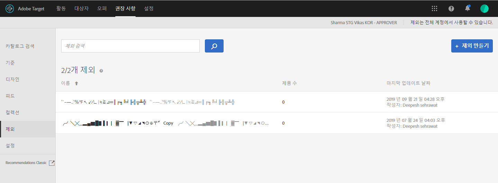

# 제외{#exclusions}

제품 또는 컨텐츠가 방문자에게 추천되지 않도록 [!DNL Adobe Target Recommendations] 하려면 제외를 만듭니다.

제외는 방문자에게 권장되지 않는 제품 또는 컨텐츠의 하위 집합입니다. 예를 들어, 제품이나 컨텐츠가 중단되거나 본질적으로 민감한 권장 사항에 표시되지 않도록(예: 모든 연령에 적합하지 않은 등급이 있는 동영상) 제외를 사용할 수 있습니다.

>[!IMPORTANT]
>
>정적 및 동적 제외 규칙은 마케팅 활동에 도움이 될 수 있는 강력한 기능입니다. 자세한 정보, 예 및 사용 사례 시나리오가 필요하면 [동적 및 정적 포함 규칙 사용](../../c-recommendations/c-algorithms/use-dynamic-and-static-inclusion-rules.md#concept_4CB5C0FA705D4E449BD0B37B3D987F9F)을 참조하십시오.

## 제외 만들기

1. **[!UICONTROL 권장 사항]** > **[!UICONTROL 제외]**&#x200B;를 클릭하여 기존 제외 목록을 표시합니다.

   

   [!UICONTROL 제외] 목록 보기의 각 제외에 대해 보고된 &quot;항목 수&quot;는 구성된 기본 권장 사항 [호스트 그룹](/help/administrating-target/hosts.md)(환경)에서 해당 제외에 대한 규칙과 일치하는 제품의 수입니다. 기본 호스트 그룹을 변경하려면 [설정](../../c-recommendations/plan-implement.md#concept_C1E1E2351413468692D6C21145EF0B84)을 참조하십시오.

1. **[!UICONTROL 제외 만들기]**&#x200B;를 클릭합니다.

1. (조건부) 제외를 만들거나 업데이트하여 해당 환경에서 제외의 컨텐츠를 미리 보는 동안 **[!UICONTROL 환경]** 필터에서 환경을 선택합니다. 기본적으로 기본 호스트 그룹의 결과가 표시됩니다.

   

1. 제외 **[!UICONTROL 이름]**&#x200B;을 입력하고 선택적 설명을 입력합니다.

1. 규칙 빌더를 사용하여 제외 항목을 만듭니다.

   규칙 목록에서 매개 변수를 선택하고 연산자를 선택한 다음, 하나 이상의 값을 입력하여 제품을 식별하십시오. 여러 값을 입력할 경우에는 쉼표로 구분합니다.

1. **[!UICONTROL 저장]**&#x200B;을 클릭합니다.

## 고급 검색을 사용하여 제외 만들기

카탈로그 검색 페이지의 고급 검색([!UICONTROL 권장 사항] > [!UICONTROL 카탈로그 검색] > [!UICONTROL 고급 검색])을 사용하여 제외를 만들 수도 있습니다. 

예를 들어 &quot;id > 포함&quot;을 사용하여 검색을 작성한 후 [!UICONTROL 다른 이름으로 저장] > [!UICONTROL 제외]를 클릭할 수 있습니다. 자세한 내용은 [카탈로그 검색](/help/c-recommendations/c-products/catalog-search.md#save-as)을 참조하십시오.

>[!IMPORTANT]
>
>고급 검색 기능은 대소문자를 구분하지 않습니다. 그러나 배송 시 반환되는 제품은 대소문자를 구분하는 검색을 기반으로 합니다. 이러한 불일치로 인해 혼동이 발생할 수 있습니다. 따라서 고급 검색 기능을 사용하는 결과를 기반으로 제외를 작성할 때에는 대소문자 구분을 고려해야 합니다. 예를 들어, &quot;Holiday&quot;를 검색할 때 초기 검색 목록에는 &quot;Holiday&quot;와 &quot;holiday&quot;를 포함하는 결과가 나열됩니다. 그런 다음 &quot;holiday&quot;를 포함하는 제품을 제외할 의도로 제외를 만드는 경우 &quot;holiday&quot;를 포함하는 제품만 제외됩니다. &quot;Holiday&quot;를 포함하는 제품은 제외되지 않습니다.

## 교육 비디오: 추천에서 컬렉션 및 제외 만들기(7:05) 

이 비디오에는 다음 정보가 포함됩니다.

* 컬렉션 만들기
* 제외 만들기

>[!VIDEO](https://video.tv.adobe.com/v/27689)