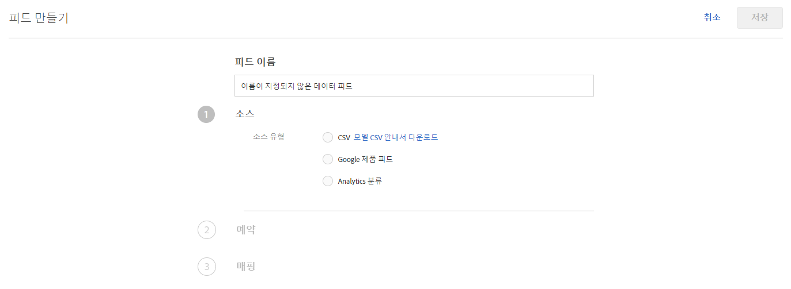
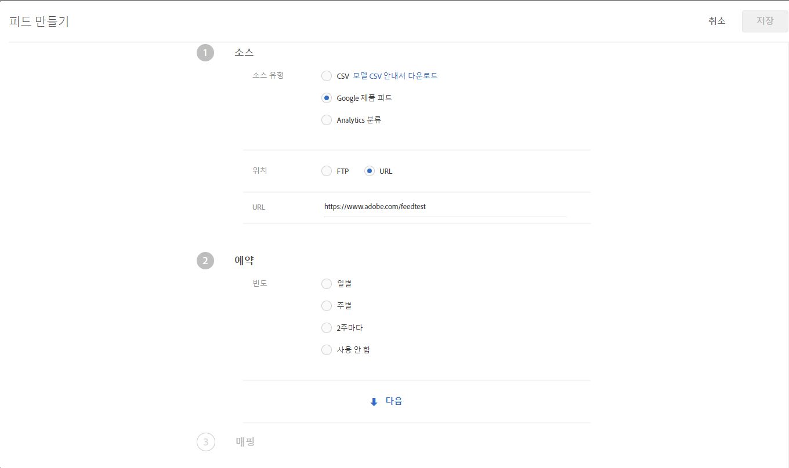
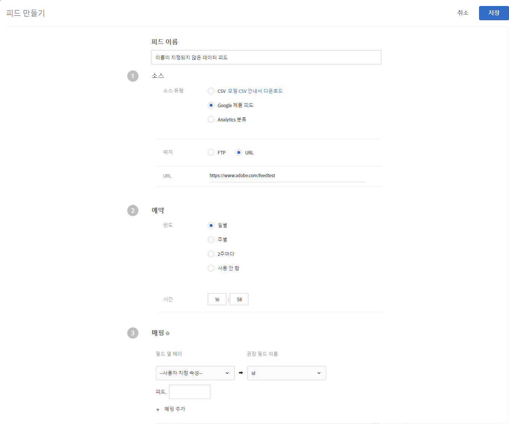

#  피드{#feeds}

[!DNL Adobe Target Recommendations]에 가져온 엔티티를 가져오려면 피드를 사용하십시오. 엔티티는 CSV 파일, Google 제품 검색 피드 형식 및/또는 Adobe Analytics 제품 분류를 사용하여 보낼 수 있습니다.

## 피드 개요 {#concept_D1E9C7347C5D4583AA69B02E79607890}

피드를 사용하면 [엔티티](/help/c-recommendations/c-products/products.md)를 전달하거나, 페이지에서 사용할 수 없거나 여백, COGS 등과 같이 페이지에서 직접 보내기에는 안전하지 않은 정보가 있는 mbox 데이터를 보강할 수 있습니다.

피드를 사용하면 제품 ID, 카테고리, 이름, 메시지 및 기타 특성과 같은 세부 항목 정보를 [!DNL Recommendations]에 전달할 수 있습니다.

[!DNL Target] 제품 분류 파일 또는 Google 제품 검색 파일에서 [!DNL Recommendations] 서버로 전송할 열을 선택할 수 있습니다. 

각 항목에 대한 이러한 데이터 조각을 사용하여 다음을 수행할 수 있습니다.

* 디자인에 값 표시
* 기준 포함 규칙 정의
* 다른 컬렉션으로 항목 정렬
* 권장 사항에 제외 적용

피드 또는 mbox를 사용하여 항목 설명을 [!DNL Target]으로 전달할 수 있습니다. 개체 피드와 mbox 양쪽에서 데이터를 수집할 경우 가장 최근의 데이터가 우선합니다. 일반적으로 가장 최근의 데이터는 mbox가 더 자주 조회되므로 mbox에서 옵니다. 드물지만 개체 피드 데이터와 mbox 데이터가 동시에 조회되는 경우 mbox 데이터가 사용됩니다.

[!UICONTROL 피드] 목록(**[!UICONTROL 권장 사항]** > **[!UICONTROL 피드]**)에는 만들어진 피드에 대한 정보가 있습니다.


피드 페이지에는 다음 열이 포함되어 있습니다.

* **이름**: 만드는 중에 지정된 피드의 이름입니다. 피드의 이름을 편집하려면 피드 자체를 편집해야 합니다. 새 이름으로 저장하면 피드가 새로 고쳐집니다.
* **유형**: 유형에는 [CSV](/help/c-recommendations/c-products/feeds.md#section_65CC1148C7DD448FB213FDF499D35FCA), [Google 제품 피드](/help/c-recommendations/c-products/feeds.md#section_8EFA98B5BC064140B3F74534AA93AFFF) 및 [Analytics 분류](/help/c-recommendations/c-products/feeds.md#section_79E430D2C75443BEBC9AA0916A337E0A)가 포함됩니다.
* **상태**: 피드의 현재 [상태](/help/c-recommendations/c-products/feeds.md#concept_E475986720D1400999868B3DFD14A7A0)입니다.
* **일정**: 피드에 대한 업데이트 일정을 표시합니다(예: 매일, 주별, 격주 또는 업데이트 안 함).
* **항목**: 피드에 있는 항목의 수를 표시합니다.
* **최근 업데이트**: 피드를 마지막으로 업데이트한 날짜와 시간, 피드를 업데이트한 사람의 이름을 표시합니다. [!UICONTROL 최근 업데이트] 피드에 &quot;정의되지 않음&quot;이라고 표시된다면 피드가 [!DNL Recommendations Classic]을 통해 제공되는 것이며 [!DNL Target Premium Recommendations]에서는 변경할 수 없습니다.

>[!IMPORTANT]
>
>업로드된 개체 및 개체 속성은 61일 후 만료됩니다. 이것은 다음을 의미합니다.
>
>* 카탈로그 컨텐츠가 만료되지 않도록 하려면 최소한 매월 피드를 실행해야 합니다.
>* 피드 파일에서 항목을 제거해도 카탈로그에서 해당 항목이 제거되지 않습니다. 카탈로그에서 항목을 제거하려면 Target UI 또는 API를 통해 항목을 수동으로 삭제합니다. 또는 품목 속성(예: 재고)을 수정하여 품목이 고려되지 않도록 합니다.


## 소스 유형

엔티티는 CSV 파일, Google 제품 검색 피드 형식 및/또는 Adobe Analytics 제품 분류를 사용하여 보낼 수 있습니다.

### CSV{#section_65CC1148C7DD448FB213FDF499D35FCA}로 내보내기 

Adobe 소유 CSV 업로드 형식을 사용하여 .csv 파일을 작성할 수 있습니다. 파일에는 제품용으로 예약된 속성과 사용자 지정 속성에 대한 표시 정보가 들어 있습니다. 사용하는 구현에 대한 속성을 업로드하려면 헤더 행의 `CustomN`을 사용하려는 속성의 이름으로 바꾸십시오. 이 아래 예에서는 `entity.Custom1`이 `entity.availability`로 교체되었습니다. 그런 다음 파일을 [!DNL Recommendations] 서버에 벌크로 업로드할 수 있습니다.

.csv 형식을 사용하면 Google 피드 형식보다 다음과 같은 장점이 있습니다.

* 필드 매핑이 필요하지 않습니다.
* 다중 값 속성이 지원됩니다(아래 예 참조).
* 최대 100개의 사용자 지정 속성이 지원됩니다. 100개가 넘는 사용자 지정 속성이 필요한 경우에는 다른 사용자 지정 속성 세트가 지정된 부가적 피드 파일을 작성할 수 있습니다.

페이지에 mbox가 없는 경우 또는 사이트에서 사용할 수 없는 항목으로 표시 정보를 보완하려는 경우 일괄 업로드 방법을 사용하여 표시 정보를 전송할 수 있습니다. 예를 들어 사이트에 게시되지 않았을 수 있는 재고 정보를 전송할 수 있습니다.

.csv 파일, Google 제품 피드 또는 Analytics 제품 분류 피드를 사용하여 업로드한 모든 데이터는 데이터베이스의 기존 엔티티 속성 값을 덮어씁니다. mbox 요청을 통해 가격 정보를 보내고 파일에 다른 가격 값을 보내는 경우 파일의 값은 mbox 요청에 설정된 값을 덮어씁니다. 최대 250자까지 덮어쓰는 대신 카테고리 값을 추가한 `categoryId` 엔티티 속성은 예외입니다.

>[!IMPORTANT]
>
>.csv 파일에서 의도된 것이 아니라면 값을 큰따옴표(&quot;)로 묶지 마십시오. 값을 큰따옴표로 묶으면 다른 큰따옴표로 묶어서 이스케이프 처리를 해야 합니다. 큰따옴표를 이스케이프 처리를 하지 않으면 추천 피드가 제대로 로드되지 않습니다.

예를 들어, 다음 구문은 올바르지 않습니다.

```
"Apples "Bananas" Grapes"",
```

다음 구문은 올바릅니다.

```
"Apples ""Bananas"" Grapes""",
```

>[!NOTE]
>
>기존 값을 빈 값으로 덮어쓸 수 없습니다. 덮어쓰려면 해당 위치에 다른 값을 전달해야 합니다. 할인가의 경우 일반적인 해결 방법은 실제 &quot;NULL&quot; 또는 다른 메시지를 전달하는 것입니다. 그런 다음 템플릿 규칙을 작성하여 해당 값이 포함된 항목을 제외할 수 있습니다.

개체를 성공적으로 업로드하고 약 2시간 후 관리 인터페이스에서 제품을 사용할 수 있습니다.

다음은 .csv 파일의 샘플 코드입니다.

```
## RECSRecommendations Upload File 
## RECS''## RECS'' indicates a Recommendations pre-process header. Please do not remove these lines. 
## RECS 
## RECSUse this file to upload product display information to Recommendations. Each product has its own row. Each line must contain 19 values and if not all are filled a space should be left. 
## RECSThe last 100 columns (entity.custom1 - entity.custom100) are custom. The name 'customN' can be replaced with a custom name such as 'onSale' or 'brand'. 
## RECSIf the products already exist in Recommendations then changes uploaded here will override the data in Recommendations. Any new attributes entered here will be added to the product''s entry in Recommendations. 
## RECSentity.id,entity.name,entity.categoryId,entity.message,entity.thumbnailUrl,entity.value,entity.pageUrl,entity.inventory,entity.margin,entity.last_updated_by,entity.multi_english,entity.availability,entity.tax_country,entity.tax_region,entity.tax_rate,entity.product_type,entity.item_group_id,entity.color,entity.size,entity.brand,entity.gtin 
na3456,RipCurl Watch with Titanium Dial,Watches & Sport,Cutting edge titanium with round case,https://example.com/s7/na3456_Viewer,425,https://example.com/shop/en-us/na3456_RipCurl,24,0.25,csv,"[""New"",""Web"",""Sales"",""[1,2,34,5]""]",in stock,US,CA,9.25,Shop by Category > Watches,dz1,Titanium,44mm,RipCurl,"075380 01050 5" 
na3457,RipCurl Watch with Black Dial,Watches & Sport,Cutting edge matte black with round case,https://example.com/s7/na3457_Viewer,275,https://example.com/shop/en-us/na3457_RipCurl,24,0.27,csv,"[""New"",""Web"",""Sales"",""[1,2,34,5]""]",in stock,US,CA,9.25,Shop by Category > Watches,dz1,Black,44mm,RipCurl,"075340 01060 7"
```

### Google {#section_8EFA98B5BC064140B3F74534AA93AFFF}

Google Product Search 피드 유형에서는 Google 형식을 사용합니다. 이것은 Adobe 소유 CSV 업로드 형식과는 다릅니다.

기존 Google 제품 피드가 있는 경우 가져오기 파일로 사용할 수 있습니다.

>[!NOTE]
>
>Google 데이터를 사용할 필요는 없습니다. [!DNL Recommendations]에서는 Google과 동일한 형식을 사용합니다. 이 방법을 사용하여 보유하고 있는 데이터를 업로드하고 사용 가능한 예약 기능을 이용할 수 있습니다. 하지만 파일을 설정할 때에는 Google의 사전 정의된 속성 이름을 보유하고 있어야 합니다.

많은 소매점의 경우 제품을 Google에 업로드하여, 방문자가 Google 제품 검색을 사용할 때 제품이 나타나도록 합니다. [!DNL Recommendations]는 정확히 개체 피드에 대해 Google의 사양을 따릅니다. 개체 피드는 .xml, .txt 또는 .tsv를 통해 [!DNL Recommendations]으로 전송될 수 있으며 Google](https://support.google.com/merchants/answer/188494?hl=en&amp;topic=2473824&amp;ctx=topic#US)에 의해 정의된 [특성을 사용할 수 있습니다. 결과는 [Google 쇼핑 페이지](https://www.google.com/prdhp)에서 검색할 수 있습니다.

>[!NOTE]
>
>POST 방법은 Google 피드 컨텐츠를 호스팅하는 서버에서만 허용됩니다.

[!DNL Recommendations] 사용자는 이미 URL 또는 FTP를 통해 Google로 전송할 .xml 또는 .txt 피드를 구성했으므로, 개체 피드는 해당 제품 데이터를 승인하고 이를 사용하여 추천 카탈로그를 구성합니다. 피드가 존재하며 권장 사항 서버가 데이터를 검색하는 위치를 지정합니다.

개체 피드 업로드에 대해 Google 제품 검색을 사용하는 경우, 페이지에 권장 사항을 표시하거나 뷰를 기반으로 한 알고리즘 제공을 위한 제품 보기를 추적하려면 여전히 페이지에 제품 페이지 mbox가 있어야 합니다.

Google 피드는 사용자 지정 속성에 대해 여러 값을 지원하지 않습니다.

피드를 저장하고 활성화하면 피드가 실행됩니다. 피드를 저장할 때 실행된 다음 매일 한 시간 늦게 실행됩니다.

다음은 Google 제품 검색 피드 .xml 파일의 샘플 코드입니다.

```
<?xml version="1.0" encoding="UTF-8" standalone="yes"?> 
<feed xmlns="https://www.w3.org/2005/Atom" xmlns:ns2="https://base.google.com/ns/1.0" xmlns:ns3="https://base.google.com/cns/1.0"> 
    <title>Product Feed</title> 
    <link href="https://example.com"/> 
    <updated>2017-12-13T08:45:04.918-08:00</updated> 
    <author> 
        <name>Product Feed Author</name> 
    </author> 
    <id>https://example.com</id> 
    <entry> 
        <title>RipCurl Watch with Titanium Dial</title> 
        <description>Cutting edge Titanium with Round case</description> 
        <ns2:id>na3452</ns2:id> 
        <ns2:link>https://example.com/shop/en-us/na3452_RipCurl</ns2:link> 
        <ns2:availability>in stock</ns2:availability> 
        <ns2:condition>NEW</ns2:condition> 
        <ns2:google_product_category>Watches &amp; Sport</ns2:google_product_category> 
        <ns2:gtin>075380 01050 5</ns2:gtin> 
        <ns2:image_link>https://example.com/s7/na3452_Viewer</ns2:image_link> 
        <ns2:mobile_link>https://m.example.com/s7/na3452_Viewer</ns2:mobile_link> 
        <ns2:mpn>71050</ns2:mpn> 
        <ns2:price>425</ns2:price> 
        <ns2:product_review_average>5.0</ns2:product_review_average> 
        <ns2:product_review_count>30</ns2:product_review_count> 
        <ns2:product_type>Shop by Category > Watches </ns2:product_type> 
        <ns2:brand>RipCurl</ns2:brand> 
        <ns2:sale_price>375</ns2:sale_price> 
        <ns2:tax> 
          <ns2:country>US</ns2:country> 
          <ns2:region>CA</ns2:region> 
          <ns2:rate>9.25</ns2:rate> 
          <ns2:tax_ship>y</ns2:tax_ship> 
        </ns2:tax> 
        <ns2:is_bundle>N</ns2:is_bundle> 
    </entry> 
    <entry> 
        <title>RipCurl Watch with Black Dial</title> 
        <description>Cutting edge matte black with Round case</description> 
        <ns2:id>na3453</ns2:id> 
        <ns2:link>https://example.com/shop/en-us/na3453_RipCurl</ns2:link> 
        <ns2:availability>in stock</ns2:availability> 
        <ns2:condition>NEW</ns2:condition> 
        <ns2:google_product_category>Watches &amp; Sport</ns2:google_product_category> 
        <ns2:gtin>075380 013450 5</ns2:gtin> 
        <ns2:image_link>https://example.com/s7/na3453_Viewer</ns2:image_link> 
        <ns2:mobile_link>https://m.example.com/s7/na3453_Viewer</ns2:mobile_link> 
        <ns2:mpn>71050</ns2:mpn> 
        <ns2:price>275</ns2:price> 
        <ns2:product_review_average>4.8</ns2:product_review_average> 
        <ns2:product_review_count>23</ns2:product_review_count> 
        <ns2:product_type>Shop by Category > Watches </ns2:product_type> 
        <ns2:brand>RipCurl</ns2:brand> 
        <ns2:sale_price>249</ns2:sale_price> 
        <ns2:tax> 
          <ns2:country>US</ns2:country> 
          <ns2:region>CA</ns2:region> 
          <ns2:rate>9.25</ns2:rate> 
          <ns2:tax_ship>y</ns2:tax_ship> 
        </ns2:tax> 
        <ns2:is_bundle>N</ns2:is_bundle> 
    </entry> 
</feed> 
```

다음은 Google 제품 검색 피드 .tsv 파일의 샘플 코드입니다.

```
id    title    description    link    price    condition    availability    image_link    tax    shipping_weight    shipping    google_product_category    product_type    item_group_id    color    size    gender    age_group    pattern    brand    gtin    mpn 
na3454    RipCurl Watch with Titanium Dial    Cutting edge titanium with round case    https://example.com/shop/en-us/na3454_RipCurl    425    new    in stock    https://example.com/s7/na3452_Viewer    US:CA:9.25:y    1.5 oz    US:::0.00 USD    Watches & Sport    Shop by Category > Watches    dz1    Black    44mm    male    adult    Solid    RipCurl    075380 01050 5    DZ1437 
na3455    RipCurl Watch with Black Dial    Cutting edge matte black with round case    https://example.com/shop/en-us/na3455_RipCurl    275    new    in stock    https://example.com/s7/na3452_Viewer    US:CA:9.25:y    1.5 oz    US:::0.00 USD    Watches & Sport    Shop by Category > Watches    dz1    Black    44mm    male    adult    Solid    RipCurl    075340 01060 7    DZ1446
```

### Analytics 제품 분류  {#section_79E430D2C75443BEBC9AA0916A337E0A}

Analytics 제품 분류는 권장 사항에서 사용할 수 있는 분류입니다. 이 분류 파일에 대한 자세한 내용은 *분석 구성 요소* 안내서의 [분류 ](https://experienceleague.adobe.com/docs/analytics/components/classifications/c-classifications.html) 정보를 참조하십시오. 권장 사항에서 필요한 일부 정보는 현재 구현에서 사용하지 못할 수 있으므로, 분류 파일에 추가할 경우 이 사용자 안내서를 따르십시오.

>[!IMPORTANT]
>
>Analytics 제품 분류를 사용하여 개체 데이터를 [!DNL Recommendations]으로 가져오기 전에 이 방법이 기본 설정 방법이 아니라는 것을 알아야 합니다.
>
> 다음 주의 사항에 유의하십시오.
>
>* 엔티티 속성에 대한 업데이트는 최대 24시간이 넘는 지연을 초래합니다.
>* [!DNL Target] 제품 분류만 지원합니다. Analytics 제품 SKU는 [!DNL Recommendations] `entity.id`과(와) 동일한 수준에 매핑해야 합니다. 사용자 지정 Analytics 분류는 Adobe 컨설팅 서비스를 사용하여 만들 수 있습니다. 질문이 있으면 계정 관리자에게 문의하십시오.


## 피드 만들기  {#steps}

[!DNL Recommendations]에 제품이나 서비스에 대한 정보를 삽입하는 피드를 작성합니다.

1. Target 인터페이스 내에서 **[!UICONTROL Recommendations]** > **[!UICONTROL 피드]** > **[!UICONTROL 피드 만들기]**&#x200B;를 클릭합니다.

   

1. 피드의 수사적 이름을 지정합니다.
1. **[!UICONTROL 소스 유형]**&#x200B;을 선택합니다.

   * CSV로 내보내기
   * Google 제품 피드
   * Analytics 분류

   CSV 및 Google 제품 피드 유형에 대한 자세한 내용은 [피드 개요](/help/c-recommendations/c-products/feeds.md#concept_D1E9C7347C5D4583AA69B02E79607890)를 참조하십시오. [모델 CSV 안내서](https://recspm2.experiencecloud.adobe.com/content/mac/default/target/files/EntityFileUploadTemplate.csv)를 다운로드하여 피드의 형식을 올바르게 지정할 수도 있습니다.

1. (조건부) **[!UICONTROL CSV]** 또는 **[!UICONTROL Google 제품 피드]**&#x200B;를 선택한 경우 피드에 액세스할 수 있는 위치를 지정합니다.

   * **FTP**: FTP를 선택하는 경우 FTP 서버 정보, 로그인 자격 증명, 파일 이름 및 FTP 디렉토리를 제공하십시오. 보다 안전한 업로드를 위해 SSL을 사용하는 FTP(FTPS)를 선택할 수 있습니다.

      지원되는 FTP 서버 설정:

      * FTP 및 FTPS는 수동 FTP를 사용하도록 설정되어야 합니다.
      * FTPS의 경우, 명시적 FTPS 연결을 허용하도록 서버를 구성합니다.
      * SFTP는 지원되지 않습니다.
      * 연결을 시작할 포트를 수동으로 지정할 수 있습니다(예: `ftp://ftp.yoursite.com:2121`). 포트를 지정하지 않으면 기본 FTP 또는 FTPS 포트가 사용됩니다.
   * **URL**: URL을 선택하는 경우에는 URL을 지정하십시오.


1. (조건부) **[!UICONTROL Analytics 분류]**&#x200B;를 선택한 경우, 드롭다운 목록에서 보고서 세트를 선택합니다.

1. **[!UICONTROL 다음]** 화살표를 클릭하여 [!UICONTROL 예약] 선택 사항을 표시합니다.

   

1. 업데이트 선택 사항을 선택합니다. 

   * 일별
   * 주별
   * 2주마다
   * 업데이트는 예약하지 마십시오. 이 피드를 실행하지 않으려면 이 항목을 선택하십시오.

1. 피드를 실행할 시간을 지정합니다.

   이 선택 사항은 브라우저에서 사용되는 시간대를 기반으로 합니다. 다른 시간대의 시간을 사용하려면 시간대에 따라 시간을 계산해야 합니다.

1. **[!UICONTROL 다음]** 화살표를 클릭하여 [!UICONTROL 매핑] 선택 사항을 표시한 다음, 데이터를 [!DNL Target] 정의에 매핑하는 방식을 지정합니다.

   

1. (선택 사항) 피드가 환경(호스트 그룹)에 속하도록 하려면 호스트 그룹을 선택합니다.

   기본적으로 피드는 모든 호스트 그룹에 속합니다. 따라서 이 피드의 항목을 어떤 환경에서든 사용할 수 있습니다. 자세한 내용은 [호스트](/help/administrating-target/hosts.md#concept_516BB01EBFBD4449AB03940D31AEB66E)를 참조하십시오.

1. **[!UICONTROL 저장]**&#x200B;을 클릭합니다.

피드를 만들거나 편집하면 피드가 즉시 실행된 다음, 설정하는 매개 변수에 따라 업데이트됩니다. 모든 정보를 사용할 수 있게 되는 데에는 시간이 걸립니다. 먼저 피드를 동기화한 후에 처리하고 색인화해야만 게시하고 사용할 수 있게 됩니다. 현재 상태가 피드 목록의 [피드 상태](/help/c-recommendations/c-products/feeds.md#status) 아래에 표시됩니다. [!DNL Target]을 닫은 후에 프로세스를 완료하고 프로세스를 계속 진행할 수 있습니다.

색인화가 진행 중인 동안 개별 값이 색인화되기 전에 제품 및 피드 헤더가 표시됩니다. 따라서 제품을 검색하고 볼 수 있으므로 색인화가 완료되기 전에 컬렉션, 제외, 디자인 및 활동을 작성할 수 있습니다.

상태에 &quot;성공&quot;이 표시되면 이것은 파일을 찾았으며 올바로 구문 분석했음을 의미합니다. 파일이 색인화되기 전까지는 [!DNL Recommendations]에서 이 정보를 사용할 수 없습니다. 색인화는 파일의 크기에 따라 시간이 좀 걸릴 수 있습니다. 프로세스가 실패한다면 이것은 파일을 찾지 못했거나(잘못된 URL을 사용했거나 FTP 정보가 올바르지 않은 경우 등) 구문 분석 오류가 있음을 의미합니다.

## 피드 상태 및 표시기  {#concept_E475986720D1400999868B3DFD14A7A0}

가능한 피드 상태 및 해당 표시기에 대한 정보입니다.

### 피드 상태 {#status}

다음은 피드의 가능한 상태입니다.

| 상태 | 설명 |
|--- |--- |
| 동기화 중 | 피드 설정 세부 사항이 Target에 저장되고 있습니다. |
| 동기화 실패 | 피드 설정 세부 사항을 Target에 저장할 수 없습니다. 다시 시도하십시오. |
| 피드 실행 안 함 | 피드를 만들었지만 예약하지 않았습니다(빈도가 사용 안 함으로 설정됨). |
| 예약 일시: *날짜 및 시간* | 피드가 실행되지 않았지만 지정된 날짜 및 시간에 실행되도록 예약되었습니다. |
| 다운로드 대기 중 | Target이 피드 파일 다운로드를 준비하는 중입니다. |
| 피드 파일 다운로드 중 | Target이 피드 파일을 다운로드하는 중입니다. |
| 항목을 가져오는 중 | Target이 피드 파일에서 항목을 가져오는 중입니다. |
| 피드를 *시간 내에* 성공적으로 가져옴 | Target에서 피드 파일을 콘텐츠 전달 시스템으로 가져옵니다. 항목 속성에 대한 변경 사항은 콘텐츠 전달 시스템에서 만들어졌으며, 곧 전달된 추천에 반영될 예정입니다. 예상 변경 사항이 표시되지 않는 경우 잠시 후 추천이 포함된 페이지를 새로 고침하십시오.<br>참고:<ul><li>항목의 속성을 변경하면 항목이 추천에서 제외되는 경우 제외가 즉시 반영됩니다. 항목이 새로 추가되거나 속성을 변경하면 더 이상 추천에서 *제외되지 않습니다*. 이 경우 24시간 내에 다음 알고리즘 업데이트가 발생할 때까지 반영되지 않습니다.</li><li>이 상태가 표시되면 업데이트가 아직 카탈로그 검색 사용자 인터페이스에 반영되지 않을 수 있습니다. 별도의 상태가 검색 가능한 카탈로그가 업데이트된 마지막 시간을 나타내는 카탈로그 검색에 표시됩니다.</li></ul> |
| 색인화 실패 | 색인 작업에 실패했습니다. 다시 시도하십시오. |
| 서버를 찾을 수 없음 | FTP 또는 URL 위치가 잘못되었거나 접속할 수 없습니다. |

피드를 업데이트하려면(예를 들어, 피드 구성이나 피드 파일 변경) 피드를 열고 원하는 대로 변경하고 **[!UICONTROL 저장을 클릭하십시오]**.

>[!IMPORTANT]
>
>업로드된 엔티티는 61일 후에 만료됩니다. 즉, 권장 사항 활동이 중단되는 것을 방지하기 위해 적어도 60일마다 피드 파일을 업로드해야 합니다. 항목이 피드 파일(또는 기타 엔티티 업데이트 방법)에 최소 60일에 한 번 이상 포함되지 않은 경우 [!DNL Adobe Target]은 더 이상 항목이 관련이 없으며 카탈로그에서 제거합니다.

### 피드 상태 표시기 {#section_3C8A236C5CB84C769A9E9E36B8BFABA4}

[!UICONTROL 상태] 열에 다음 피드 상태 표시기가 표시됩니다.

| 상태 표시기 | 설명 |
|--- |--- |
| 녹색 상태 표시기 | 피드가 색인화를 성공적으로 완료하면 녹색 상태 점이 피드가 성공 상태임을 표시합니다. |
| 노란색 상태 표시기 | 피드 또는 피드 색인이 피드 주기의 25%만큼 지연되면 노란색 상태 점이 표시됩니다. 예를 들어 예약된 시간으로부터 6시간 후에도 색인이 완료되지 않으면 매일 실행되도록 설정된 피드에 대해 노란색 점이 표시됩니다.   참고: 피드 상태가 &quot;색인 큐 대기 중&quot;이면 새로 업데이트된 값을 전달 및 기준 처리에서 사용할 수 있습니다. |
| 흰색 상태 표시기 | 피드를 예약하지 않으면 흰색 상태 점이 피드가 아직 실행되지 않았음을 표시합니다. |
| 빨간색 상태 표시기 | 피드가 데이터를 서버에 업로드하지 못하면 빨간색 상태 표시기가 표시됩니다. |

다음 예를 생각해 보십시오.

**예제 1:**

* 1일째: 태평양 표준시(PST) 기준 오전 9시에 일별 피드가 처리됩니다.
* 2일째: 오후 3시 30분인데 피드가 어제 오전 9시 이후에 실행되지 않았습니다.

약 6.5시간 전에 색인이 실행되어야 했는데 그렇지 않으므로 상태는 노란색이어야 합니다. 6.5시간 +24는 피드 창의 127%입니다.

**예제 2:**

* 1월 1일: 태평양 표준시(PST) 기준 오전 9시에 월별 피드가 처리됩니다.
* 2월 3일: 오전 10시이고 피드가 1개월, 1일, 1시간 동안에 실행되지 않았습니다.

약 1일 1시간 전에 색인이 실행되어야 했는데 그렇지 않으므로 상태는 노란색이어야 합니다. 이것은 빈도 설정의 (31+(1/25))/30 = 1.03%에 불과하지만 하루 지연의 최대값을 초과했습니다.

## 교육 비디오

다음 비디오에는 이 문서에서 설명한 개념에 대한 자세한 정보가 포함되어 있습니다.

### 추천의 피드 이해(3:01)  

이 비디오에는 다음 정보가 포함됩니다.

* 피드의 목적 이해
* 피드 값 이해

>[!VIDEO](https://video.tv.adobe.com/v/27695)

### 피드 만들기(6:44)  

이 비디오에는 다음 정보가 포함됩니다.

* 피드 설정
* 사용할 피드 유형 파악

>[!VIDEO](https://video.tv.adobe.com/v/27696)
