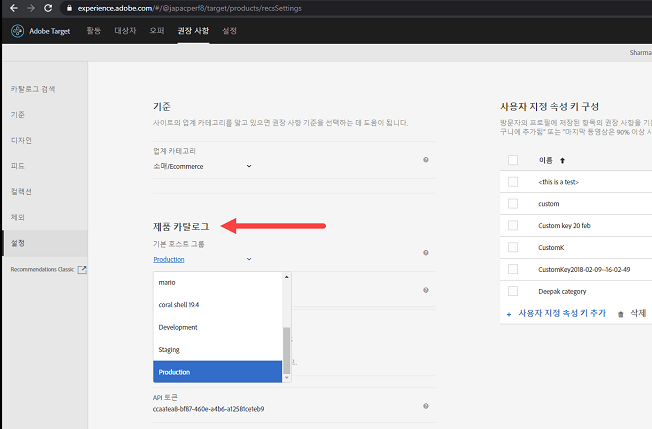
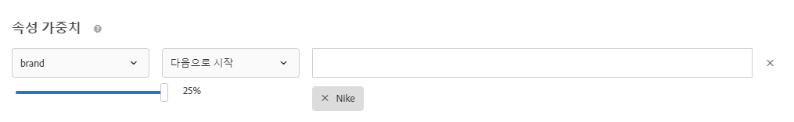

#  권장 사항 FAQ

[!DNL Adobe Target] [!DNL Recommendations] 활동에 대한 FAQ 목록.

## 숫자 값으로 사용자 지정 특성을 검색할 때 [!UICONTROL 카탈로그 검색]이 올바른 결과를 표시하지 않는 이유는 무엇입니까?

숫자 값으로 사용자 지정 특성에 대한 카탈로그 검색을 수행할 때 결과는 사용자 지정 특성을 숫자 값 대신 문자열 유형으로 간주합니다.

현재, 고객이 특성 유형을 변경할 수 있는 기능이 없습니다. 변경하려면 문자열에서 숫자로 유형을 변경해야 하는 특성을 참조하는 [고객 문제를 여십시오](/help/cmp-resources-and-contact-information.md#reference_ACA3391A00EF467B87930A450050077C).

## 내 카탈로그에 있는 항목에 대한 업데이트를 내 사이트에 반영하는 데 얼마나 걸립니까?

항목을 업데이트하는 방식에 따라 시간대와 결과가 다릅니다.

| 소스 | 세부 사항 |
| --- | --- |
| mbox 또는 or API | <ul><li>권장 사항이 15분 안에 업데이트됩니다.</li><li>기존 권장 사항 및 항목 속성은 업데이트를 사용할 수 있을 때까지 표시됩니다.</li><li>카탈로그 색인 다음에는 카탈로그 검색이 없데이트됩니다(3~8시간).</li></ul> |
| 피드를 통한 항목 속성 업데이트 | <ul><li>피드 수집 후에는 권장 사항이 업데이트됩니다(2~8시간).</li><li>기존 권장 사항 및 항목 속성은 업데이트를 사용할 수 있을 때까지 표시됩니다.</li><li>피드 수집(2~8시간) 및 후속 카탈로그 색인(3~8시간) 후에는 카탈로그 검색이 업데이트됩니다. 카탈로그 검색이 총 5-16시간 내에 업데이트됩니다.</li></ul> |
| [!DNL Target] UI 또는 API를 통해 카탈로그에서 삭제된 항목 | <ul><li>권장 사항이 15분 안에 업데이트됩니다.</li><li>기존 권장 사항 및 항목 속성은 업데이트를 사용할 수 있을 때까지 표시됩니다.</li><li>카탈로그 색인 다음에는 카탈로그 검색이 없데이트됩니다(3~8시간).</li></ul> |
| 항목이 mbox 또는 API를 통해 카탈로그에 추가됨 | <ul><li>알고리즘 실행 후에는 권장 사항이 업데이트됩니다. 알고리즘 실행은 1~2일 알고리즘의 경우 12시간마다 예약되며, 7일 이상 알고리즘의 경우에는 24시간마다 예약됩니다.</li><li>추가된 항목이 요청된 키가 아닌 경우에는 업데이트를 사용할 수 있을 때까지 기존 권장 사항이 표시됩니다.</li><li>추가된 항목이 요청된 키가 아닌 경우에는 업데이트를 사용할 수 있을 때까지 백업 권장 사항이 표시됩니다.</li><li>카탈로그 색인 다음에는 카탈로그 검색이 없데이트됩니다(3~8시간).</li></ul> |
| 항목이 피드를 통해 카탈로그에 추가됨 | <ul><li>피드가 수집된 후에는 권장 사항이 업데이트됩니다(2~8시간). 후속 알고리즘 실행은 1~2일 알고리즘의 경우 12시간마다 예약되며, 7일 이상 알고리즘의 경우에는 24시간마다 예약됩니다. Recommendations가 총 2-32시간 내에 업데이트됩니다.</li><li>추가된 항목이 요청된 키가 아닌 경우에는 업데이트를 사용할 수 있을 때까지 기존 권장 사항이 표시됩니다.</li><li>추가된 항목이 요청된 키가 아닌 경우에는 업데이트를 사용할 수 있을 때까지 백업 권장 사항이 표시됩니다.</li><li>피드 수집(2~8시간) 및 카탈로그 색인(3~8시간) 후에는 카탈로그 검색이 업데이트됩니다. 카탈로그 검색이 총 5-16시간 내에 업데이트됩니다.</li></ul> |

피드 파일을 가져온 후 또는 API나 mbox를 통해 엔티티 업데이트를 받은 후, 60분 이내에 다음 변경 사항이 반영됩니다.

* 이전에는 제외되었지만 지금은 포함되어야 하는 경우에는 항목이 다음 알고리즘 실행에 포함됩니다(12~24시간).

   이 상황은 [!DNL Target]이 온라인과 오프라인 모두에서 제외를 적용하기 때문에 발생합니다. 항목을 새로 제외하는 경우에는 온라인 제외가 빠르게 적용됩니다. 항목이 새로 포함되는 경우에는 온라인 제외가 빠르게 사라지지만, 오프라인 제외는 다음 알고리즘일 실행될 때까지 사라지지 않습니다.

* 이전에는 포함되었지만 지금은 제외되는 경우에는 피드 소스에 따라 위에서 논의된 &quot;항목 속성 업데이트...&quot; 시간표(mbox/API를 통해 15분 또는 피드를 통해 12~24시간)에 따라 항목이 제외됩니다.

다음 알고리즘이 실행될 때까지 아래 변경 사항이 반영되지 않습니다(12~24시간 이내).

* 활동에 사용된 컬렉션 규칙에 사용되는 항목 속성입니다.
* 활동과 연관된 속성 또는 컬렉션을 기반으로 한 프로모션에 사용되는 항목 속성입니다.
* 항목이 최상위 판매자 또는 가장 많이 본 알고리즘의 &quot;현재 범주&quot; 또는 &quot;즐겨 찾는 범주&quot;에 대한 항목이 표시되는 항목 범주입니다.
* 변경된 속성이 알고리즘에 대한 사용자 지정 키로 사용되는 사용자 지정 속성인 경우 권장되는 항목의 등급입니다.
* 권장 사항 로직이 &quot;속성이 비슷한 항목&quot;이거나, &quot;콘텐츠 유사성&quot; 가중치 요소가 사용되거나, &quot;속성 가중치&quot; 요소가 사용되는 경우 하나 이상의 변경된 속성에 따라 권장되는 항목의 등급입니다.

>[!NOTE]
>
>피드 파일은 &quot;항목 가져오는 중&quot;에서 &quot;검색 색인 업데이트 준비 중&quot;으로 상태가 변경될 때 가져온 것으로 간주됩니다. 업데이트는 카탈로그 검색 사용자 인터페이스에 반영되는 데 60분 이상 걸릴 수 있습니다. 피드 상태가 &quot;업데이트 완료&quot;로 바뀌는 경우 카탈로그 검색이 최신이 상태가 됩니다. 카탈로그 검색이 아직 최신 상태가 아닌 경우에도 위에 나열된 시간대에 사이트 업데이트가 반영됩니다. 가장 최근의 카탈로그 검색 색인 업데이트 시간이 카탈로그 검색 페이지에 표시됩니다.

## 나의 [!UICONTROL Recommendations] 오퍼 활동, 오퍼, 프로모션, 또는 기준 설정의 구성 변경이 내 사이트에 반영되려면 얼마나 걸립니까?

* 프로모션 설정의 변경은 사이트에 반영되기까지 최대 5시간 소요될 수 있습니다.
* 다른 기준 설정의 변경은 다음 알고리즘이 실행될 때까지 반영되지 않을 수 있음:

   * 일부 조건 설정(예: &quot;동적 포함 규칙의 추가&quot;)는 즉시 반영됩니다.
   * 다른 기준 설정(예: &quot;동적 포함 규칙의 제거&quot;, 룩백 창 등)은 다음 알고리즘이 실행되기까지 통합될 수 없습니다.
   * 알고리즘 실행은 이러한 변경에 의해 트리거될 수 있으나 완료까지 최대 24시간 소요될 수 있습니다. 또한 12-24시간마다 예약된 방식으로도 알고리즘이 실행됩니다.

## 사용자의 비헤이비어(예: A 제품을 클릭하고 B 제품을 구매)가 *사용자가 받는* Recommendations에 반영되려면 얼마나 걸립니까?

* 현재 보는/구매하는 제품/콘텐츠는 사용자가 같은 페이지뷰/[!DNL Target] 콘텐츠 요청에서 받는 Recommendations에 영향을 미칩니다.
* &quot;마지막으로 본 제품&quot;, &quot;가장 많이 본 제품&quot;, 전체 보기/구매하기 기록 같은 역대 사용자 비헤이비어는 해당 요청으로 업데이트되며 사용자가 다음 페이지뷰/[!DNL Target] 콘텐츠 요청에서 받는 Recommendations에 영향을 미칩니다. 예를 들어 &quot;최근 본 항목&quot;과 &quot;나의 추천 제품&quot; 알고리즘은 각각의 제품 보기/구매로 업데이트되며 추후 콘텐츠 요청에 반영됩니다.

## 사용자의 비헤이비어(예: A 제품을 클릭하고 B 제품을 구매)가 *다른* 사용자가 받는 Recommendations에 반영되려면 얼마나 걸립니까?

사용자의 비헤이비어 합계는 12-24시간 마다 발생하는 모든 알고리즘 실행으로 오프라인 알고리즘 처리에 통합됩니다.

## 특수 문자가 배열을 깨는 경우 어떻게 해야 합니까? {#section_D27214116EE443638A60887C7D1C534E}

Javascript에서 이스케이프 처리된 값을 사용하십시오. 따옴표(&quot;)는 배열을 깰 수 있습니다. 다음 코드 스니펫은 이스케이프 처리된 값의 예입니다.

```
#set($String='') 
#set($escaper=$String.class.forName('org.apache.commons.lang.StringEscapeUtils')) 
<script type="text/javascript"> 
console.log("$escaper.escapeJavaScript($entity1.name)") 
console.log("$escaper.escapeJavaScript($entity2.name)") 
console.log('$escaper.escapeJavaScript($entity3.name)') 
names.push("$escaper.escapeJavaScript($entity4.name)") 
</script>
```

## 권장 사항 활동을 만들 때 사용자 지정 기준을 포함한 일부 기준을 선택할 수 없는 이유는 무엇입니까? {#section_B2265AC8B8A94E0298D495A05C5D817F}

사용 가능한 기준은 현재 범주를 기반으로 합니다. 권장 사항 오퍼를 만드는 경우 알고리즘 선택기는 범주 ID를 기반으로 기준을 표시합니다.

이 기준을 적용하는 위치에 범주 ID가 없을 경우 알고리즘 선택기에서 특정 기준을 사용할 수 없습니다.

mbox에 범주 ID가 있는 위치를 사용하는 경우 기준 선택기는 적용 가능한 모든 기준을 포함합니다.

[!DNL Target]은 알고리즘 선택기의 인텔리전스 필터링을 제어할 수 있도록 [호환되지 않는 조건 필터링](/help/c-recommendations/plan-implement.md#concept_C1E1E2351413468692D6C21145EF0B84) 설정을 가지고 있습니다.

>[!NOTE]
>
>이 설정은 [!UICONTROL 시각적 경험 작성기] (VEC)에서 만들어진 활동에만 적용되고, 이 설정은 양식 기반 경험 작성기에서 만들어진 활동에는 적용되지 않습니다([!DNL Target]에는 위치 컨텍스트가 없습니다).

[!UICONTROL 호환되지 않는 기준 필터링] 설정에 액세스하려면 [!UICONTROL 권장 사항] > [!UICONTROL 설정]을 클릭하십시오.


[!UICONTROL 호환되지 않는 기준 필터링] 설정이 사용되지 않는 경우, [!DNL Target]은 알고리즘 선택기에서 알고리즘을 필터링하지 않고 모든 알고리즘이 표시됩니다.

[!UICONTROL 호환되지 않는 기준 필터링] 설정이 사용되는 경우 VEC 활동에서 [!DNL Target]이 entityId와 범주 ID를 선택한 위치에서 읽은 다음 `currentItem|currentCategory`를 기반으로 알고리즘을 표시합니다(각각의 값이 해당 위치에 제공되는 경우). 따라서 기본적으로 알고리즘 선택기에는 선택한 위치를 위한 호환되는 알고리즘만 표시됩니다.

[!UICONTROL 호환되지 않는 기준 필터링] 설정이 활성화되어 있으면 기준을 선택하는 동안 [!UICONTROL 호환] 확인란을 선택 취소하여 비호환 알고리즘을 계속 볼 수 있습니다.


다음 목록은 [!DNL Target]이 [!UICONTROL 호환되는] 확인란을 표시하지 않는 특수 사례를 포함합니다.

* entityId와 범주 ID가 모두 해당 위치에 있으며 아무것도 필터링되지 않는 경우
* [!DNL mbox.js] 버전 55 이하를 사용하는 경우
* 페이지에서 mbox 호출이 실행되지 않는 경우(!config.isAutoCreateGlobalMbox &amp;&amp; !config.isRegionalMbox).
* [!DNL Target] 매개 변수가 정의되지 않았습니다.

## 권장 사항의 컬렉션이 0(영)이 되는 경우 어떻게 해야 합니까? {#section_E2DB2FE67CF24EEC81412BFF3FA6385D}

이전에 0이 아니었던 컬렉션이 0이 된 것으로 표시되면 다음 정보를 고려하십시오.

* 컬렉션을 다시 저장하고 번호가 업데이트되는지 확인할 수 있습니다. 다시 저장하면 컬렉션이 해당 컬렉션을 사용하는 모든 알고리즘을 다시 실행합니다.
* 올바른 환경을 보고 있습니까? [!DNL /target/products.html#recsSettings] 로 이동하여 아래와 같이 다시 확인합니다.

   

* 색인이 최신 상태입니까? [!DNL /target/products.html#productSearch] 로 이동하여 색인이 몇 시간 경과되었는지 확인합니다(예를 들어 &quot;색인화된 후 3시간 경과&quot;). 필요에 따라 색인을 새로 고칠 수 있습니다.
* 엔티티가 더 이상 컬렉션 규칙과 일치하지 않도록 피드 또는 데이터 계층에서 변경한 것이 있습니까? 대소문자가 일치하는지 확인하십시오(대소문자 구분).
* 피드가 성공적으로 실행되었습니까? FTP 디렉터리, 암호 등을 변경한 사람이 있습니까?
* [!DNL Target]은 게재(고객의 페이지/앱에서) 업데이트가 최대한 빨리 일어나도록 최선을 다합니다. 그러나, [!DNL Target]은 마케터를 위해 UI에 일부 표시를 제공해야 합니다. [!DNL Target]은 UI 업데이트가 동기화되는 것을 기다리기 위해 게재 업데이트를 지연하지 않습니다. [mboxTrace](/help/c-activities/c-troubleshooting-activities/content-trouble.md) 를 사용하여 요청이 들어올 당시 시스템의 내용을 확인할 수 있습니다.

## 일반 속성 가중치와 콘텐츠 유사성별 속성 가중치 간의 차이는 무엇입니까? {#section_FCD96598CBB44B16A4C6C084649928FF}

속성 가중치는 &quot;표준 속성 가중치&quot;와 &quot;콘텐츠 유사성 속성 가중치&quot;, 이렇게 두 가지 형태로 존재합니다.

표준 속성 가중치는 모두는 아니지만 대부분의 기준 유형(콘텐츠 유사성뿐만 아니라)에 적용됩니다. 이 유형의 가중치는 특정 속성 값에 더 많은 가중치를 부여합니다. 다음 예에서 Nike 제품은 출력 권장 사항에서 문제가 생깁니다.



콘텐츠 유사성 속성 가중치는 콘텐츠 유사성 기준에만 적용됩니다.

이 유형의 가중치는 더 동적이며 현재 &quot;권장 사항 키&quot;(현재 보는 항목)를 기반으로 합니다. 다음 예에서(브랜드 x 16)는 방문자가 Nike 스니커즈를 보고 있다면 해당 방문자는 경쟁 업체의 스니커즈보다 다른 Nike 제품(반드시 스니커즈일 필요는 없음)을 추천받을 가능성이 더 큽니다. 방문자가 Adidas 스니커즈를 보고 있다면 이 방문자는 Adidas 제품을 추천받을 가능성이 더 큽니다.


## [!DNL Target]에서 권장 사항이 때때로 표시되지 않는 이유는 무엇입니까? {#section_DB3F40673AED42228E407C05437D99E9}

[!DNL Target]은 사용 가능한 Recommendations가 적어 Recommendations를 표시하지 못할 때가 있습니다.

기준당 생성된 값의 수는 디자인에 지정된 엔티티 수의 배입니다. 런타임 필터링(예: 재고, mbox 속성 일치)은 3x개의 값을 생성한 후에 적용되며, 따라서 전달 시 3x개보다 적은 수의 값으로 끝날 수 있습니다. 이 상황을 완화하려면 추가 엔티티를 숨겨서 디자인의 엔티티 수를 늘리십시오.

다음 JavaScript는 요청한 엔티티 수를 늘리기 위해 디자인의 시작 부분에서 사용할 수 있습니다. 이 예제에서 요청된 엔티티 수는 30(3x10)입니다.

```
#foreach($entity in $entities) 
 #if( $foreach.count > 10 ) 
  #break 
 #end 
 #set ($foo = $entity.id) 
#end 
```

## 제품 삽입/업데이트에 대한 API 호출의 크기 제한이란 무엇입니까? 피드 대신 API를 사용하여 한 번의 호출로 50,000개의 제품을 업데이트할 수 있습니까? {#section_434FE1F187B7436AA39B7C14C7895168}

[!DNL Target]은 애플리케이션 수준에서 50MB 게시물 한도를 부여하지만 이는 `application/x-www-form-urlencoded` 콘텐츠 유형 헤더를 전달하는 때만 해당합니다.

단일 호출에서 50,000개 제품 전송을 시도할 수 있습니다. 실패할 경우 묶음으로 나누어야 합니다. 일반적으로 고객이 호출을 5,000 또는 10,000개의 제품 묶음으로 나누어 시스템 로드로 인한 시간 초과 가능성을 줄이는 것이 좋습니다.

## 권장 사항 기준, 프로모션 또는 템플릿 테스트 규칙을 생성할 때 mbox 이름을 지정해야 합니까? {#section_FFA42ABCC5954B48A46526E32A3A88A2}

mbox 매개 변수를 기반으로 한 권장 사항, 기준, 프로모션 또는 템플릿 테스트 규칙을 만들 때 `mboxParameter` 에 `mboxName`을 묻는 메시지가 더 이상 표시되지 않습니다. 이제 mbox 이름은 선택 사항입니다. 따라서 여러 mbox의 매개 변수를 사용하거나 가장자리에 아직 기록되지 않은 매개 변수를 참조할 수 있습니다.

원하는 매개 변수를 선택하려면 다음을 수행하십시오.

* 기준, 프로모션 또는 템플릿 테스트 규칙을 생성하는 동안 목록에서 매개 변수 이름을 선택합니다. 원하는 매개 변수 이름의 첫 번째 문자 입력을 시작하거나 원하는 매개 변수 이름의 전체 이름을 입력합니다.
* mbox 이름은 기억하지만, 매개 변수 이름을 기억하지 못하는 경우 원하는 매개 변수를 전달하는 알려진 mbox를 필터링할 확인란을 사용합니다.

어느 방법을 사용하든 mbox와 매개 변수 간에 링크가 없습니다. 기준, 프로모션 또는 템플릿 테스트 규칙은 해당 매개 변수를 전달하는 모든 mbox에서 매개 변수를 기준으로 하여 작동합니다.

기존 기준, 프로모션 또는 템플릿 테스트 규칙을 편집하는 경우 필터링 기준에는 작성 중에 제공된 mbox 이름이 함께 표시됩니다.

## 새 대상을 정의한 후 기존 권장 사항 활동을 저장할 수 없는 이유는 무엇입니까? {#section_1E47C40B1FE7479BAC3EE0F50CE7C2C4}

대상에 고유한 이름이 있는지 확인하십시오. 기존 대상과 동일한 이름을 지정했다면 기존 권장 사항 활동(2016년 10월 이전에 만든 권장 사항 활동)을 저장할 수 없습니다.

## 피드 업로드를 위한 CSV 파일의 최대 크기는 얼마입니까? {#section_20F1AF4839A447B9889B246D6E873538}

피드의 CSV 파일 업로드에 대한 행 수 또는 파일 크기에는 엄격한 제한이 없습니다. 그러나 파일 업로드 프로세스 중 실패를 방지하기 위해 CSV 파일 크기를 1GB로 제한하는 것이 좋습니다. 파일 크기가 1GB를 초과하는 경우 이상적으로 여러 피드 파일로 분할해야 합니다. 사용자 지정 속성 컬럼의 최대 수는 100개이며 사용자 지정 속성은 4096자로 제한됩니다. 필수 열의 길이에 대한 다른 제한은 [[!DNL Target] 제한 페이지](/help/r-troubleshooting-target/target-limits.md#reference_BEFE60C3AAA442FF94D4EBFB9D3CC9B1)에서 확인할 수 있습니다.

## 엔티티를 동적으로 제외할 수 있습니까? {#exclude}

권장 사항에서 제외하려는 엔티티에 대한 엔티티 ID를 쿼리 문자열에서 전달할 수 있습니다. 예를 들어 장바구니에 이미 있는 항목을 제외할 수 있습니다.

제외 기능을 활성화하려면 `excludedIds` mbox 매개 변수를 사용합니다. 이 매개 변수는 쉼표로 구분된 엔티티 ID 목록을 가리킵니다. 예: `mboxCreate(..., "excludedIds=1,2,3,4,5")`. 권장 사항 요청 시 해당 값이 전송됩니다.

제외는 현재 [!DNL Target] 호출에만 수행되며 항목은 `excludedIds` 값이 다시 전달되지 않는 한 추후 [!DNL Target] 호출에서 제외됩니다. 장바구니의 항목을 모든 페이지의 권장 사항에서 제외하려면 모든 페이지의 `excludedIds` 값을 계속 전달하십시오.

>[!NOTE]
>
>너무 많은 엔티티가 제외되는 경우 권장 사항은 엔티티가 개체 템플릿을 채우기에 부족한 것처럼 작동합니다.

`entityIds`를 제외하려면 `&excludes=${mbox.excludedIds}` 토큰을 오퍼 콘텐츠 URL에 추가합니다. 콘텐츠 URL이 추출되면 필수 매개 변수는 현재 mbox 요청 매개 변수를 사용하여 대체됩니다.

기본적으로 이 기능은 새로 만든 권장 사항에 활성화되어 있습니다. 동적으로 제외된 엔티티를 지원하려면 기존 권장 사항을 저장해야 합니다.

## 권장 사항 콘텐츠 추적에서 반환되는 NO_CONTECT 응답은 무엇을 의미합니까?

요청한 알고리즘 및 키 조합에 대한 권장 사항을 사용할 수 없는 경우 NO_CONTENT가 반환됩니다. 일반적으로 이 상황은 알고리즘에 대해 백업이 비활성화된 경우에 발생하며 다음 중 하나 이상에 해당하는 경우에도 발생합니다.

* 결과가 아직 준비되지 않았습니다.

   일반적으로 이 상황은 새로 만든 활동을 처음 저장하거나 활동에 사용된 컬렉션, 기준 또는 프로모션에 대한 구성이 변경된 후에 발생합니다.

* 요청된 알고리즘/키 조합에 대해 가장 가까운 에지 서버에 아직 캐시되지 않은 결과가 준비됩니다.

   요청이 캐싱 작업을 시작하므로 이 문제는 몇 페이지를 다시 로드하거나 몇 분이 경과하면 해결됩니다.

* 결과가 준비되었지만 제공된 키 값에 대해 사용할 수 없습니다.

   이 상황은 일반적으로 최신 알고리즘 실행 후 카탈로그에 추가된 항목에 대한 권장 사항을 요청할 때 발생하며 다음 알고리즘 실행 후에 자체적으로 해결됩니다.

* 부분 템플릿 렌더링이 비활성화되며 템플릿을 채우기에는 결과가 충분하지 않습니다.

   일반적으로 이 상황은 동적 포함 규칙이 있을 때 발생하며, 이 규칙은 가능한 결과에서 많은 항목을 적극적으로 필터링합니다. 상황이 발생하지 않도록 하려면 백업을 활성화하고 백업에 포함 규칙을 적용하지 않거나 덜 적극적으로 필터링된 기준을 순서대로 사용하십시오.

## 최근에 본 항목 기반의 권장 사항은 단일 방문자에 대해 여러 디바이스에서 지속됩니까? {#persist-across-devices}

방문자가 세션을 시작하는 경우, 세션 ID가 단일 에지 머신에 연결되며 임시 프로필 캐시는 이 에지 머신에 저장됩니다. 동일한 세션의 후속 요청에서는 최근에 본 항목을 포함해 이러한 프로필 캐시를 읽습니다.

세션이 종료되면 최근에 본 항목을 포함한 세션 상태는 동일한 지리적 에지의 보다 영구적인 프로필 스토리지로 유지됩니다.

새로운 세션이 동일한 MCID(Marketing Cloud ID), ECID(Experience Cloud ID), or CustomerID/mbox3rdPartyId를 통해 고객 프로필에 연결되어 있는 동안에는 다른 디바이스의 후속 세션이 이러한 최근에 본 항목에 액세스할 수 없습니다.

방문자의 활성 세션이 동시에 두 개인 경우, 한 디바이스의 최근 본 항목은 세션 ID를 강제로 공유하는 게 아니면 다른 디바이스의 최근 본 항목을 업데이트하지 않습니다. 문제에 대한 잠재적인 해결 방법이 있기는 하지만, [!DNL Target]은 디바이스 여러 대의 세션 ID에 대한 공유를 직접 지원하지 않습니다. 고객은 직접 이러한 ID 공유를 관리해야 합니다.

방문자가 한 디바이스에서 활성이었다가 몇 분 뒤 다른 디바이스에서 활성이 되면 이 비헤이비어는 여전히 발생합니다. 첫 번째 디바이스의 세션은 30분 동안 만료되지 않으며, 프로필 상태가 영구 상태에 기록되어 처리되기 전에 최대 5분 동안 지연될 수 있습니다. 이 행동을 테스트할 때, 35분 안에 세션을 만료할 수 있으며 프로필을 저장할 수 있습니다.

방문자에게 동시에 2개의 활성 세션이 없는 경우에는 세션이 종료된 동안 하나의 디바이스에 있는 최근에 본 항목이 다른 디바이스에 있는 최근에 본 항목을 업데이트하지 않습니다. 이 행동을 테스트할 때, 35분 안에 세션을 만료할 수 있습니다.

## [!DNL Adobe Recommendations Classic] in [!DNL Recommendations Premium]에서 만들어진 알고리즘을 사용할 수 있습니까?

[!DNL Recommendations Classic]에서 만들어진 알고리즘은 [!DNL Recommendations Premium]에서 지원되지 않습니다. [!DNL Target Premium]에서 레거시 알고리즘을 사용할 수 있으나 [!DNL Target Premium] UI에서 오퍼 활동을 사용하지 않거나 삭제할 때 알고리즘이 동기화 문제를 일으킬 수 있습니다. 두 솔루션의 차이에 대한 자세한 정보는  [!DNL Target Premium]](/help/c-recommendations/c-recommendations-faq/recommendations-classic-versus-recommendations-activities-target-premium.md)의 [[!DNL Recommendations Classic] versus [!DNL Recommendations]  활동을 참조하십시오.

## 새 기사나 비디오만 추천하려면 어떻게 합니까? {#recommend-new-articles}

미디어 및 출판 분야의 일부 고객은 추천 항목에 최신 기사 또는 비디오만 포함되기를 원합니다. 예를 들어 [!DNL Target] 고객은 60일 이내의 문서를 추천받기 위해 다음과 같은 방법을 사용했습니다.

1. 기사 게시 날짜를 YYMMDDD 형식으로 사용자 지정 엔티티 속성으로 전달합니다.
1. 오늘 날짜에서 60일을 뺀 프로필 스크립트를 YYYMMDD 형식으로 생성합니다.
1. 기준에 동적 포함 필터를 사용합니다.`publish date > today’s date minus 60 days`

### 게시 날짜를 사용자 지정 엔티티 속성으로 전달합니다.

| 엔티티 속성 | 예 |
| --- | --- |
| 발행일 | 2021218 |
| 마지막으로 본 날짜 | 2021701 |
| 상위 카테고리 | 댓글 |
| 게시일 | 20210113 |
| 게시일 표시 | 2021년 1월 13일 |

### 프로필 스크립트를 구성합니다.


### 포함 규칙을 구성합니다.


>[!NOTE]
>
>이 예는 매개변수 일치를 사용하고 `priorDate60` 값을 mbox 매개변수로 전달하여 수행할 수도 있습니다.
