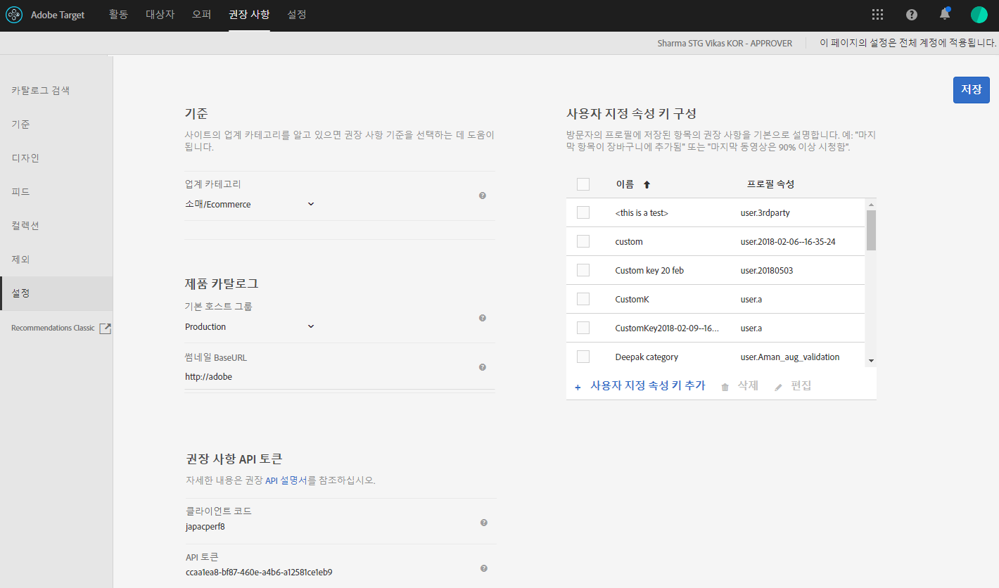

#  계획 및 구현 [!DNL Recommendations]

첫 번째 [!DNL Recommendations] 활동 [!DNL Adobe Target]에서 다음 단계를 완료합니다.

1. [구현 [!DNL Target]](#implement-target) 사용자 행동을 캡처하고 권장 사항을 전달하는 데 사용할 웹 및 모바일 앱 면에서 입니다.
1. [설정 [!DNL Recommendations] 카탈로그](#rec-catalog) 사용자에게 추천할 제품 또는 콘텐츠의 집합입니다.
1. [행동 정보 및 컨텍스트 전달](#pass-behavioral) to [!DNL Target Recommendations] 개인화된 추천을 제공할 수 있도록 허용.
1. [글로벌 제외 구성](#exclusions).
1. [구성 [!DNL Recommendations] 설정](#concept_C1E1E2351413468692D6C21145EF0B84).

## 구현 [!DNL Target] {#implement-target}

[!DNL Target Recommendations] 를 구현해야 합니다 [!DNL Adobe Experience Platform Web SDK] 또는 at.js 0.9.2 이상 자세한 내용은 [구현 [!DNL Target]](/help/c-implementing-target/implementing-target.md) 추가 정보.

## Recommendations 카탈로그 설정 {#rec-catalog}

고품질 추천을 제공하려면 [!DNL Target] 추천할 제품 또는 콘텐츠에 대해 알고 있어야 합니다. 카탈로그에는 일반적으로 추천할 항목에 대한 세 가지 정보 유형이 포함되어야 합니다. 영화를 추천한다고 가정해 봅시다. 다음을 포함합니다.

1. 추천을 받는 사용자에게 표시하려는 데이터. 예를 들어 동영상 이름과 동영상 포스터의 축소판 이미지에 대한 URL을 표시할 수 있습니다.
1. 마케팅 및 판매 계획 관리에 유용한 데이터. 예를 들어 NC-17 영화를 추천하지 않도록 동영상 등급을 표시할 수 있습니다.
1. 항목과 다른 항목의 유사성을 결정하는 데 유용한 데이터. 예를 들어 영화의 장르 및 동영상 감독자를 표시할 수 있습니다.

[!DNL Target] 은 카탈로그를 채우기 위한 여러 통합 옵션을 제공합니다. 이러한 옵션을 조합하여 카탈로그의 다른 항목을 업데이트하거나 다른 주파수의 다른 항목 속성을 업데이트하는 데 사용할 수 있습니다.

| 메서드 | 정의 | 사용하는 경우 | 추가 정보 |
| --- | --- | --- | --- |
| 카탈로그 피드 | 피드 예약(CSV, Google 제품 XML 또는 [!DNL Analytics Product Classifications])를 매일 업로드 및 수집할 수 있습니다. | 한 번에 여러 항목에 대한 정보를 전송하는 경우 자주 변경되지 않는 정보를 전송하는 데 사용됩니다. | 자세한 내용은 [피드 를 참조하십시오](/help/c-recommendations/c-products/feeds.md). |
| 엔티티 API | API를 호출하여 단일 항목에 대한 분 단위 업데이트를 보냅니다. | 한 번에 한 항목에 대해 발생할 때 업데이트를 보내는 방법입니다. 자주 변경되는 정보(예: 가격, 재고/재고 수준)를 발송하기 위해 | 자세한 내용은 [엔티티 API 개발자 설명서](https://developers.adobetarget.com/api/recommendations/#tag/Entities). |
| 페이지에서 업데이트 전달 | 페이지에서 JavaScript를 사용하거나 배달 API를 사용하여 단일 항목에 대한 분 단위 업데이트를 보냅니다. | 한 번에 한 항목에 대해 발생할 때 업데이트를 보내는 방법입니다. 자주 변경되는 정보(예: 가격, 재고/재고 수준)를 발송하기 위해 | 자세한 내용은 [항목 보기/제품 페이지](#items-product-pages) 아래의 제품에서 사용할 수 있습니다. |

대부분의 고객은 적어도 한 개의 피드를 구현해야 합니다. 엔티티 API 또는 페이지 내 메서드를 사용하여 자주 변경되는 속성 또는 항목에 대한 업데이트로 피드를 보완하도록 선택할 수 있습니다.

## 행동 정보 및 컨텍스트 전달 {#pass-behavioral}

전달해야 하는 행동 정보 및 컨텍스트 [!DNL Target] 은 방문자가 수행하는 작업에 따라 달라집니다. 이 작업은 종종 방문자가 상호 작용하는 페이지 유형과 연결됩니다.

### 항목 보기/제품 페이지 {#items-product-pages}

방문자가 제품 세부 사항 페이지와 같은 단일 항목을 보고 있는 페이지에서는 방문자가 보고 있는 항목의 ID를 전달해야 합니다. 권장 사항을 현재 카테고리로 필터링할 수 있도록 방문자가 보고 있는 항목의 가장 세부적인 카테고리를 전달해야 합니다.

제품 페이지 자체에서 특정 빠르게 변경되는 속성을 전달할 수도 있습니다. 예를 들어 가격(`value`) 및 재고/재고 수준.

```
<script type="text/javascript">
function targetPageParams() { 
   return { 
      "entity": { 
         "id": "32323", 
         "categoryId": "running-shoes", 
         "value": 119.99, 
         "inventory": 329 
      } 
   } 
}
</script>
```

### 카테고리 보기/카테고리 페이지

카테고리 페이지에서는 해당 카테고리 내의 제품 또는 콘텐츠로 권장 사항을 제한할 수 있습니다. 이렇게 하려면 현재 본 카테고리의 ID를 전달해야 합니다.

```
function targetPageParams() { 
   return { 
      "entity": { 
         "categoryId": "running-shoes" 
      } 
   } 
}
```

### 장바구니 추가/장바구니 보기/체크아웃 페이지 {#cart}

장바구니 페이지에서는 방문자의 현재 장바구니의 컨텐츠를 기반으로 하는 항목을 추천할 수 있습니다. 이렇게 하려면 특수 매개 변수를 사용하여 방문자의 현재 장바구니에 있는 모든 항목의 ID를 전달합니다 `cartIds`.

```
function targetPageParams() {
   return {
      "cartIds": ["352", "223", "23432", "432", "553"]
      }
}
```

장바구니 기반 권장 사항 로직은 &quot;[!UICONTROL 권장 사항]&quot; 사용자 기반 알고리즘 및 &quot;[!UICONTROL 이 항목을 보고 다른 항목을 구입한 사람]&quot; 및 &quot;[!UICONTROL 이 항목을 구입하고 다른 항목도 구입한 사람]항목 기반 알고리즘

[!DNL Target] 에서는 공동 작업 필터링 기술을 사용하여 방문자 장바구니에 있는 각 항목에 대한 유사성을 파악한 다음, 각 항목에 대한 이러한 행동 유사성을 결합하여 병합된 목록을 가져옵니다.

[!DNL Target] 또한 마케터에게 단일 세션 내 또는 여러 세션 간 방문자 행동을 살펴볼 수 있는 선택 사항을 제공합니다.

* **단일 세션 내**: 단일 세션 내에서 다른 방문자가 수행한 작업을 기반으로 합니다.

   단일 세션 내의 동작을 보면 제품이 사용, 상황 또는 이벤트를 기반으로 서로 강력하게 &quot;사용&quot;한다고 생각될 때 적절할 수 있습니다. 예를 들어, 방문자가 프린터를 구입하고 있고 잉크와 종이도 필요할 수 있습니다. 혹은, 방문객은 땅콩 버터를 사고, 빵과 젤리가 필요할 수도 있다.

* **여러 세션 간**: 여러 세션에서 다른 방문자가 수행한 작업을 기반으로 합니다.

   여러 세션에서 행동을 관찰하는 것은 제품이 방문자의 선호도 또는 취향에 따라 서로 &quot;사용&quot;한다는 의미가 있을 때 적절할 수 있습니다. 예를 들어, 방문자는 스타워즈를 좋아하고, 비록 방문자가 반드시 같은 자리에서 두 영화를 모두 보고 싶지 않더라도 인디아나 존스를 좋아할 수도 있습니다. 또는 방문자는 보드 게임 &quot;Codenames&quot;를 좋아하며 사용자가 두 게임을 동시에 할 수 없어도 보드 게임 &quot;Avalon&quot;을 원할 수도 있습니다. 

단일 세션 내의 방문자 행동을 보는지 또는 여러 세션에서 방문자 행동을 보는지에 관계없이, [!DNL Target] 은 현재 장바구니에 있는 항목을 기반으로 각 방문자에 대한 권장 사항을 제공합니다.

### 방문자의 장바구니에 이미 있는 항목 제외

사이트 전체의 페이지에서 일부 항목을 권장 사항에서 제외할 수 있습니다. 예를 들어 방문자의 현재 장바구니에 이미 있는 항목을 추천하지 않을 수 있습니다. 이렇게 하려면 특수 매개 변수를 사용하여 제외할 모든 항목의 ID를 전달합니다 `excludedIds`.

```
function targetPageParams() {
   return {
      "excludedIds": ["352", "223", "23432", "432", "553"]
      }
}
```

### 구매/주문 확인 페이지

구매 이벤트가 발생하면 구매한 항목 또는 항목의 ID를 전달합니다. 자세한 내용은 [전환 추적](/help/c-implementing-target/c-implementing-target-for-client-side-web/how-to-deployatjs/implementing-target-without-a-tag-manager.md#task_E85D2F64FEB84201A594F2288FABF053) in *구현 [!DNL Target] 태그 관리자 없이*.

## 글로벌 제외 구성 {#exclusions}

방문자에게 권장하지 않는 글로벌 수준의 항목을 제외합니다. [제외](/help/c-recommendations/c-products/exclusions.md)를 참조하십시오.

## 구성 [!DNL Recommendations] 설정 {#concept_C1E1E2351413468692D6C21145EF0B84}

설정을 사용하여 [!DNL Recommendations] 구현을 관리하십시오.

에 액세스하려면 [!UICONTROL Recommendations 설정] 옵션, 열기 [!DNL Target] 에서 [!DNL Adobe Experience Cloud]를 클릭한 다음 **[!UICONTROL Recommendations]** > **[!UICONTROL 설정]**.



다음 옵션을 사용할 수 있습니다.

| 설정 | 설명 |
|--- |--- |
| 사용자 지정 글로벌 mbox | (선택 사항) [!DNL Target] 활동을 제공하는 데 사용되는 사용자 지정 글로벌 mbox를 지정합니다. 기본적으로, 에 사용되는 글로벌 mbox입니다 [!DNL Target] 에 사용됨 [!DNL Recommendations].<br>참고: 이 옵션은 [!DNL Target] [!UICONTROL 관리] 페이지. 열기 [!DNL Target]를 클릭한 다음 [!UICONTROL 관리] > [!UICONTROL 시각적 경험 작성기]. |
| 업계 카테고리 | 업계 카테고리는 권장 사항 기준을 분류하는 데 사용됩니다. 이 정보는 팀 구성원이 장바구니 페이지나 미디어 페이지에 가장 적합한 기준과 같이 특정 페이지에 맞는 기준을 찾는 데 도움이 됩니다. |
| 호환되지 않는 기준 필터링 | 선택한 페이지가 필수 데이터를 전달하는 기준만 표시하려면 이 선택 사항을 사용하십시오. 모든 기준이 모든 페이지에서 올바르게 실행되지는 않습니다. 페이지 또는 mbox가 전달되어야 합니다 `entity.id` 또는 `entity.categoryId` 호환될 현재 항목/현재 카테고리에 대한 권장 사항. 일반적으로 호환 가능한 기준만 표시하는 것이 가장 좋습니다. 그러나 호환되지 않는 기준을 활동에 사용할 수 있게 하려면 이 선택 사항을 선택 취소하십시오.<br>태그 관리 솔루션을 사용하는 경우에는 이 선택 사항을 비활성화하는 것이 좋습니다.<br>이 선택 사항에 대한 자세한 내용은 [권장 사항 FAQ](/help/c-recommendations/c-recommendations-faq/recommendations-faq.md)를 참조하십시오. |
| 기본 호스트 그룹 | 기본 호스트 그룹을 선택합니다.<br>호스트 그룹을 사용하여 카탈로그에 있는 사용 가능한 항목을 다양한 용도로 구분할 수 있습니다. 예를 들어 개발 및 프로덕션 환경, 다양한 브랜드 또는 다양한 지역용으로 호스트 그룹을 사용할 수 있습니다. 기본적으로 카탈로그 검색, 컬렉션 및 제외의 미리 보기 결과는 기본 호스트 그룹을 기반으로 합니다. (환경 필터를 사용하여 다른 결과를 미리 볼 호스트 그룹을 선택할 수도 있습니다.) 기본적으로 항목을 만들거나 업데이트할 때 환경 ID를 지정하지 않는 한, 새로 추가된 항목은 모든 호스트 그룹에서 사용할 수 있습니다. 전달되는 권장 사항은 요청에 지정된 호스트 그룹에 따라 다릅니다.<br>제품이 보이지 않는다면 올바른 호스트 그룹을 사용하고 있는지 확인하십시오. 예를 들어, 스테이징 환경을 사용하도록 권장 사항을 설정하고 호스트 그룹을 스테이징으로 설정하는 경우, 제품을 표시할 스테이징 환경에서 컬렉션을 다시 만들어야 합니다. 각 환경에서 사용 가능한 제품을 확인하려면 각 환경에서 카탈로그 검색을 사용하십시오. 선택한 환경(호스트 그룹)에 대한 권장 사항 컬렉션 및 제외 콘텐츠를 미리 볼 수도 있습니다.<br>**참고:**  선택한 환경을 변경한 후 검색을 클릭하여 반환된 결과를 업데이트해야 합니다.<br>[!UICONTROL 환경] 필터는 [!DNL Target] UI의 다음 위치에서 사용할 수 있습니다.<ul><li>카탈로그 검색(권장 사항 > 카탈로그 검색)</li><li>컬렉션 만들기 대화 상자([!UICONTROL 권장 사항 > 컬렉션 > 새로 만들기])</li><li>컬렉션 업데이트 대화 상자([!UICONTROL 권장 사항 > 컬렉션 > 편집])</li><li>제외 만들기 대화 상자([!UICONTROL 권장 사항 > 제외 > 새로 만들기])</li><li>제외 업데이트 대화 상자([!UICONTROL 권장 사항 > 제외 > 편집])</li></ul>자세한 내용은 [호스트](/help/administrating-target/hosts.md)를 참조하십시오. |
| 썸네일 기본 URL | 제품 카탈로그용의 기본 URL을 설정하면 썸네일 URL을 전달할 때, 제품의 썸네일을 지정할 때 상대 URL을 사용할 수 있습니다.<br>예를 들어<br>`"entity.thumbnailURL=/Images/Homepage/product1.jpg"`<br>는 썸네일 기본 URL에 상대적인 URL을 설정합니다. |
| Recommendations API 토큰 | Download API와 같은 권장 사항 API 호출에서 이 토큰을 사용하십시오. |
