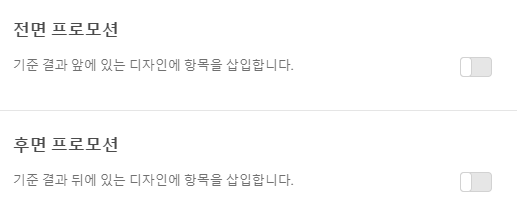

#  프로모션 추가{#add-promotions}

프로모션된 항목을 추가하고 권장 사항 디자인에서 해당 배치를 제어합니다. 정적 및 동적 프로모션을 추가할 수 있습니다.

>[!IMPORTANT]
>
>정적 및 동적 제외 규칙은 마케팅 활동에 도움이 될 수 있는 강력한 기능입니다. 자세한 정보, 예 및 사용 사례 시나리오가 필요하면 [동적 및 정적 포함 규칙 사용](../../c-recommendations/c-algorithms/use-dynamic-and-static-inclusion-rules.md#concept_4CB5C0FA705D4E449BD0B37B3D987F9F)을 참조하십시오.

[!DNL Recommendations] 활동을 만들 때 [!DNL Recommendations] 디자인에 판촉된 항목을 포함할 수 있는 선택 사항이 있습니다. 프로모션은 디자인에서 사용 가능한 슬롯을 사용하며, 기준 결과 및 백업 권장 사항보다 우선합니다. 예를 들어, 디자인에 6개의 슬롯이 있고 이 중 2개를 프로모션으로 사용하는 경우 4개의 슬롯은 기준에 따라 권장되는 항목에 대해 사용할 수 있습니다.

판촉 행사는 활동의 기준이 권장하는 항목에 대해 중복 제거됩니다. 따라서 해당 항목이 단일 Recommendations 트레이에 두 번 표시되지 않습니다.

특정 항목을 판촉하거나, 항목을 동적으로 판촉하거나, 속성을 기준으로 항목을 판촉하거나, 컬렉션을 판촉할 수 있습니다.

>[!NOTE]
>
>프로모션을 사용하면 CSV 구조 및 출력이 변경됩니다. 이러한 변경 사항은 CSV를 포함하는 외부 프로세스(예: 이메일)에 영향을 줄 수 있습니다.

1. **[!UICONTROL 옵션]** 페이지에서 **[!UICONTROL 앞면 프로모션]** 또는 **[!UICONTROL 뒤로 프로모션]** 전환을 클릭합니다.

   The following illustration shows the [!UICONTROL Front Promotion] toggle in the "On" position.

   

   기준 결과 이전 *및* 이후에 프로모션을 삽입할 수 있습니다.
1. 판촉된 항목에 사용할 디자인 슬롯 수를 설정합니다.

   [!DNL Recommendations] 디자인에 따라 최대 20개의 슬롯을 사용할 수 있습니다. 사용하는 각 슬롯은 기준에 따라 반환되는 권장 사항에는 사용할 수 없게 됩니다.

1. 판촉된 항목의 시작 날짜 및 종료 날짜를 설정합니다.

   시작 날짜를 설정하지 않으면 즉시 프로모션이 시작됩니다. 종료 날짜를 설정하지 않으면 판촉 행사가 무기한으로 실행됩니다.

1. **[!UICONTROL 프로모션 유형]을 선택합니다.**

   * **[!UICONTROL 항목 목록]**&#x200B;을 선택하고, 판촉할 특정 항목의 `entity.id` 값을 쉼표로 구분해서 입력합니다.

      목록에 프로모션용으로 설정한 슬롯 수보다 많은 항목이 포함된 경우 **[!UICONTROL 항목 순서 무작위 지정]선택란을 선택하여 디자인에 표시되는 판촉된 항목을 변경할 수 있습니다.** 이 옵션을 선택하면 Target에서 각 방문에 대해 전체 판촉 행사 세트의 템플릿에서 판촉 행사에 대해 활성화된 항목 수를 임의로 선택할 수 있습니다.

   * **속성별 판촉을 선택하고 규칙을 추가하여 판촉할 항목의 속성을 정의합니다.**

      속성별 판촉을 선택하는 경우 다이내믹 일치를 만들 수 있습니다. 자세한 내용은 [동적 및 정적 포함 규칙 사용](../../c-recommendations/c-algorithms/use-dynamic-and-static-inclusion-rules.md#concept_4CB5C0FA705D4E449BD0B37B3D987F9F)을 참조하십시오.

   * **[!UICONTROL 컬렉션 판촉]을 선택하고 판촉할 항목의 컬렉션을 선택합니다.** 프로모션에 사용할 새 컬렉션을 만들 수 있습니다. 자세한 내용은 [컬렉션 만들기](../../c-recommendations/c-products/collections.md#task_1256DFF6842141FCAADD9E1428EF7F08)를 참조하십시오.

1. **[!UICONTROL 저장]**&#x200B;을 클릭합니다.

활동의 모든 경험에 프로모션이 적용됩니다.
