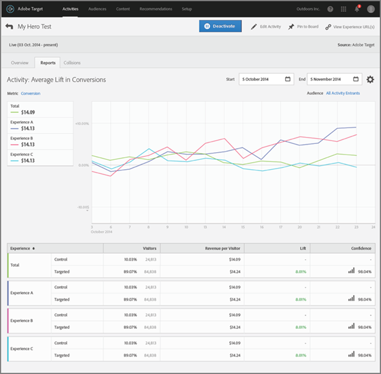

# Auto-Target 요약 보고서{#auto-target-summary-report}를 참조하십시오

자동 Target 요약 보고서를 해석하는 방법에 대한 정보입니다.

다음 그림은 자동 타겟을 사용할 때 일반적인 요약 보고서의 모습을 보여줍니다.

자동 타겟 보고서를 해석할 때 필요한 몇 가지 팁과 고려 사항:

* 표의 다양한 행은 활동 성과를 이해하는 데 도움이 됩니다.

   * 보고 페이지에 있는 표에서 맨 위의 두 행에는 통제군(즉, 임의로 제공된 경험)에 지정된 방문자와 개인화 알고리즘에 지정된 방문자 간의 A/B 테스트의 결과가 표시됩니다. 이 정보를 사용하여 무작위로 제공된 통제군과 비교하여 개인화 알고리즘이 어떻게 수행되었는지를 측정할 수 있습니다.
   * 나머지 행은 경험 수준의 결과를 보여줍니다. 각 경험에 대해서는, 해당 경험이 임의로 제공되는 통제 경험으로서 표시된 방문자의 평균 응답과 경험이 개인화 알고리즘을 사용하는 것으로 표시된 방문자의 평균 응답 간 비교가 있습니다.

* 보고서에서 각 경험 옆에 있는 녹색 확인 아이콘은 해당 경험에 대해 개인화된 기계 학습 모델이 생성되었음을 나타냅니다. 시계 아이콘은 모델을 만들 수 있는 충분한 트래픽이 제공되지 않았음을 나타냅니다.

   * 모델은 경험마다 만들어지므로 녹색 확인 아이콘이 있는 경험과 시계 아이콘이 있는 다른 경험들을 위한 모델이 표시될 수 있습니다.
   * 이 경우 모든 경험을 위해 모델을 만드는 활동의 속도를 높이기 위해 아직 만들어지지 않은 모델이 있는 경험에 추가 트래픽이 전송됩니다.
   * 개인화를 시작하려면 모델이 빌드된 경험(녹색 확인 표시)이 두 개 이상 있어야 합니다.

* 경험 A의 전환율을 경험 B의 전환율과 비교하는 것은 자동 타겟에서 적절한 비교가 아닙니다. 문제는 지능적인 방식으로 제공될 때와 임의 방식(다시 말해 통제군 사용)으로 제공될 때 중 언제 경험 A가 더 나은 성과를 보이는가 하는 것입니다. 또한 개인화 알고리즘은 개별 경험이 아니라 전체 활동에 대한 성공 지표에 대해 최적화하려고 시도하므로 마케터는 개별 경험의 상승도 해석에 대해 주의해야 합니다.
* 상승도가 가장 높은 경험은 모집단 내에서 분화가 가장 큰 것으로 이해할 수 있습니다. 즉, 알고리즘이 해당 특정 경험을 가장 좋아하는 세그먼트를 찾은 것입니다.

