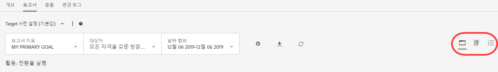
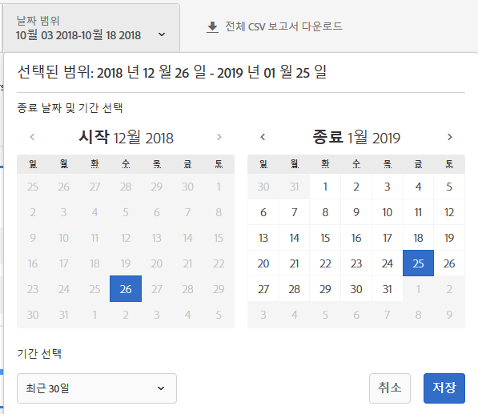
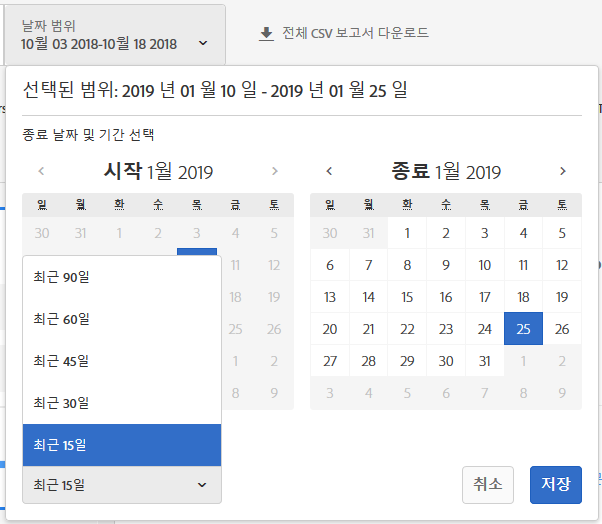
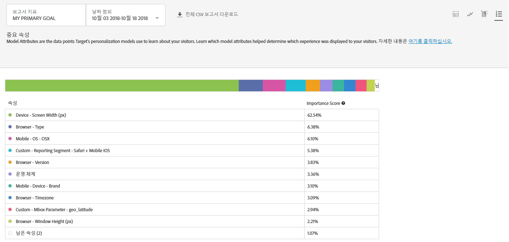

#  중요 속성 보고서

에 대한 정보 [!UICONTROL 중요 속성] 보고서, [!UICONTROL Automated Personalization] (AP) 및 [!UICONTROL 자동 Target] (AT) 활동.

>[!NOTE]
>
>을 사용할 때는 다음 사항을 고려하십시오 [!UICONTROL 개인화 통찰력] 보고서:
>
>* AP 및 AT 활동은 [!DNL Target Premium] 솔루션의 일부로 사용할 수 있습니다. [!DNL Target Premium] 라이센스가 없는 [!DNL Target Standard]에는 포함되지 않습니다.
>
>* [!UICONTROL 개인화 인사이트 보고서는 전환 최적화 목표를 사용하는 AP 및 AT 활동에만 사용할 수 있습니다. ] 활동이 이미 활성화된 후에 수익에서 전환하도록 최적화 목표가 변경된 활동도 지원되지 않습니다.
>
>* [!UICONTROL 개인화 통찰력] 보고서는 [!UICONTROL 기본 목표] 선택 [!UICONTROL 보고서 지표] 드롭다운 목록.
>
>* 개인화 통찰력 보고서는 [기본 환경](/help/administrating-target/hosts.md)에서만 지원됩니다.
>
>* [!UICONTROL 개인화 통찰력] 보고서는 [!UICONTROL 라이브] 상태 및 이(가) 활성화되었으며 적어도 15일 동안 트래픽을 수신했습니다.

다른 활동에서 다른 속성은 모델이 개인화를 결정하는 방법에 대해 더 중요하거나 덜 중요합니다. 이 보고서는 모델 및 모델의 상대적 중요도에 영향을 미친 주요 속성을 보여 줍니다.

## 액세스 권한 [!UICONTROL 중요 속성] 보고서 {#section_8E8F997AAAF44A1B9EE06EB6FB652801}

1. 클릭 **[!UICONTROL 활동]**&#x200B;를 클릭한 다음, 원하는 를 클릭합니다 [Automated Personalization](/help/c-activities/t-automated-personalization/automated-personalization.md#task_8AAF837796D74CF893CA2F88BA1491C9) 또는 [자동 Target](/help/c-activities/auto-target/auto-target-to-optimize.md) 활동 을 포함할 수 없습니다.

   활동이 많다면 [!UICONTROL 유형], [!UICONTROL 상태], [!UICONTROL 보고 소스], [!UICONTROL 경험 작성기], [!UICONTROL 지표 유형] 및 [!UICONTROL 활동 소스] 드롭다운 목록에서 선택 사항을 선택하여 목록을 필터링할 수 있습니다.

1. **[!UICONTROL 보고서를 클릭합니다]**.

   다음 [Automated Personalization 요약](/help/c-reports/reports-ap.md) 또는 [자동 Target 요약](/help/c-reports/auto-target-summary-report.md) 보고서에는 활동의 성과에 대한 정보를 제공하는 첫 번째 화면 아이콘으로 표시됩니다. 두 개의 추가 아이콘은 [!UICONTROL 개인화 통찰력] 보고서: [!UICONTROL 자동화된 세그먼트] 및 [!UICONTROL 중요 속성].

   

   참고 사항 [!UICONTROL 자동 Target] 에는 의 그래픽 보기에 대한 추가 그래프 아이콘이 있습니다 [!UICONTROL 요약] 보고서 세트에 대해 설명합니다.

   

   >[!IMPORTANT]
   >
   >[!UICONTROL 중요 속성] 보고서는 활동을 활성화한 후 적어도 15일 이후에나 사용할 수 있습니다. 이 초기 기간에는 이 보고서에 액세스하거나 [!UICONTROL 중요 속성] 아이콘을 클릭할 수 없습니다. 15일 이후에는 활동에 개인화된 트래픽이 충분하다 고 가정하여 [!UICONTROL 중요 속성] 보고서를 사용할 수 있습니다.

1. 활동을 활성화한 후 15일이 지나면 **[!UICONTROL 중요 속성]** 아이콘.

   

1. 원하는 날짜 범위를 선택합니다.

   와 달리 [!UICONTROL 요약] 보고서(성과 보고), [!UICONTROL 개인화 통찰력], 포함 [!UICONTROL 중요 속성]에서는 고정된 날짜 범위에 대해서만 사용할 수 있습니다. 15일, 30일 및 60일.

   >[!NOTE]
   >
   >다음 [!DNL Target] UI를 현재 45일 및 90일 날짜 범위를 선택할 수 있습니다. 하지만, [!DNL Target] 백엔드가 이 두 범위를 처리하지 않습니다. 사용 패턴 및 성능 향상을 위한 노력으로 이러한 날짜 범위는 더 이상 사용되지 않습니다. UI가 현재 허용된 범위를 반영하도록 업데이트됩니다. 15, 30 및 60일.

   이러한 고정 날짜 범위를 사용하면 [!UICONTROL 개인화 인사이트]에서 사용자 활동의 단기 패턴에서 인사이트를 파생할 가능성을 줄이기 위해 충분히 큰 데이터 범위를 사용할 수 있습니다. 날짜 범위에 대해 가능한 두 가지 의사 결정은 &quot;종료 날짜&quot; 및 &quot;지속 시간&quot;입니다. &quot;시작&quot;은 회색으로 표시됩니다. 시작 날짜는 선택한 종료 날짜 및 지속 시간에 따라 자동으로 변경됩니다.

   

   [!UICONTROL 기간 선택] 드롭다운 목록에서 사용 가능한 고정 날짜 범위에 액세스할 수 있습니다.

   

1. [!UICONTROL 중요 속성] 보고서 데이터를 검토하십시오.

   

1. (선택 사항) Excel 및 기타 도구에서 분석할 [보고서를 CSV 형식으로 다운로드](/help/c-reports/c-report-settings/report-settings.md#section_77E65C50BAAF4AB79242DB3A8778ADEF)합니다.

   >[!NOTE]
   >
   >개인화 통찰력 UI 보고서에는 선택 정보가 들어 있습니다. 중요 속성의 CSV 다운로드에는 추가 세부 사항이 포함되어 있습니다. 중요 속성 보고서 다운로드에는 상위 100개 속성의 전체 목록이 포함되어 있지만, UI 보고서에는 상위 10개만 포함되어 있습니다. 보고서에서 찾고 있는 특정 속성이 없는 경우 속성이 활동에 영향을 주지 않았음을 의미하는 것이 아니라, 상위 100개 속성에 대한 목록이 작성되지 않은 것입니다.

## 중요한 속성 보고서 해석

다음 표에는 보고서를 해석하고 해당 요소를 설명하는 방법이 나와 있습니다.

| 요소 | 세부 사항 |
|--- |--- |
| 막대 그래프 | 화면 맨 위에 있는 여러 색의 막대 그래프를 사용하면 이러한 상대적 중요도 점수를 시각화할 수 있으며, 테이블에서 해당하는 각 속성 옆에 있는 점의 색상에 매핑됩니다. 또한 막대형 차트에서 특정 색상을 마우스로 가리키면 색상이 나타내는 속성을 볼 수 있습니다.  상위 100개 속성의 중요도 점수는 100%에 추가됩니다. Target의 개인화 모델에서 사용할 수 있는 속성을 더 추가하는 방법에 대한 자세한 내용은 [Target의 개인화 알고리즘을 위해 데이터 업로드](/help/c-activities/t-automated-personalization/uploading-data-for-the-target-personalization-algorithms.md). |
| 모델 속성 등급 차트 | 모델 속성 등급에는 Target의 개인화 모델이 각 방문자를 표시하는 콘텐츠를 결정하는 데 가장 중요한 상위 10개 속성이 포함되어 있습니다. 중요도 점수는 상위 100개 속성을 기준으로 하여 이 활동에서 특정 속성이 Target의 개인화 모델에 얼마나 중요한지를 보여 줍니다. |

## 중요 속성 FAQ {#section_740910A52FA646B4AC9452F98C2F5719}

**개인화 인사이트 보고서를 아직 내 활동에 아직 사용할 수 없습니다. 이유가 무엇입니까?**

다음과 같은 여러 가지 이유로 활동에 [!UICONTROL 개인화 인사이트] 보고서를 아직 사용하지 못할 수도 있습니다.

* 활동을 활성화한 후에 15일이 지나지 않았습니다. 자동화된 세그먼트 및 중요 속성 보고서는 활동을 활성화한 후 적어도 15일 이후에나 사용할 수 있습니다. 이 초기 기간에는 보고서에 액세스하거나 자동화된 세그먼트 및 중요 속성 아이콘을 클릭할 수 없습니다.
* 사용자의 활동에 지정된 기간에 충분한 트래픽이 없습니다. 15일 이후에는 활동에 개인화 모델을 구축할 [개인화된 트래픽이 충분하다](/help/c-activities/auto-target/auto-target-to-optimize.md#section_BA4D83BE40F14A96BE7CBC7C7CF2A8FB)고 가정하여 자동화된 세그먼트 및 중요 속성 보고서를 사용할 수 있습니다.
* 활동에는 수입 최적화 목표가 있습니다. 현재 [!UICONTROL 개인화 인사이트]는 변환 최적화 목표 활동에만 사용할 수 있습니다. 향후 릴리스에서 수익 최적화 목표 활동에 대한 지원을 추가할 예정입니다.

**속성이란 무엇입니까?**

속성은 트래픽을 개인화하는 방법을 학습하기 위해 개인화 알고리즘에 사용된 방문자 또는 방문자의 특정 방문에 대한 정보입니다. 예를 들어, 브라우저 유형, 위치, 방문 요일 등이 속성이 될 수 있습니다.

개인화 모델에서 [!DNL Target]이 사용하는 속성에 대한 자세한 내용은 [Target의 개인화 알고리즘에 대한 데이터 수집](/help/c-activities/t-automated-personalization/ap-data.md)을 참조하십시오. Target의 개인화 모델에 사용할 새 속성을 Target에 업로드하는 방법에 대한 자세한 내용은 [데이터를 Target에 가져오는 방법](/help/c-implementing-target/c-considerations-before-you-implement-target/c-methods-to-get-data-into-target/methods-to-get-data-into-target.md#concept_0069C0EFB56C4700BB33F2F35C2B9B17)을 참조하십시오.

**[!UICONTROL 자동화된 세그먼트] 및 [!UICONTROL 중요 속성] 보고서가 CSV 다운로드와 동일합니까?**

아니요, UI 보고서에는 선택 정보가 포함되어 있습니다. CSV 다운로드에 추가 세부 사항이 포함되어 있습니다. 자동화된 세그먼트 인사이트 보고서 다운로드에는 UI에 포함된 최상위 세그먼트 외에 그러한 세그먼트가 오퍼 또는 경험에 대해 수행된 방식과 함께 추가 자동화 세그먼트가 포함되어 있습니다. 중요 속성 보고서에는 상위 100개 방문자 속성과 상대적 중요도가 포함되어 있지만, UI에는 상위 10개 방문자 속성만 포함되어 있습니다.

**사용자 지정 날짜 범위에 대한 개인화 인사이트를 볼 수 있습니까?**

개인화 인사이트 보고([!UICONTROL 자동화된 세그먼트]와 [!UICONTROL 중요 속성] 모두)는 고정 날짜 범위(15일, 30일, 45일, 60일 및 90일)에만 사용할 수 있습니다. 이러한 고정 날짜 범위를 사용하면 [!UICONTROL 개인화 인사이트]에서 사용자 활동의 단기 패턴에서 인사이트를 파생할 가능성을 줄이기 위해 충분히 큰 데이터 범위를 사용할 수 있습니다. 종료 날짜에 대해 이러한 지속 시간을 선택할 수 있습니다(활동에 지속 시간을 충족할 충분한 데이터가 있는 경우).

**개인화 인사이트 작성 방법**

[!UICONTROL 개인화 인사이트는 MAGIX(Model Agnostic Globally Interpretable Explanations)라고 하는 Adobe 특허 출원 기술을 사용하여 작성됩니다. ] [arXiv.org 웹 사이트](https://arxiv.org/abs/1706.07160)에 Adobe 연구 팀이 게시한 문서에서 MAGIX에 대해 자세히 알아볼 수 있습니다.

**수입을 기반으로 한 모델링 목표/기본 목표에 개인화 인사이트를 사용할 수 있습니까?**

현재 [!UICONTROL 개인화 인사이트]는 변환 최적화 목표 활동에만 사용할 수 있습니다. 향후 릴리스에서 수익 최적화 목표 활동에 대한 지원을 추가할 예정입니다.

**중요 속성 보고서에서 속성 중요도 점수란 무엇입니까?**

보고서의 &quot;속성 중요도 등급&quot; 부분에서 중요도 점수는 모든 방문자를 식별된 세그먼트로 분할하는 방법을 결정할 때 알고리즘이 학습하는 데 사용한 가장 중요한 변수에 입력을 제공합니다. 모델에서 사용하는 상위 100개 속성에 백분율 점수를 지정했습니다.

**전환율이 낮은 일부 오퍼/경험이 특정 자동화된 세그먼트에 대한 다른 오퍼/경험보다 큰 트래픽을 수신하는 이유는 무엇입니까?**

다음을 포함하여 자동화된 세그먼트 내에서 전환율이 낮은 오퍼/경험에 대한 더 많은 방문 횟수를 볼 수 있는 몇 가지 잠재적인 이유가 있습니다.

* 특정 자동화된 세그먼트의 일부 또는 전체 오퍼/경험에 대한 보기 횟수가 적습니다.
* 특정 오퍼나 경험에 모델이 구축되지 않은 낮은 볼륨 활동입니다.
* 모델이 일부 오퍼/경험에 대해 보다 빠르게 구축된 낮은 볼륨 활동입니다. 예를 들어 추가 모델이 22일에 구축되었고, 사용자가 10~24일의 데이터를 보고 있다고 가정합니다.
* 방문자가 볼 수 있는 오퍼/경험을 제한하는 특정 오퍼에 대한 타깃팅 규칙입니다.
* 인사이트 보고에는 신뢰 구간이 없습니다. 그러나 전환율이 거의 근접한 경우 모델이 트래픽을 제공하므로 포인트 크기보다 높을 수 있지만 &quot;통계적으로 다른&quot; 숫자는 아닙니다.

트래픽을 제공하는 모델이 어떻게 작동하는지 파악하는 것이 도움이 될 수 있습니다. 각 개인에게는 개인의 전체 프로필을 기반으로 하여 제공됩니다. 하지만 인사이트 보고서는 이 동작을 일반화하여 사람이 쉽게 이해할 수 있게 만듭니다. 따라서 세그먼트는 상호 배타적이 아닙니다. 이렇게 하면 동일한 사람이 여러 세그먼트에 나타날 수 있으므로 개별 세그먼트에 이러한 유형의 동작이 표시될 수 있습니다.

**개인화 인사이트의 정보를 활용할 수 있는 다른 방법에는 어떤 것이 있습니까?**

* 타깃팅할 새 대상 검색: 특히 잘 수행되는 특정한 자동화된 세그먼트가 표시되면 다른 보고서에서 해당 세그먼트를 재사용할 수 있도록 대상을 만드는 것을 고려할 수 있습니다.
* 사용자의 경험에 해당하는 방문자 유형에 대한 가정을 테스트합니다.
* 방문자에게 적용된 콘텐츠 종류에 대한 인사이트를 얻습니다. 즉, 오퍼가 방문자에 대한 리프트를 담당합니다.
* 성과가 낮은 콘텐츠를 식별합니다.
* 모델 학습 방법에 가장 중요한 속성을 파악합니다.
* 개인화 모델에서 사용되는 속성 및 그러한 속성의 중요도를 확인합니다.
* 개인화를 자세히 알릴 Target에 전달할 수 있는 추가 데이터 포인트에 대한 기회를 식별합니다.
