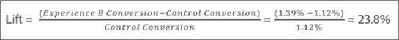

# 평균 상승도, 상승도 한계 및 신뢰 구간

보고서에는 우승자를 보다 정확하게 판별할 수 있도록 [!DNL Adobe Target] 활동과 연관된 리프트 경계 및 신뢰 수준을 이해하는 데 도움이 되는 여러 데이터 포인트 및 시각화 표현들이 포함되어 있습니다.

>[!NOTE]
>
>이 기능은 [!UICONTROL 표] 보기에서 보고서를 볼 때만 사용할 수 있습니다. 이 기능은 [Analytics를 보고 소스로 사용(A4T)](/help/c-integrating-target-with-mac/a4t/a4t.md#concept_7540C8C04259434AB6EE33B09F47A1DE)하는 활동에는 사용할 수 없습니다.

## 데이터 해석 {#section_62C0D7E76F3D49A7B3C371C82AEF27D5}

다음 그림은 [!UICONTROL 리프트 경계 및 신뢰 수준] 정보를 보여줍니다.

[!DNL Target] 보고 UI의 리프트 및 신뢰도 정보에는 다음이 포함됩니다.

### 상승도

큰 숫자와 화살표는 상승도의 예상 값을 반영합니다. 이 숫자는 상승도 한계 범위의 중간점입니다. 예상 상승도 화살표는 신뢰도가 95%를 넘을 때까지 회색으로 표시됩니다. 이 임계값 이후에는 상승도가 음수인지 또는 양수인지에 따라 화살표가 빨간색 또는 녹색으로 표시됩니다.

### 리프트 경계

상승도의 95% 신뢰 구간입니다. 평균 상승도 이하 범위로 표시됩니다. 이러한 리프트 범위를 계산하는 방법에 대한 예를 보려면 아래 [계산 예](#example)를 참조하십시오.

### 상자 플롯 그래프

[!DNL Target] 인터페이스의 상자 플롯 그래프는 해당 성공 지표의 예상 값 및 95% 신뢰 구간을 나타냅니다. 상승도 및 상승도 한계 정보를 보는 그래픽 방식이라고 보면 됩니다.

[!DNL Target]은(는) 색상 중 하나인 신뢰도 정보를 해석하는 데 도움이 되는 몇 가지 주요 방법이 있습니다. 그래프에서 특정 경험의 신뢰 구간에 통제되는 신뢰 구간과 겹치는 부분이 있으면 회색으로 표시되고, 특정 경험의 신뢰 구간에서 통제 신뢰 구간의 위 또한 아래에 있는 범위는 각각 녹색 또는 빨간색으로 표시됩니다.

상자그림 막대의 길이는 신뢰 구간의 크기를 쉽게 이해할 수 있는 방식으로 표현합니다. 활동에서 더 많은 데이터를 수집하면 막대가 이동하고 변경됩니다. 신뢰 구간은 분산과 샘플 크기(방문자 수)를 통해 얻게 됩니다. 분산이 작을수록, 샘플 크기가 클수록 신뢰 구간은 좁아집니다.

### 신뢰도

경험이나 오퍼의 신뢰도는 통제 경험/오퍼에 대한 연결된 경험/오퍼의 증가가 &quot;사실&quot;(우연히 초래되지 않음)인 확률을 나타냅니다. 일반적으로 95%는 상승도에 대해 유의미한 것으로 간주되는 권장 신뢰 수준입니다.

## 리프트 범위는 어떻게 계산됩니까?{#section_1D360781D972483693680BE0F07AEAD1}

상승도 한계는 통제 경험 또는 통제 오퍼에 비해 증가한 특정 경험 또는 특정 오퍼의 95% 신뢰 구간을 나타냅니다. 대략적으로 말해, 이는 실제 상승도가 이러한 한계 사이에 있을 확률이 약 95%임을 의미합니다.

상승도 한계는 다음 공식을 사용하여 계산됩니다.

상승도 한계에 대한 입력에 도달하는 몇 가지 추가 계산이 있습니다.

* **t 값:** 95% 신뢰 수준에 대한 중요 통계는 1.96.입니다. [여기서 t 값](https://en.wikipedia.org/wiki/T-statistic)에 대해 자세히 알 수 있습니다.
* **상승도 분산:**&#x200B;상승도 분산을 결정하려면 경험 N의 성공 지표에 대한 표준 오차와 통제 경험의 성공 지표에 대한 표준 오차가 있어야 합니다. 상승도 분산은 다음 공식을 사용하여 계산됩니다(성공 지표가 전환인 경우가 설명됨).

   

* **전환율 / 성공 지표 표준 오차:**&#x200B;다음 공식을 사용하여 경험 N 및 통제 경험에 대해 동일한 방식으로 표준 오차가 계산됩니다(성공 지표가 전환인 경우가 설명됨). [여기서 표준 오차](https://en.wikipedia.org/wiki/Standard_error)에 대해 자세히 알 수 있습니다.

   

   >[!NOTE]
   >
   >수입 성공 지표 활동에 대한 표준 오차는 수입의 샘플 분산을 기반으로 합니다.

## 계산 예 {#example}

두 개의 경험과 다음 결과가 있는 활동 예를 살펴보겠습니다.

| 경험 | 방문자 수 | 변환 | 전환율 |
|--- |--- |--- |--- |
| 경험 A(통제) | 219, 328 | 2,466 | 1.12% |
| 경험 B | 218, 362 | 3,040 | 1.39% |

공식에 따라 상승도 한계에 필요한 입력을 계산할 수 있습니다.

**경험 A(통제)에 대한 표준 오차**

**경험 B에 대한 표준 오차**

**경험 B에 대한 상승도 분산**

**경험 B에 대한 상승도 한계**

경험 B에 대한 예상 상승도:

따라서 경험 B의 상승도 한계는 다음과 같습니다.

>[!NOTE]
>
>위의 공식을 사용한 수동 계산과 보고서에 표시된 숫자 간에 사소한 차이가 있습니다. 이 차이는 수동 계산에 사용되는 페이지 보기 횟수가 반올림되어 있기 때문에 발생할 수 있습니다. [!DNL Target] 보고서에 표시된 향상도는 총 참여 및 참여 수에서 얻은 정확한 숫자를 기반으로 합니다. 참여도 숫자는 실적 보고서 API를 통해 확보할 수 있습니다.

## 리프트 경계가 표시되지 않는 경우{#section_C5622E1E94684DAD937249B51A9E42CC}

경우에 따라 [!DNL Target]에 리프트 경계가 표시되지 않습니다.

* 어떤 활동에 대해서든 방문 또는 방문자의 총 수가 30 미만일 때 표시되지 않습니다.
* [!UICONTROL 자동 할당] 활동의 경우 한 경험이 60% 신뢰도를 달성할 때까지 리프트 경계가 표시되지 않습니다.
