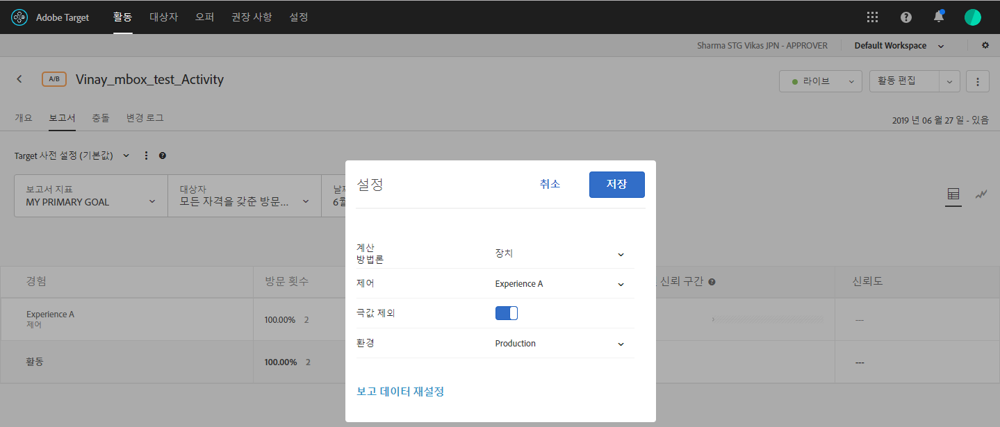

# 예외적인 값 제외

[!DNL Adobe Target]에서 보고서에 영향을 주는 예외적인 값을 제외하여 몇 가지 비정상적인 주문이 활동 결과에 영향을 주지 않도록 합니다. 비정상적인 주문의 예로, 개인 유니폼을 구매하는 개별 쇼핑객 대신 전체 팀용으로 유니폼을 구매하는 코치가 있을 수 있습니다.

>[!NOTE]
>
>[!UICONTROL 예외적인 값 제외] 플래그는 매출 및 참여 지표 유형을 갖는 활동에만 적용됩니다.

예외적인 값에는 아래 설명된 규칙을 기반으로 자동으로 플래그가 지정됩니다. 보고서에서 예외적인 값의 보기와 제외 간을 전환할 수 있습니다. 활동이 한 시간 동안 실행되거나 15건의 주문이 발생하면, 어느 쪽이 먼저인지 상관없이 예외적인 값을 제외하게 됩니다.

데이터의 마지막 월을 사용하여 평균 주문 값에서 +/- 3 이상의 표준 편차를 보이는 경우 값은 예외적인 것으로 간주됩니다(계산한 시간에 최대 포인트).

예를 들어, RPV를 사용할 때 예외적인 값 필터가 종종 유용합니다. RPV는 전환율과 평균 주문 가격을 결합하고, 이러한 지표들의 변동성을 종종 노출합니다. RPV를 사용하고 주문이 정상적으로 배포되지 않는 것으로 파악되는 경우, 예외적인 주문 필터를 적용하면 정상적인 결과가 더 많이 표시됩니다.

값이 예외적인 것으로 표시되면 예외적인 항목을 제외하고, 주문 가격은 마지막 달 동안 경험의 평균 주문 가격으로 대체됩니다. 이 주문은 [!UICONTROL 주문 세부 사항] 보고서와 일별 결과에 대한 CSV 다운로드에서도 극단으로 표시됩니다.

**보고서에서 예외적인 값을 제외하려면**

1. 매출 또는 참여 지표 유형을 포함하는 활동을 연 다음 **[!UICONTROL 보고서]** 탭을 클릭합니다.
1. 톱니바퀴 아이콘을 클릭하여 **[!UICONTROL 설정]** 대화 상자를 표시합니다.

   

1. 원하는 대로 **[!UICONTROL 예외값 제외]** 전환을 &quot;켜기&quot; 또는 &quot;끄기&quot; 위치로 끕니다.
1. **[!UICONTROL 저장]**&#x200B;을 클릭합니다.
