# 보고서 설정{#report-settings}

보고서에 표시할 요소를 설정하는 데 도움이 되는 정보입니다. 보고서 설정은 나중에 사용할 수 있도록 저장할 수 있습니다.

보고서를 표시하려면 **[!UICONTROL 활동]**을 클릭하고 목록에서 원하는 활동을 클릭한 다음, **보고서]탭을 클릭하십시오.[!UICONTROL **

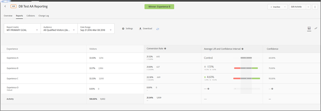

## Target 사전 설정 {#section_51F67341465045BEB4F1A2FB638A8EB1}

이제 개별 활동의 보고서를 원하는 대로 구성한 후(지표, 날짜 범위, 대상, 고급 설정 등) 그러한 보고서의 여러 사전 설정을 최대 10개까지 저장할 수 있습니다. 모든 Target 사용자는 사전 설정을 생성한 사람과 관계없이 다양한 사전 설정을 표시, 편집 및 삭제할 수 있습니다.

개별 활동의 보고서를 원하는 대로 구성한 다음 해당 구성을 기본/즐겨 찾는 사전 설정으로 저장할 수도 있습니다. 해당 활동 보고서를 볼 때마다 표시되는 보기입니다.

**사전 설정 또는 기본 사전 설정 작성**

1. 활동의 보고서를 원하는 대로 구성합니다(지표, 날짜 범위, 대상, 고급 설정 등).
1. **[!UICONTROL Target 사전 설정]** 옆에 있는 3개의 수직 줄임표 아이콘을 클릭한 뒤 **[!UICONTROL 새 이름으로 저장]**을 클릭합니다.

   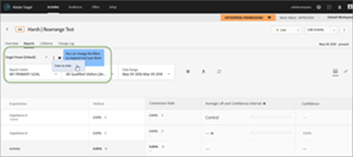

   새 사전 설정 대화 상자가 표시됩니다.

   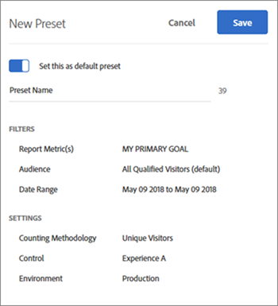

1. 필터 및 설정 섹션의 정보를 검토하여 보고서가 원하는 대로 구성되었는지 확인한 다음 **[!UICONTROL 사전 설정 이름]**(최대 50자까지)을 지정하십시오.
1. (조건부) 기본/즐겨 찾는 보고서 보기로 설정하려면 **[!UICONTROL 이 설정을 기본 사전 설정으로 설정]토글을 [켜기] 위치로 밉니다.**
1. **[!UICONTROL 저장을 클릭합니다]**.

**다른 사전 설정 선택**

**[!UICONTROL Target 사전 설정]드롭다운 목록에서 원하는 사전 설정을 선택합니다.**

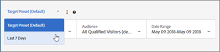

**사전 설정 편집**

1. 편집할 사전 설정을 선택합니다.
1. 보고서의 구성을 원하는 대로 편집합니다(지표, 날짜 범위, 대상, 고급 설정 등).

   보고서의 구성을 편집한 후 [!UICONTROL 저장]을 클릭하면 사전 설정 이름 뒤에 별표(*)가 표시되어 아래와 같이 사전 설정이 변경되었음을 나타냅니다.

   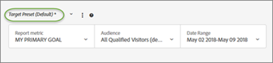

1. 3개의 수직 줄임표 아이콘 &gt; **[!UICONTROL 새 이름으로 저장]을 클릭하여 새로운 사전 설정을 만듭니다.**

   또는

   3개의 수직 줄임표 아이콘 &gt; **[!UICONTROL 업데이트]를 클릭하여 현재 사전 설정을 업데이트합니다.**

   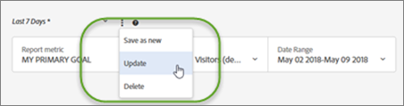

**사전 설정 삭제**

1. 삭제할 사전 설정을 선택합니다.
1. 3개의 수직 줄임표 아이콘 &gt; **[!UICONTROL 삭제를 클릭합니다]**.

   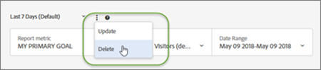

1. **[!UICONTROL 삭제]를 다시 클릭하여 삭제를 확인합니다.**

**사전 설정 오류 처리**

보고서 내의 경고 및 메시지를 통해 사전 설정이 유효하지 않은 상태가 되는지 알 수 있습니다. 경고 또는 메시지에 올바른 사전 설정을 작성하기 위한 다른 대상, 지표, 호스트 그룹 또는 경험을 선택하라고 표시됩니다.

다음 목록은 사전 설정이 유효하지 않을 수 있는 몇 가지 상황을 설명합니다.

* 보고 대상이 활동에서 제거되었지만, 사전 설정된 정의에서 참조됩니다.
* 하나 이상의 지표가 삭제되었지만 사전 설정된 정의에서 참조됩니다. 예를 들어, 활동에서 하나 이상의 지표를 삭제한 다음 지표를 새로 추가할 수 있습니다.
* 하나 이상의 호스트 그룹(환경)이 존재하지 않지만 사전 설정된 정의에서 참조됩니다.
* 사전 설정이 작성된 후에 하나 이상의 경험이 삭제되었지만 사전 설정된 정의에서 참조됩니다.
* 참조된 엔티티가 있지만 사전 설정 정의가 의미상 변경되는 방식으로 업데이트되었으므로 사전 설정이 의미상 잘못되었습니다. 예를 들어 처음에 &quot;Revenue on Chrome&quot;이라는 사전 설정된 이름을 만들었다고 가정해 보겠습니다. 나중에 활동을 업데이트하여 수입 대신 전환 지표를 측정합니다. 활동 정의에 대한 이 업데이트는 사전 설정된 정의를 무효화했습니다.

## 보고서 지표 {#section_894ABD7148244806B7CE556EBBA2AD62}

**[!UICONTROL 보고서 지표]** 드롭다운 목록을 클릭하면 다른 [성공 지표](../../c-activities/r-success-metrics/success-metrics.md#reference_D011575C85DA48E989A244593D9B9924)나 여러 지표를 선택하여 그래프 및 차트로 표시할 수 있습니다.

기본적으로, 기본 지표는 활동을 작성할 때 성공 지표 설정에서 결정됩니다. 설정을 변경하고 활동을 다시 저장하면 보고에 대한 기본 지표가 업데이트됩니다.

보고서에서 볼 여러 지표를 선택하는 방법에 대한 자세한 내용은 [보고서에서 여러 지표 보기](../../c-reports/c-report-settings/view-multiple-metrics.md#concept_9E3C3F6F3EC1412FAF252975AC0720B7)를 참조하십시오.

## 대상자 {#section_70926EB4618945D9AFF2B0564FF3717B}

[!UICONTROL 대상] 드롭다운 목록을 클릭하면 보고서에 대해 표시된 [대상](../../c-target/target.md#concept_A782F8481A5041EBA75103CB26376522)을 변경할 수 있습니다.

자세한 내용은 [대상](../../c-target/target.md#concept_A782F8481A5041EBA75103CB26376522)을 참조하십시오.

## 날짜 범위 {#section_A410A768403C4E01891F95CB357E63ED}

날짜 범위 상자에 보고서 현재 날짜 범위가 표시됩니다. 드롭다운 아이콘을 클릭하여 보고서의 날짜 범위를 변경할 수 있는 달력을 표시합니다.

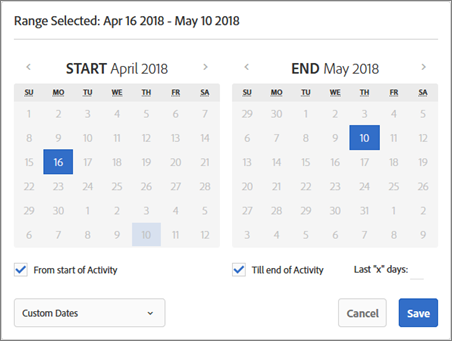

보고서에 대한 새로운 **[!UICONTROL 시작]** 및 **종료]날짜를 선택하십시오.[!UICONTROL ** **[!UICONTROL 활동 시작 날짜부터]** 및 **활동 마지막 날짜까지[!UICONTROL 확인란을 사용할 수도 있습니다.]**

**[!UICONTROL 사용자 지정 날짜]를 클릭하여 사전 정의된 날짜 범위인 [최근 7일], [최근 15일] 또는 [최근 30일]을 선택합니다.** 이러한 사전 정의된 날짜 범위는 순환 범위입니다. 시작 날짜가 선택한 일 수보다 작은 경우, 달력에 시작 날짜부터 범위가 표시되지만, 시작 날짜가 활동 기간이 늘어날 때 선택한 일 수보다 오래되면 롤링됩니다.

보고서 날짜는 다음과 같이 제한됩니다.

* 보고서의 시작 날짜는 지난 2년 이내여야 합니다.
* 일일 보고서는 100일로 제한됩니다.
* 시간별 보고서는 15일로 제한됩니다.

## 설정{#section_D99CE462107D45CABE0960F820E1E972}의 지침을 완료하여 이 설정을 변경할 수 있습니다 

톱니바퀴 아이콘을 클릭하여 보고서 설정을 구성한 다음, 완료되면 **[!UICONTROL 설정 저장]을 클릭하십시오.**

다음 그림은 A/B 활동에 대한 [설정] 대화 상자입니다.

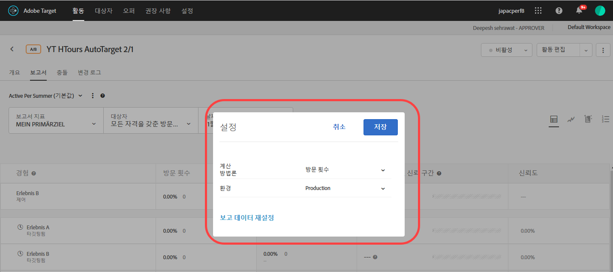

선택한 활동 유형에 따라 선택 사항이 달라집니다.

* **계산 방법론:**원하는 방법을 선택하십시오.

   * 방문자 수
   * 방문 횟수
   * 활동 노출 횟수

* **제어:**상승도를 계산하고 비교할 때 사용할 통제 경험을 선택하십시오.
* **환경:**보고서에 사용할 환경(호스트 그룹)을 선택하십시오.  자세한 내용은 [호스트](../../administrating-target/hosts.md#concept_516BB01EBFBD4449AB03940D31AEB66E)를 참조하십시오.
* **보고서 데이터 재설정:**이전 데이터를 제거하려면 보고 데이터를 재설정하십시오. 현재 방문자는 활동에 남아 있습니다.  이 선택 사항은 승인자 권한이 있는 사용자만 사용할 수 있습니다.

   >[!IMPORTANT]
   >
   >영구적인 작업으로서, 실행을 취소할 수 없습니다.

* **극값 제외:** [!UICONTROL 극값 제외] 토글은 [수입] 및 [거래] 지표 유형이 있는 활동에만 적용됩니다. 자세한 내용은 [예외적인 주문 제외](../../c-reports/c-report-settings/excluding-extreme-orders.md#task_2AE7743FFCDD466DAEEB720BE5F33DAA)를 참조하십시오.

## 다운로드 {#section_77E65C50BAAF4AB79242DB3A8778ADEF}

[다운로드] 아이콘을 클릭하여 보고서 데이터를 [!DNL .csv] 형식으로 다운로드하면 Excel, Access 또는 기타 데이터 분석 프로그램으로 빠르게 가져올 수 있습니다. 자세한 내용은 [CSV 파일로 데이터 다운로드](../../c-reports/downloading-data-in-csv-file.md#concept_3F276FF2BBB2499388F97451D6DE2E75)를 참조하십시오.

## 새로 고침 {#section_E203729F2F314DF3856D2EE67C60B370}

[새로 고침] 아이콘을 클릭하면 전체 페이지, 페이지 구성 또는 날짜 범위를 새로 고치지 않고 보고서 테이블 및 그래프 보기를 새로 고칠 수 있습니다.

## 추가 옵션 {#section_AB1B5C695D7045A0A0AC0E2698D2E7DE}

[!UICONTROL 활동 편집] 및 [!UICONTROL 경험 URL 보기] 옵션에 액세스하려면 [추가 옵션] 아이콘(3개의 수직 줄임표)을 클릭하십시오.

## 표 보기 {#section_4E7E75955A964847ADFF2C2314EC0F21}

보고서를 표로 보려면 **[!UICONTROL 표 보기]아이콘을 클릭하십시오.**

## 그래프 보기 {#section_0D24B902A8D142468ADB7EEF1D941786}

보고서를 그래프로 보려면 **[!UICONTROL 그래프 보기]아이콘을 클릭하십시오.**

## 평균 상승도, 상승도 한계 및 신뢰 구간{#section_0D87615B1D3344B3858BA494EEBC16FB}을 참조하십시오 

보고서는 활동과 연결된 상승도 한계와 신뢰 수준을 이해하는 유용한 몇 가지 데이터 포인트와 시각화 표현을 포함합니다. 이러한 항목들을 포함하는 것은 승자를 보다 정확하게 판별하는 데 도움이 됩니다.

자세한 내용은 [평균 상승도, 상승도 한계 및 신뢰 구간](../../c-reports/c-report-settings/average-lift-bounds-and-confidence-interval.md#topic_AFFDC672A8A34D028B100EF6BE5D8129).

다음 사항을 고려하십시오.

* [표 보기]에서 보고서를 볼 때만 사용할 수 있습니다.
* 이 기능은 Analytics를 보고 소스로 사용(A4T)하는 활동에는 사용할 수 없습니다.

## 위치 기여도 {#section_5832F126AC114AE1ABFFF4D9B904393B}

위치별 기여도를 표시하도록 보고서를 전환하려면 **[!UICONTROL 위치 기여도]아이콘을 클릭하십시오.**

## 경험{#section_3A450DE1FA7E43F0AAB73165EC3D1C34}을 참조하십시오 

[그래프 보기]에서 보고서를 볼 때만 사용할 수 있습니다.

차트에서 경험을 표시하거나 숨기려면 차트의 왼쪽에서 해당 경험을 선택하거나 선택 취소하십시오.

다음 그림의 경우 보고서에 경험 B와 C만 표시됩니다.

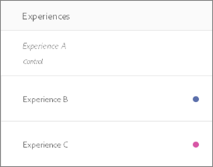

## 평균 실행 {#section_59066693158C4433B87D07402C2BC6CD}

[그래프 보기]에서 보고서를 볼 때만 사용할 수 있습니다.

원하는 그래프 보기를 선택하십시오.

* 평균 실행
* 평균 상승도 실행
* 일별
* 일별 상승도

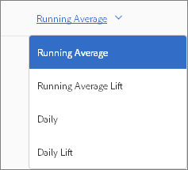

>[!NOTE]
>
>이 드롭다운 목록의 이름은 선택한 보기에 따라 달라지지만 위에 나열된 네 개의 보기 중 하나가 됩니다.

## 계산 방법론{#section_01B0ED5665C74AE1AE97259800190C3E}을 참조하십시오 

[그래프 보기]에서 보고서를 볼 때만 사용할 수 있습니다.

보고서에서 그래프에 대한 계산 방법론을 선택할 수 있습니다. 자동화된 개인화(AP) 활동에는 지원되지 않습니다.

[계산 방법론] 선택 사항에 액세스하려면 그래프 모드에서 보고서를 볼 때 **[!UICONTROL 기본 목표]드롭다운을 클릭한 다음, 계산 방법론을 선택하십시오.**

계산 방법론은 위에서 설명한 [!UICONTROL 설정] 대화 상자에서 선택한 방법론과 같습니다.

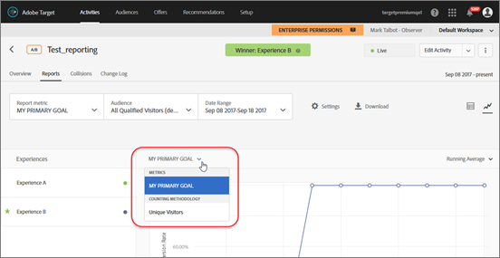

기본적으로 그래프는 [!UICONTROL 일별] 모드로 작성됩니다.

[!UICONTROL 일별] 드롭다운 목록을 클릭한 다음, [!UICONTROL 누적]을 선택하여 모드를 변경할 수 있습니다.

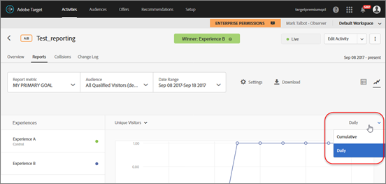

>[!NOTE]
>
>이 드롭다운 목록의 이름은 선택한 모드에 따라 달라집니다.

자동 타겟 활동에 대한 모드로는 [일별 제어], [일별 타깃팅], [누적 제어] 및 [누적 타깃팅], 이렇게 네 가지 모드가 있습니다.

그래프가 작성되는 기본 순서는 다음과 같습니다.

* A/B 테스트([자동 할당] 및 [자동화된 개인화] 포함): 내림차순의 경험 작성 순서.
* 경험 타깃팅(XT): 활동에 있는 경험의 순서.
* 다변량 테스트(MVT): 경험 이름별 알파벳순.
* 권장 사항: 내림차순의 경험 작성 순서.

[계산 방법론] 선택 사항을 사용하여 작업할 때에는 다음 주의 사항을 고려하십시오.

* 자동 타겟 활동의 경우 계산 방법론으로 &quot;방문자 수&quot;를 선택하는 선택 사항이 없습니다. 자동 타겟은 방문자 수로 그래프를 그릴 수 없는 유일한 활동 유형입니다.
* Analytics를 보고 소스로 사용(A4T)하는 활동의 경우 방문자, 방문 또는 노출을 누적해서 그릴 수 없습니다.

**활동에 16개가 넘는 경험이 있는 그래프 작업**

활동에 16개 미만의 경험이 있다면 각 경험은 그래프에서 서로 다른 색상으로 이 표시됩니다.

활동에 16개가 넘는 경험이 있다면 처음 16개의 경험에 대해서는 색상이 지정된 선이 그래프에 표시되고, 나머지 경험은 왼쪽에 있는 [경험] 창에 회색으로 표시되며 그래프에는 해당 그래프 선이 표시되지 않습니다. 16개 경험에 대한 선만 지정된 시간에 표시할 수 있습니다.

회색으로 처리된 경험을 마우스로 가리키면 그 경험에 해당하는 새로운 회색 그래프 선이 그래프에 임시로 표시됩니다. 회색으로 처리된 경험의 그래프 선을 어떤 색상으로 표시하기 위해서는 컬러로 표시되는 한 경험의 이름을 클릭하여 선택 취소한 다음, 회색으로 처리된 원하는 경험의 이름을 클릭하여 이 경험을 선택할 수 있습니다.

일례로 다음 그림은 26개의 경험이 있는 활동의 그래프입니다.

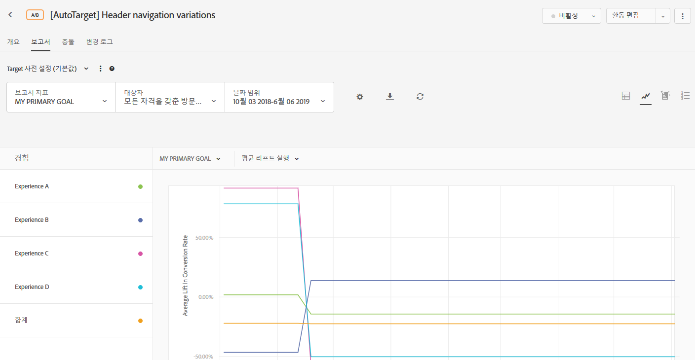

이 그래프는 처음 16개의 경험에 대한 선을 표시합니다(일부는 겹쳐져서 선이 16개 미만으로 표시됩니다.). 왼쪽에 있는 [경험] 패널에서 각 경험 이름 옆에 있는 색상이 지정된 점은 그 경험의 그래프 선이 해당 색상으로 표시되고 있음을 나타냅니다.

[경험] 창에서 아래로 스크롤하면 다음 그림과 같이 17번째부터 26번째 경험까지는 이름이 회색으로 표시됩니다.

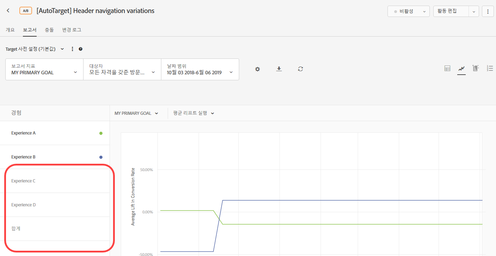

회색으로 처리된 경험 중 하나를 마우스로 가리키면 그 경험에 해당하는 새로운 회색 그래프 선이 그래프에 임시로 표시됩니다.

경험 R에 대한 그래프 선을 표시하고 경험 P에 대한 선은 표시하지 않으려 한다고 가정하십시오. 경험 P의 이름을 클릭하여 선택을 취소한 다음, 경험 R의 이름을 클릭하여 아래와 같이 선택할 수 있습니다.

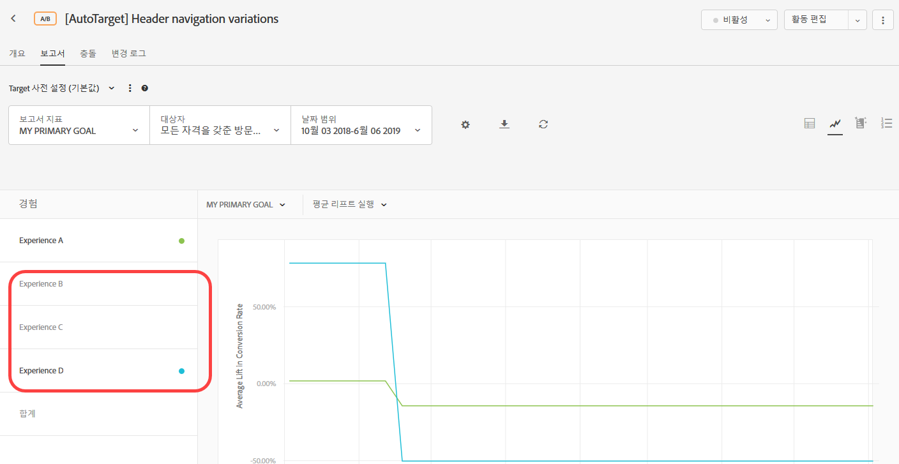

