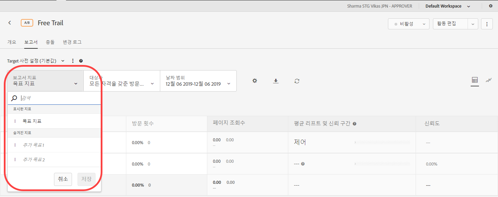
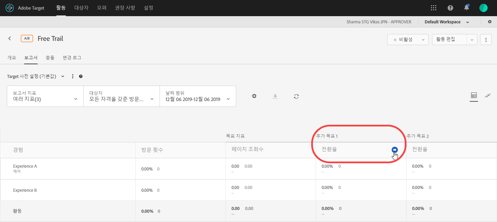

# 보고서에서 여러 지표 보기{#view-multiple-metrics-in-a-report}

여러 지표를 선택하여 [!DNL Adobe Target] 보고서에서 볼 수 있습니다.

보고서에서 여러 지표로 작업할 때는 다음 정보를 유념하십시오.

* The ability to view multiple metrics is available for [A/B Test](/help/c-activities/t-test-ab/test-ab.md), [Auto-Allocate](/help/c-activities/automated-traffic-allocation/automated-traffic-allocation.md), [Auto-Target](/help/c-activities/auto-target/auto-target-to-optimize.md), and [Experience Targeting](/help/c-activities/t-experience-target/experience-target.md) (XT) activities only.
* You cannot add more than 20 metrics to a report for an activity that uses [Analytics for Target](/help/c-integrating-target-with-mac/a4t/a4t.md) (A4T). You can add as many metrics as you have in your activity to reports for activities that do *not* use A4T.
* 여러 지표를 선택한 경우 보고서를 CSV로 다운로드하는 데 다운로드 선택 사항을 사용할 수 없습니다. [!UICONTROL 다운로드] 선택 사항을 활성화하려면 하나의 지표만 선택해야 합니다.
* You cannot view multiple metrics for activities created before the July 2015 [!DNL Target] release (July 30, 2015).

**보고서에 표시할 지표를 여러 개 선택하려면 다음을 수행하십시오.**

1. 보고서를 표시하려면 **[!UICONTROL 활동]**&#x200B;을 클릭하고 목록에서 원하는 활동을 클릭한 다음, **[!UICONTROL 보고서]** 탭을 클릭하십시오.
1. **[!UICONTROL 보고서 지표]** 드롭다운 목록을 클릭하여 [!UICONTROL 표시된 지표] 및 [!UICONTROL 숨겨진 지표] 목록을 표시합니다.

   

   [!UICONTROL 검색] 상자를 사용하여 사용 가능한 지표를 빠르게 찾아 [!UICONTROL 표시된 지표] 목록에 추가할 수 있습니다.

   보고서의 [!UICONTROL 표 보기]와 [!UICONTROL 그래프 보기], 이 두 모드에서 여러 지표를 선택할 수 있습니다.

1. [!UICONTROL 숨겨진 지표] 목록의 원하는 지표 위에 마우스 포인터를 놓은 다음 **[!UICONTROL 선택]**&#x200B;을 클릭하여 [!UICONTROL 표시된 지표] 목록으로 이동합니다.

   또는

   [!UICONTROL 숨겨진 지표] 목록에서 원하는 지표를 [!UICONTROL 표시된 지표] 목록으로 드래그하여 놓으십시오.

   [!UICONTROL 표시된 지표] 목록에 지표가 하나 이상 있어야 합니다.

   [!UICONTROL 표시된 지표] 목록에서 지표를 원하는 순서로 드래그하여 놓아 지표들을 다시 정렬할 수 있습니다. The selected order will be reflected in the [!UICONTROL Table View] and [!UICONTROL Graph View]. [!UICONTROL 표시된 지표] 목록에서 지표를 제거하려면 지표를 마우스 포인터로 가리킨 다음, **X** 아이콘을 클릭하십시오.

1. 완료되면 **[!UICONTROL 저장]**&#x200B;을 클릭합니다.
1. (Conditional) While viewing the report in the [!UICONTROL Table View], hover your mouse pointer on any metric&#39;s column header to display a blue arrow. 이 화살표를 클릭하여 해당 지표에 대한 [!UICONTROL 상승도] 및 [!UICONTROL 신뢰도]를 표시하도록 표를 확장하십시오.

   

   한 번에 하나의 지표/열만 확장할 수 있습니다. 열을 축소하려면 화살표를 다시 클릭하십시오.

1. (조건부) 그래프 보기에서 보고서를 보는 동안 드롭다운 목록에서 표시할 개별 지표를 선택할 수 있습니다.

   

