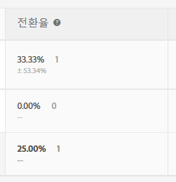

# 전환율

각 경험에 대한 전환율, 상승도, 신뢰도(통계적 중요도) 및 신뢰 구간이 보고됩니다.

다음 그림은 [!UICONTROL 전환율], [!UICONTROL 상승도] 및 [!UICONTROL 신뢰도] 헤더가 강조 표시된 샘플 활동의 차트 헤더를 보여줍니다.

>[!NOTE]
>
>`orderID` 가 전달된 경우 모든 데이터에서 중복 주문은 무시됩니다. 감사 보고서에 무시된 중복 주문이 표시됩니다.

## 전환율 {#section_07A36846C4E84D0881906809B9CE5A74}

중간 전환율, 신뢰도, 간격 및 전환 개수를 표시합니다.

예를 들어, 다음 전환율 보고서 열을 살펴보십시오.

첫 번째 줄은 통제 경험으로서, 세 개의 전환과 함께, 15% 전환율을 표시합니다. 두 번째 줄인 경험 B는 + 또는 - 15.65% 신뢰 구간 및 세 개의 전환과 함께, 15% 전환율을 표시합니다.

>[!NOTE]
>
>현재, 신뢰 구간은 이진 지표에 대해서만 계산됩니다.

## 상승도 {#section_0F409572C720433D9378092ABC999982}

통제 경험을 기준으로 각 경험의 전환율을 비교합니다.

상승도 = (경험 CR - 제어 CR) / 제어 CR

제어가 0이면 상승도 비율이 없습니다.

## 신뢰도(통계적 중요도) {#section_35DB6724813D40C7B0808DE18FE595C1}

이 숫자는 테스트를 다시 실행할 경우 결과가 중복될 가능성을 나타냅니다. 신뢰도가 99.995% 이상이면 신뢰도는 100.00%로 반올림됩니다.

[신뢰 수준 및 신뢰 구간](/help/c-reports/conversion-rate.md#concept_0D0002A1EBDF420E9C50E2A46F36629B)을 참조하십시오.

## 소매 데이터 {#section_30A674731BA6440E9BB93C421BE990EE}

[주문](/help/c-implementing-target/c-implementing-target-for-client-side-web/t-mbox-download/orderconfirm-create.md)(`orderConfirmPage`) mbox를 삽입하여 전환 mbox로 선택한 경우 각 경험에 대해 AOV, RPV 및 판매 데이터가 표시됩니다.

## 신뢰 수준 및 신뢰 구간{#concept_0D0002A1EBDF420E9C50E2A46F36629B}의 &quot;Analytics for Target (A4T)에 사용할 오프라인 계산 수행&quot;을 참조하십시오 

각 경험에 대한 신뢰 수준 및 신뢰 구간이 표시됩니다.

수입 및 참여 지표와 같은 Target 기반 지표용의 전환 및 연속 변수는 다음과 같이 계산됩니다.

* **전환:** 예 또는 아니요 중 하나
* **기타 모든 변수:** 범위의 값

 for Target(A4T)에 사용할 오프라인 계산을 수행할 수 있지만 [!DNL Analytics]Analytics의 데이터 내보내기 단계가 필요합니다. 자세한 내용은 아래의 &quot;Analytics for Target (A4T)에 사용할 오프라인 계산 수행&quot;을 참조하십시오.

### 신뢰도 수준 {#section_26FE5E44BDD5478792A65FCFD83DCCDC}

*신뢰 수준*&#x200B;은 각 경험에 대한 전환율 열에 짙은 비율로 표시됩니다.

  

신뢰 수준 또는 통계적 중요도는 경험의 성공이 우연의 영향을 받지 않는 정도를 나타냅니다. 신뢰 수준이 높다는 것은 다음을 의미합니다.

* 경험이 제어와 매우 다르게 수행되고 있습니다.
* 경험 성능에 영향을 주는 요소가 노이즈만이 아닙니다.
* 이 테스트를 다시 실행하면 동일한 결과가 나올 가능성이 큽니다.

신뢰 수준이 90% 또는 95% 이상이면 결과가 통계적으로 중요하다고 간주될 수 있습니다. 비즈니스 결정을 내리기 전에 안정적인 결과를 얻기 위해 샘플 크기가 충분히 크고 하나 이상의 경험에 대한 신뢰도 막대 4개가 지속적으로 일관되게 유지될 때까지 기다리십시오.

>[!NOTE]
>
>신뢰도가 99.995% 이상이면 신뢰도는 100.00%로 반올림됩니다.

### 신뢰도 구간 {#section_F582738DFE1648C78B93D81EBC6CACF7}

>[!NOTE]
>
>현재, 신뢰 구간은 이진 지표에 대해서만 계산됩니다.

*신뢰 구간*&#x200B;은 지정된 신뢰 수준에서 실제 값을 찾을 수 있는 범위입니다. 신뢰 구간은 전환율 열에 밝은 회색 +/- 백분율로 표시됩니다. 아래 예에서 경험 B의 상승도에 대한 신뢰 구간은 + 또는 - 15.65%입니다.

**예:** 경험의 RPV는 $10이고 신뢰 수준은 95%이며 **신뢰 구간**&#x200B;은 $5~$15입니다. 이 테스트를 여러 번 실행한 경우 95%의 시간에 RPV가 $5~$15였습니다.

**신뢰도 구간은 어떤 영향을 미칩니까?** 관련 공식은 신뢰 구간을 계산하는 표준 통계 방법을 따릅니다.

* **샘플 크기:** 샘플이 성장하면 구간이 축소되거나 좁아집니다. 보고서가 성공 지표의 실제 값에 더 가까워지고 있음을 의미하므로 이것은 바람직합니다.
* **표준 편차 감소:** 매일 전환되는 방문자 수 또는 숫자가 유사하거나 AOV가 유사한 경우 등 결과가 더 유사하면 표준 편차가 감소합니다.

## 신뢰도 계산 및 오프라인 수행 방법  {#section_86F7C231943043A5B8B6BFE67B706E3B}

[다운로드한 CSV 보고서](/help/c-reports/downloading-data-in-csv-file.md#concept_3F276FF2BBB2499388F97451D6DE2E75)는 원시 데이터만 포함하며 A/B 테스트에 사용되는 방문자당 수입, 상승도 또는 신뢰도와 같이 계산된 지표는 포함하지 않습니다.

이러한 계산된 지표를 계산하려면 Target [완전한 신뢰도 계산기](/help/assets/complete_confidence_calculator.xlsx) Excel 파일을 다운로드하여 활동 값을 입력하거나 Target](/help/assets/statistical-calculations.pdf)에 사용되는 [통계 계산을 검토하십시오.

>[!NOTE]
>
>이 계산기는 Target 기반 보고용이며 A4T 보고에 사용되지 않습니다.

## Analytics for Target (A4T)에 사용할 오프라인 계산 수행{#section_B34BD016C8274C97AC9564F426B9607E}

A4T에 사용할 오프라인 계산을 수행할 수 있지만 [!DNL Analytics]의 데이터 내보내기 단계가 필요합니다. 

A4T의 경우 연속 변수(2진 지표가 아님)를 위한 학생 t 검증(t-test) 계산을 사용합니다. Analytics에서 방문자는 항상 추적되며 수행된 모든 작업이 카운트됩니다. 따라서 방문자가 여러 번 구입하거나 성공 지표를 여러 번 방문하면 해당 추가 히트가 카운트됩니다. 이 작업으로 지표는 연속 변수가 됩니다. 학생 t 검증(t-test) 계산을 수행하려면 &quot;제곱합&quot;이 필요합니다. 제곱합은 [!DNL Analytics]에서 검색할 수 있습니다. 제곱합 데이터를 얻으려면, 최적화할 지표에 대한 방문자 수준 내보내기를 샘플 기간 동안 수행해야 합니다.

예를 들어, 방문자별 페이지 보기 횟수로 최적화하는 경우, 지정된 기간(예: 2일) 동안 방문자별로 총 페이지 보기 횟수의 샘플을 내보냅니다(수천 데이터 포인트만 있으면 됩니다.). 그런 다음 각 값을 제곱하고 이 제곱들의 총합을 구합니다(여기서 연산 순서가 매우 중요합니다.). 그런 다음 이 &quot;제곱합&quot; 값은 Complete Confidence Calculator에서 사용됩니다. 이 값에 해당 스프레드시트의 &quot;수입&quot; 섹션을 사용하십시오.

**[!DNL Analytics] 데이터 내보내기 기능을 사용하여 다음을 수행하십시오.**

1. [!DNL Adobe Analytics]에 로그인합니다.
1. **[!UICONTROL 도구]** > **[!UICONTROL Data Warehouse]**&#x200B;를 클릭합니다.
1. **[!UICONTROL 데이터 웨어하우스 요청]** 탭에서 필드를 채웁니다.

   각 필드에 대한 자세한 내용은 [Data Warehouse](https://experienceleague.adobe.com/docs/analytics/export/data-warehouse/data-warehouse.html)의 &quot;데이터 웨어하우스 설명&quot;을 참조하십시오.

   | 필드 | 지침 |
   |--- |--- |
   | 요청 이름 | 요청에 사용할 이름을 지정하십시오. |
   | 보고 날짜 | 기간 및 세부기간을 지정하십시오. 가장 좋은 방법은 첫 번째 요청에 대해 1시간 또는 하루 이하의 데이터를 선택하는 것입니다.  Data Warehouse 파일은 요청된 시간이 길수록 처리하는 데 걸리는 시간도 더 걸리므로, 항상 파일이 예상한 결과를 반환하도록 작은 기간 데이터를 먼저 요청하는 것이 좋습니다. 그런 다음 요청 관리자로 이동하여 요청을 복제하고 두 번째는 더 많은 데이터를 요청하십시오. 또한 세부기간을 &quot;없음&quot; 이외의 값으로 전환하면 파일 크기가 크게 증가합니다.  |
   | 사용 가능한 세그먼트 | 필요에 따라 세그먼트를 적용하십시오. |
   | 분류 | 원하는 차원을 선택하십시오.  표준은 즉시 사용할 수 있는(OOTB) 반면, 사용자 지정에는 eVar 및 prop이 포함되어 있습니다. 방문자 ID 수준 정보가 필요한 경우 &quot;Experience Cloud 방문자 ID&quot;가 아닌 &quot;방문자 ID&quot;를 사용하는 것이 좋습니다.<ul><li>방문자 ID는 Analytics에서 사용되는 최종 ID로서, AID(이전부터 있었던 고객인 경우) 또는 MID(MC 방문자 ID 서비스가 시작된 이후 신규 고객이거나 쿠키가 지워진 고객인 경우)입니다.</li><li>Experience Cloud 방문자 ID는 MC 방문자 ID 서비스가 시작된 이후 새 쿠키 또는 지워진 쿠키인 고객에 대해서만 설정됩니다.</li></ul> |
   | 지표 | 원하는 지표를 선택하십시오. 표준은 OOTB인 반면, 사용자 지정에는 사용자 지정 이벤트가 포함됩니다. |
   | 보고서 미리 보기 | 보고서를 예약하기 전에 설정을 검토하십시오.  |
   | 배달 예약 | 파일을 전달할 이메일 주소를 입력하고 파일 이름을 지정한 다음, [!UICONTROL 즉시 전송]을 선택하십시오. 참고: [!UICONTROL 고급 배달 선택 사항]  |

1. **[!UICONTROL 이 보고서 요청]**&#x200B;을 클릭합니다.

   파일 배달은 요청된 데이터의 양에 따라 최대 72시간이 걸릴 수 있습니다. [!UICONTROL 도구] > [!UICONTROL Data Warehouse] > [!UICONTROL 요청 관리자]를 클릭하여 언제든지 요청의 진행 상태를 확인할 수 있습니다.

   과거에 요청한 데이터를 다시 요청하려는 경우 필요에 따라 [!UICONTROL 요청 관리자]에서 이전 요청을 복제할 수 있습니다.

[!DNL Data Warehouse]에 대한 자세한 내용은 [!DNL Analytics] 도움말 설명서에서 다음 링크를 참조하십시오.

* [Data Warehouse 요청 만들기](https://experienceleague.adobe.com/docs/analytics/export/data-warehouse/t-dw-create-request.html)
* [Data Warehouse 모범 사례](https://experienceleague.adobe.com/docs/analytics/export/data-warehouse/data-warehouse-bp.html)

## 계산 방법론{#concept_EC19BC897D66411BABAF2FA27BCE89AA}을 참조하십시오 

서로 다른 계산 방법으로 보고서를 표시하도록 선택하여 활동의 수명 전체나 단일 세션 동안 활동이 사용자에게 영향을 주는 방식을 이해할 수 있습니다.

다음 활동 유형에 대한 계산 방법론이 지원됩니다.

* A/B 테스트

   예외로서, 자동 타겟 A/B 활동은 기본 &quot;방문&quot; 계산 방법론만 지원합니다.

* 경험 타깃팅(XT)
* 다변량 테스트(MVT)

   MVT 요소 기여도 보고서에 대해서는, Target이 수입 지표 유형에 대한 활동 노출 횟수를 지원하지 않습니다.

* 권장 사항

자동화된 개인화(AP) 활동에 대해서는 현재 기본 계산 방법론(방문)만 지원됩니다.

다음 계산 방법론을 사용하여 보고서를 볼 수 있습니다.

* **방문자:** 활동 라이프타임 중 활동의 고유 참가자입니다.

   새 컴퓨터 또는 새 브라우저에서 사이트를 방문하거나, 쿠키를 삭제하거나, 전환하고 동일한 쿠키를 사용하여 활동으로 돌아가면 새 참여자로 카운트됩니다. 참여자는 방문자 mbox 쿠키의 PCID로 식별됩니다. PCID가 변경되면 새 방문자로 간주됩니다.

* **방문:**&#x200B;단일 30분 브라우저 세션 중 경험의 고유 참가자입니다.

   전환에 성공하거나 방문자가 30분 이상 사이트를 나갔다가 돌아오는 경우 돌아온 방문자가 새 방문으로 카운트됩니다. 방문은 방문자 mbox 쿠키의 `sessionID`로 식별됩니다. `sessionID`가 변경되면 새 방문으로 간주됩니다.

* **노출/페이지 보기:** 방문자가 활동의 임의 페이지를 로드할 때마다 카운트됩니다.

   단일 방문에 홈 페이지 등의 임프레션이 여러 개 포함될 수 있습니다.

>[!NOTE]
>
>일반적으로 계수는 쿠키 및 세션 활동에 의해 결정됩니다. 하지만 활동의 최종 전환 지점에 도달한 후 활동을 다시 시작하는 경우에는 활동에 대한 새 방문 및 새 참여자로 간주됩니다. PCID 및 `sessionID` 값이 변경되지 않는 경우에도 마찬가지입니다.

## Target에서 학생의 테스트 사용을 권장하는 이유는 무엇입니까?{#t-test}

A/B 테스트는 하나 이상의 대체 경험에서 제어 변형(경험이라고도 함)에 있는 일부 비즈니스 지표의 평균 값을 해당 지표의 평균 값과 비교하는 실험입니다.

[!DNL Target] z-테스트와 같은 대체  [방법보다 가정을 적게 요하므로 2개의 샘플 학생 t-테스트를 사용하는 것이 권장되며, 이는 제어 경험과 대체 경험 간의 (정량적) 비즈니스 지표를 정확하게 비교할 수 있는 적절한 통계적 테스트입니다](https://en.wikipedia.org/wiki/Student%27s_t-test#:~:text=The%20t%2Dtest%20is%20any,the%20test%20statistic%20were%20known.).

### 자세한 내용

온라인 A/B 테스트를 실행할 때 각 사용자/방문자가 단일 변형에 임의로 할당됩니다. 그 후 관심 분야의 비즈니스 지표(예: 전환, 주문, 매출 등)를 측정합니다. 를 각 변형의 방문자에 대해 지정합니다. Adobe가 사용하는 통계적 테스트는 평균적인 비즈니스 지표(예: 전환율, 사용자당 주문 수, 사용자당 매출 등)라는 가설을 테스트합니다. 는 해당 컨트롤 및 지정된 대체 변형과 같습니다.

비즈니스 지표 자체가 일부 임의의 분포에 따라 배포될 수 있지만, 각 변형 내에서 이 지표의 평균의 분포는 [중앙 한계 정리](https://en.wikipedia.org/wiki/Central_limit_theorem)를 통해 일반적인 분포로 수렴해야 합니다. 이 평균 샘플링 분포가 얼마나 빨리 정상으로 수렴되는지에 대한 보장은 없지만, 일반적으로 온라인 테스트의 방문자 수를 감안할 때 이 조건은 달성됩니다.

평균의 이러한 정상적인 상황에서는 일반적으로 분포된 값(비즈니스 지표의 차이점)과 데이터로부터의 예상치를 기반으로 하는 크기 조절 용어(평균의 차이에 대한 표준 오류)의 비율이므로 사용할 테스트 통계를 t 분포에 따라 표시할 수 있습니다. 테스트 통계가 T-분포 뒤에 있으므로 **Student&#39;s t-test**&#x200B;는 적절한 가설 테스트입니다.

### 다른 테스트가 사용되지 않는 이유

일반적인 A/B 테스트 시나리오에서 테스트 통계의 분모는 알려진 변화로부터 파생되지 않으므로 대신 데이터에서 예상해야 하므로 **z-test**&#x200B;는 부적절합니다.

**두 변형이** 질적 관계(즉, 변형 사이에 차이가 없다는 null 가설)가 있는지 확인하는 데 적절하기 때문에 치에 맞는 테스트를 사용하지 않습니다. T 테스트는 지표 비교&#x200B;_양의 시나리오에 더 적합합니다._

**Mann-Whitney U 테스트**&#x200B;는 비파라메트릭 테스트로서 각 변형에 대한 평균 비즈니스 지표의 샘플링 분배가 정상적으로 배포되지 않을 때 적합합니다. 그러나 앞서 설명한 바와 같이 온라인 테스팅과 관련된 트래픽의 규모가 높았던 점을 고려할 때 일반적으로 중앙 제한 정리가 적용되므로 t-테스트가 안전하게 적용됩니다.

테스트에 2개 이상의 경험(&quot;A/Bn 테스트&quot;)이 있는 경우 **ANOVA**(두 개 이상의 변형으로 t 테스트를 일반화)와 같은 보다 복잡한 메서드를 적용할 수 있습니다. 하지만, ANOVA는 일반적인 A/Bn 테스트의 경우 &quot;모든 변형이 같은 평균을 가지고 있는지&quot;, 특정 변형&#x200B;_이 가장 적합한_&#x200B;에 더 관심이 있는 반면, &quot;모든 변형이 같은 평균을 가지고 있는지&quot; 질문에 대한 답을 제공합니다. 따라서 [!DNL Target]에서는 여러 비교를 위해 Bonferroni 교정을 사용하여 각 변형을 컨트롤에 비교하는 정규 t-테스트를 적용합니다.
