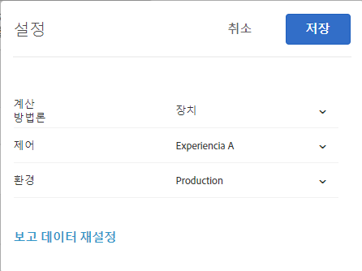

# 보고 FAQ{#reporting-faq}

Target의 보고에 대한 FAQ 목록

## 다른 Experience Cloud 솔루션보다 Target에서 방문 횟수가 더 적은 이유는 무엇입니까? {#section_7E626FDB417E41B8B58BBF30FB207409}

예를 들어 [!DNL Target]에 의해 보고된 방문 횟수와 같은 지표 수치는 다음과 같은 여러 가지 이유로 다른 [!DNL Experience Cloud] 솔루션에서 보고된 수치보다 항상 낮습니다.

* [!DNL Target]은 활동에 대해 자격이 되는 방문자에 대해서만 방문을 카운트하고, 다른 솔루션에서는 방문자를 페이지로 유도한 활동과 관계없이 페이지를 표시하는 방문자에 대한 방문을 카운트합니다.
* 서로 다른 활동이 한 곳에서 경합하는(함께 수행할 수 없는) 상황이 있을 수 있습니다. 그 결과, 방문자는 웹 페이지에 있는 [!DNL Target]에서 보고하는 지표 수치에 영향을 주는 다른 컨텐츠를 보게 됩니다.

## 내 활동의 보고서에 사용할 수 있는 데이터가 없는 이유는 무엇입니까? {#section_E4722F6445884130951DF79981C8289B}

활동의 컨텐츠가 사용자에게 전달되었지만 해당 보고서에 데이터가 들어 있지 않은 경우 보고서의 설정에 올바른 환경(호스트 그룹)이 선택되어 있는지 확인하십시오.

개발 환경을 선택한 경우 "선택한 보고서 설정에 사용 가능한 데이터가 없습니다"라는 오류 메시지가 표시될 수 있습니다.

활동의 보고서에 대한 환경을 변경하려면 다음을 수행하십시오.

1. **[!UICONTROL 활동]**&#x200B;을 클릭하고 목록에서 원하는 활동을 클릭한 다음, **보고서[!UICONTROL 탭을 클릭합니다.]**
1. 톱니바퀴 아이콘을 클릭하여 보고서 설정을 구성합니다.

   

   >[!NOTE]
   >
   >톱니바퀴 아이콘은 자동화된 개인화 보고서에 사용할 수 없습니다.

1. **[!UICONTROL 환경]** 드롭다운 목록에서 **[!UICONTROL 프로덕션]**&#x200B;을 선택합니다.

   개발 환경이 선택되어 있지 않은 경우에는 보고서 데이터를 사용하지 못할 수 있습니다.

1. **[!UICONTROL 설정 저장을 클릭합니다]**.

환경에 대한 자세한 내용은 [호출](../administrating-target/hosts.md#concept_516BB01EBFBD4449AB03940D31AEB66E)를 참조하십시오.
