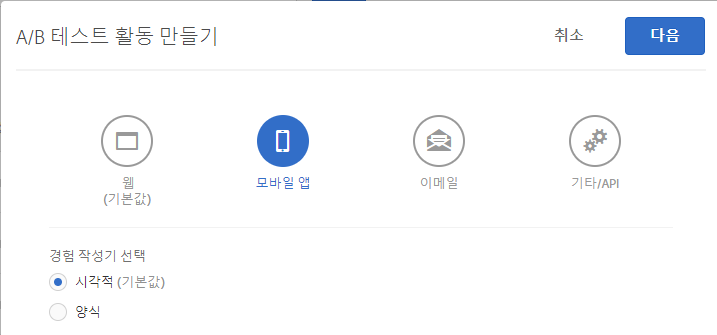

# 모바일 앱 시각적 경험 작성기{#mobile-app-visual-experience-composer}

기본 모바일 앱용 VEC(시각적 경험 작성기)를 사용하면 연속적인 개발 종속성 및 앱 릴리스 주기 없이 자체적인 방식으로 기본 모바일 앱에 대한 활동을 만들고 컨텐츠를 개인화할 수 있습니다.

기존 [시각적 경험 작성기](../../c-experiences/experiences.md#section_34265986611B4AB8A0E4D6ACC25EF91D)는 개발자 개입 없이 Target의 글로벌 Mbox를 통해 웹 속성에 동적으로 전달할 수 있는 활동을 만들고 경험을 개인화하는 자체 기능을 제공합니다. 이제 VEC를 활용하여 기본 모바일 애플리케이션에 대해 동일하게 수행할 수 있습니다. [AEP SDK v5](https://aep-sdks.gitbook.io/docs/using-mobile-extensions/adobe-target-vec)에 제공되는 모바일 앱 VEC를 사용하여 모바일 앱에 대한 [A/B 테스트](/help/c-activities/t-test-ab/test-ab.md) 및 [XT(경험 타깃팅)](/help/c-activities/t-experience-target/experience-target.md) 활동을 만들 수 있습니다. 다른 활동 유형에 대한 지원은 향후에 가능합니다.

모바일 앱 VEC는 [지원되는 브라우저](../../c-implementing-target/c-considerations-before-you-implement-target/supported-browsers.md#reference_01B4BF99E7D545A7998773202A2F6100)에 나열된 브라우저를 지원합니다.

## 기본 모바일 앱에서 시각적 경험 작성기 사용 {#using-the-mobile-vec}

다음 그림은 모바일 앱 VEC 사용 절차를 나타냅니다.


| 프로세스 | 세부 사항 |
|--- |--- |
| 연결 | Target에서 사용할 모바일 앱과 장치를 안전하게 승인합니다. 이 단계는 장치에 한 번만 필요합니다. |
| 작성 | Target UI에서 수행한 작업의 실시간 미리 보기로 [Target 활동](/help/c-activities/activities.md)을 작성합니다. |
| 배달 | Target이 기본 모바일 앱에서 자동으로 활동을 전달합니다. |

**연결:**

모바일 앱 VEC는 Target 활동을 작성할 마케터의 모바일 앱에 실시간으로 연결됩니다. 이를 활성화하기 위한 첫 단계는 모바일 장치와 앱을 Target과 안전하게 연결(승인)하는 것입니다.

1. 예를 들어, A/B 테스트 활동을 작성하는 동안 **[!UICONTROL 모바일 앱]** 을 선택하고 **[!UICONTROL 시각적(기본값)]** 을 선택한 후 **다음[!UICONTROL 을 클릭합니다]**.

   

1. 앱의 URL을 입력한 다음 **[!UICONTROL 딥링크 만들기를 클릭합니다]**.

   

연결 절차에는 다음 단계가 포함됩니다.

1. 딥링크를 생성하는 데 사용할 수 있는 앱의 URL 체계를 입력합니다. 일반적인 딥링크 모양은 다음과 같습니다.

   `mymobileapp://path?params`

1. 딥링크는 QR 코드 또는 URL로 사용할 수 있습니다. 사용자는 전화에서 QR 코드를 스캔하거나 URL을 자신에게 이메일/메시지로 보낼 수 있습니다. 딥링크 URL에는 모바일 앱과 장치를 Target과 안전하게 연결하는 데 사용되는 승인 토큰이 있습니다.
1. 모바일 장치에서 딥링크 URL을 여십시오. 그러면 모바일 앱이 실행됩니다. SDK는 VEC에서 연결 및 작성을 위해 앱이 실행되었는지 확인합니다.

   SDK가 Target 서버에 요청하고 자체를 등록합니다. Target 서버가 토큰을 승인하고, 현재 웹 소켓을 사용하여 장치와의 실시간 연결을 설정합니다.

   연결이 설정된 후에는 앱의 실시간 보기가 Target 인터페이스에 나타납니다. 이 앱에는 아래 그림에서처럼 앱이 Target에 연결되었음을 나타내는 빨간색 경계 오버레이가 있습니다.

   

   이미 연결된 장치는 앱을 실행하고 작성 인터페이스를 열어 다시 연결할 수 있습니다.

**작성:**

앱이 연결되고 앱의 실시간 보기가 VEC에 표시되면 활동 작성을 시작할 수 있습니다. 현재 다음 작업이 지원됩니다.

| Action | 세부 사항 |
|--- |--- |
| 이미지 교체 | 다른 이미지 오퍼를 선택하거나 이미지의 CDN URL을 직접 설정하여 이미지를 다른 이미지로 바꿉니다. Target의 이미지 오퍼는 [Adobe Scene7](/help/administrating-target/scene7-settings.md)을 통해 제공됩니다. |
| 텍스트 변경 | 텍스트 요소, 단추 또는 레이블에서 텍스트 콘텐츠, 색상 또는 글꼴 크기를 변경합니다. |
| 배경 변경 | 텍스트 영역 또는 단추의 콘텐츠 또는 요소 배경을 변경합니다. |

VEC에서 수행한 작업은 앱에서 실시간으로 표시되므로 작성 중에 실시간 미리 보기 기능을 사용할 수 있습니다. 작업은 관련 모바일 화면 또는 보기와 적절하게 연결됩니다.


**여러 앱 버전 관리**

새 앱 버전이 감지되면 앱 버전이 타깃팅된 버전 목록에 추가되었다는 알림을 받게 됩니다.


Multiple mobile app versions can be added and removed manually from the [!UICONTROL Manage Versions] dialog box.


## 문제 해결 {#troubleshooting}

**모바일 앱 VEC에 내 앱 연결이 끊겼다고 표시됩니다.**

인터넷 연결이 끊겼을 수 있습니다. 인터넷을 사용할 수 있고 연결을 새로 설정한 후에 애플리케이션을 다시 실행합니다. Wi-Fi 연결로 모바일 앱 VEC 활동을 작성하는 것이 좋습니다.

**모바일 앱 VEC가 내 모바일 앱과 동기화되지 않습니다.**

디스플레이를 동기화하려면 VEC에서 [!UICONTROL 새로 고침] 단추를 클릭합니다.

## Target 보기 및 모바일 애플리케이션 {#target-views}

모바일 앱 VEC는 보기의 새로운 개념(예: 모바일 앱 경험을 함께 구성하는 시각적 요소의 논리 그룹)을 이용합니다.

**Target 보기 소개**

꽃에 대한 쇼핑 앱을 예로 고려해 보겠습니다. 이 앱을 사용하여 사용자가 다음 작업을 수행할 수 있습니다.

* 사용 가능한 꽃 및 부케 나열
* 세부 사항 보기
* 꽃 주문
* 결제 옵션 및 주소와 같은 설정 제어

이 애플리케이션에서 이러한 각 작업은 모바일 앱의 별도 화면에서 수행할 수 있습니다. 사용자가 앱을 탐색할 때 화면이 렌더링되어 다음 작업 중 하나를 수행할 수 있습니다. Android 개발자인 경우 이러한 작업 중 하나와 연관된 각 클래스를 사용하여 네 개의 서로 다른 Android 활동 클래스를 만들 수 있습니다.

이 경우 이러한 각 작업을 모바일 앱이 전환되는 보기로 간주할 수 있습니다. 이들을 Target 보기라고 하며 각각 고유한 특징이 있습니다. Target 보기 또는 간단하게 보기는 모바일 화면에 표시되는 시각적 요소의 논리적 컨테이너입니다. 보기의 예로는 화면 또는 Android의 활동 클래스가 있습니다.

이렇게 단순하게 만들어진 모바일 앱은 거의 없습니다. 보다 현실적으로 만들어 보겠습니다. 사용 가능한 꽃과 부케를 나열하는 첫 번째 작업에서 여러 레이아웃 및 다른 화면을 만드는 기능을 추가해 보겠습니다. 예를 들면, 다음 세 가지 옵션이 있는 &quot;정렬 기준&quot; 기능을 추가해 보겠습니다.

* 인기도순
* 가격 - 높은 가격순
* 가격 - 낮은 가격순

이 예에서는 사용자가 다른 &quot;정렬 기준&quot; 옵션을 선택할 때마다 활동 클래스가 동일한 경우에도 새 화면이 표시됩니다. 따라서 이러한 각 화면은 다른 Target 보기로 간주될 수 있습니다.

마케터는 개발자에게 로컬 mbox를 설정하거나 앱 릴리스 주기를 수행하도록 요청하지 않고도 이러한 각 보기에서 다른 경험을 생성하고 고유한 오퍼를 실행하는 데 관심이 있습니다.

## Target 모바일 앱 VEC 설정 {#setting-up}

개발자는 모바일 앱의 모바일 앱 VEC를 활성화하려면 다음을 수행해야 합니다.

* Launch에서 Adobe Target VEC 확장 프로그램 구성
   * VEC 확장 프로그램은 [Adobe Target 확장 프로그램](/help/c-implementing-target/c-implementing-target-for-client-side-web/how-to-deployatjs/cmp-implementing-target-using-adobe-launch.md)에 따라 다릅니다. Adobe Target 확장 프로그램이 이미 구성되고 활성화되어 있는지 확인합니다.
* Target VEC 확장 프로그램을 앱에 추가합니다.
   * [Android - 모바일 앱 설정](/help/c-target-mobile-app/c-mobile-visual-experience-composer/mobile-visual-experience-composer-android.md)
   * [iOS - 모바일 앱 설정](/help/c-target-mobile-app/c-mobile-visual-experience-composer/mobile-visual-experience-composer-ios.md)

## Target VEC에 대한 구현 방법

Target VEC 확장 프로그램은 네트워크 요청을 통해 앱에 대한 관련 Target 경험을 검색합니다. 오퍼가 이 네트워크 호출을 통해 검색되고 타깃팅된 화면에 자동으로 적용됩니다. 사용자가 앱의 여러 화면을 탐색할 때 VEC 경험을 검색할 수 있도록 후속 네트워크 요청이 수행되지 않습니다.

확장 프로그램의 기본 동작은 애플리케이션을 실행할 때 동기식 네트워크 요청(호출 차단)을 수행하는 것입니다. 애플리케이션 동작을 충족하기 위해 Launch를 사용하여 이 네트워크 요청의 동작을 제어할 수 있습니다.

### Target 활동 자동으로 가져오기

Target VEC 확장 프로그램에 의해 네트워크 요청이 자동으로 시작되는 기본 동작입니다. 다음 옵션 중 하나를 사용하여 호출 차단 또는 비동기 요청을 요청할 수 있습니다.

* 동기 호출 시 가져오기(배경이 꺼져 있음)

   선택하면 Target VEC 확장 프로그램이 애플리케이션 실행 시 네트워크 요청을 호출 차단으로 지정합니다. 오퍼가 즉시 적용되며 앱에서 깜박임이 없습니다. 확장 프로그램의 기본 동작입니다.

* 비동기 호출 시 가져오기(배경이 켜져 있음)

   선택하면 Target VEC 확장 프로그램은 애플리케이션 실행 시 백그라운드에서 네트워크 요청을 만들지만 앱이 로드되는 것을 차단하지 않습니다. 앱의 홈 화면에서 경험이 작성되면 호출이 완료되기 전에 화면이 렌더링되는 경우 홈 화면에 오퍼가 적용되지 않을 수 있습니다. 앱 화면 렌더링은 일반적으로 iOS와 Android의 라이프사이클 이벤트 `didFinishLaunchingWithOptions` 및 `onActivityResumed`를 통해 각각 식별됩니다. 오퍼는 이후 모든 화면에 자동으로 적용됩니다.

### 프로그래밍 방식으로 Target 활동 가져오기

Target VEC 확장 프로그램을 비활성화하여 네트워크 요청을 자동으로 만들고 프로그래밍 방식으로 확장 프로그램 API를 호출하도록 지정할 수 있습니다. 이 경우 개발자가 앱에서 Target VEC 오퍼를 통합하는 방법을 제어할 수 있습니다. Target VEC 확장 프로그램에는 Target VEC 오퍼를 프로그래밍 방식으로 검색하는 정적 메서드인 `prefetchOffers`와 `prefetchOffersBackground`가 있습니다.

* `prefetchOffers` 메서드는 Target VEC 오퍼를 가져올 때까지 현재 화면을 숨깁니다. 해당하는 경우 오퍼가 현재 화면에 자동으로 적용되며 화면이 다시 표시됩니다.
* `prefetchOffersBackground` 메서드는 현재 화면을 숨기지 않고 관련 Target 오퍼를 검색하기 위한 호출을 만듭니다. 타겟 오퍼는 현재 화면에 적용되지 *않으며* 깜박임이 없습니다. 사용자가 후속 화면으로 이동할 때 오퍼가 자동으로 적용됩니다.

### Target 작업 공간 제한 처리

Launch 인터페이스를 사용하여 작업 공간에 대한 `at_property` 값을 설정할 수 있습니다. 이렇게 하면 해당 작업 공간의 활동만 모바일 앱에 전달됩니다.

## Target API 호출에 대한 일반 지침 {#section_C7276795F02540DCA230AEEDF882A833}

다음은 Android의 Target 보기를 올바르게 추가할 수 있도록 하기 위해 `targetView` 호출을 지정할 올바른 위치를 표시한 간단한 표입니다.

| 허용되는 TargetView 위치 | 올바른 추가 위치 |
|--- |--- |
| `Activity::onStart`, `Activity::onResume`의 끝 | `OnStart`와 `OnResume`을 동일하거나 다른 `targetViews`로 고려할 것인지 여부는 개발자가 결정합니다. 동일한 것으로 고려할 경우 동일한 `viewName`을 사용합니다. 다른 것으로 고려할 경우 다른 `viewNames`를 사용합니다. 이러한 이벤트는 SDK에 의해 자동으로 추가됩니다. |
| `Activity::SetContent` 호출 바로 뒤 | UI가 변경되지 않으면 `targetView` 호출을 삽입할 수 있습니다. |
| `View::willAppear`의 내부 | 선택된 보기가 하나의 특정 보기 계층 구조에 고유하게 표시되는 경우입니다. |
| `Activity::SetContentView` 호출 바로 뒤 | 활동이 다음 코드에서 해당 컨텐츠를 변경/수정하지 않는 경우입니다. |

다음은 Android에서 `targetView` 호출을 지정할 잘못된 위치에 대한 표입니다.

| 사용할 수 없는 TargetView 위치 | 이유 |
|--- |--- |
| `Activity::onCreate` 내 | 활동이 작성되었지만 활동과 연관된 보기가 완료되지 않았거나 창에 첨부되지 않았습니다. 이 배치를 사용할 경우 작성 화면이 샘플링되지 않거나 잘못 샘플링되고, 오퍼가 비결정적 방식으로 적용될 수 있습니다. |
| `View::didAppear`의 내부 | 보기가 이미 표시되어 있고 오퍼 애플리케이션에서 깜박임이 있는 느린 UI 경험을 생성합니다. |
| `View::didLoad`의 내부 | 이 보기는 기본 보기 계층 구조에 첨부되지 않으며, 인스턴스화될 수 있지만, 앱 UI에 표시되지는 않습니다. |

## 배달 {#delivery}

모바일 앱 VEC를 사용하여 작성된 Target 활동은 모바일 앱에서 자동으로 전달됩니다. 이러한 활동은 앱 실행 시 미리 가져오고(Launch 구성 기반) 사용자가 다른 Target 보기를 탐색할 때 적용되고, 화면에 직접 매핑됩니다.

`TargetVEC.prefetchOffersBackground()` API 메서드를 호출할 때 Target 오퍼를 Target Edge에서 가져오고 로컬로 캐시합니다. 이 경우 Target 보기를 네트워크를 통해 가져오지 않고 `targetView()` 호출로 트리거할 때 캐시에서 Target 오퍼가 바로 적용되므로 더욱 원활한 사용자 경험을 제공할 수 있습니다.

추가적인 유연성을 위해 `TargetVEC.prefetchOffers()` API를 호출할 수도 있습니다. API를 호출하면 Target 오퍼를 미리 가져와서 Target 보기에 적용할 때까지 현재 레이아웃을 미리 숨깁니다(깜박임이 발생할 수 있음).

사용자가 로컬 Target 오퍼 캐시를 가장 적절한 컨텐츠(현재 사용자의 대상 프로필에 대한 최신 업데이트)로 새로 고치기 위해 고객 앱을 탐색할 때 `TargetVEC.prefetchOffersBackground()`를 반복적으로 호출할 수도 있습니다.

Target 오퍼를 미리 가져올 때마다 `AdobeTargetMobile.targetView()`로 트리거된 최신 Target 보기에 대한 오퍼가 적용됩니다.

## 문제 해결 {#ts}

**&quot; context. application. name &quot;값에 금지된 문자가 포함되어 있다는 오류 메시지가 표시되었습니다. What characters are allowed in mobile app names?**

모바일 앱 이름에 허용되는 문자는 다음과 같습니다.

| 허용되는 문자 | 설명 |
| --- | --- |
| letters |  |
| 숫자 |  |
| `-` | 하이픈 |
| `.` | 기간 |
| `,` | 쉼표 |
| `:` | 콜론 |
| `#` | 숫자 기호 |
| `(` | 여는 괄호 |
| `)` | 닫는 괄호 |
| `&` | 앰퍼샌드 |
| `+` | 더하기 기호 |

Using a character that is not allowed, for example, an apostrophe ( `'` ) causes you to receive the following error message:

```
Target Response was received : {"status":400,"message":"Errors: field - [context.application.name] - Value contains prohibited chars;"}
```

## 알려진 제한 사항 {#limitations}

* 모바일 앱 VEC는 현재 모바일 앱에 대한 [A/B 테스트](/help/c-activities/t-test-ab/test-ab.md) 및 [XT(경험 타깃팅)](/help/c-activities/t-experience-target/experience-target.md) 활동을 만드는 데 사용할 수 있습니다. 다른 활동 유형에 대한 지원은 향후에 가능합니다.
* 미리 보기 기능은 아직 지원되지 않습니다. 향후 릴리스에서 제공될 예정입니다.
* 앱을 모바일 앱 VEC에 다시 연결할 때 앱을 완전히 종료한 후 다시 실행해야 합니다.

   아래 나열된 시나리오 진행 중 모바일 앱이 이미 열려 있는 경우에는 해당 앱을 닫은 다음 다시 열어야 합니다. 그러나 앱을 닫을 때 최신 앱 섹션에서 닫아야 *하며* 뒤로 단추를 누르지 *말아야* 합니다. 뒤로 단추를 눌러 앱을 닫으면 간헐적인 연결 문제가 발생할 수 있습니다.

   이미 열려 있는 앱을 모바일 앱 VEC에 연결하기 위해 앱을 재실행해야 하는 몇 가지 상황이 있습니다.

   * 새 활동을 작성하는 동안 모바일 앱을 선택하면 장치 목록 대화 상자가 표시됩니다. 앱이 이미 열려 있는 경우에는 앱을 닫은 다음 다시 실행하여 선택할 수 있는 것으로 표시된 장치를 가져와야 합니다.
   * 활동 편집을 시작하면 장치 대화 상자가 표시됩니다. 앱이 이미 열려 있는 경우에는 앱을 닫은 다음 다시 실행하여 선택할 수 있는 것으로 표시된 장치를 가져와야 합니다.
   * &quot;목표 및 설정&quot; 단계에서 &quot;작성&quot; 단계(1단계)로 돌아가면 장치 대화 상자가 표시됩니다. 앱이 이미 열려 있는 경우에는 앱을 닫은 다음 다시 실행하여 모바일 앱 VEC에 다시 연결해야 합니다.
   앱을 닫을 때 최신 앱 섹션에서 닫아야 하며 [!UICONTROL 뒤로] 단추를 누르지 말아야 합니다.

## Training video: Adobe Target Mobile App Visual Experience Composer (3:33) {#video}

>[!VIDEO](https://video.tv.adobe.com/v/27528?captions=kor)