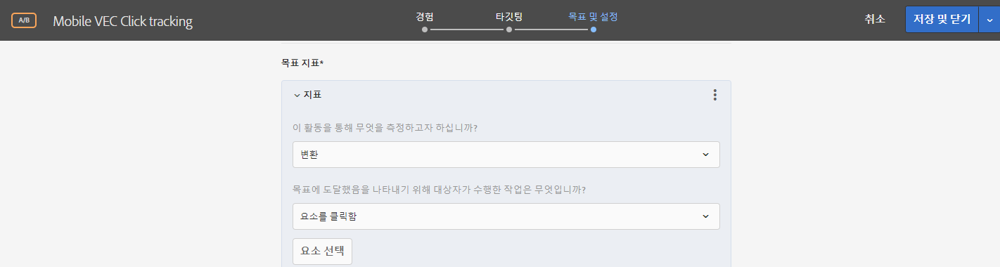
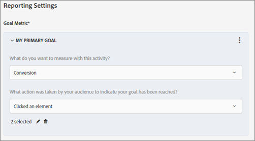

# 모바일 앱 VEC에서 클릭 추적 설정{#set-up-click-tracking-in-the-mobile-vec}

모바일 앱 VEC는 [!DNL Target] 활동에 대한 클릭 추적 목표 설정을 지원합니다.

1. 활동에 대한 목표 및 설정 페이지에서 목표를 설정할 때 [!UICONTROL 변환] 성공 지표를 선택합니다.

   

1. 작업에 대해 **[!UICONTROL 요소를 클릭함]**&#x200B;을 선택한 후 **[!UICONTROL 요소 선택]**&#x200B;을 클릭합니다.

   모바일 앱이 모바일 VEC(Visual Experience Composer)에서 열립니다.

   

1. 추적할 요소를 선택합니다.

   요소 선택에 대한 팁은 아래의 [!UICONTROL 고려 사항] 섹션을 참조하십시오.

   

1. 화면 맨 위에 있는 확인 표시를 클릭하여 선택 사항을 저장합니다.

또한 클릭한 항목을 편집 및 변경하거나 새로 시작해야 하는 경우 이를 삭제할 수도 있습니다.

활동 참여자가 선택된 요소를 클릭하면 해당 클릭이 전환으로 카운트됩니다.

## 고려 사항 {#considerations}

요소를 선택할 때 다음과 같은 몇 가지 사항을 고려해야 합니다.

* 두 개 이상의 요소를 선택한 경우 및 방문자가 이러한 요소 중 하나를 클릭하는 경우 이 클릭이 카운트됩니다. 각 클릭을 별도로 카운트하려면 각 요소에 대해 개별 성공 지표를 설정하십시오.
* 이벤트를 클릭하면 사용자가 요소를 클릭하는 즉시 Target으로 전송됩니다.
* 모바일 앱 VEC에서는 클릭 처리기가 첨부된 요소만 선택할 수 있습니다.
* 앱의 섹션을 찾아볼 수 있지만 클릭을 추적하기 위해 요소를 선택한 섹션에 대해 [ 보기](/help/c-target-mobile-app/c-mobile-visual-experience-composer/mobile-visual-experience-composer.md#target-views)가 정의되어 있는지 확인합니다.
* 활동을 편집하는 동안 장치가 이미 1단계에서 선택된 경우 장비를 다시 선택할 필요가 없습니다. 그러나 클릭 추적 페이지로 직접 연결하는 경우에는 인증된 장치를 선택하도록 장치 선택 화면이 표시됩니다.
* 클릭 추적용으로 설정한 요소를 표시하는 수정 패널이 모바일 앱 VEC에 표시됩니다.

   