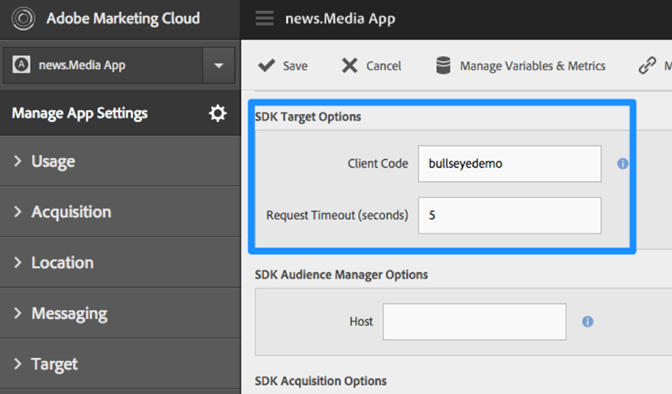

# SDK에서 Target을 활성화{#enable-target-in-the-sdk}

앱에 Adobe Mobile Services SDK를 추가합니다.

1. 앱에 Adobe Mobile Services SDK를 설치하지 않은 경우 Analytics 또는 Experience Cloud 자격 증명을 사용하고 [Adobe Mobile Services](https://mobilemarketing.adobe.com) 웹 사이트에서 SDK를 다운로드합니다.

1. 앱에 Adobe Mobile Services SDK를 추가합니다.

   [핵심 구현 및 라이프사이클](https://experienceleague.adobe.com/docs/mobile-services/ios/getting-started-ios/dev-qs.html)에서 지침을 찾을 수 있습니다.

1.  클라이언트 코드, 시간 제한을 추가하고, SSL을 활성화합니다. 

   Experience Cloud에서 Mobile Services를 열고 **[!UICONTROL 앱 설정 관리]** > **[!UICONTROL SDK Target 옵션]**&#x200B;으로 이동합니다.

   Target 클라이언트 코드 및 시간 제한 시간을 추가합니다. 클라이언트 코드는 계정 또는 회사에 고유합니다. 시간 제한은 기본 컨텐츠를 표시하기 전에 Target이 응답을 기다리는 시간(초)입니다. Adobe Mobile Services의 앱 설정 관리 페이지에서 **[!UICONTROL HTTPS 사용]** 옵션이 선택되어 있는지 확인합니다. HTTPS가 활성화되지 않은 경우 Target 서버를허용 목록에 추가하다하지 않는 한 iOS9+의 모든 호출이 차단됩니다.

   

1.  앱을 만들었거나 찾은 후에 앱 설정을 찾고 원하는 SDK를 다운로드합니다. 

   

>[!IMPORTANT]
>
> 모바일 마케팅 인터페이스에 액세스할 수 없는 경우 앱 코드의 구성 파일에서 직접 변경할 수 있습니다. 그러나 변경 사항이 사용자 인터페이스의 설정 페이지와 동기화되지 않습니다.

