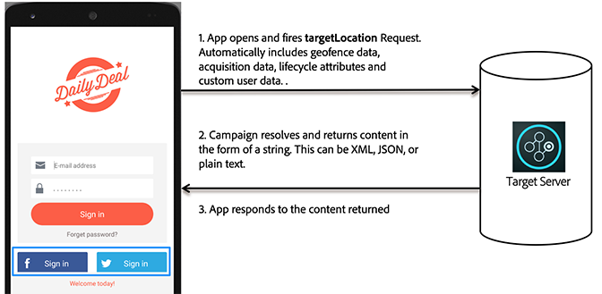

# 모바일 앱에서 [!DNL Target]의 작동 방식

Adobe Mobile SDK는 Target 서버에 접속하여 다른 데이터 포인트와 함께 컨텐츠를 가져와서 사용자에게 적합한 경험을 보여줍니다.

## Target 위치 및 성공 지표 {#section_A08AAB0ABA9C4568A5AFD4D27EF1CE74}

*타겟 위치*&#x200B;는 mbox라고도 합니다. 앱에서 식별된 위치는 테스트나 개인화에 사용할 수 있습니다(예: 홈 화면의 환영 메시지). 이러한 위치는 테스트 작성 프로세스 중에 식별됩니다.

A *[성공 지표](/help/c-activities/r-success-metrics/success-metrics.md#reference_D011575C85DA48E989A244593D9B9924)*&#x200B;는 특정 활동이 성공했는지(서명, 구매, 티켓 예약 등) 여부를 식별하는, 사용자가 수행하는 작업입니다.

* **타겟 위치:** 등록 단추 아래에 표시되는 컨텐츠입니다.

   이 특정 사용자는 오후 6시까지 무료 배송을 제공합니다. 이 위치는 A/B 테스트 및 개인화를 실행하기 위해 여러 Target 활동에서 재사용할 수 있습니다.

* **성공 지표:** 사용자가 등록 단추를 탭할 때 사용자가 수행하는 작업입니다.

**SDK에서의 Target 작동 방식 이해**

