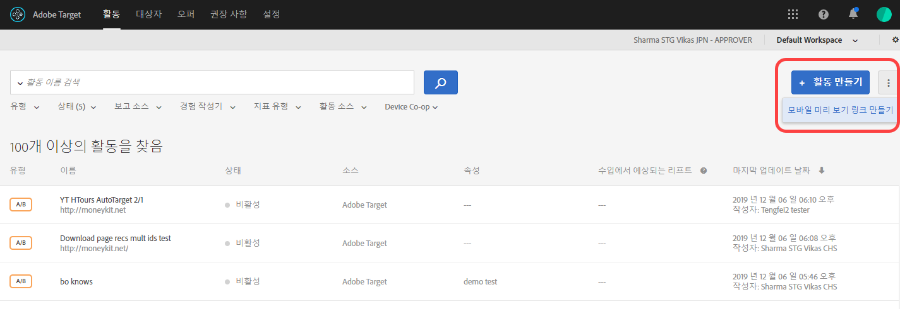
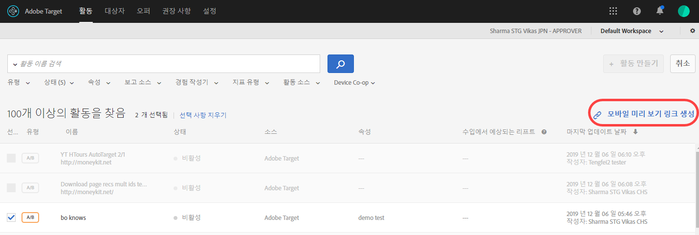
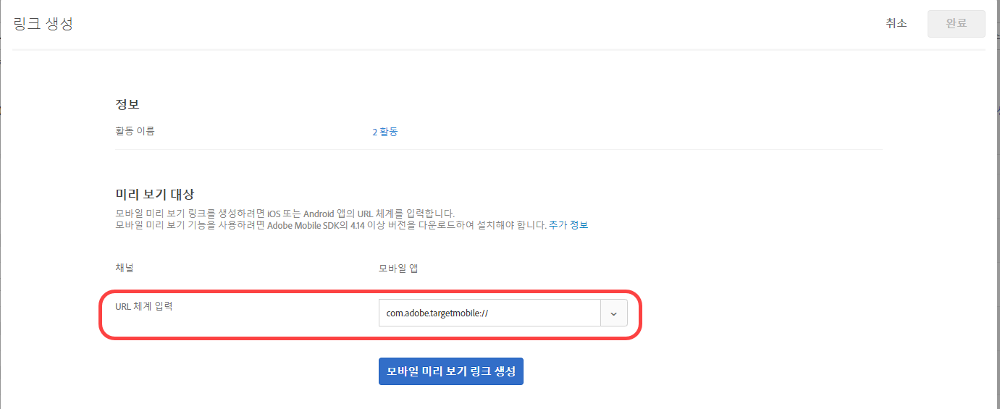
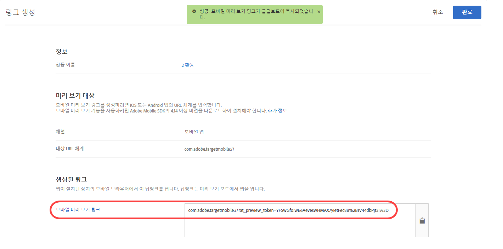

# Target 모바일 미리 보기

모바일 미리 보기 링크를 사용하여 모바일 앱 활동에 대한 간단한 종단 간 QA를 수행하고 특별한 테스트 장치 없이 장치에서 다양한 경험을 직접 등록할 수 있습니다.

>[!NOTE]
>
>모바일 미리 보기 기능을 사용하려면 해당 Adobe Mobile SDK 4.14 이상 버전을 다운로드한 후 설치해야 합니다.

## 개요 {#section_981D6FA4AEE64098809EA606E89E4A5E}

모바일 미리 보기 기능을 사용하면 실시간으로 실행하기 전에 모바일 앱 활동을 완전히 테스트할 수 있습니다.

## 전제 조건 {#section_A763C564C9E84B0EB448237B5B1E4068}

1. **지원되는 SDK 버전 사용:**&#x200B;모바일 미리 보기 기능을 사용하려면 해당 앱에서 Adobe Mobile SDK의 해당 4.14 이상 버전을 다운로드한 후 설치해야 합니다.

   적절한 SDK를 다운로드하는 방법에 대한 지침은

   * **iOS:** [Mobile ](https://experienceleague.adobe.com/docs/mobile-services/ios/getting-started-ios/requirements.html) Services iOS 도움말을  *시작하기 전에*.
   * **Android:** [Mobile ](https://experienceleague.adobe.com/docs/mobile-services/android/getting-started-android/requirements.html) Services Android 도움말을  *시작하기 전에*.

1. **URL 체계 설정:** 미리 보기 링크는 URL 체계를 사용하여 앱을 엽니다. 미리 보기에 대해 고유한 URL 체계를 지정해야 합니다.

   다음 그림은 iOS의 예입니다.

   

   다음 그림은 Android의 예입니다.

   

1. **Adobe DeepLink 추적**

   **iOS:** 앱 위임에서는 대리자가 이전 단계에서 지정한 URL 체계로 리소스를 열도록 요구되면 `[ADBMobile trackAdobeDeepLink:url`을 호출합니다.

   다음 코드 조각은 예제입니다.

   ```javascript
   - (BOOL) application:(UIApplication *)app openURL:(NSURL *)url 
                options:(NSDictionary<NSString *,id> *)options { 
   
       if ([[url scheme] isEqualToString:@"com.adobe.targetmobile"]) { 
           [ADBMobile trackAdobeDeepLink:url]; 
           return YES; 
       } 
       return NO; 
   } 
   ```

   **Android:** 앱에서 호출자가 이전 단계에서 지정된 URL 체계로 리소스를 열도록 요청받으면 `Config.trackAdobeDeepLink(URL);`을 호출합니다.

   ```javascript
    private Boolean shouldOpenDeeplinkUrl() { 
        Intent appLinkIntent = getIntent(); 
        String appLinkAction = appLinkIntent.getAction(); 
        Uri appLinkData = appLinkIntent.getData; 
        if (appLinkData.toString().startsWith("com.adobe.targetmobile")) { 
            Config.trackAdobeDeepLink(appLinkData); 
            return true; 
        } 
        return false; 
     }
   ```

   Android에서 모바일 미리 보기가 작동하려면 Adobe Mobile SDK 버전 5를 사용하는 경우 [!DNL AndroidManifest.xml]에 다음 코드 조각을 추가해야 합니다.

   ```javascript
   <activity android:name="com.adobe.marketing.mobile.FullscreenMessageActivity" />
   ```

   Adobe Mobile SDK 버전 4를 사용하는 경우 다음 코드 조각을 사용하십시오.

   ```javascript
   <activity android:name="com.adobe.mobile.MessageFullScreenActivity" />
   ```

## 미리 보기 링크 생성 {#section_D9D58173FFF34E9BB75EBF357273F128}

1. Target UI에서 **[!UICONTROL 추가 선택 사항]** 아이콘(3개의 수직 줄임표)을 클릭한 다음, **[!UICONTROL 모바일 미리 보기 만들기]**&#x200B;를 선택합니다.

   

1. 미리 보려는 활동을 선택한 후 **[!UICONTROL 모바일 미리 보기 링크 생성을 클릭합니다]**.

   >[!NOTE]
   >
   >양식 기반 AB 및 XT 활동만 선택할 수 있습니다.

   

1. 앱의 URL 체계를 지정합니다.

   iOS 또는 Android 앱의 경우와 같아야 합니다. 필요한 경우 iOS 및 Android에 대해 이 과정을 별도로 반복합니다.

   

1. **[!UICONTROL 모바일 미리 보기 링크 생성]**&#x200B;을 클릭한 다음, 링크를 복사합니다.

   

## 장치에서 미리 보기 {#section_521F0D46F3DE4A2A98283A1B73FF69F6}

앱이 설치된 장치의 모바일 브라우저에서 링크를 엽니다. 이 앱은 Apple 앱스토어 또는 Google Play 스토어에서 다운로드한 프로덕션 앱일 수 있습니다. 특별한 빌드가 아니어도 됩니다. 활성 미리 보기 링크가 있는 경우 장치에서 경험을 볼 수 있습니다.

1. 모바일 브라우저에서 링크를 엽니다.

   Target UI에서 이전 단계에서 복사한 링크를 편리한 방식으로(예: 문자, 이메일 또는 Slack 사용) 모바일 장치와 공유합니다.

   |||

   앱이 열리고 Target 모바일 미리 보기 모드가 시작됩니다.

1. 표시하려는 경험의 조합을 선택한 다음 **[!UICONTROL 경험 실행을 클릭합니다]**.

   ||||
||||

## 제한 {#section_4E9BDED0F718485292527EFB508305BD}

* [!UICONTROL 경험 실행] 단추를 클릭한 후에 새 컨텐츠가 표시되도록 보기를 다시 로드해야 합니다. 가장 쉬운 방법은 다른 화면으로 전환한 다음, 변경이 발생할 것으로 예상되는 화면으로 돌아가는 것입니다.
* API-19(KitKat) 이전의 Android 버전에서는 모바일 미리 보기가 지원되지 않습니다.
