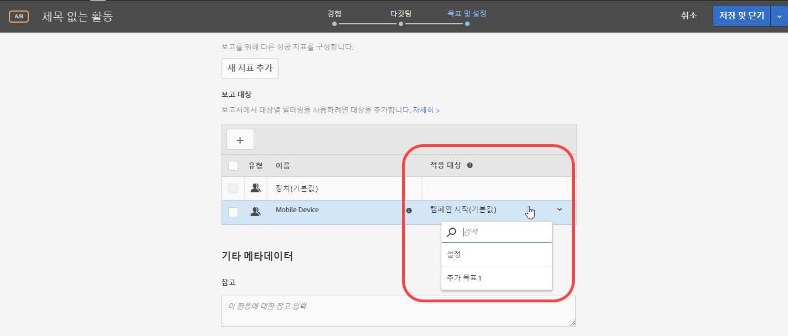
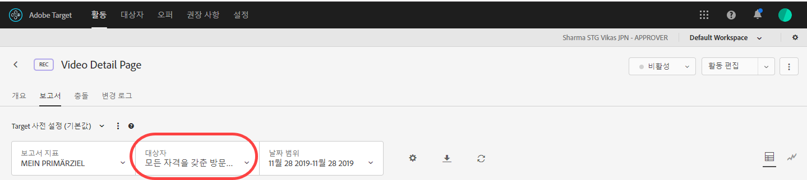

# 성공 지표에 보고 대상 적용{#apply-a-reporting-audience-to-a-success-metric}

사용자를 보고 대상이 될 수 있도록 하는 성공 지표를 선택하십시오.

[!UICONTROL 적용 대상] 드롭다운 목록을 사용하면 모든 활동에서 대상을 성공 지표에 적용하여 성공 지표에 도달한 후 및 그 이후의 작업에서 보고된 수치를 확인할 수 있습니다.

예를 들어, 홈 페이지에서 들어가서 전환 페이지에 도달하는 모든 방문자를 위한 활동을 만들었지만, 전환하기 전에 50달러 이상을 장바구니에 추가한 방문자를 더 자세히 드릴다운하고 싶은 경우를 가정할 수 있습니다.

적용 대상 드롭다운 목록은 활동의 모든 방문자, 활동의 특정 단계에 도달하는 방문자만 또는 전환에 도달한 방문자만, 이렇게 세 가지 카테고리를 잠재적으로 제공합니다. 또는 다른 식으로 구문을 지정하기 위해서는 방문자가 활동의 시작 페이지에 있는 mbox나, 활동 중간에 있는 어떤 시점을 정의하는 mbox 또는 활동의 끝에 있는 전환 mbox에 도달했어야 한다고 지정할 수 있습니다.

[성공 지표](/help/c-activities/r-success-metrics/success-metrics.md#reference_D011575C85DA48E989A244593D9B9924)는 활동에 대해 구성한 경우에만 사용할 수 있습니다. 성공 지표를 정의하지 않은 경우에는 드롭다운 목록에 캠페인 시작과 전환 선택 사항만 표시됩니다.

보고 대상을 성공 지표에 적용할 때에는 다음 정보를 고려하십시오.

* 성공 지표가 적용된 작업 이전의 작업에 대해서는, Target이 세그멘테이션된 대상을 적용하지 않습니다.
* 성공 지표가 적용된 이후의 작업에 대해서는, Target이 세그멘테이션된 대상을 적용합니다.

보고에서 세그멘테이션을 보려면 활동의 보고서에 있는 대상 드롭다운 목록에서 원하는 대상을 선택하십시오.

