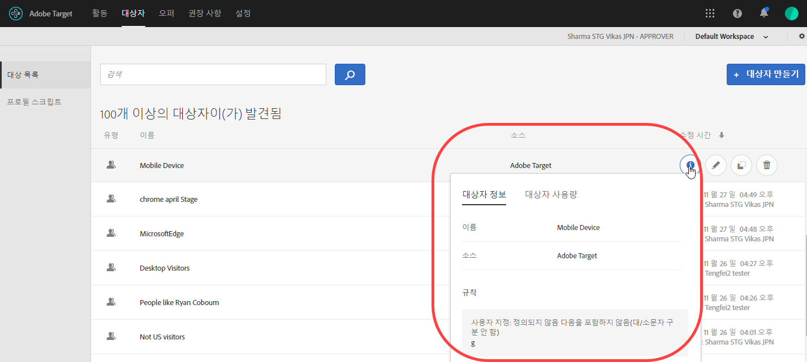
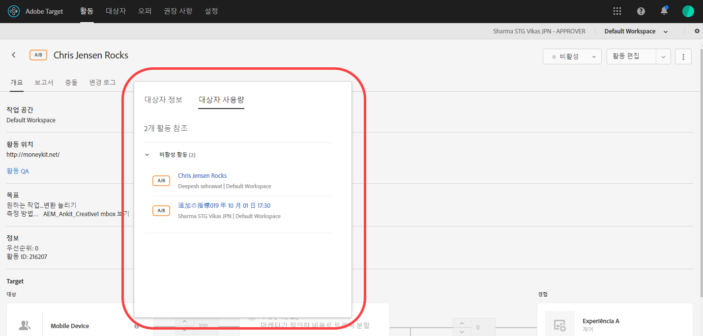
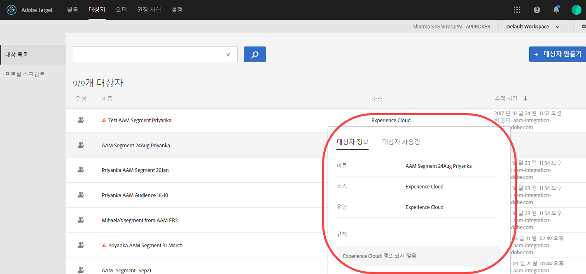

# 대상자 만들기

[!DNL Adobe Target]의 대상은 타깃팅된 활동에서 컨텐츠 및 경험을 보는 사용자를 결정합니다.

대상은 타깃팅이 가능한 모든 곳에서 사용됩니다. 활동을 타깃팅할 때 다음 옵션을 사용할 수 있습니다.

* [!UICONTROL 대상] 목록에서 재사용 가능한 대상을 선택합니다
* [활동별 대상을 ](/help/c-target/creating-activity-only-audience.md) 만들고 타깃팅합니다
* [여러 ](/help/c-target/combining-multiple-audiences.md#concept_A7386F1EA4394BD2AB72399C225981E5) 대상을 결합 하여 임시 대상 만들기

[!DNL Adobe Analytics]에서 수집한 대상 데이터를 [!DNL Target] 및 기타 [!DNL Adobe Experience Cloud] 애플리케이션에서 실시간 타깃팅 및 개인화에 사용할 수도 있습니다. *Experience Cloud 중앙 인터페이스 구성 요소* 안내서의 [Experience Cloud 대상](https://experienceleague.adobe.com/docs/core-services/interface/audiences/audience-library.html?lang=ko-KR)을 참조하십시오.

[!DNL Target]에서는 두 가지 유형의 대상을 정의합니다.

* **타깃팅 대상:**&#x200B;다양한 유형의 방문자에게 다양한 콘텐츠를 전달하는 데 사용되는 입니다.
* **보고 대상:**&#x200B;테스트 결과를 분석할 수 있도록 다양한 유형의 방문자가 동일한 콘텐츠에 어떻게 반응하는지를 판별하는 데 사용됩니다.

   [!DNL Target]에서는 [!DNL Target]을 보고 소스로 사용하는 경우에만 보고 대상을 구성할 수 있습니다. [ Adobe Analytics를 보고 소스](/help/c-integrating-target-with-mac/a4t/a4t.md)(A4T)로 사용하는 경우에는 [!DNL Analytics]에서 보고 대상을 구성해야 합니다.

## [!UICONTROL Audiences] 목록 사용

[!UICONTROL 대상자] 목록에 액세스하려면 맨 위 메뉴 막대에서 **[!UICONTROL 대상자]**&#x200B;를 클릭하십시오.

[!UICONTROL 대상자] 목록에는 활동에서 사용할 수 있는 모든 대상자가 포함되어 있습니다. 대상자를 작성, 편집, 삭제, 복사 또는 결합하려면 [!UICONTROL 대상자] 목록을 사용하십시오. 대상이 만들어진 소스([!DNL Target], [!DNL Target Classic] 및 [!DNL Experience Cloud])도 이 목록에 표시됩니다. &quot;[!UICONTROL 새 방문자]&quot; 및 &quot;[!UICONTROL 재방문자]&quot;와 같이 사전 정의된 대상의 이름은 변경할 수 없습니다.

원래 [!DNL Experience Cloud]에서 만들어진 대상으로 작업하는 경우, Target은 [!DNL Experience Cloud]에서 나중에 삭제된 [!DNL Target] 활동에서 대상을 참조하는 경우 경고를 표시합니다.

* [!DNL Experience Cloud]에서 대상이 삭제된 경우 [!UICONTROL Audience] 목록 및 대상 선택기 모두에 경고 아이콘이 표시됩니다. UI의 도구 설명도 [!DNL Experience Cloud]에서 대상이 삭제되었음을 나타냅니다.
* 삭제된 대상으로 여러 대상을 결합하려고 시도하거나 삭제된 대상을 참조하는 활동을 저장하려고 하면 경고 메시지가 표시됩니다.

사용자 지정 프로필 매개 변수와 `user.` 매개 변수를 타깃팅할 수도 있습니다. 대상을 추가할 때 활동을 타깃팅하는 데 사용할 속성을 클릭합니다. 원하는 속성이 나타나지 않으면, mbox에서 속성을 실행하지 않았습니다. 다른 사용자 지정 mbox 매개 변수는 [!UICONTROL 사용자 지정 매개 변수] 드롭다운 목록에서 사용할 수 있습니다.

[!UICONTROL 필터] 단추를 사용하여 [!UICONTROL 대상] 목록을 소스별로 필터링합니다.[!DNL Adobe Target], [!DNL Adobe Target Classic] 및 [!DNL Experience Cloud].

[!UICONTROL 대상 검색] 상자를 사용하여 [!UICONTROL 대상] 목록을 검색합니다. 대상 이름의 일부를 검색하거나 특정 문자열을 따옴표로 묶을 수 있습니다.

대상 이름이나 마지막 수정 날짜별로 [!UICONTROL 대상자] 목록을 정렬할 수 있습니다. 이름이나 날짜별로 정렬하려면 열 헤더를 클릭한 다음, 대상을 오름차순이나 내림차순으로 표시하도록 선택하십시오.

## 대상 정의 보기 {#section_11B9C4A777E14D36BA1E925021945780}

대상을 열지 않고도 Target UI에서 다양한 위치에 있는 팝업 카드에서 대상 정의 세부 사항을 볼 수 있습니다. 이 기능은 [!DNL Target Standard/Premium]에서 만들거나 [!DNL Target Classic]에서 가져오거나 API를 통해 만든 대상에 적용됩니다.

예를 들어 원하는 대상에 대해 [!UICONTROL 세부 정보 보기] 아이콘을 클릭하여 다음 대상 정의 카드에 액세스합니다.

다음 대상 정의 카드는 활동의 [!UICONTROL 개요] 페이지에서 [!UICONTROL 세부 정보 보기] 아이콘을 클릭하여 액세스합니다.

대상 정의 카드는 대상자의 유형, 소스 및 속성을 보여줍니다. 해당하는 경우 **[!UICONTROL 전체 세부 정보 보기]**&#x200B;를 클릭하여 해당 대상을 참조하는 다른 활동을 확인합니다. 활동의 [!UICONTROL 개요] 페이지에서 대상 정의 카드를 보는 경우 **[!UICONTROL 대상 사용]**&#x200B;을 클릭합니다.

대상 사용 정보는 대상을 편집하는 동안 다른 활동에 실수로 영향을 주지 않도록 하는 데 도움이 될 수 있습니다. 정보에는 [라이브 활동], [비활성 활동], [보관된 활동] 및 [활동 동기화]가 포함됩니다. 이 기능은 모든 대상(라이브러리 대상과 [활동 전용 대상](/help/c-target/creating-activity-only-audience.md#concept_A6BADCF530ED4AE1852E677FEBE68483))에 사용할 수 있습니다.

대상이 다른 대상과 결합되고 결합된 대상이 활동을 만드는 데 사용되는 경우 두 대상에 대한 사용 정보는 새로 생성된 활동을 나열합니다.

다음 대상 정의 카드는 Adobe Experience Cloud에서 가져온 대상에 대한 것입니다. 이 경우 대상은 Adobe Audience Manager(AAM)에서 가져왔습니다. 

다음 세부 사항은 이 가져온 대상 유형에 사용할 수 있습니다.

| 대상 유형 | 세부 사항 |
|--- |--- |
| 모바일 대상 | 마케팅 이름, 공급업체 및 모델. `matches | does not match` 연산자가 `equals | does not equal`  대신 표시됩니다. |
| 방문자 행동 대상 | **user.categoryAffinity:** `FAVORITE` 매개 변수와 함께 `categoryAffinity`  **모니터링:** 모니터링 서비스가 true입니다. **모니터링 서비스 없음:**&#x200B;모니터링 서비스가 false와 같음.  |
| NOT 연산자를 사용하는 대상 | **단일 규칙:** Target에 대상이 `[All Visitor AND [NOT [rule]` 형식으로 표시됩니다. 단일 NOT 규칙이 `AllVisitor` 대상 및 AND와 함께 표시됩니다.  |

가져온 대상으로 작업할 때에는 다음 사항을 잊지 마십시오.

* 표현식 타깃팅 대상은 더 이상 Target Standard/Premium에서 지원되지 않습니다.
* Target Standard/Premium이 일부 사용되지 않는 대상을 지원하지 않거나, 사용하기 쉽도록 연산자를 개선했습니다. 이러한 이유로 특정 대상을 가져올 경우, 가져온 대상의 정의가 올바르게 작동하더라도 Standard/Premium 인터페이스에서 해당 대상을 생성하지 못할 수도 있습니다. 예를 들어, 소셜 대상은 해당 규칙으로 표시되지만 Target Standard/Premium에서는 소셜 대상을 만들 수 없습니다.

## 교육 비디오: 대상 사용 

다음 비디오에는 대상 사용에 대한 정보가 포함되어 있습니다.

* 용어 &quot;대상&quot; 설명
* 최적화에 대상을 사용하는 두 가지 방법 설명
* 대상자 목록에서 대상자 찾기
* 활동을 대상에 타깃팅
* 활동에서 수동 보고에 대상 사용

>[!VIDEO](https://video.tv.adobe.com/v/17398)
