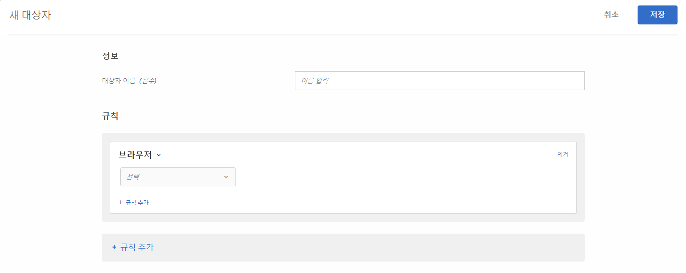

# 브라우저{#browser}

페이지를 방문할 때 특정 브라우저나 특정 브라우저 선택 사항을 사용하는 사용자를 타깃팅할 수 있습니다.

다음 브라우저를 타깃팅할 수 있습니다.

* Chrome
* Microsoft Edge
* Firefox
* Opera
* Safari
* iPad
* Internet Explorer
* iPhone|

브라우저를 타깃팅하는 방법에는 두 가지가 있습니다.

**사전에 만들어진 대상:**&#x200B;특정 브라우저를 사용하여 사이트를 방문하는 방문자만 타깃팅하려는 경우 사전에 만들어진 대상을 사용하십시오. 예를 들어 Chrome 확장 프로그램을 제공하는 경우 Chrome 사용자만 타깃팅할 수 있습니다.

1. 활동을 설정할 때 대상 드롭다운 목록에서 브라우저를 선택합니다.

   이 선택 사항은 활동을 지정된 브라우저를 사용하는 방문자에게만 타깃팅합니다.

**사용자 지정된 브라우저 대상 규칙:**&#x200B;사용자 지정된 대상을 이용하면 여러 브라우저를 타깃팅하거나 특정 브라우저, 브라우저 버전 또는 브라우저 언어에 대한 규칙 또는 제외를 설정할 수 있습니다. 이 기능은 브라우저 속성을 기반으로 캠페인을 타깃팅할 때 상당한 유연성을 제공합니다.

1. [!DNL Target] 인터페이스에서 **[!UICONTROL 대상자]** > **[!UICONTROL 대상자 만들기]**&#x200B;를 클릭합니다.
1. 대상자의 이름을 지정합니다.
1. **[!UICONTROL 규칙 추가]** > **[!UICONTROL 브라우저]**&#x200B;를 클릭합니다.

   

1. **[!UICONTROL 선택]**&#x200B;을 클릭한 후, 다음 선택 사항 중 하나를 선택합니다.

   * **유형:** 특정 브라우저를 타깃팅하거나 제외합니다. [유형](/help/c-target/c-audiences/c-target-rules/browser.md#section_6ADC758F23F145B3A310151546D83D56)을 참조하십시오.
   * **언어:** 특정 언어를 사용하도록 설정된 특정 브라우저를 타깃팅하거나 제외합니다. [언어](/help/c-target/c-audiences/c-target-rules/browser.md#section_7520D1AA464A45A6843EABE2D2B431A1)를 참조하십시오.
   * **버전:** 특정 브라우저 버전을 타깃팅하거나 제외합니다. [버전](/help/c-target/c-audiences/c-target-rules/browser.md#section_37CC8CE45DA04E8682AE6388321BA6EF)을 참조하십시오.

1. (선택 사항) **[!UICONTROL 규칙 추가]**&#x200B;를 클릭하고 대상에 대한 추가 규칙을 설정합니다.
1. **[!UICONTROL 저장]**&#x200B;을 클릭합니다.

다음 예는 버전 10 또는 11에서 Internet Explorer 사용자를 포함하는 대상을 보여줍니다.

## 브라우저 옵션{#concept_221D8EEF53CC45AEACEB17CF336A3658}을 참조하십시오 

브라우저 유형, 언어 또는 버전을 기반으로 활동 참여자를 타깃팅하거나 제외하십시오.

### 유형 {#section_6ADC758F23F145B3A310151546D83D56}

특정 브라우저를 타깃팅하거나 제외합니다.

**[!UICONTROL 유형]**&#x200B;을 선택한 다음, 다음과 같음 또는 다음과 같지 않음을 선택하십시오.

* 다음과 같음: 선택한 브라우저를 타깃팅합니다.
* 다음과 같지 않음: 선택한 브라우저를 제외합니다.

브라우저를 하나 이상 선택하십시오. 여러 선택 사항은 OR로 연결됩니다.

### 언어 {#section_7520D1AA464A45A6843EABE2D2B431A1}

특정 언어를 사용하도록 설정된 특정 브라우저를 타깃팅하거나 제외합니다.

예를 들어 오퍼가 영어로만 제공되는 경우 해당 언어가 영어로 설정된 브라우저를 타깃팅할 수 있습니다. 또는 페이지에 더블바이트가 활성화되어 있지 않은 경우 동아시아 언어로 설정된 브라우저를 제외할 수 있습니다.

브라우저 언어를 포함하거나 제외하면 언어가 위치보다 중요한 경우 지역을 기반으로 타깃팅하는 것보다 더 정확한 방문자 타깃팅을 수행할 수 있습니다. 예를 들어 영어로 작성된 문서를 제공하는 경우 영어 사용 국가를 타깃팅하거나 영어로 설정된 브라우저를 타깃팅할 수 있습니다. 브라우저에 타깃팅하면 영어가 기본 언어가 아닌 국가에 있는 영어 사용자가 문서를 사용할 수 있게 됩니다.

**[!UICONTROL 언어]**&#x200B;를 선택한 다음, 다음과 같음 또는 다음과 같지 않음을 선택하십시오.

* 다음과 같음: 선택한 브라우저 언어를 타깃팅합니다.
* 다음과 같지 않음: 선택한 브라우저 언어를 제외합니다.

언어를 하나 이상 선택하십시오. 여러 선택 사항은 OR로 연결됩니다.

다음 브라우저 언어는 타깃팅하거나 제외할 수 있습니다.

* 영어
* 프랑스어
* 독일어
* 일본어
* 한국어
* 포르투갈어
* 러시아어
* 스페인어
* 중국어 번체

### 버전 {#section_37CC8CE45DA04E8682AE6388321BA6EF}

특정 브라우저 버전을 타깃팅하거나 제외합니다.

예를 들어, 페이지가 Internet Explorer 버전 11 이하에서 올바르게 표시되지 않는 경우 해당 버전을 제외하는 대상을 만들 수 있습니다. 이 경우 브라우저 유형이 Internet Explorer와 같은 규칙을 설정하고 버전이 11 이하인 두 번째 규칙을 추가하십시오.

**[!UICONTROL 버전]**&#x200B;을 선택한 다음 연산자를 선택하십시오.

* 다음과 같음
* 다음과 같지 않음
* 다음보다 큼
* 다음보다 크거나 같음
* 다음보다 작음
* 다음보다 작거나 같음

버전 번호를 입력하십시오.

텍스트 필드에는 주 버전만 입력할 수 있습니다. 지정된 버전은 해당 릴리스의 모든 부 버전이 포함되어 있습니다. 예를 들어, 버전 10을 지정하면 버전 10.1의 방문자가 포함됩니다.

여러 선택 사항은 OR로 연결됩니다.

## 교육 비디오: 대상 만들기 

다음 비디오에는 대상 카테고리 사용에 대한 정보가 포함되어 있습니다.

* 대상자 만들기
* 대상 카테고리 정의

>[!VIDEO](https://video.tv.adobe.com/v/17392)