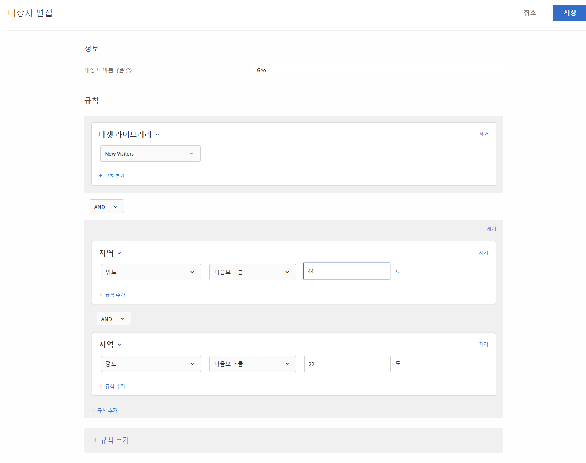

# 지역

[!DNL Adobe Target]의 대상을 사용하여 지리적 위치에 따라 사용자를 타깃팅하십시오.

지리적 위치 매개 변수를 사용하여 방문자의 지리적 위치에 따라 활동과 경험을 타깃팅할 수 있습니다. 국가, 시/도, 도시, 우편 번호, 위도, 경도, DMA 또는 이동통신사를 기반으로 방문자를 포함하거나 제외할 수 있습니다. 이 데이터는 각 [!DNL Target] 요청을 통해 전송되며 방문자의 IP 주소를 기반으로 합니다. 이러한 매개 변수는 타깃팅 값과 같이 선택합니다.

## 지리 기반의 타깃팅으로 대상 만들기 {#section_49CBFFAAC8694C4AAD3DE4B2DB7B05DE}

1. [!DNL Target] 인터페이스에서 **[!UICONTROL 대상자]** > **[!UICONTROL 대상자 만들기]**&#x200B;를 클릭합니다.
1. 대상자의 이름을 지정하고 선택적 설명을 추가합니다.
1. **[!UICONTROL Geo]**&#x200B;을 대상 빌더 창으로 끌어다 놓습니다.

1. **[!UICONTROL 선택]**&#x200B;을 클릭한 후, 다음 선택 사항 중 하나를 선택합니다.

   * [!UICONTROL 국가/지역]
   * [!UICONTROL 상태]
   * [!UICONTROL 구/군/시]
   * [!UICONTROL 우편번호]
   * [!UICONTROL 경도]
   * [!UICONTROL 위도]
   * [!UICONTROL DMA]
   * [!UICONTROL 모바일 통신사]

   방문자의 IP 주소는 방문자의 지리 기반 타깃팅 매개 변수를 확인하도록 mbox 요청과 함께 방문(세션)당 한 번 전달됩니다.

   [!UICONTROL 이동통신사]의 경우 [!DNL Target]는 IP 주소 등록 데이터(IP 주소 블록을 소유하는 사용자)를 사용하여 [모바일 국가 코드(MCC) 및 모바일 네트워크 코드(MNC)](https://www.mcc-mnc.com)를 사용하는 적절한 이동통신사를 결정합니다.

1. 연산자와 적절한 값을 지정합니다.
1. (선택 사항) 대상에 대한 추가 규칙을 설정합니다.
1. **[!UICONTROL 완료를 클릭합니다]**.

다음 그림은 44° 이상의 위도와 22° 이하의 경도에서 활동에 액세스하는 사용자를 타깃팅하는 대상을 보여줍니다.

## 정확도 {#section_D63D5FFCB49C42F9933AFD0BD7C79DF1}

지리 기반의 타깃팅의 정확도는 몇 가지 요인에 의존합니다. WiFi 연결은 셀룰러 네트워크(무선 통신망)보다 더 정확합니다. 방문자가 셀룰러 데이터 연결을 사용하는 경우 지역 조회의 정확도에는 위치, [DeviceAtlas](https://deviceatlas.com/device-data/user-agent-tester)와의 제공자 데이터 관계 및 기타 요인의 영향을 받을 수 있습니다. 셀 타워 기반 네트워크 연결은 유선 또는 WiFi 연결보다 정확도가 떨어질 수 있습니다. 또한 방문자의 IP 주소가 방문자의 ISP 위치에 매핑될 수 있으며, 이것은 방문자의 실제 위치와 같지 않을 수 있습니다. 일부 모바일 지리적 위치 문제는 [지리적 위치 API](https://developer.mozilla.org/en-US/docs/Web/API/Geolocation_API)를 사용하여 해결될 수 있습니다.

다음 표는 유선 또는 WiFi 인터넷 연결을 위한 [DigitalEnvoy](https://www.digitalelement.com/solutions/)의 IP 기반 지리 정보의 정확도를 보여줍니다. DigitalEnvoy는 해당 산업 분야의 보다 정확한 데이터를 제공합니다. 전역 정확도는 국가 수준에서 99.9%가 넘고, 구/군/시 수준에서는 최대 97%에 이릅니다. 정확도 정보는 셀 타워 기반 네트워크에 적용되지 않습니다.

| 국가 | 주/도 | 구/군/시 | 지역 |
|--- |--- |--- |--- |
| 미국 | 99.99% | 96% | 94% |
| 캐나다 | 99.99% | 96% | 94% |
| 유럽 | 99.99% |  |  |
| 영국 | 99.99% |  | 87% |
| 독일 | 99.99% | 95% | 93% |
| 스칸디나비아 | 99% | 90% 초반 | 80% 중반 |
| 스페인 | 99.99% | 90% 내외 | 90% 중반부터 후반 |
| 아시아 | 99% | 90% 중반 | 90% 초반 |
| 일본 | 99.99% | 90% 중반 | 90% 초반 |
| 오스트레일리아 | 99.99% | 94% | 91% |

## 프로필 스크립트에서 지역 타깃팅 사용 {#section_92C93138542C4A94997E3F4BE3F5DA28}

프로필 스크립트에 지리 정보를 사용할 수 있습니다.

예를 들어, 다음 항목을 사용하십시오.

* `profile.geolocation.country`
* `profile.geolocation.state`
* `profile.geolocation.city`
* `profile.geolocation.zip`
* `profile.geolocation.dma`
* `profile.geolocation.domainName`
* `profile.geolocation.ispName`
* `profile.geolocation.connectionSpeed`
* `profile.geolocation.mobileCarrier`

따라서 다음 코드와 함께 &quot;From North America&quot;라는 타겟 표현식을 쓸 수 있습니다.

`return profile.geolocation.country == 'united states' || profile.geolocation.country == 'canada' || profile.geolocation.country == 'mexico';`

## 지리 기반의 타깃팅 값을 토큰으로 사용 {#section_E7F7FDF62C3B4934A6565D04B24655F6}

오퍼, 플러그인 등에서 `profile.geolocation` 값을 토큰으로 바로 사용할 수 있습니다.

예를 들어, 다음 항목을 사용하십시오.

* `${profile.geolocation.country}`
* `${profile.geolocation.state}`
* `${profile.geolocation.city}`
* `${profile.geolocation.zip}`
* `${profile.geolocation.dma}`
* `${profile.geolocation.domainName}`
* `${profile.geolocation.ispName}`
* `${profile.geolocation.connectionSpeed}`
* `${profile.geolocation.mobileCarrier}`
* `${profile.geolocation.latitude}`
* `${profile.geolocation.longitude}`

## 지역 타깃팅 FAQ {#section_DD308A53AF0F48FA8C81423580561FE7}

지리 기반의 타깃팅에 대한 FAQ는 다음과 같습니다.

### 위도와 경도를 지정하려면 어떻게 합니까?

* 위도와 경도 값은 도 단위의 숫자 값이어야 합니다.
* 위도와 경도 값은 최대 소수점 이하 다섯 자리까지 정밀할 수 있습니다.
* 위도 값은 -90 ~ 90 범위여야 합니다.
* 경도 값은 -180 ~ 180 범위여야 합니다.

### 모바일 장치에서 지리 기반의 타깃팅은 어떻게 작동합니까?

대부분의 모바일 장치 사용자는 WiFi를 통해 콘텐츠에 액세스합니다. 즉, [!DNL Target]의 IP 기반, 지리 기반의 타깃팅이 데스크톱만큼 정확합니다. 기지국 기반의 연결은 방문자의 IP 주소가 신호를 선택하는 기지국을 기준으로 하므로 덜 정확할 수 있습니다. 일부 모바일 지리적 위치 문제는 [지리적 위치 API](https://developer.mozilla.org/en-US/docs/Web/API/Geolocation_API)를 사용하여 해결될 수 있습니다.

### 지리 기능은 AOL에서 온 방문자를 어떻게 처리합니까?

AOL이 트래픽을 프록시하는 방식 때문에 [!DNL Target]은 국가 수준에서만 트래픽을 타깃팅할 수 있습니다. 예를 들어 프랑스에 타깃팅한 캠페인은 프랑스의 AOL 사용자를 성공적으로 타겟팅합니다. 그러나 파리를 겨냥한 캠페인은 파리의 AOL 사용자를 성공적으로 타겟팅하지 않습니다. 특별히 AOL 사용자를 타깃팅하려는 경우 지역 필드를 &quot;aol&quot;로 설정할 수 있습니다. 실제로, 국가가 정확히 &quot;미국&quot;과 일치하고 지역이 정확히 &quot;aol&quot;과 일치한다는 두 가지 타깃팅 조건을 지정하여 미국 AOL 사용자를 타깃팅할 수 있습니다.

### 지리 기반 타깃팅은 어떤 위치 세분화를 제공합니까?

* 국가 - 글로벌
* 주/도/지역 - 글로벌
* 구/군/시 - 글로벌
* 우편번호 - 미국, 독일, 캐나다
* DMA/ITV(영국) - 미국, 영국
* 이동통신사 - 글로벌

### 다른 위치에서 온 사용자의 경우 활동을 어떻게 테스트할 수 있습니까?

* **at.js 1.*x***: 자신의 IP 주소 대신 다른 위치의 IP 주소를 사용하고  `mboxOverride.browserIp url` 매개 변수를 사용할 수 있습니다. 예를 들어 회사가 영국에 있지만 글로벌 캠페인 타겟이 뉴질랜드의 오클랜드의 방문자인 경우, 다음과 같이 `60.234.0.39`이 오클랜드의 IP 주소라고 가정하는 다음과 같은 스타일의 URL을 사용하십시오.

   `https://www.mycompany.com?mboxOverride.browserIp=60.234.0.39`

   활동을 테스트하기 전에 쿠키를 지웁니다.

   >[!NOTE]
   >
   >`mboxOverride.browserIp` 는 at.js 1.*x*&#x200B;에만 사용할 수 있습니다. 이 기능은 at.js 2에서 지원되지 않습니다.*x*.

* **at.js 2.*x***: IP 주소를 at.js 2.*x*에서 브라우저 확장/플러그인(예: Chrome 또는 Firefox용 X-Forwarded-For Header)을 설치합니다. 이 확장을 사용하면 페이지 요청에 x-forwarded-for 헤더를 전달할 수 있습니다.

### 푸에르토리코 및 홍콩과 같은 지역은 어떻게 지역 타깃팅 구조에 매핑됩니까?

푸에르토리코, 홍콩 및 기타 지역은 &quot;국가&quot; 값으로 취급됩니다.

### 활동이 지리적 위치 타깃팅 기능을 사용하여 타깃팅될 때 [!DNL Target] 은 우편번호와 같은 정보를 캡처(및 저장)합니까?

아니요. [!DNL Target] 은 세션 중에만 지역 데이터를 사용하면 데이터가 무시됩니다.

## 교육 비디오: 대상 만들기 

다음 비디오에는 대상 카테고리 사용에 대한 정보가 포함되어 있습니다.

* 대상자 만들기
* 대상 카테고리 정의

>[!VIDEO](https://video.tv.adobe.com/v/17392)
