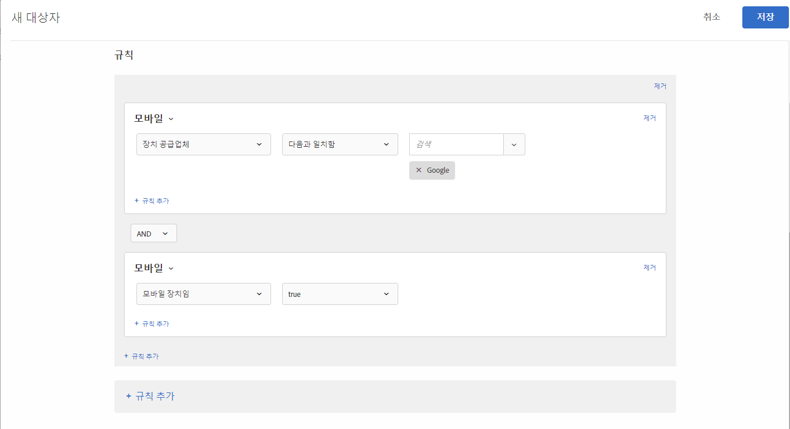

# 모바일{#mobile}

모바일 장치, 장치 유형, 장치 공급업체, 화면 치수(픽셀) 등의 매개 변수를 기반으로 하는 모바일 장치를 타깃팅할 대상을 만듭니다.

예를 들어, 휴대폰에서 페이지에 들어가는 사용자에게 컴퓨터에서 방문할 때와는 다른 콘텐츠를 표시할 수 있습니다. 이런 경우 모바일 대상을 선택한 다음, **[!UICONTROL 휴대 전화입니다]** 선택 사항을 선택하고, 휴대폰 유형, 화면의 크기(픽셀 단위) 등과 같이 중요한 구체적인 세부 사항이 있으면 추가할 수 있습니다.

모바일 타깃팅은 DotMobi의 서비스인 [DeviceAtlas](https://deviceatlas.com/device-data/user-agent-tester)에서 제공됩니다. DeviceAtlas는 제조업체와 네트워크 운영자를 비롯한, 수 많은 소스에서 컴파일된 데이터 위에 구축된 휴대 장치의 포괄적인 데이터베이스입니다. 그런 다음 이러한 데이터가 확인되고 상호 참조되며 유효성이 검사되어 사용 가능한 대용량의 정확한 휴대 장치 데이터베이스를 구축합니다.

장치 검색은 사용자-에이전트 문자열을 분석하여 수행됩니다. Apple과 같은 일부 장치 제조업체에서는 UA에서 충분한 정보를 제공하지 않음으로써 이 기능을 비활성화합니다.

예를 들어, Apple 장치는 UA에서 장치 모델별 토큰을 공유하지 않습니다. 따라서 단순한 키워드 기반 방법을 사용해서는 iPhone 모델(iPhone 5S, iPhone SE, iPhone 6 등)을 감지할 수 없습니다.

이 문제를 해결하기 위해 Target은 다음 매개 변수를 사용하여 iPhone 및 기타 Apple 장치를 정확하게 감지하기 위해 추가 데이터를 수집합니다.

| 매개 변수 | 유형 | 설명 |
|--- |--- |--- |
| devicePixelRatio | 문자열 | 브라우저의 실제 픽셀과 장치 독립적인 픽셀(dips) 간의 비율입니다.  예: &quot;1.5&quot; 또는 &quot;2&quot; |
| screenOrientation | 문자열 | 장치와 브라우저의 JavaScript 엔진은 장치 방향을 지원합니다. 가로이거나 세로일 수 있습니다. |
| webGLRenderer | 문자열 | 그래픽 드라이버의 브라우저 렌더러입니다. |

>[!NOTE]
>
>Mobile SDK를 사용하는 고객은 이 기능을 활용하기 위해 다른 작업을 수행하지 않아도 됩니다. at.js를 사용하는 고객은 [at.js 버전 1.5.0으로 업그레이드](/help/c-implementing-target/c-implementing-target-for-client-side-web/target-atjs-versions.md#reference_DBB5EDB79EC44E558F9E08D4774A0F7A)(또는 그 이상 버전)해야 합니다.

모바일 장치 속성을 두 개 이상 선택할 수 있습니다. 여러 개를 선택할 때에는 OR로 결합합니다.

사용자 지정 통합(at.js 또는 Mobile SDK를 사용하지 않음)을 사용하는 고객은 이러한 매개 변수를 직접 수집하여 mbox 매개 변수로 전달할 수 있습니다.

1. [!DNL Target] 인터페이스에서 **[!UICONTROL 대상자]** > **[!UICONTROL 대상자 만들기]**&#x200B;를 클릭합니다.
1. 대상자의 이름을 지정합니다.
1. **[!UICONTROL 규칙 추가]** > **[!UICONTROL 모바일]**&#x200B;을 클릭합니다.
1. **[!UICONTROL 선택]**&#x200B;을 클릭한 후, 다음 선택 사항 중 하나를 선택합니다.

   * 장치 마케팅 이름
   * 장치 모델
   * 장치 공급업체
   * 모바일 장치입니다.
   * 휴대 전화입니다.
   * 태블릿입니다.
   * OS
   * 화면 높이(픽셀)
   * 화면 너비(픽셀)

   >[!NOTE]
   >
   >iOS 12.2에 새롭게 추가된 변경 사항으로 인해, iPhone 모델을 지정한 장치 마케팅 이름 및 장치 모델로 정의된 규칙으로 대상을 만들면 영향을 받습니다. iOS 12.2가 설치된 iPhone 사용자를 더 이상 타깃팅할 수 없습니다. 그러나 그러한 사용자에게 iOS 12.2가 없는 경우 iPhone 모델 타깃팅이 계속 제대로 작동합니다.
   >
   >iPhone, iPhone 3G, iPhone 3GS, iPhone 4, iPhone 4s, iPhone 5, iPhone 5c, iPad, iPad 2, iPad/Retina 디스플레이, iPad Retina (4th Gen), iPod Touch 4 및 iPod Touch 5 모델은 iOS 12.2로의 업그레이드를 지원하지 않기 때문에 iOS 12.2 업데이트는 이러한 모델을 식별하는 데 영향을 주지 않습니다.

   >[!NOTE]
   >
   >[지역 설정](/help/c-target/c-audiences/c-target-rules/geo.md#concept_5B4D99DE685348FB877929EE0F942670)을 사용하여 이동통신사별로 타깃팅할 수 있습니다.

1. (선택 사항) **[!UICONTROL 규칙 추가]**&#x200B;를 클릭하고 대상에 대한 추가 규칙을 설정합니다.
1. **[!UICONTROL 저장]**&#x200B;을 클릭합니다.

다음 그림은 Google에서 만든 모바일 장치를 사용하는 방문자를 타깃팅하는 대상을 보여줍니다.

## 교육 비디오: 대상 만들기

다음 비디오에는 대상 카테고리 사용에 대한 정보가 포함되어 있습니다.

* 대상자 만들기
* 대상 카테고리 정의

>[!VIDEO](https://video.tv.adobe.com/v/17392)
