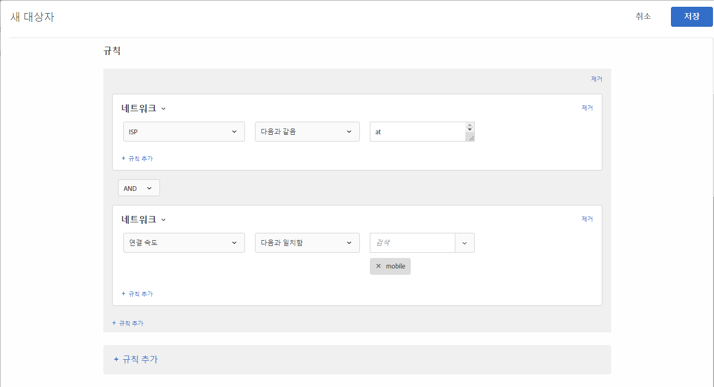

# 네트워크

네트워크 세부 사항을 기반으로 대상을 만들 수 있습니다.

1. [!DNL Target] 인터페이스에서 **[!UICONTROL 대상자]** > **[!UICONTROL 대상자 만들기]**&#x200B;를 클릭합니다.
1. 대상자의 이름을 지정합니다.
1. **[!UICONTROL 규칙 추가]** > **[!UICONTROL 네트워크]**&#x200B;를 클릭합니다.
1. **[!UICONTROL 선택]**&#x200B;을 클릭한 후, 다음 선택 사항 중 하나를 선택합니다.

   * **ISP:** ISP는 보통 월별 또는 연간 요금으로 해당 가입자에게 인터넷 액세스 권한을 제공하는 회사입니다. 많은 ISP에서 웹 호스팅이나 이메일과 같은 추가 서비스를 제공합니다. ISP 필드는 상업적인 ISP(예: Comcast, TimeWarner)나, 비즈니스 또는 교육 기관과 같은 엔티티입니다.

      다음은 미국에서 많이 이용하는 ISP들의 예입니다.

      | 일반 이름 | ISP 이름 | 도메인 이름 | 샘플 IP 주소 |
      |---|---|---|---|
      | Cablevision | Cablevision Systems Corp. | *.optonline.net | 68.196.130.239 |
      | CenturyLink | Qwest Communications Company, LLC | *.centurylink.net | 64.40.65.0 |
      | Charter Communications | 차터 커뮤니케이션 | *.charter.com | 71.85.225.124 |
      | Comcast | Comcast Cable Communications, Inc. | *.comcast.net | 76.27.24.28 |
      | Cox | Cox Communications Inc. | *cox.net | 68.224.174.22 |
      | Speakeasy | MegaPath Corporation | *.speakeasy.net | 66.93.240.0 |
      | Time Warner | Time Warner Cable Internet LLC | *.res.rr.com | 72.229.28.185 |
      | Verizon FiOS | MCI Communications Services, Inc. d/b/a Verizon Business | *.fios.verizon.net | 173.68.112.34 |
      | Vivint | Smartrove Inc. | *.vivintwireless.net | 170.72.26.105 |
      | AT&amp;T Wireless | AT | *.mycingular.net |  |
      | Sprint mobile | Sprint Personal Communications Systems | IP 주소 |  |
      | T-Mobile | T-Mobile USA, Inc. | IP 주소 | 208.54.86.0 |
      | Verizon Wireless | Cellco Parternship DBA Verizon Wireless | *.myvzw.com | 70.195.74.199 |

      >[!NOTE]
      >
      >ISP를 기반으로 타깃팅할 때에는 일반 이름을 사용하지 말고 ISP 이름을 사용하십시오. 대소문자를 구분하지 않는 규칙을 작성하거나 항상 소문자 형식을 사용하는지 확인합니다.

      ISP 및 도메인 이름 값을 테스트할 수 있습니다. https://www.whoismyisp.org는 타깃팅용으로 적합한 리소스입니다. 위 표에 제공된 샘플 IP 주소를 사용하거나 원하는 IP 주소를 입력할 수 있습니다. 그런 다음 `mboxOverride.browserIp= URL` 매개 변수를 사용하여 IP 주소를 모방하십시오.

   * **도메인 이름:**&#x200B;방문자 IP 주소의 도메인 이름입니다. [!DNL Target]에 사용하는 웹 사이트의 도메인 이름이 아닙니다. 이 도메인 이름은 방문자의 IP 주소와 관련되며 때로는 호스트 이름이라고도 합니다. 일반적으로 ISP 이름과 매우 유사합니다. 호스트 이름이 도메인 이름이 아니라, ISP 이름을 새로이 브랜딩한 회사의 이전 이름을 참조하는 경우도 있습니다.
   * **연결 속도:**&#x200B;인터넷에 대한 방문자의 연결 속도입니다. 선택 사항에는 광대역, 케이블, 전화 접속, 모바일, oc3, oc12, 위성, t1, t2, 무선 및 xdsl 등이 있습니다.

      이 필드는 연결 유형을 기반으로 하며 실제 속도 자체는 아닙니다. [!DNL Target]은 연결의 정확한 연결 속도를 판별할 수 없습니다. 기타 연결 유형이 표시되지 않아서 특정 유형을 선택할 수 없는 경우 광대역 연결 유형이 사용됩니다.

1. (선택 사항) **[!UICONTROL 규칙 추가]**&#x200B;를 클릭하고 대상에 대한 추가 규칙을 설정합니다.
1. **[!UICONTROL 저장]**&#x200B;을 클릭합니다.

다음 그림은 [!UICONTROL 모바일]의 연결 속도로 AT&amp;T를 사용하는 방문자를 타깃팅하는 대상을 보여줍니다.

## 교육 비디오: 대상 만들기

다음 비디오에는 대상 카테고리 사용에 대한 정보가 포함되어 있습니다.

* 대상자 만들기
* 대상 카테고리 정의

>[!VIDEO](https://video.tv.adobe.com/v/17392)
