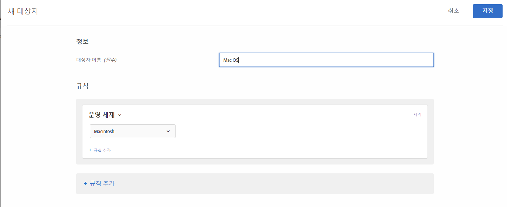

# 운영 체제

특정 운영 체제를 사용하는 [!DNL Adobe Target] 을 사용하여 방문자를 타깃팅할 수 있습니다.

1. [!DNL Target] 인터페이스에서 **[!UICONTROL 대상자]** > **[!UICONTROL 대상자 만들기]**&#x200B;를 클릭합니다.
1. 대상자의 이름을 지정하고 선택적 설명을 추가합니다.
1. **[!UICONTROL 운영 체제]**&#x200B;를 대상 빌더 창으로 끌어다 놓습니다.
1. **[!UICONTROL 선택]**&#x200B;을 클릭한 후, 다음 선택 사항 중 하나를 선택합니다.

   * Linux
   * Macintosh
   * Windows

1. (선택 사항) 대상에 대한 추가 규칙을 설정합니다.
1. **[!UICONTROL 완료를 클릭합니다]**.

다음 그림은 Macintosh OS를 사용하는 방문자를 타깃팅하는 대상을 보여줍니다.

## 교육 비디오: 대상 만들기

다음 비디오에는 대상 카테고리 사용에 대한 정보가 포함되어 있습니다.

* 대상자 만들기
* 대상 카테고리 정의

>[!VIDEO](https://video.tv.adobe.com/v/17392)
