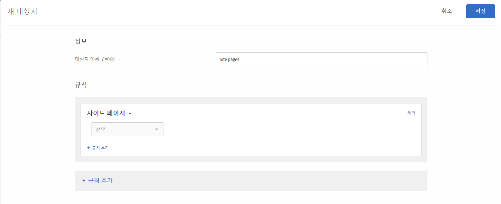

# 사이트 페이지{#site-pages}

사이트의 특정 페이지에 있는 방문자를 타깃팅할 수 있습니다.

1. [!DNL Target] 인터페이스에서 **[!UICONTROL 대상자]** > **[!UICONTROL 대상자 만들기]**&#x200B;를 클릭합니다.
1. 대상자의 이름을 지정합니다.
1. **[!UICONTROL 규칙 추가]** > **[!UICONTROL 사이트 페이지]**&#x200B;를 클릭합니다.

   

1. 선택 **[!UICONTROL 드롭다운]** 목록을 클릭하고 다음 옵션 중 하나를 선택한 다음 원하는 대로 규칙을 구성합니다.

   규칙의 후속 드롭다운 목록에 있는 사용 가능한 옵션 및 평가기는 선택한 옵션에 따라 달라집니다. 다음 그림은 현재 페이지를 선택하는 경우 사용 가능한 옵션 [!UICONTROL 을 보여줍니다].

   

   선택을 선택하면 초기 드롭다운 목록에서 다음 옵션을 사용할 수 [!UICONTROL 있습니다].

   * **현재 페이지:** 사용자가 현재 있는 페이지입니다.

      이 옵션을 선택하면 두 번째 드롭다운 목록에서 다음 옵션을 사용할 수 있습니다.

      * URL(Target이 URL을 평가하는 방법에 대한 자세한 내용은 [Target 및 대상 FAQ를 참조하십시오](/help/c-target/c-troubleshooting-targets-and-audiences/troubleshooting-targets-and-audiences.md).)
      * 도메인
      * 쿼리
      * 하위 도메인
      * 최상위 도메인
      * 경로
      * 해시(#) 단편
   * **이전 페이지:** 현재 페이지를 클릭하기 전에 사용자가 있던 페이지입니다. (사용자가 이전 페이지에서 클릭하여 현재 페이지로 이동해야 페이지가 추적됩니다. 사용자가 브라우저에서 새 URL을 입력하는 경우 이전 페이지가 추적됩니다.) 이 페이지의 실제 내용은 사이트의 디자인에 따라 다릅니다. 예를 들어, 현재 페이지에 특정 제품에 대한 정보가 표시되는 경우 이전 페이지는 방문자가 특정 항목을 선택하는 카테고리 페이지(예: 특정 유형의 카메라 몇 대가 표시되는 페이지)이거나 최종 페이지로 이어지는 홈페이지일 수 있습니다.

      이 옵션을 선택하면 두 번째 드롭다운 목록에서 다음 옵션을 사용할 수 있습니다.

      * URL(Target이 URL을 평가하는 방법에 대한 자세한 내용은 [Target 및 대상 FAQ를 참조하십시오](/help/c-target/c-troubleshooting-targets-and-audiences/troubleshooting-targets-and-audiences.md).)
      * 도메인
      * 쿼리
      * 하위 도메인
      * 최상위 도메인
      * 경로
   * **랜딩 페이지:** 랜딩 페이지는 사이트에 액세스할 때 방문자가 보는 첫 페이지입니다. 예를 들어 방문자가 범주 페이지로 이동하는 Google에 대한 링크를 클릭하는 경우 범주 페이지는 랜딩 페이지입니다. 링크가 홈페이지로 이동하는 경우 홈페이지는 랜딩 페이지입니다. 랜딩 페이지는 방문자의 세션을 기억합니다. 방문자의 랜딩 페이지가 이 세션에 있었던 것을 기준으로 더 깊이 타깃팅할 수 있습니다.

      이 옵션을 선택하면 두 번째 드롭다운 목록에서 다음 옵션을 사용할 수 있습니다.

      * URL(Target이 URL을 평가하는 방법에 대한 자세한 내용은 [Target 및 대상 FAQ를 참조하십시오](/help/c-target/c-troubleshooting-targets-and-audiences/troubleshooting-targets-and-audiences.md).)
      * 도메인
      * 쿼리
      * 하위 도메인
      * 최상위 도메인
      * 경로
      * 해시(#) 단편

      >[!NOTE]
      >
      >`landing.url` 개체는 하위 도메인 변경 시 또는 직접적인 URL 대체 시 재설정됩니다.

   * **HTTP 헤더:** 이 옵션은 Target 요청의 HTTP 헤더에 있는 정보를 평가합니다. 예를 들어 HTTP 헤더에 언어 정보가 포함되어 있는 경우, 스페인어로 페이지에 액세스하는 방문자를 타게팅하는 `Accept-Language: es` 조건을 포함하는 규칙을 만들 수 있습니다.

      이 옵션을 선택하면 두 번째 드롭다운 목록에서 다음 옵션을 사용할 수 있습니다.

      * Accept
      * 수락 문자
      * 수락-인코딩
      * Accept-Language
      * 승인
      * Cache-Control
      * 연결
      * Content-Length
      * 컨텐츠-MDS
      * Content-Type
      * 날짜
      * 예상
      * From
      * 호스트
      * 일치
      * 수정된 경우
      * If-None-Match
      * If-Range
      * 수정되지 않은 경우
      * 최대 포워즈
      * Pragma
      * 프록시 인증
      * 범위
      * Referer
      * TE
      * 업그레이드
      * User-Agent
      * Via
      * 경고

   [ [!UICONTROL 현재 페이지]], [ [!UICONTROL 이전 페이지]] 또는 [ [!UICONTROL 랜딩 페이지]]를 선택한 경우   DomainDomain 및 Flash QueryOptions를 사용할 수 있습니다. 이러한 옵션을 선택할 때는 다음 사항을 고려하십시오.

   * **도메인:**&#x200B;페이지의 전체 도메인. 도메인을 지정할 때는 &quot;contains&quot;를 사용하는 것이 좋습니다. 예를 들어, &quot;Domain equals facebook.com&quot;(도메인이 facebook.com과 같음)은 `m.facebook.com`이나 `www.facebook.com`을 허용하지 않지만, &quot;Domain contains facebook.com&quot;(도메인이 facebook.com 포함)은 facebook.com의 모든 변형을 허용합니다.
   * **쿼리:**&#x200B;첫 번째 물음표(?) 다음의 URL 콘텐츠입니다. 

      `foo.html?e0a72cb2a2c7`

1. (선택 사항) **[!UICONTROL 규칙 추가]**&#x200B;를 클릭하고 대상에 대한 추가 규칙을 설정합니다.
1. **[!UICONTROL 저장]**&#x200B;을 클릭합니다.

자신만의 &quot;사용자 정의 쿼리 매개 변수&quot; 또는 &quot;사용자 정의 헤더&quot;를 사용하여 사이트 페이지 대상을 만들 수도 있습니다.

아래 그림과 같이

* 사용자가 선택한 규칙이 현재 페이지, 랜딩 페이지 또는 이전 페이지인 경우 쿼리 매개 변수를,
* 사용자가 선택한 규칙이 HTTP 헤더인 경우 헤더입니다.

사용하십시오.

## 문제 해결 {#ts}

* 랜딩 페이지 대상이 제대로 작동하려면 요청에 at.js JavaScript 라이브러리가 속성을 사용하여 페이지에서 가져오는 매개 변수 세트(전달 API의 `mboxReferrer` 경우 매개 변수)가 `context.address.referringUrl` `document.referrer` 있어야 합니다. 이 `HTMLDocument` 속성은 사용자가 탐색한 페이지의 URI를 반환합니다. 이 속성의 값은 사용자가 직접(링크를 통해서가 아니라 책갈피를 통해) 페이지로 이동할 때 빈 문자열입니다.

   이 동작이 요구 사항과 일치하지 않는 경우 다음 작업 중 하나를 수행하는 것이 좋습니다.

   * 타깃팅 목적으로 사용할 [mbox 매개](/help/c-implementing-target/c-implementing-target-for-client-side-web/t-mbox-download/c-understanding-global-mbox/pass-parameters-to-global-mbox.md) 변수 [!DNL Target] 를 전달합니다.
   * 랜딩 페이지 활동 [대신 A/B 테스트 활동을](/help/c-activities/t-test-ab/test-ab.md) 사용하십시오. A/B 테스트 활동은 동일한 방문자에 대한 경험을 전환하지 않습니다.
   * 대신 [방문자 프로필을](/help/c-target/c-audiences/c-target-rules/visitor-profile.md) 사용하십시오.

* 쉼표를 포함하는 문자열에서 &quot;시작/종료&quot;를 사용할 때는 각 값이 쉼표로 구분되는 값 배열로 평가됩니다. 예를 들어 헤더에 대한 값이 있는 경우 `Accept-Language: en,zh;q=0.9,en-IN;q=0.8,zh-CN;q=0.7` 다음과 같은 조건이 충족됩니다.
   * zh로 시작,
   * 다음으로 시작,
   * 0.7로 끝나는 경우,
   * 0.8로 끝납니다.

## 교육 비디오: 대상 만들기

다음 비디오에는 대상 카테고리 사용에 대한 정보가 포함되어 있습니다.

* 대상자 만들기
* 대상 카테고리 정의

>[!VIDEO](https://video.tv.adobe.com/v/17392)
