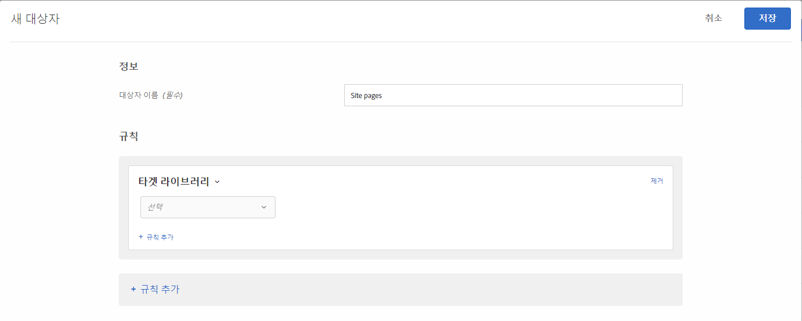

# 타겟 라이브러리{#target-library}

사전 빌드된 타깃팅 규칙을 기반으로 사용자를 타깃팅하십시오.

[타겟 라이브러리] 카테고리의 사전 빌드된 대상은 이전 대상으로서, 다른 카테고리에 있습니다. 자세한 내용 및 우수 사례에 대해서는 [타겟 및 대상 FAQ](/help/c-target/c-troubleshooting-targets-and-audiences/troubleshooting-targets-and-audiences.md#concept_C4EE4B8F4840430CBD798D579A8F208D).

1. [!DNL Target] 인터페이스에서 **[!UICONTROL 대상자]** > **[!UICONTROL 대상자 만들기]**&#x200B;를 클릭합니다.
1. 대상자의 이름을 지정합니다.
1. **[!UICONTROL 규칙 추가]** > **[!UICONTROL 타겟 라이브러리]**&#x200B;를 클릭합니다.

   

1. **[!UICONTROL 선택]**&#x200B;을 클릭한 다음, 사전 빌드된 타깃팅 규칙을 선택합니다.

   사전 빌드된 타깃팅 규칙에는 Windows 운영 체제, 태블릿 장치, Safari 브라우저, 재방문자, Google에서 참조 등이 포함됩니다.

   사용자 에이전트가 다음 문자열(일부는 장치 모델 번호임) 중 하나를 포함할 때 사전 정의된 대상 &quot;태블릿 장치&quot;는 이미 사용되고 있습니다. 이 장치들에 대한 사용자 지정 타깃팅 규칙은 만들 필요가 없습니다.

   Kindle, Silk, iPad, Sony Tablet, TF101, GT-P1000, GT-P1000R, GT-P1000M, SGH-T849, SHW-M180S, GT-I9000T, BNTV250 및 Tablet PC.

1. (선택 사항) **[!UICONTROL 규칙 추가]**&#x200B;를 클릭하고 대상에 대한 추가 규칙을 설정합니다.
1. **[!UICONTROL 저장]**&#x200B;을 클릭합니다.

## 교육 비디오: 대상 만들기

다음 비디오에는 대상 카테고리 사용에 대한 정보가 포함되어 있습니다.

* 대상자 만들기
* 대상 카테고리 정의

>[!VIDEO](https://video.tv.adobe.com/v/17392)
