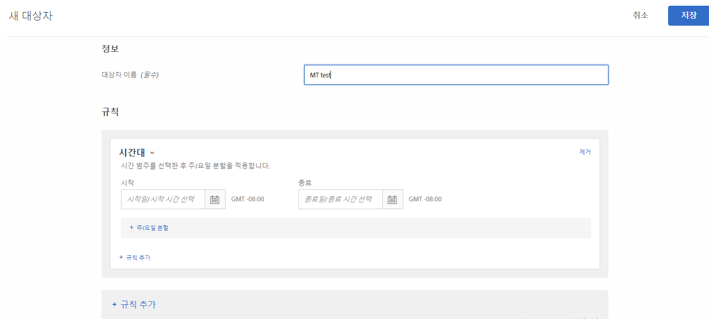
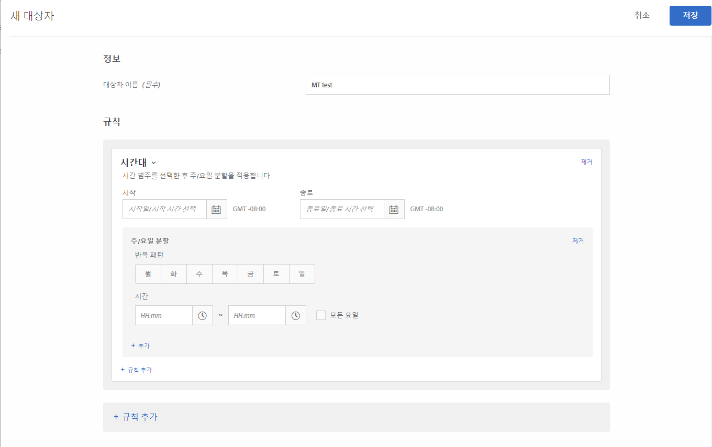

# 시간대{#time-frame}

특정 기간에 사이트를 방문하는 사용자를 타깃팅하는 시작/종료 날짜 및 시간을 추가할 수 있습니다. 또한 주/요일 분할 선택 사항을 설정하여 대상 타깃팅을 위한 반복 패턴을 만들 수도 있습니다.

예를 들어, [결합한 임시 대상 기능](../../../c-target/combining-multiple-audiences.md#concept_A7386F1EA4394BD2AB72399C225981E5)을 사용하는 경우 블랙 프라이데이 이전 3일 동안에 특정 콘텐츠에 돈을 덜 쓰는 대상과 블랙 프라이데이 이후에 다른 콘텐츠에 돈을 덜 쓰는 대상을 타깃팅할 수 있습니다.

1. [!DNL Target] 인터페이스에서 **[!UICONTROL 대상자]** > **[!UICONTROL 대상자 만들기]**&#x200B;를 클릭합니다.
1. 대상자의 이름을 지정합니다.
1. **[!UICONTROL 규칙 추가]** > **[!UICONTROL 시간대]**&#x200B;를 클릭합니다.

   

1. 대상의 시작 및 종료 날짜와 시간을 지정합니다.

   활동의 일정에 따라 타깃팅을 시작하려면 시작 날짜를 비워 두십시오. 활동의 종료 날짜 및 시간까지 계속 타깃팅하려면 종료 날짜를 비워 두십시오.

   시작 및 종료 날짜를 모두 비워 둘 수도 있습니다. 이렇게 하면 활동 수준에서 시작 및 종료 날짜를 제어하면서 여러 활동에서 동일한 대상(대상 복사본을 만들지 않고)을 사용할 수 있습니다.

   >[!NOTE]
   >
   >시작/종료일 시간대는 GMT +/- NN:NN 형식으로 표시되며, 여기서 NN:NN은 GMT로부터의 오프셋으로서, 방문자의 시간대가 아닌 계정 수준 시간대를 반영합니다. 예를 들어, 캘리포니아 시간대는 GMT -08:00로 표시됩니다.

1. (조건부) **[!UICONTROL 주/요일 분할]**&#x200B;을 클릭하여 요일 및 시간을 포함하여 반복 패턴을 설정합니다.

   

   예를 들어, 주/요일 분할 선택 사항을 사용하여 콜 센터가 근무하는 날 및 시간 동안에만 &quot;채팅 지금&quot; 선택 사항을 방문자에게 표시할 수도 있습니다.

   요일을 하나 이상 선택한 다음, 시작 및 종료 시간을 설정하십시오. 원하는 대로 추가적인 패턴을 지정하려면 **[!UICONTROL 추가]**&#x200B;를 클릭하십시오.

   >[!NOTE]
   >
   >[!UICONTROL 주/요일 분할] 시간대는 GMT +/- NN:NN 형식으로 표시되며, 여기서 NN:NN은 GMT로부터의 오프셋으로서, 방문자의 시간대가 아닌 계정 수준 시간대를 반영합니다. 예를 들어, 캘리포니아 시간대는 GMT -08:00로 표시됩니다.

1. (선택 사항) **[!UICONTROL 규칙 추가]**&#x200B;를 클릭하고 대상에 대한 추가 규칙을 설정합니다.

   필요한 경우, 각 규칙에 대해 5단계를 반복할 수 있습니다.

1. **[!UICONTROL 저장]**&#x200B;을 클릭합니다.

## 교육 비디오:대상 

다음 비디오에는 대상 카테고리 사용에 대한 정보가 포함되어 있습니다.

* 대상자 만들기
* 대상 카테고리 정의

>[!VIDEO](https://video.tv.adobe.com/v/17392)
