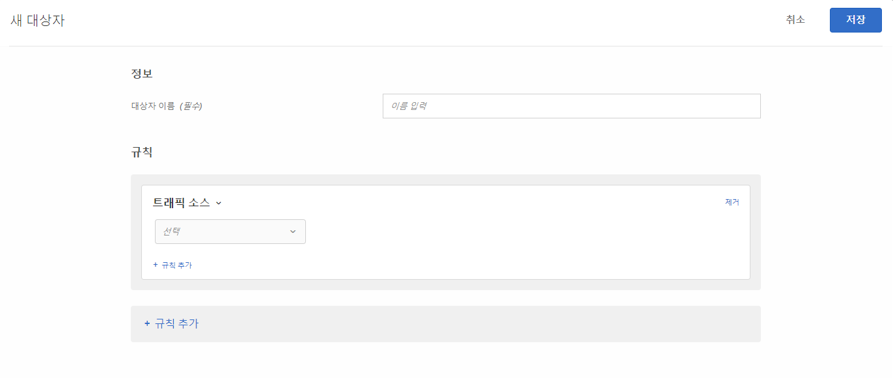

# 트래픽 소스

사이트를 안내하는 검색 엔진 또는 랜딩 페이지에 따라 방문자를 타깃팅할 대상을 만듭니다.

예를 들어 방문자의 브라우저, 검색 엔진 또는 참조 랜딩 페이지를 기반으로 타깃팅할 수 있습니다. 참조 랜딩 페이지는 이 세션에서 현재 사이트에 도달하기 위해 방문자가 클릭했던 페이지입니다. (예를 들어 방문자가 Google에서 광고를 클릭하여 `adobe.com` 홈페이지로 이동하는 경우 참조 랜딩 페이지는 `google.com`입니다.)

여러 트래픽 소스를 결합하여 복잡한 타깃팅 규칙을 만들 수 있습니다.

1. [!DNL Target] 인터페이스에서 **[!UICONTROL 대상자]** > **[!UICONTROL 대상자 만들기]**&#x200B;를 클릭합니다.
1. 대상자의 이름을 지정합니다.
1. **[!UICONTROL 규칙 추가]** > **[!UICONTROL 트래픽 소스]**&#x200B;를 클릭합니다.

   

1. **[!UICONTROL 선택]**&#x200B;을 클릭한 후, 다음 선택 사항 중 하나를 선택합니다.

   * Baidu에서
   * Bing에서
   * Google에서
   * Yahoo에서
   * 참조 랜딩 페이지: URL
   * 참조 랜딩 페이지: 도메인
   * 참조 랜딩 페이지: 쿼리

   선택한 항목에 따라 추가 정보(평가기 및/또는 값)를 제공해야 할 수 있습니다.

1. (선택 사항) **[!UICONTROL 규칙 추가]**&#x200B;를 클릭하고 대상에 대한 추가 규칙을 설정합니다.
1. **[!UICONTROL 저장]**&#x200B;을 클릭합니다.

특정 검색 엔진으로 또는 특정 랜딩 페이지에서 사이트를 참조하는 사용자를 타깃팅할 수 있습니다.

## 교육 비디오: 대상 만들기  

다음 비디오에는 대상 카테고리 사용에 대한 정보가 포함되어 있습니다.

* 대상자 만들기
* 대상 카테고리 정의

>[!VIDEO](https://video.tv.adobe.com/v/17392)
