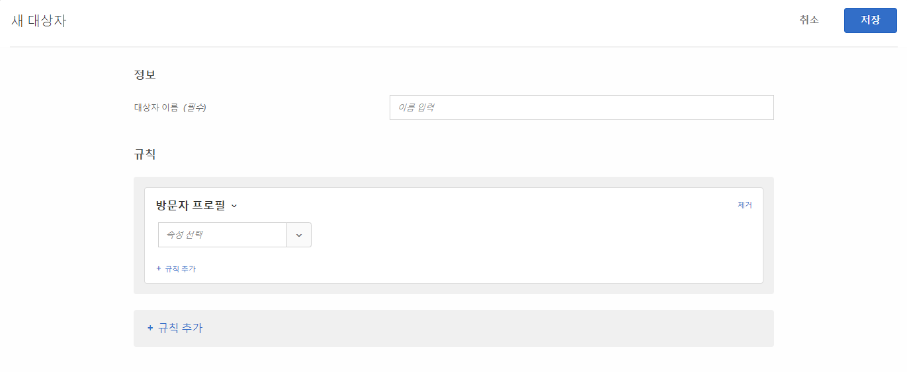

# 방문자 프로필

[!DNL Adobe Target]에서 특정 프로필 매개 변수를 충족하는 방문자를 타깃팅할 대상을 만듭니다.

1. [!DNL Target] 인터페이스에서 **[!UICONTROL 대상자]** > **[!UICONTROL 대상자 만들기]**&#x200B;를 클릭합니다.
1. 대상자의 이름을 지정하고 선택적 설명을 추가합니다.
1. **[!UICONTROL 방문자 프로필]**&#x200B;을 대상 빌더 창으로 끌어다 놓습니다.

1. **[!UICONTROL 선택]**&#x200B;을 클릭한 후, 다음 선택 사항 중 하나를 선택합니다.

   

   방문자 프로필 매개 변수는 mbox(프로필)를 통해 전달됩니다. 새 방문자 또는 재방문자를 대상으로 지정하거나 모든 사용자를 포함할 수 있습니다.

   * [!UICONTROL 새 방문자]
   * [!UICONTROL 재방문자]
   * [!UICONTROL 다른 테스트에 포함]
   * [!UICONTROL 다른 테스트에 없음]
   * [!UICONTROL 세션의 첫 페이지]
   * [!UICONTROL 세션의 첫 페이지 아님]
   * [!UICONTROL 범주 친화성]

   방문자 프로필은 새로운 `mboxPC`가 있는 각 mbox 호출의 로컬 엣지 메모리에 생성됩니다. 30분 동안 비활성화되면 프로필이 [!DNL Target] 데이터베이스에 저장되고 다른 엣지에서 액세스할 수 있습니다.

   사이트 방문자가 세션 중간에 로그인하고 `3rdpartyId`을 얻으면 `3rdPartyId`에 연결된 이전에 로드된 모든 프로필 속성을 즉시 사용할 수 있게 됩니다.

   사용자 지정 프로필 매개 변수와 `user.` 매개 변수를 타깃팅할 수 있습니다. 사용자 활동을 대상으로 지정하는 데 사용할 매개 변수를 선택합니다. 원하는 매개 변수가 표시되지 않으면 mbox에서 매개 변수를 실행하지 않았습니다.

1. (선택 사항) 대상에 대한 추가 규칙을 설정합니다.
1. **[!UICONTROL 완료를 클릭합니다]**.

## 교육 비디오: 대상 만들기 

다음 비디오에는 대상 카테고리 사용에 대한 정보가 포함되어 있습니다.

* 대상자 만들기
* 대상 카테고리 정의

>[!VIDEO](https://video.tv.adobe.com/v/17392)
