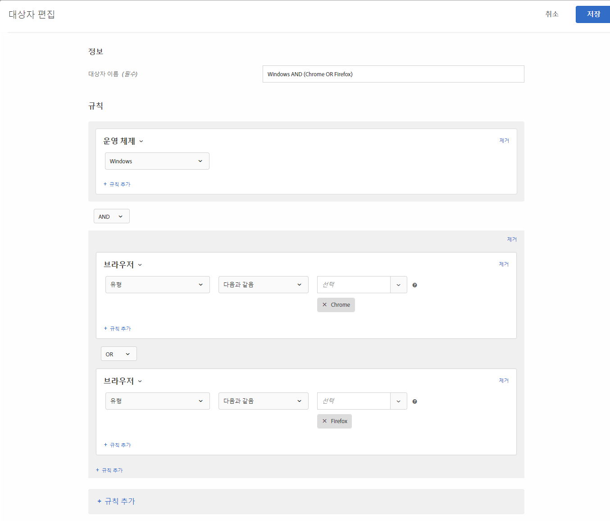
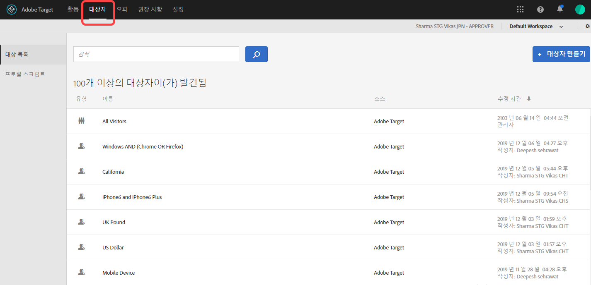
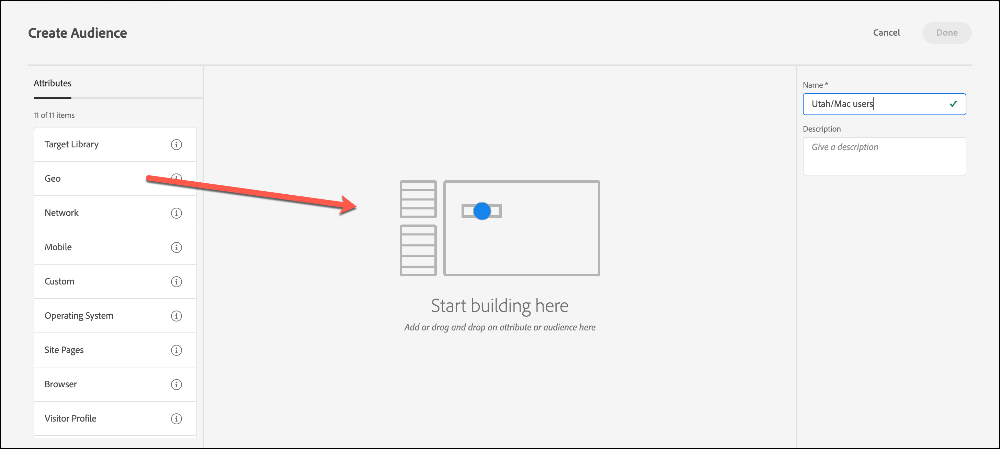

# [!DNL Target]에서 대상 작성

사용자 지정된 대상을 만들고 활동에 사용할 [!DNL Adobe Target] [!UICONTROL Audiences] 라이브러리에 저장할 수 있습니다. 기존 대상을 복사 한 다음 편집하여 유사한 대상을 만들고 여러 대상을 결합 할 수도 있습니다.

## 대상 개요

대상은 [!DNL Target] 활동에서 포함되거나 제외되는 사용자를 결정하는 규칙으로 정의됩니다. 대상 정의에는 여러 규칙이 포함될 수 있으며 각 규칙에는 여러 매개 변수가 포함될 수 있습니다. 복잡한 대상 정의는 부울 연산자 AND 및 OR로 규칙과 매개 변수를 결합하여 활동 참여자로 카운트되는 사이트 방문자를 보다 자세히 제어할 수 있습니다.

규칙이나 매개 변수를 AND와 결합할 때 잠재적 대상 구성원은 *모든* 정의된 조건을 충족해야 참여자로 포함할 수 있습니다. 예를 들어, OS 규칙 AND 브라우저 규칙을 정의하는 경우 정의된 OS *와* 정의된 브라우저 둘 다를 사용하는 방문자만 활동에 포함됩니다.

규칙 또는 매개 변수를 OR로 결합하면 잠재적인 모든 대상 멤버가 참여자로 포함되기 위해 정의된 조건 하나만 만족하면 됩니다. 예를 들어, OR로 연결된 여러 개의 모바일 규칙을 정의하는 경우 정의된 기준을 *하나라도* 충족하는 방문자가 활동에 포함됩니다.

두 부울 연산자를 혼합하여 복합 규칙을 만들 수 있지만 동일한 규칙 수준의 연산자가 일치해야 합니다. 사용자 인터페이스는 올바른 연산자를 자동으로 적용합니다.

예를 들어, 다음 규칙은 Windows 컴퓨터에서 Chrome *또는* Firefox를 사용하는 방문자를 타깃팅합니다.

>[!NOTE]
>
>모든 잠재적 대상 구성원을 제외하는 규칙을 작성하지 않도록 주의하십시오. 예를 들어 고객이 Chrome *과* Firefox를 동시에 사용하여 페이지를 방문할 수는 없습니다.

## 대상자 만들기

1. 위쪽 메뉴 막대에서 **[!UICONTROL 대상]**&#x200B;을 클릭합니다.

   

1. [!UICONTROL 대상] 목록에서 **[!UICONTROL 대상 만들기]**&#x200B;를 클릭합니다.

   또는

   기존 대상을 복사하려면 [!UICONTROL 대상] 목록에서 **[!UICONTROL 추가 작업]** 아이콘(줄임표 아이콘)을 클릭한 다음 **[!UICONTROL 복제]**&#x200B;를 클릭합니다. 그러면 대상을 편집하여 유사한 대상을 만들 수 있습니다.

1. 고유한 수사적 대상 이름과 선택적 설명을 입력합니다.
1. 대상 빌더 창 오른쪽의 **[!UICONTROL 속성]** 목록에서 원하는 속성을 드래그하여 놓습니다.

   

   각 규칙 유형에는 고유한 매개 변수가 있습니다. 각 유형의 대상 규칙을 구성하는 방법에 대한 자세한 내용은 [대상 카테고리](/help/c-target/c-audiences/c-target-rules/target-rules.md#concept_E3A77E42F1644503A829B5107B20880D)를 참조하십시오.

1. 규칙 매개 변수를 정의합니다.

   예를 들어 다음 대상은 Macintosh 운영 체제를 사용하여 Utah의 방문자를 타깃팅합니다.

   

1. (조건부) 원하는 속성을 계속 추가 및 정의합니다.

   다른 컨테이너를 만들려면 **[!UICONTROL 컨테이너 추가]**&#x200B;를 클릭하거나 다른 속성을 중간 프레임으로 드래그하십시오. 그런 다음 드롭다운 목록을 사용하여 연산자(AND 또는 OR)를 조정할 수 있습니다.

1. **[!UICONTROL 완료를 클릭합니다]**.

   새로 만든 대상이 몇 초 동안 처리가 지연된 후에 목록에 표시됩니다. 대상이 목록에 즉시 표시되지 않는 경우 대상을 검색하거나 목록을 새로 고치십시오.

## 교육 비디오: 대상 만들기 

이 비디오에는 대상을 만드는 방법에 대한 정보가 포함되어 있습니다.

* 대상자 만들기
* 대상 카테고리 정의

>[!VIDEO](https://video.tv.adobe.com/v/17392)
