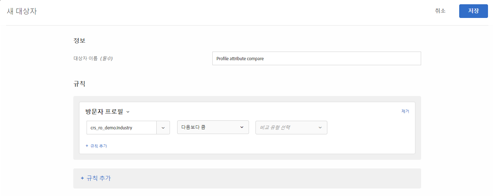
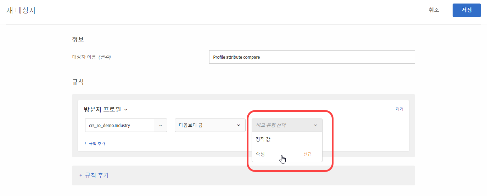
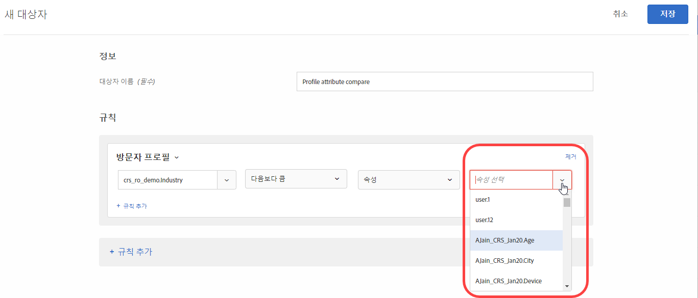

# 프로필 속성 비교 대상 만들기{#create-a-profile-attribute-comparison-audience}

타겟 [대상 라이브러리](/help/c-target/c-audiences/audiences.md)에 대한 두 프로필 속성 또는 [활동 전용 대상](/help/c-target/creating-activity-only-audience.md)의 두 프로필 속성을 비교할 대상을 정의합니다. 보다 큼, 보다 작음 또는 같음 등의 연산자를 사용하여 두 개 다른 프로필 속성 값을 동적으로 비교하는 대상을 정의합니다.

>[!NOTE]
>
>이 기능은 [방문자 프로필](/help/c-target/c-audiences/c-target-rules/visitor-profile.md#concept_E972690B9A4C4372A34229FA37EDA38E) 카테고리에 대해서만 사용할 수 있습니다.

## 개요 {#section_303CBC78194D49A2A004945D425441E1}

대상은 Target 활동에서 포함되거나 제외되는 사용자를 결정하는 규칙으로 정의됩니다. 대상 정의에는 여러 규칙이 포함될 수 있으며 각 규칙에는 여러 매개 변수가 포함될 수 있습니다. 포함된 규칙 중 하나가 방문자 프로필 카테고리를 사용하는 경우 방문자 프로필 속성의 특정 값을 기반으로 규칙을 정의하거나 해당 속성의 값을 다른 방문자 프로필 속성에 비교할 수 있습니다.

예를 들어, 가구 회사에서 근무하고 두 고객 성향 점수를 Target에 업로드했다고 가정해 보겠습니다.

* 향후 90일 이내에 부엌 가구를 구입할 가능성
* 향후 90일 이내에 거실 가구를 구입할 가능성

부엌 가구를 구입할 경향이 거실 가구를 구입할 경향보다 크다고 정의된 대상을 생성할 수 있습니다. 그러면 Target이 특정 방문자에 대한 부엌 성향과 거실 성향 점수를 동적으로 비교하여 해당 방문자가 이 대상에 적합한지 확인합니다.

자세한 내용은 [데이터를 Target으로 가져오는 방법](/help/c-implementing-target/c-considerations-before-you-implement-target/c-methods-to-get-data-into-target/methods-to-get-data-into-target.md#concept_0069C0EFB56C4700BB33F2F35C2B9B17)을 참조하십시오.

## 프로필 속성 비교 대상 만들기 {#section_7A62FD47D5C74C3EBC3417ACDBB85013}

1. **[!UICONTROL 대상]** > **[!UICONTROL 대상 만들기]** > **[!UICONTROL 규칙 추가]** > **[!UICONTROL 방문자 프로필]**&#x200B;을 클릭합니다.
1. **[!UICONTROL 방문자 프로필]** 드롭다운 목록에서 속성을 선택합니다.

   

1. 평가기를 선택합니다.

   

1. **[!UICONTROL 비교 유형 선택]** 드롭다운 목록에서 **[!UICONTROL 속성]**&#x200B;을 선택합니다.

   &quot;정적 값&quot; 비교 유형을 사용하면 방문자 프로필 속성을 특정 값과 비교할 수 있습니다.

   

   >[!NOTE]
   >
   >1단계의 기본 방문자 프로필 카테고리 중 하나를 사용하는 경우(예: 새 방문자 또는 재방문자) 정적 값 선택 사항만 선택할 수 있습니다. 동적 비교 옵션은 기본 카테고리에 사용할 수 없습니다. 동적 비교 옵션을 사용할 수 없는 다른 예로는 &quot;세션의 첫 페이지&quot;, &quot;다른 테스트에 없음&quot;, &quot;세션의 첫 페이지 아님&quot;, &quot;카테고리 친화성&quot;이 있습니다.

1. 초기 속성과 비교할 추가 속성을 선택합니다.

   

## 교육 비디오  {#section_3BB8DBF3418F4520B3E274B6F40AF8F3}

이 기능을 사용할 수 있는 시나리오 및 자세한 내용은 비디오를 참조하십시오.

>[!VIDEO](https://video.tv.adobe.com/v/23218/)