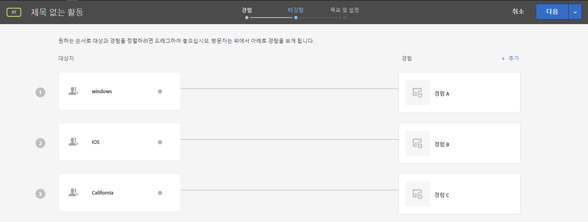

# Target 및 대상 FAQ{#targets-and-audiences-faq}

경험 타깃팅 및 대상에 대한 FAQ 목록

## 대상을 작성할 때 Target 라이브러리 아래의 사전 작성 대상이 다른 범주 아래에 표시되는 이유는 무엇입니까? {#section_9EBF5B0F9DF94168A15B92B905CCF7E0}

[타겟 라이브러리] 카테고리의 사전 빌드된 대상은 이전 대상으로서, 다른 카테고리에 있습니다. 일례로, 이전 [타겟 라이브러리] &gt; [새 방문자 수] 대상에는 이에 대응하는 업데이트된 상대([방문자 프로필] &gt; [새 방문자])가 있습니다.

성과가 개선되었으므로 최신 대상을 사용하는 것이 좋습니다(우수 사례). 일부 고객이 이전의 사전 빌드된 대상을 사용 중일 수 있으므로 이러한 대상을 Target 인터페이스에서 제거하지 않았습니다.

## 트래픽이 대상 간에 분할되는 방식을 어떻게 알 수 있습니까? {#section_067EEFB956E7465CBF77EC86834470AB}

기본적으로 트래픽은 경험 간에 균등하게 분할됩니다. 그러나 각 경험에 대해 백분율 타겟을 지정할 수도 있습니다. 이런 경우, 무작위 숫자가 생성되고 이 숫자를 사용하여 표시할 경험이 선택됩니다. 결과로 얻은 비율은 지정한 타겟과 정확하게 일치하지 않을 수도 있지만 더 많은 트래픽이 일어나면 경험이 타겟 목표에 더 가깝게 분할되어야 한다는 것을 의미합니다.

## 사용자가 여러 개의 적절한 대상이 있는 여러 경험을 포함하는 활동에 적합한 경우 어느 경험이 표시됩니까? {#section_94A60B11212D48FD8AB0803C6C7E7253}

사용자는 활동의 [!UICONTROL 타겟] 페이지에 표시되는 첫 번째 경험/대상에 대한 자격이 있습니다.

예를 들어 다음 그림에서 Windows 장치를 사용하는 캘리포니아 사용자는 경험 A(Windows 대상)와 경험 C(캘리포니아 대상) 모두에 대한 자격이 있습니다. [타겟] 페이지의 목록에서 경험 A가 경험 C의 위에 표시되므로 이 사용자에게는 경험 A가 표시됩니다.

## Target, Adobe Audience Manager(AAM) 및 핵심 서비스의 대상 라이브러리에 있는 동일한 대상의 이름이 서로 다른 이유는 무엇입니까? {#section_F67E61A607B6444C8DAA4F99C3E95AED}

대상의 대상자 이름은 [!DNL Target] 고유합니다. 하지만 In [!DNL AAM] 및 In [!DNL Audience Library]는 여러 대상자에 대해 동일한 이름을 가질 수 있습니다 (서로 다른 폴더에 있을 경우). 에서는 [!DNL Target][!DNL AAM] OR [!DNL Audience Library] 대상과 일치하는 대상 이름이 있을 때 이름에 &quot; # &lt; number &gt;&quot; [!DNL Target] 를 추가합니다.

예를 들어, &quot;PC 사용자&quot;([!DNL AAM]에서)와 &quot;PC 사용자 #1&quot;([!DNL Target]에서)이라는 대상이 표시될 수 있습니다.

## 대상의 이름을 바꿀 수 없는 이유는 무엇입니까? {#section_54E420556F534D20836E261E253D8B97}

일부 Target 대상은 &quot;새 방문자&quot; 및 &quot;재방문자&quot;와 같이 사전에 정의되어 있습니다. 이렇게 사전 정의된 대상은 사용자가 이름을 바꿀 수 없습니다.

## 일부 프로필 매개 변수가 Target 사용자 인터페이스에 표시되지 않는 이유는 무엇입니까? {#section_3CD947D15C984EE9AD19550220E0E8BD}

[!DNL Target]의 mbox 호출당 고유한 프로필 속성 제한은 50개입니다. [!DNL Target]에 50개가 넘는 프로필 속성을 전달해야 하는 경우 [!UICONTROL 프로필 업데이트] API 방법을 사용하여 전달할 수 있습니다. 자세한 내용은 Adobe Target API 설명서의 [프로필 업데이트](https://developers.adobetarget.com/api/#authentication-tokens)를 참조하십시오.

## 방문자에게 표시되지 않아야 하는 AP 활동에 대한 경험이 방문자에게 표시되는 이유는 무엇입니까? {#section_41CECEAE0881446A8D9F3B016857914B}

자동화된 개인화 활동은 세션당 한 번씩 평가됩니다. 특정 경험에 적합한 활성 세션이 있고 이제 여기에 새 오퍼가 추가되었다면, 사용자는 이전에 표시된 오퍼와 함께 새 컨텐츠를 보게 됩니다. 이 사용자는 이전에 이 경험에 대해 자격이 있었으므로 세션 지속 기간 동안 계속 해당 경험을 보게 됩니다. 모든 단일 페이지 방문에서 이 경험을 평가하려는 경우에는 경험 타깃팅(XT) 활동 유형으로 변경해야 합니다.

## API를 통해 생성된 대상의 변경 사항이 Target UI에 반영되지 않는 이유는 무엇입니까? {#section_6BEB237CAC004A06A290F9644E5BF0FB}

오퍼 및 프로필 스크립트와 달리 Target Standard를 통해 작성된 대상에 대해 API에서 변경한 사항은 현재 Target UI에 다시 동기화되지 않습니다.

## 숫자를 나타내는 문자열(부동 소수점 숫자도 지원됨)은 숫자로 비교됩니다.{#strings-that-represent-numbers}

&quot;같음&quot;(equals) 표현식의 왼쪽 부분과 오른쪽 부분을 숫자로 구문 분석할 수 있는 경우 두 부분은 문자열이 아닌 숫자로서 비교됩니다.

예:

| 값 | 타깃팅 기준 | 결과 |
| --- | --- | --- |
| 1.0 | equals 1 | true |
| 1 | equalsIgnoreCase 1.0 | true |
| 1.230 | equals 1 | true |
| 1.500 | equals 1.5 | true |
| 1.200 | is less than 2 | true |
| 2 | is greater than 3.0 | false |
| 045 | equals 45 | true |

과학적 표기법으로 작성된 숫자는 항상 문자열로 비교됩니다.

예:

&quot;4e-2&quot;는 &quot;4e-2&quot;와만 같습니다. &quot;0.04&quot;와는 같지 *않습니다*.