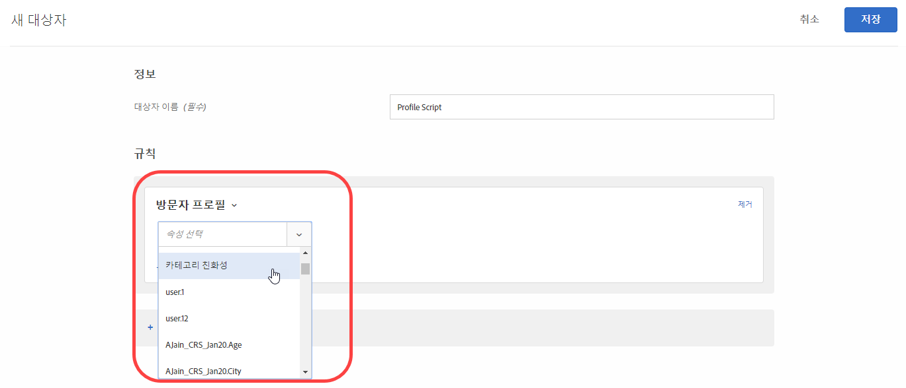

# 카테고리 친화성{#category-affinity}

카테고리 친화성 기능을 사용하여 자동으로 사용자가 방문하는 카테고리를 캡처하고 카테고리에 대한 사용자의 친화성을 계산하여 카테고리를 타깃팅하고 세그먼트화할 수 있습니다. 이 기능은 해당 정보에 대해 행동할 가능성이 가장 큰 방문자를 타겟으로 콘텐츠를 지정합니다.

## Target에 카테고리 친화성 정보 전달 {#section_B0C8E46EEBAC4549AD90352A47787D04}

사용자가 사이트를 방문할 때마다 방문자와 관련된 프로필 매개 변수가 [!DNL Target]의 데이터베이스에 기록됩니다. 이 데이터는 사용자의 쿠키에 연결되어 있습니다. 특히 유용한 한 가지 매개 변수는 `user.categoryId`로, 제품 페이지에서 지정된 mbox 매개 변수입니다. 방문자가 계속 탐색하거나 다른 세션을 위해 재방문할 때 특정 사용자가 보는 제품 카테고리를 기록할 수 있습니다. 또한 임의의 mbox(중첩된 mbox 포함)에서 mbox 매개 변수 `user.categoryId`나 URL 매개 변수 `user.categoryId`로서 또는 글로벌 mbox를 사용하는 Target 페이지 매개 변수로 카테고리 정보를 전달하여 카테고리 정보를 기록할 수도 있습니다. 자세한 내용은 계정 담당자에게 문의하십시오.

여러 카테고리의 항목을 포함하려면 쉼표로 카테고리를 구분합니다. 예:

* `user.categoryId=clothing,shoes,nike,running,nike clothing,nike shoes,nike running shoes`

제품 카테고리에 대한 방문 빈도 및 최근성에 따라 사용자가 보유한 카테고리 친화성(있는 경우)이 기록됩니다. 카테고리 친화성을 사용하여 활동을 위한 모집단을 타깃팅할 수 있습니다.

프로필 스크립트에서 `user.categoryAffinities[]`를 사용하여 방문자가 채운 다수의 관심 사항을 반환할 수 있습니다.

>[!IMPORTANT]
>
>Adobe Target의 카테고리 친화성 알고리즘에 사용되는 `user.categoryId` 속성은 Adobe Target 권장 사항의 제품 및 콘텐츠 권장 사항에 사용되는 `entity.categoryId` 속성과 구별됩니다. `user.categoryId`는 사용자의 즐겨찾기 카테고리를 추적하는 데 필요합니다. `entity.categoryId`는 현재 페이지의 카테고리 또는 현재 항목의 카테고리에 대한 권장 사항을 기반으로 해야 합니다. 두 기능을 모두 사용하려면 두 값을 Adobe Target에 전달합니다.

## 카테고리 친화성에 대한 비즈니스 사례 {#section_D6FF913E88E6486B8FBCE117CA8B253B}

가장 자주 보는 카테고리와 같은 한 세션에서 수행되는 방문자 활동을 이후 방문의 타깃팅에 사용할 수 있습니다. 세션 중에 방문자가 보는 각 카테고리 페이지는 캡처되며, 최근 및 빈도 모델에 따라 &quot;즐겨찾기&quot; 카테고리가 계산됩니다. 그런 후에 방문자가 홈 페이지로 돌아올 때마다 사용자의 즐겨찾기 카테고리와 관련된 콘텐츠를 표시하도록 주인공 이미지 영역을 타깃팅할 수 있습니다.

## 카테고리 친화성 사용의 예 {#section_A4AC0CA550924CB4875F4F4047554C18}

온라인으로 악기를 판매하며 과거에 기타에 대한 관심을 표시한 방문자로 베이스 기타 판촉 활동을 타깃팅한다고 가정해 보십시오. 카테고리 친화성을 사용하여 이 카테고리 관련성이 있는 방문자에게만 표시되는 오퍼를 만들 수 있습니다.

## 카테고리 친화성 알고리즘 {#section_8B86C7FF50294208866ABF16F07D5EB9}

카테고리 친화성 알고리즘은 다음과 같이 작동합니다.

* 첫 번째로 본 카테고리에 대해 10포인트
* 처음 다음 클릭한 각 카테고리에 대해 5포인트
* 새 카테고리를 클릭하면 이전에 클릭한 모든 카테고리에서 1을 빼게 됩니다.
* 카테고리를 이미 클릭한 경우(표시됨)에는 다시 클릭해도 다른 모든 카테고리에서 1을 빼지 않습니다.
* 여섯 번째 새 카테고리를 클릭하면, 처음 5개 카테고리 중 점수가 가장 낮은 카테고리가 계산에서 삭제됩니다.
* 세션 끝에서 모든 값을 2로 나누기

### 예: 카테고리 친화성 알고리즘

예를 들어 `mens-clothing` 카테고리를 본 다음 세션에서 `accessories`, `jewelry`, `accessories`를 다시 볼 경우 관심도는 다음과 같습니다.

* `accessories`: 9 (+5 – 1 + 5)

* `mens-clothing`: 8 (+10 – 1 – 1)

* `jewelry`: 5 (+5)

세션이 끝나고 사용자가 나중에 사이트로 돌아오면 점수가 절반으로 줄어듭니다.

* `accessories`: 4.5 (9/2)

* `mens-clothing`: 4 (8/2)

* `jewelry`: 2.5 (5/2)

사용자를 가정하고 `jewelry`, `accessories`, `beauty`, `shoes` 및 `womens-clothing` 순서로 봅니다.

* `accessories`: 6.5 (4.5 + 5 – 1 – 1 - 1)

* `womens-clothing`: 5 (+5)

* `jewelry`: 4.5 (2.5 + 5 – 1 – 1 - 1)

* `shoes`: 4 (+5 – 1)

* `beauty`: 3 (+5 – 1 - 1)

* 점수가 1인 최저 점수의 카테고리(4 - 1 - 1 - 1)로 `womens-clothing`을 마지막 클릭하면 `mens-clothing`이 삭제됩니다.

세션이 끝나고 사용자가 나중에 사이트로 돌아오면 점수가 절반으로 줄어듭니다.

* `accessories`: 3.3 (6.5/2)

* `womens-clothing`: 2.5 (5/2)

* `jewelry`: 2.3 (4.5/2)

* `shoes`: 2 (4/2)

* `beauty`: 1.5 (3/2)

## 타깃팅에 카테고리 친화성 사용 {#concept_5750C9E6C97A40F8B062A5C16F2B5FFC}

활동에서 타깃팅에 [!UICONTROL 카테고리 친화성] 대상을 사용하는 데 도움이 되는 정보입니다.

이 섹션에는 다음 정보가 포함됩니다.

* [카테고리 친화성을 사용할 대상 만들기](/help/c-target/c-visitor-profile/category-affinity.md#section_A27C600BBA664FE7A74F8FE076B78F40)
* [활동에서 카테고리 친화성 대상 사용](/help/c-target/c-visitor-profile/category-affinity.md#section_91526B942D1B4AEBB8FCDF4EBFF931CF)

## 카테고리 친화성을 사용할 대상 만들기 {#section_A27C600BBA664FE7A74F8FE076B78F40}

1. **[!UICONTROL 대상]** 목록에서 **[!UICONTROL + 대상 만들기]**&#x200B;를 클릭합니다.

   또는

   기존 대상을 복사하려면 대상자 목록에서 원하는 대상으로 마우스를 가져간 다음 복사 아이콘을 클릭합니다. 그러면 대상을 편집하여 유사한 대상을 만들 수 있습니다.

1. 수사적 대상 이름을 입력합니다.
1. **[!UICONTROL + 규칙 추가]** > **[!UICONTROL 방문자 프로필]**&#x200B;을 클릭합니다.
1. **[!UICONTROL 방문자 프로필]** 드롭다운 목록에서 **[!UICONTROL 카테고리 친화성]**&#x200B;을 선택합니다.

   

1. 원하는 카테고리를 선택합니다.

   

   카테고리는 다음과 같습니다.

   * 즐겨찾는 카테고리
   * 첫 번째 카테고리
   * 두 번째 카테고리
   * 세 번째 카테고리
   * 네 번째 카테고리
   * 다섯 번째 카테고리

   &quot;즐겨찾기 카테고리&quot; 및 &quot;첫 번째 카테고리&quot; 옵션은 동일합니다.

1. 평가기를 선택합니다.

   * 다음 포함(대/소문자 구분 안 함)
   * 다음을 포함하지 않음(대/소문자 구분 안 함)
   * 다음과 같음

1. 각각의 새 값을 별도의 행에 지정합니다(예: &quot;신발&quot;).
1. **[!UICONTROL 저장]**&#x200B;을 클릭합니다.

## 활동에서 카테고리 친화성 대상 사용 {#section_91526B942D1B4AEBB8FCDF4EBFF931CF}

모든 활동에서 카테고리 친화성 대상을 사용할 수 있습니다. 3단계 안내가 있는 워크플로우 동안 Target 단계에서 원하는 대상을 선택하십시오.
