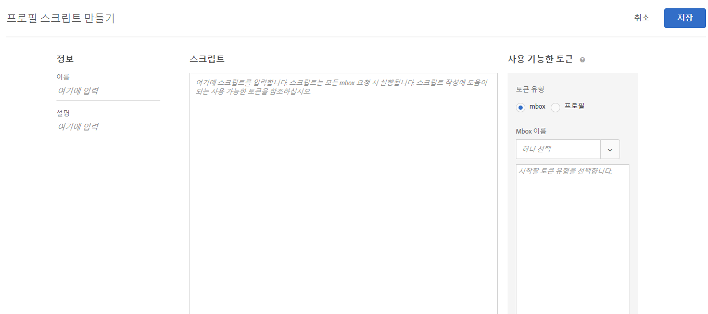
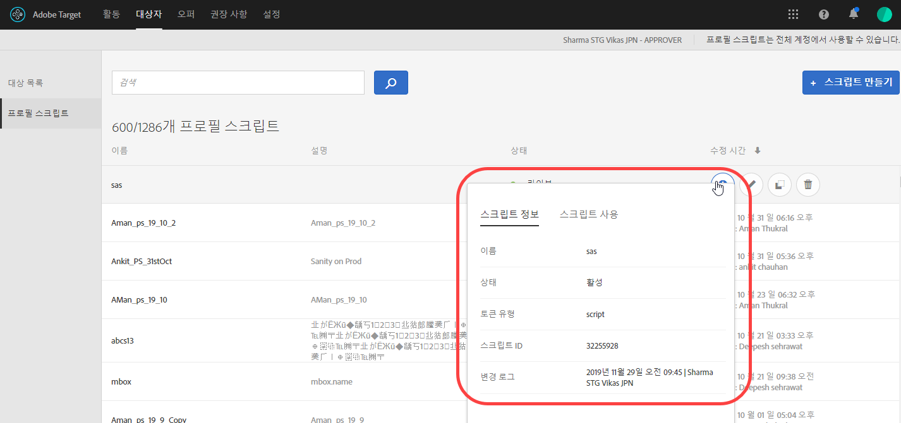
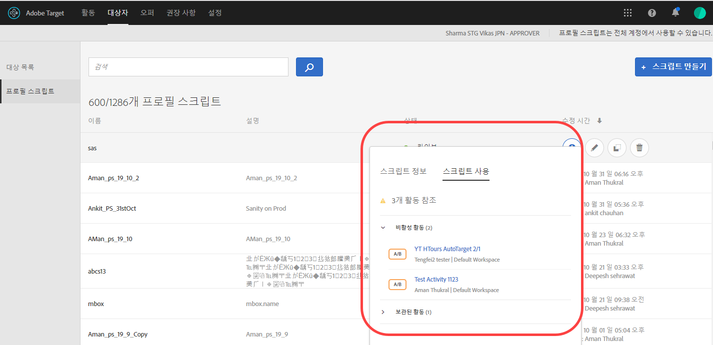
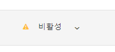

# 프로필 속성{#profile-attributes}

프로필 속성은 방문자와 관련된 매개 변수입니다. 이러한 속성은 방문자의 프로필에 저장되어 활동에 사용할 수 있는 방문자에 대한 정보를 제공합니다.

방문자가 웹 사이트를 찾아보거나 방문자가 다른 세션을 위해 돌아오면 저장된 프로필 속성을 사용하여 세그먼트 필터링을 위한 컨텐츠 또는 로그 정보를 타깃팅할 수 있습니다.

프로필 속성을 설정하려면 **[!UICONTROL 대상]** &gt; **[!UICONTROL 프로필 스크립트]** 를 클릭하십시오.


다음 유형의 프로필 속성을 사용할 수 있습니다.

| 매개 변수 유형 | 설명 |
|--- |--- |
| Mbox | mbox를 만들 때 페이지 코드를 통해 직접 전달됩니다. 활동에서 지리 기반의 타깃팅을 사용하는 방법에 대한 자세한 내용은 [글로벌 mbox에 매개 변수 전달](/help/c-implementing-target/c-implementing-target-for-client-side-web/t-mbox-download/c-understanding-global-mbox/pass-parameters-to-global-mbox.md)을 참조하십시오.<br>**** 참고: Target의 mbox 호출당 고유한 프로필 속성 제한은 50개입니다. Target에 50개가 넘는 프로필 속성을 전달해야 하는 경우 프로필 업데이트 API 방법을 사용하여 전달할 수 있습니다. 자세한 내용은 Adobe Target API 설명서의 [프로필 업데이트를 참조하십시오](http://developers.adobetarget.com/api/#updating-profiles). |
| 스크립트 | JavaScript 코드 조각으로 바로 정의됩니다. 이러한 스크립트는 소비자가 지출한 총 금액과 같은 누계를 저장할 수 있으며 각 mbox 요청 시 실행됩니다. 활동에서 지리 기반의 타깃팅을 사용하는 방법에 대한 자세한 내용은 아래의 &quot;프로필 스크립트 속성&quot;을 참조하십시오. |

## 프로필 스크립트 속성 {#concept_8C07AEAB0A144FECA8B4FEB091AED4D2}

연결된 JavaScript 코드 조각으로 프로필 스크립트 속성을 정의합니다.

프로필 스크립트를 사용하여 여러 방문에서 방문자 속성을 캡처할 수 있습니다. 프로필 스크립트는 서버 측 JavaScript의 한 형태를 사용하여 Target 내에 정의된 코드 조각입니다. 예를 들어 프로필 스크립트를 사용하여 방문자가 사이트를 방문하는 빈도와 마지막으로 방문한 시기를 캡처할 수 있습니다.

프로필 스크립트가 프로필 매개 변수와는 같지 않습니다. 프로필 매개 변수는 Target의 mbox 코드 구현을 사용하여 방문자에 대한 정보를 캡처합니다.

>[!NOTE]
>
>[!DNL Target]에는 계정당 프로필 스크립트가 1,000개로 제한됩니다.

## 프로필 스크립트 만들기 {#section_CB02F8B97CAF407DA84F7591A7504810}

프로필 스크립트는 [!UICONTROL  인터페이스의 ]대상자[!DNL Target] 탭에서 사용할 수 있습니다.

새 프로필 스크립트를 추가하려면 **[!UICONTROL 프로필 스크립트]** 탭과 **[!UICONTROL 스크립트 만들기]** 를 클릭한 다음 스크립트를 작성합니다.

또는

기존 프로필 스크립트를 복사하려면 [!UICONTROL 프로필 스크립트] 목록에서 원하는 스크립트를 마우스로 가리킨 다음, **[!UICONTROL 복사]** 아이콘(assets/icon_copy.png)을 클릭하십시오.

그러면 대상을 편집하여 유사한 대상을 만들 수 있습니다.



프로필 스크립트는 각 위치 요청에서 프로필 속성 &quot;catchers&quot;를 실행합니다. 위치 요청이 수신되면, Target은 실행해야 할 활동을 결정하고 해당 활동과 해당 경험에 적절한 컨텐츠를 표시하며 활동의 성공을 추적하고 모든 적절한 프로필 스크립트를 실행합니다. 이렇게 하면 방문자의 위치, 시각, 방문자가 사이트에 있었던 횟수, 전에 구입한 적이 있었는지 여부 등과 같은 방문에 대한 정보를 추적할 수 있습니다. 그런 다음 이러한 정보가 방문자의 프로필에 추가되므로 방문자의 사이트 활동을 더 잘 추적할 수 있습니다.

프로필 스크립트 속성은 속성 이름 앞에 `user.` 태그가 삽입되어 있습니다. 예:

```
if (mbox.name == 'Track_Interest') { 
    if (profile.get('model') == "A5" &&; profile.get('subcat') == "KS6") { 
        return (user.get('A5KS6') || 0) + 1; 
    } 
}
```

* `user.get('parameterName')`&#39;)을 사용하여 코드에서 프로필 스크립트 속성(자신 포함)을 참조하십시오.
* `user.setLocal('variable_name', 'value')`&#39;)을 사용하여 다음 mbox 요청에서 스크립트가 다음에 실행될 때 액세스할 수 있는 변수를 저장합니다. `user.getLocal('variable_name')`을 사용하여 변수를 참조합니다. 마지막 요청의 날짜와 시간을 참조하려는 경우에 유용합니다.
* 매개 변수와 값은 대/소문자를 구분합니다. 활동 또는 테스트 중에 받게 될 매개 변수 및 값의 대/소문자를 일치시킵니다.
* 자세한 JavaScript 구문에 대해서는 아래의 &quot;스크립트 프로필 매개 변수에 대해 JavaScript 참조&quot; 섹션을 참조하십시오.

## 프로필 스크립트 정보 카드 보기 {#section_18EA3B919A8E49BBB09AA9215E1E3F17}

오퍼 정보 카드와 유사한 프로필 스크립트 정보 팝업 카드를 볼 수 있습니다. 이러한 프로필 스크립트 정보 카드를 사용하면 선택한 프로필 스크립트를 참조하는 활동 목록과 함께 다른 유용한 메타데이터를 볼 수 있습니다.

예를 들어, 다음 프로필 스크립트 정보 카드는 프로필 스크립트 목록(대상 &gt; 프로필 스크립트)의 프로필 스크립트를 마우스로 가리키고 정보 아이콘을 클릭하면 액세스할 수 있습니다.

[!UICONTROL 스크립트 정보] 탭에는 이름, 상태, 토큰 유형, 스크립트 ID, 변경 로그 및 설명이 있습니다.



[!UICONTROL 스크립트 사용] 탭에는 선택한 프로필 스크립트를 참조하는 활동(및 해당 작업 공간)이 나열됩니다.



>[!Note]
>
>스크립트 사용 탭에는 다음 상황에서 선택한 프로필 스크립트를 참조하는 활동이 표시되지 않습니다.
> * 활동이 초안 상태입니다.
> * 활동에 사용된 컨텐츠 또는 오퍼가 스크립트 변수(활동 내의 인라인 오퍼 또는 오퍼 라이브러리 내의 오퍼)를 사용합니다.


## Target이 프로필 스크립트를 비활성화하는 특정 상황 {#section_C0FCB702E60D4576AD1174D39FBBE1A7}

프로필 스크립트가 실행하는 데 너무 오래 걸리거나 너무 많은 명령어를 포함하고 있는 경우와 같은 특정 상황에서 [!DNL Target]은 프로필 스크립트를 자동으로 비활성화하게 됩니다.

프로필 스크립트를 비활성화하는 경우, 아래 그림과 같이 Target UI의 프로필 스크립트 옆에 노란색 경고 아이콘이 표시됩니다.



마우스로 가리키면 아래 그램과 같이 오류에 대한 세부 사항이 표시됩니다.


시스템이 프로필 스크립트를 비활성화하는 일반적인 이유는 다음과 같습니다.

* 정의되지 않은 변수가 참조되었습니다.
* 올바르지 않은 값이 참조되었습니다. 적절한 유효성 검사를 수행하지 않고 URL 값 및 기타 사용자가 입력한 데이터를 참조할 때 이런 일이 종종 발생합니다.
* 너무 많은 JavaScript 명령어가 사용되었습니다. Target에서는 스크립트당 JavaScript 명령어 개수를 2,000개로 제한하지만 JavaScript를 수동으로 읽어서는 이것을 간단히 계산할 수 없습니다. 예를 들어 Rhino는 모든 함수 호출 및 &quot;새로운&quot; 호출을 100개의 명령어로 처리합니다. 또한 URL 값과 같은 임의 항목 데이터의 크기는 명령어 개수에 영향을 줄 수 있습니다.
* 아래의 [우수 사례](../../c-target/c-visitor-profile/profile-parameters.md#section_64AFE5D2B0C8408A912FC2A832B3AAE0) 섹션에서 강조 표시된 항목을 따르지 않습니다.

## 우수 사례 {#section_64AFE5D2B0C8408A912FC2A832B3AAE0}

다음 지침은 시스템 스크립트 중지를 강제하지 않고 스크립트가 처리되도록 정상적으로 실패하는 코드를 작성하여 가능한 한 오류 실패가 없는 간소화된 프로필 스크립트를 작성하기 위한 것입니다. 이러한 지침은 효율적으로 실행되는 것으로 입증된 우수 사례의 결과이며, Rhino 개발 커뮤니티에서 작성된 원칙 및 권장 사항과 함께 적용됩니다.

* 사용자 스크립트에서 현재 스크립트 값을 로컬 변수로 설정하고 장애 조치를 빈 문자열로 설정합니다.
* 빈 문자열이 아니도록 하여 로컬 변수의 유효성을 확인합니다.
* 문자열 기반 조작 함수와 정규 표현식을 비교 사용합니다.
* 제한된 for 루프와 개방된 for 또는 while 루프를 비교 사용합니다.
* 1,300자 또는 50개 루프 반복을 초과하지 않도록 합니다.
* JavaScript 명령어 2,000개를 초과하지 않도록 합니다. Target에서는 스크립트당 JavaScript 명령어 개수를 2,000개로 제한하지만 JavaScript를 수동으로 읽어서는 이것을 간단히 계산할 수 없습니다. 예를 들어 Rhino는 모든 함수 호출 및 &quot;새로운&quot; 호출을 100개의 명령어로 처리합니다. 또한 URL 값과 같은 임의 항목 데이터의 크기는 명령어 개수에 영향을 줄 수 있습니다.
* 스크립트 성능뿐만 아니라 모든 스크립트를 결합한 성능에 주의하십시오. 우수 사례로, 총 5,000개 미만의 지침을 사용하는 것이 좋습니다. 지침 수를 계산하는 것이 명확하지 않지만, 중요한 것은 2KB를 초과하는 스크립트가 자동으로 비활성화된다는 점입니다. 실행할 수 있는 스크립트의 수에 대한 제한이 설정되어 있지 않지만, 각 스크립트는 단일 mbox가 호출될 때마다 실행됩니다. 필요만 만큼만 스크립트를 실행합니다.
* 모두 실패하는 경우 try/catch에 스크립트를 래핑합니다.
* 자세한 내용은 JS Rhino 엔진 설명서를 참조하십시오. [https://www.mozilla.org/rhino/doc.html](https://www.mozilla.org/rhino/doc.html).

## 함께 수행할 수 없는 활동을 테스트하는 프로필 스크립트 {#section_FEFE50ACA6694DE7BF1893F2EFA96C01}

프로필 속성을 사용하여 두 개 이상의 활동을 비교하되 동일한 방문자가 각 활동에 참여하지 못하도록 하는 테스트를 설정할 수 있습니다.

상호 배타적인 활동 테스트에서는 한 활동의 방문자가 다른 활동에 대한 테스트 결과에 영향을 주지 않습니다. 방문자가 여러 활동에 참여하는 경우 양수 또는 음수 리프트가 방문자의 한 활동 경험에서 발생했는지 여부 또는 여러 활동 간의 상호 작용이 하나 이상의 활동 결과에 영향을 주었는지 여부를 확인하기 어려울 수 있습니다.

예를 들어 전자 상거래 시스템의 두 영역을 테스트할 수 있습니다. 장바구니에 추가 단추를 파란색이 아니라 빨간색으로 만들어 테스트하고 싶을 수 있습니다. 단계 수를 5개에서 2개로 줄이는 새로운 체크아웃 프로세스를 테스트할 수도 있습니다. 두 활동에 동일한 성공 이벤트(완료된 구입)가 있는 경우 빨간색 단추가 전환을 향상시키는지 여부 또는 향상된 체크아웃 프로세스로 인해 이러한 동일한 전환도 증가했는지 여부를 확인하기 어려울 수 있습니다. 테스트를 상호 배타적인 활동으로 구분하면 각 변경을 독립적으로 테스트할 수 있습니다.

다음 프로필 스크립트 중 하나를 사용할 때 다음 정보를 유념하십시오.

* 프로필 스크립트는 활동이 시작되기 전에 실행되어야 하며 스크립트는 활동 지속 기간 동안 변경되지 않은 상태로 있어야 합니다.
* 이 기술은 활동의 트래픽량을 줄이게 되므로 활동이 더 오래 실행되어야 할 수도 있습니다. 활동 지속 기간을 추정할 때 이 사실을 고려해야 합니다.

### 두 개의 활동 설정

방문자를 각각 다른 활동이 표시되는 그룹으로 정렬하려면 프로필 속성을 만들어야 합니다. 프로필 속성은 방문자를 둘 이상 그룹의 하나로 정렬할 수 있습니다. &quot;twogroups&quot;라는 프로필 속성을 설정하려면 다음 스크립트를 만드십시오.

```
if (!user.get('twogroups')) { 
    var ran_number = Math.floor(Math.random() * 99); 
    if (ran_number < = 49) { 
        return 'GroupA'; 
    } else { 
        return 'GroupB'; 
    } 
}
```

`if (!user.get('twogroups'))`는 *twogroups* 프로필 속성이 현재 방문자에 대해 설정되었는지 여부를 확인합니다. 설정된 경우 추가 작업이 필요 없습니다.

`var ran_number=Math.floor(Math.random() *99)`는 ran_number라는 새 변수를 선언하고 해당 값을 0과 1 사이의 임의 소수로 설정한 다음 99를 곱하고 내림하여 100(0-99)의 범위를 만듭니다. 이 범위는 활동을 보는 방문자의 비율을 지정하는 데 유용합니다.

`if (ran_number <= 49)`는 방문자가 속하는 그룹을 결정하는 루틴을 시작합니다. 반환된 숫자가 0-49이면 방문자가 GroupA에 할당됩니다. 숫자가 50-99이면 방문자가 GroupB에 할당됩니다. 그룹은 방문자에게 표시되는 활동을 결정합니다.

프로필 속성을 만든 후 사용자 프로필 매개 변수 user.twogroups가 GroupA에 대해 지정된 값과 일치하도록 하여 원하는 모집단을 타깃팅할 첫 번째 활동을 설정하십시오.

>[!NOTE]
>
>페이지의 앞부분에서 mbox를 선택하십시오. 이 코드는 방문자가 캠페인을 경험하는지 여부를 결정합니다. 브라우저가 mbox를 처음 발견하기만 하면 이 값을 설정하는 데 사용할 수 있습니다.

사용자 프로필 매개 변수 `user.twogroups`가 GroupB에 대해 지정된 값과 일치하도록 두 번째 캠페인을 설정하십시오.

### 3개 이상의 활동 설정

3개 이상의 상호 배타적인 활동을 설정하는 과정은 두 개를 설정하는 과정과 비슷하지만 프로필 속성 JavaScript를 변경하여 각 활동에 대해 별도의 그룹을 만들고 각 활동을 보는 사람을 결정해야 합니다. 홀수 또는 짝수 그룹을 만드는지에 따라 난수 생성이 달라집니다.

예를 들어 그룹을 4개 만들려면 다음 JavaScript를 사용하십시오.

```
if (!user.get('fourgroups')) { 
    var ran_number = Math.floor​(Math.random() * 99); 
    if (ran_number < = 24) { 
        return 'GroupA'; 
    } else if (ran_number < = 49) { 
        return 'GroupB'; 
    } else if (ran_number < = 74) { 
        return 'GroupC'; 
    } else { 
        return 'GroupD'; 
    } 
}
```

이 예에서 방문자를 그룹에 할당하는 난수 생성에 사용된 수학은 그룹이 2개인 경우와 동일합니다. 임의 소수가 생성된 다음 내림되어 정수를 만듭니다.

홀수 그룹이나 100이 균일하게 나누어지지 않는 임의 개수를 만드는 경우 소수를 정수로 내림하면 안 됩니다. 소수를 내림하지 않으면 정수가 아닌 범위를 지정할 수 있습니다. 이 작업을 수행하려면 다음 줄을 찾습니다.

`var ran_number=Math.floor(Math.random()*99);`

다음 동작을 수행합니다.

`var ran_number=Math.random()*99;`

예를 들어 방문자를 동일한 그룹 3개에 배치하려면 다음 코드를 사용하십시오.

```
if (!user.get('threegroups')) { 
    var ran_number = Math.random() * 99; 
    if (ran_number < = 32.33) { 
        return 'GroupA'; 
    } else if (ran_number < = 65.66) { 
        return 'GroupB'; 
    } else { 
        return 'GroupC'; 
    } 
}
```

## 프로필 스크립트 디버그 {#section_E9F933DE47EC4B4E9AF2463B181CE2DA}

다음 메서드를 사용하여 프로필 스크립트를 디버그할 수 있습니다.

>[!NOTE]
>
>프로필 스크립트는 서버 측에서 실행되므로, 프로필 스크립트 내에 [!DNL console.log]를 사용하여 프로필 값이 출력되지 않습니다.

* **프로필 스크립트를 응답 토큰으로 추가하여 프로필 스크립트 디버그:**

   Target에서 **[!UICONTROL 설정]** 을 클릭하고 **[!UICONTROL 응답 토큰]** 을 클릭한 다음 디버그하려는 프로필 스크립트를 활성화합니다.

   Target이 있는 사이트에 대한 페이지를 로드할 때 Target의 응답 중 일부에는 아래에 표시된 대로 제공된 프로필 스크립트에 대한 값이 포함됩니다.

   

* **mboxTrace 디버깅 도구를 사용하여 프로필 스크립트를 디버그** 합니다.

   이 메서드는 **[!UICONTROL Target]** &gt; **[!UICONTROL 설정]** &gt; **[!UICONTROL 구현]** &gt; **[!UICONTROL 승인 토큰 생성]** 을 클릭하여 생성할 수 있는 승인 토큰이 필요합니다.

   그런 다음 &quot;?&quot; 뒤에 있는 페이지 URL에 다음 두 매개 변수를 추가합니다.`mboxTrace=window&authorization=YOURTOKEN`

   이 매개 변수는 프로필의 실행 전 스냅샷과 실행 후 스냅샷을 가져오므로, 응답 토큰보다 더욱 유용합니다. 또한 사용 가능한 모든 프로필을 모두 표시합니다.

   

## 프로필 스크립트 FAQ {#section_1389497BB6D84FC38958AE43AAA6E712}

**이 프로필 스크립트를 사용하여 데이터 계층에 있는 페이지에서 정보를 캡처할 수 있습니까?**

프로필 스크립트는 서버 측을 실행하므로 페이지를 직접 읽을 수 없습니다. 데이터는 mbox 요청 또는 데이터를 Target으로 가져오는 다른 방법을 통해 [](../../c-implementing-target/c-considerations-before-you-implement-target/c-methods-to-get-data-into-target/methods-to-get-data-into-target.md#concept_0069C0EFB56C4700BB33F2F35C2B9B17) 전달해야 합니다. 데이터가 Target에 있으면 프로필 스크립트는 mbox 매개 변수 또는 프로필 매개 변수로 데이터를 읽을 수 있습니다.

## 스크립트 프로필 매개 변수에 대해 JavaScript 참조

스크립트 프로필
매개 변수를 효과적으로 사용하려면 간단한 Javascript 지식이 필요합니다. 이 섹션은 단 몇 분 만에 이 기능을 사용하여 생산성을 발휘하는 데 도움이 되는 빠른 참조 역할을 합니다.

스크립트 프로필 매개 변수는 mbox/프로필 탭 아래에 있습니다. Javascript 유형(문자열, 정수, 배열 등)을 반환하는 Javascript 프로그램을 작성할 수 있습니다.

### 스크립트 프로필 매개 변수 예

**이름:** *user.recency*

```
var dayInMillis = 3600 * 24 * 1000;
if (mbox.name == 'orderThankyouPage') {
    user.setLocal('lastPurchaseTime', new Date().getTime());
}
var lastPurchaseTime = user.getLocal('lastPurchaseTime');
if (lastPurchaseTime) {
    return ((new Date()).getTime() - lastPurchaseTime) / dayInMillis;
}
```

측정된 일에 대한 변수(밀리초)를 만듭니다. mbox 이름이 `orderThankyouPage`이면 `lastPurchaseTime`으로 명명된 로컬(보이지 않음) 사용자 프로필 속성을 현재 날짜 및 시간 값을 사용하도록 설정합니다. 마지막 구매 시간 값을 읽고, 이 값이 정의된 경우 마지막 구매 시간 이후 경과된 시간을 하루의 밀리초 수로 나누어서 반환합니다(마지막 구매 이후 일수).

**이름:** *user.frequency*

```
var frequency = user.get('frequency') || 0;
if (mbox.name == 'orderThankyouPage') {
    return frequency + 1;
}
```

이전 값이 없는 경우 이전 값 또는 0으로 초기화하는 frequency라는 변수를 만듭니다. mbox 이름이 `orderThankyouPage`이면 증분 값이 반환됩니다.

**이름:** *user.monetaryValue*

```
var monetaryValue = user.get('monetaryValue') || 0;
if (mbox.name == 'orderThankyouPage') {
    return monetaryValue + parseInt(mbox.param('orderTotal'));
}
```

지정된 방문자에 대한 현재 값을 조회(또는 이전 값이 없는 경우 0으로 설정)하는 `monetaryValue`라는 변수를 만듭니다. mbox 이름이 `orderThankyouPage`이면 이전 통화 값과 mbox에 전달된 `orderTotal` 매개 변수의 값을 추가하여 새 통화 값이 반환됩니다.

### 개체 및 메서드

스크립트 프로필 매개 변수에서 다음 속성 및 메서드를 참조할 수 있습니다.

| 개체 또는 메서드 | 세부 사항 |
| --- | --- |
| `page.url` | 현재 URL입니다. |
| `page.protocol` | 페이지에 사용된 프로토콜(http, https)입니다. |
| page.domain | 현재 URL 도메인(첫 번째 슬래시 앞에 있는 모든 것)입니다. 예: `http://www.acme.com/categories/men_jeans?color=blu e&size=small`에서 `www.acme.com`. |
| `page.query` | 현재 페이지에 대한 쿼리 문자열입니다. &#39;?&#39; 뒤에 있는 모든 것입니다. 예: `http://www.acme.com/categories/mens_jeans?color=blue&size=small`에서 `blue&size=small`. |
| `page.param(‘<par_name>’)` | `<par_name>`으로 표시된 매개 변수의 값입니다. 현재 URL이 Google의 검색 페이지이고 `page.param('hl')`을 입력한 경우, URL `http://www.google.com/search?hl=en& q=what+is+asdf&btnG=Google+Search`에 대해 “en”이 표시됩니다. |
| `page.referrer` | 위와 동일한 일련의 작업이 레퍼러 및 랜딩에 적용됩니다(referrer.url이 레퍼러의 URL 주소가 됨). |
| `landing.url`, `landing.protocol`, `landing.query`, 및 `landing.param` | 페이지의 값과 비슷하지만 랜딩 페이지용입니다. |
| `mbox.name` | 활성 mbox 이름입니다. |
| `mbox.param(‘<par_name>’)` | 활성 mbox에서 제공된 이름의 mbox 매개 변수입니다. |
| `profile.get(‘<par_name>’)` | `<par_name>`이라는 이름으로 클라이언트가 생성한 사용자 프로필 매개 변수입니다. 예를 들어 사용자가 &quot;gender&quot;라는 프로필 매개 변수를 설정하면 &quot;profile.gender&quot;를 사용하여 값을 추출할 수 있습니다. 현재 방문자에 대해 설정된 &quot;`profile.<par_name>`&quot; 값을 반환합니다. 설정된 값이 없으면 null를 반환합니다. |
| `user.get(‘<par_name>’)` | 현재 방문자에 대해 설정된 &quot;`user.<par_name>`&quot; 값을 반환합니다. 설정된 값이 없으면 null를 반환합니다. |
| `user.categoryAffinity` | 가장 적합한 카테고리의 이름을 반환합니다. |
| `user.categoryAffinities` | 가장 적합한 카테고리가 있는 배열을 반환합니다. |
| `user.isFirstSession` | 방문자의 첫 번째 세션인 경우 true를 반환합니다. |
| `user.browser` | HTTP 헤더에서 사용자-에이전트를 반환합니다. 예를 들어 Safari 사용자만 대상으로 하는 표현식 타겟을 만들 수 있습니다. `if (user.browser != null && user.browser.indexOf('Safari') != -1) { return true; }` |

### 일반 연산자


모든 표준 JavaScript 연산자가 존재하며 사용할 수 있습니다. JavaScript 연산자는 문자열 및 숫자와 기타 데이터 유형에서 사용할 수 있습니다. 요약하면 다음과 같습니다.

| 연산자 | 설명 |
| --- | --- |
| `==` | 같음을 나타냅니다. 양쪽에 있는 피연산자가 동일한 경우 true입니다. |
| `!=` | 같지 않음을 나타냅니다. 양쪽에 있는 피연산자가 동일하지 않은 경우 true입니다. |
| `<` | 왼쪽에 있는 변수가 오른쪽에 있는 변수보다 작음을 나타냅니다. 변수가 동일한 경우 false입니다. |
| `>` | 왼쪽의 변수가 오른쪽의 변수보다 큼을 나타냅니다. 변수가 동일한 경우 false입니다. |
| `<=` | 변수가 동일한 경우를 제외하고 `<`와 동일하면 true입니다. |
| `>=` | 변수가 동일한 경우를 제외하고 `>`와 동일하면 true입니다. |
| `&&` | 표현식의 왼쪽과 오른쪽에 있는 논리적 &quot;AND&quot;는 양쪽이 true인 경우에만 true이고, 그렇지 않으면 false입니다. |
| `||` | 표현식의 왼쪽과 오른쪽에 있는 논리적 &quot;OR&quot;은 한쪽이 true인 경우에만 true이고, 그렇지 않으면 false입니다. |
| `//` | 부울에 포함된 타겟의 모든 요소(Array source, Array target)가 소스에 포함되어 있는지 확인합니다.<br>`//`는 타겟(regexp에 해당함)에서 하위 문자열을 추출하여 `Array/*String*/ decode(String encoding, String regexp, String target)`로 디코딩합니다.<br>이 기능은 상수 문자열 값, 그룹화(`condition1 || condition2) && condition3` 및 정규식(`/[^a-z]$/.test(landing.referring.url)` 사용을 지원합니다. |

## 교육 비디오: 프로필 스크립트

다음 비디오에는 프로필 스크립트 사용 및 작성에 대한 정보가 포함되어 있습니다.

* 프로필 스크립트가 무엇인지 설명
* 프로필 스크립트와 프로필 매개 변수의 차이점 설명
* 간단한 프로필 스크립트 만들기
* 사용 가능한 토큰 메뉴를 사용하여 사용 가능한 선택 사항에 액세스
* 프로필 스크립트 활성화 및 비활성화

>[!VIDEO](https://video.tv.adobe.com/v/17394?captions=kor)