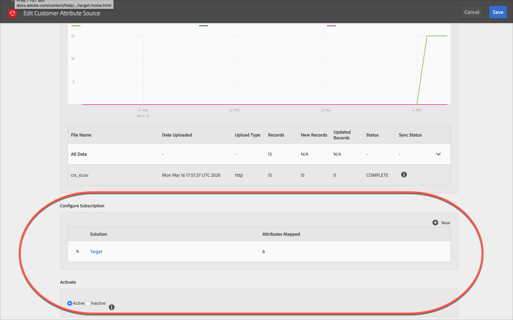

# 고객 속성{#customer-attributes}을 참조하십시오.

Adobe 프로필 및 대상 핵심 서비스에서 고객 속성을 사용하여 Adobe Target에서의 컨텐츠 타깃팅을 위해 고객 관계 관리(CRM) 데이터베이스의 엔터프라이즈 고객 데이터를 사용하는 방법에 대한 정보입니다.

여러 소스를 통해 수집되고 CRM 데이터베이스 내에 저장된 기업 고객 데이터는 [!DNL Target]에서 고객에게 가장 관련 있는 컨텐츠를 전략적으로 전달하고, 특히 재방문 고객에 중점을 두는 데 사용될 수 있습니다. [!DNL People] 핵심 서비스(이전의 프로필 및 대상)는 데이터 수집 및 분석과 실용적인 데이터와 통찰력을 만드는 테스트 및 최적화를 하나로 모읍니다.

## 고객 속성 개요 {#section_B4099971FA4B48598294C56EAE86B45A}

사용자 핵심 서비스는 [!DNL Adobe Experience Cloud]의 일부로, 고객 데이터를 [!DNL Experience Cloud] 플랫폼으로 푸시하기 위한 도구를 기업에 제공합니다. [!DNL Experience Cloud]로 온보딩되는 데이터는 모든 [!DNL Experience Cloud] 워크플로우에 사용할 수 있습니다. [!DNL Adobe Target]은 속성을 기준으로 재방문 고객을 타깃팅하기 위해 이 데이터를 활용합니다. [!DNL Adobe Analytics]는 이러한 속성을 사용하며, 분석 및 세그멘테이션에 사용될 수 있습니다.


고객 속성 및 Target을 사용할 때 다음 정보를 고려하십시오.

* [!DNL People] 핵심 서비스에서 [!UICONTROL 고객 속성] 기능을 사용하기 전에 충족해야 하는 몇 가지 전제 조건 요구 사항이 있습니다. 자세한 내용은 *Experience Cloud 및 핵심 서비스 제품 설명서*의 [고객 속성](https://marketing.adobe.com/resources/help/en_US/mcloud/attributes.html)에서 &quot;고객 속성 업로드를 위한 전제 조건&quot;을 참조하십시오. [!DNL at.js](임의 버전) 또는 [!DNL mbox.js] 버전 58 이상이 필요합니다.
* Adobe는 CRM 데이터베이스의 모든 고객 속성(방문자 프로필) 데이터가 Experience Cloud로 온보딩되어 Target에서 타깃팅에 사용될 수 있을 것으로 보장하지 않습니다. 현재 설계에서는 소량의 데이터가 온보딩되지 않을 수 있습니다.
* Experience Cloud에서 Target으로 가져온 고객 속성 데이터의 라이프타임은 기본적으로 14일에 해당하는 방문자 프로필의 라이프타임에 따라 좌우됩니다. 자세한 내용은 [방문자 프로필 라이프타임](../../c-target/c-visitor-profile/visitor-profile-lifetime.md#concept_D9F21B416F1F49159F03036BA2DD54FD).
* `vst.*` 매개 변수가 사용자를 식별하는 유일한 항목일 경우 `authState`가 UNAUTHENTICATED (0)이면 기존의 &quot;인증됨&quot; 프로필을 가져오지 않습니다. `authState`가 UNAUTHENTICATED (1)로 변경되는 경우 프로필이 재생됩니다.

   예를 들어, `vst.myDataSource.id` 매개 변수가 사용자를 식별하는 데 사용되고(`myDataSource`는 데이터 소스 별칭임) MCID 또는 타사 ID가 없는 경우 매개 변수 `vst.myDataSource.authState=0`을 사용하면 고객 속성 가져오기를 통해 작성되었을 수 있는 프로필을 가져오지 않습니다. 인증된 프로필을 가져오려면 `vst.myDataSource.authState` 값이 1(AUTHENTICATED)이어야 합니다.

* 다음 문자는 보낼 `mbox3rdPartyID`수 없습니다. 더하기 기호 (+) 와 슬래시 (/).

## Target에 대한 고객 속성 워크플로우 {#section_00DAE94DA9BA41398B6FD170BC7D38A3}

아래 그림과 같이 다음 단계를 완료하여 [!DNL Target]에서 CRM 데이터를 사용하십시오.


다음 각 작업을 완료하기 위한 자세한 지침은 *Experience Cloud 및 핵심 서비스 제품 설명서*의 [고객 속성 소스 작성 및 데이터 파일 업로드](https://marketing.adobe.com/resources/help/en_US/mcloud/t_crs_usecase.html)에서 찾을 수 있습니다.

1. 데이터 파일 만들기.

   CRM의 고객 데이터를 CSV 형식으로 내보내 [!DNL .csv] 파일을 만듭니다. 또는 업로드하기 위해 zip 또는 gzip 파일을 생성할 수 있습니다. CSV의 첫 번째 행이 헤더이고 모든 행(고객 데이터)이 동일한 수의 항목을 갖는지 확인합니다.

   

   

1. 속성 소스를 만들고 데이터 파일 업로드.

   데이터 소스 및 별칭 ID에 대해 이름과 설명을 지정합니다. 별칭 ID는 VisitorAPI.js의 고객 특성 코드에서 사용되는 고유 ID입니다.

   >[!IMPORTANT]
   >
   >데이터 소스 이름 및 속성 이름은 점을 포함할 수 없습니다.

   HTTP 메서드를 사용하여 최대 100MB의 데이터 파일을 업로드할 수 있습니다. 100MB~4GB의 파일은 FTP를 통해 업로드할 수 있습니다.

   * **HTTPS:** [!DNL .csv] 데이터 파일을 드래그 앤 드롭하여 [!UICONTROL 찾아보기]를 클릭하여 파일 시스템에서 업로드할 수 있습니다.
   * **FTP:** FTP 링크를 클릭하여 [FTP를 통해 파일을 업로드](https://marketing.adobe.com/resources/help/en_US/mcloud/t_upload_attributes_ftp.html)합니다. 첫 번째 단계는 Adobe 제공 FTP 서버에 대한 암호를 제공하는 것입니다. 암호를 입력한 다음 [!UICONTROL 완료]를 클릭합니다.

      이제 CSV/ZIP/GZIP 파일을 FTP 서버로 전송하십시오. 이 파일이 성공적으로 전송되면 동일한 이름 및 [!DNL .fin] 확장자를 사용하여 새 파일을 만듭니다. 이 빈 파일을 서버로 전송합니다. 이것은 전송 종료를 나타내며 Experience Cloud는 데이터 파일 처리를 시작합니다.

1. 스키마 유효성 검사.

   유효성 검사 프로세스를 사용하여 표시 이름 및 설명을 업로드된 속성(문자열, 정수, 숫자 등)에 매핑할 수 있습니다. 각 속성을 올바른 데이터 유형, 표시 이름 및 설명으로 매핑합니다.

   스키마 유효성 검사가 완료된 후 [!UICONTROL 저장]을 클릭합니다. 파일 업로드 시간은 크기에 따라 다릅니다.

   

   

1. 가입 구성 및 속성 소스 활성화.

   **[!UICONTROL 구독 추가]**를 클릭하고 이러한 속성을 구독할 솔루션을 선택합니다. [가입을 구성하면 Experience Cloud와 솔루션 간에 데이터 흐름이 설정됩니다. ](https://marketing.adobe.com/resources/help/en_US/mcloud/subscription.html) 속성 소스를 활성화하면 데이터가 구독 중인 솔루션으로 유입될 수 있습니다. 업로드한 고객 레코드는 웹 사이트 또는 애플리케이션에서 들어오는 ID 신호와 대조됩니다.

   

   

   이 단계를 수행하는 동안 다음 제한 사항에 유의하십시오.

   * HTTP 메서드를 사용하는 각 업로드의 최대 파일 크기는 100MB입니다.
   * FTP 메서드를 사용하는 각 업로드의 최대 파일 크기는 4GB입니다.
   * 가입이 허용되는 속성 수는 [!DNL Target Standard]의 경우 5개이고 [!DNL Target Premium]의 경우 200개입니다.

## Target에서 고객 속성 사용 {#section_107E3A0F0EC7478E82E6DBD17B30B756}

다음과 같은 방법으로 [!DNL Target]에서 고객 속성을 사용할 수 있습니다.

### 타깃팅 대상자 만들기

[!DNL Target]에서는 대상을 만들 때 방문자 프로필 섹션에서 고객 속성을 선택할 수 있습니다. 모든 고객 속성의 목록에는 &lt; data_ source_ name &gt; 접두사가 있습니다. 필요에 따라 이러한 특성을 다른 데이터 특성과 결합하여 대상을 구성합니다.


### 토큰을 사용하여 프로필 스크립트 만들기

`crs.get('<Datasource Name>.<Attribute name>')` 형식을 사용하여 프로필 스크립트에서 고객 속성을 참조할 수 있습니다.

이 프로필 스크립트는 현재 방문자에 속하는 속성을 제공하기 위해 오퍼에서 직접 사용할 수 있습니다.

### 성공적인 구현 및 사용을 위해 웹 사이트에서 mbox3rdPartyID 사용

mbox3rdPartyId를 `targetPageParams()` 메서드 내의 글로벌 mbox에 매개 변수로 전달합니다. mbox3rdPartyId 값은 CSV 데이터 파일에 있는 고객 ID로 설정되어야 합니다.

```
<script type="text/javascript">
            function targetPageParams() {
               return 'mbox3rdPartyId=2000578';
            }
</script>
```

### Experience Cloud ID 서비스 사용

Experience Cloud ID 서비스를 사용하는 경우 타깃팅에서 고객 속성을 사용하도록 고객 ID 및 인증 상태를 설정해야 합니다. 자세한 내용은 *Experience Cloud ID 서비스 설명서*의 [고객 ID 및 인증 상태](https://marketing.adobe.com/resources/help/en_US/mcvid/mcvid-authenticated-state.html)를 참조하십시오.

[!DNL Target]에서 고객 속성을 사용하는 방법에 대한 자세한 내용은 다음 리소스를 참조하십시오.

* *Experience Cloud 및 핵심 서비스 제품 문서*의 [고객 속성 소스 만들기 및 데이터 파일 업로드](https://marketing.adobe.com/resources/help/en_US/mcloud/t_crs_usecase.html)
*  *디지털 마케팅 블로그*의 [Customer Attributes: The More You Know, The Better You Connect(고객 속성: 더 많이 알수록 더 쉬워지는 연결)](https://blogs.adobe.com/digitalmarketing/analytics/customer-attributes-know-better-connect/)

## 고객에게 자주 발생하는 문제 {#section_BE0F70E563F64294B17087DE2BC1E74C}

고객 속성 및 [!DNL Target]을 사용할 때 다음과 같은 문제가 발생할 수 있습니다.

| 문제 | 세부 사항 |
|--- |--- |
| 프로필이 너무 커서 고객 속성이 제거됨 | 사용자 프로필의 특정 필드에 대해 문자 제한이 없지만 프로필이 64K보다 커지면 다시 64K보다 작아질 때까지 가장 오래된 속성을 제거하여 잘립니다. |
| 며칠 후에도 [!DNL Target]의 대상 라이브러리에 속성이 나열되지 않음 | 일반적으로 파이프라인 연결 문제입니다. 해결 방법으로 고객 속성 팀에 피드를 다시 게시하라고 요청합니다. |
| 전달이 속성을 기준으로 작동하지 않음 | 프로필이 아직 에지에서 업데이트되지 않았습니다. 해결 방법으로 고객 속성 팀에 피드를 다시 게시하라고 요청합니다. |
| 구현 문제 | 다음 구현 문제에 유의하십시오.<ul><li>방문자 ID가 올바르게 전달되지 않았습니다. ID가 `setCustomerId` 대신 mboxMCGVID에 전달되었습니다.</li><li>방문자 ID가 올바르게 전달되었지만 AUTHENTICATION 상태가 인증됨으로 설정되지 않았습니다.</li><li>`mbox3rdPartyId`가 올바르게 전달되지 않았습니다.</li> |
| `mboxUpdate`가 제대로 수행되지 않았습니다. | mboxUpdate가 `mbox3rdPartyId`로 제대로 수행되지 않았습니다. |
| 고객 속성을 Target으로 가져오지 않습니다. | Target에서 고객 속성 데이터를 찾을 수 없는 경우 지난 x일 내에 가져오기가 발생했는지 확인하십시오. 여기서 x는 Target [방문자 프로필 라이프타임](/help/c-target/c-visitor-profile/visitor-profile-lifetime.md) 값(기본값 14일)입니다. |

위의 행 1과 2의 문제는 이 영역에서 약 60%의 오류를 유발합니다. 행 3의 문제는 약 30%의 오류를 유발합니다. 행 4의 문제는 약 5%의 오류를 유발합니다. 나머지 5%는 기타 문제로 인해 발생합니다.

## 교육 비디오: 고객 속성을 사용하여 오프라인 데이터 업로드 {#section_9A4E0FA0D0934D06BD8D5BFA673E9BD8}

이 비디오는 오프라인 CRM, 도움말 데스크, POS 및 기타 마케팅 데이터를 Experience Cloud 사용자 서비스로 가져오고 알려진 ID를 사용하여 방문자와 연결하는 방법을 보여 줍니다.

>[!VIDEO](https://video.tv.adobe.com/v/17802t1/)
