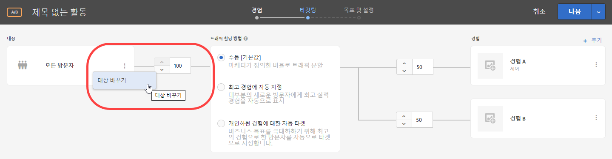
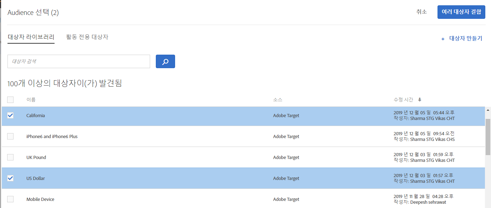
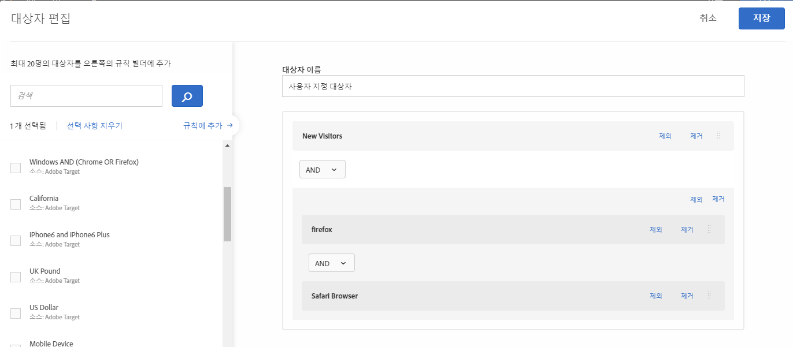
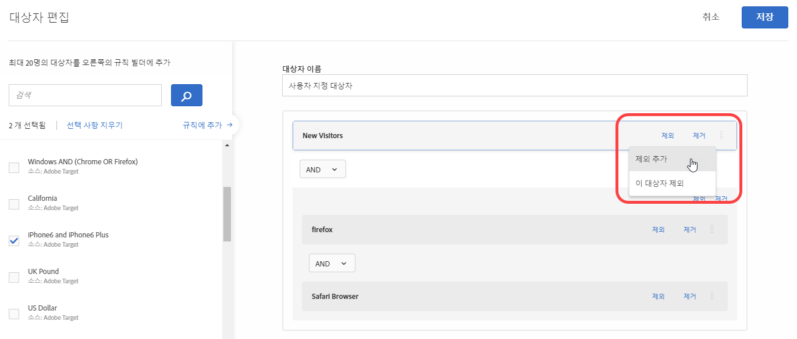
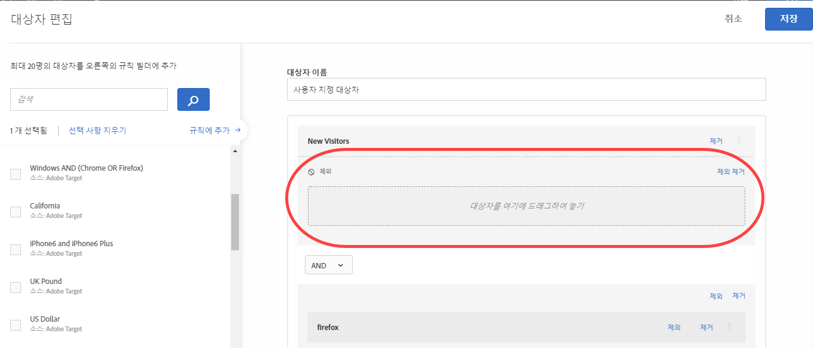
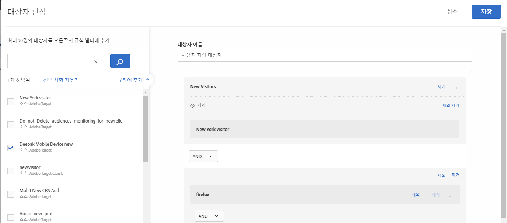
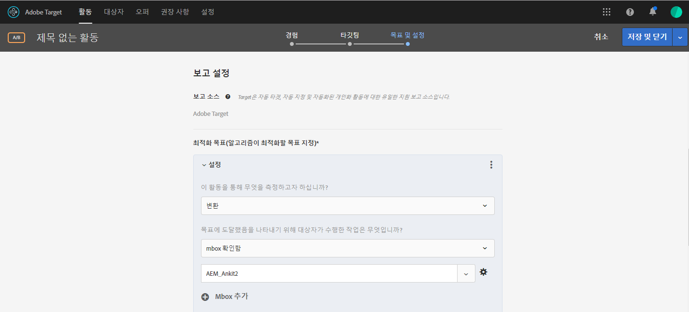
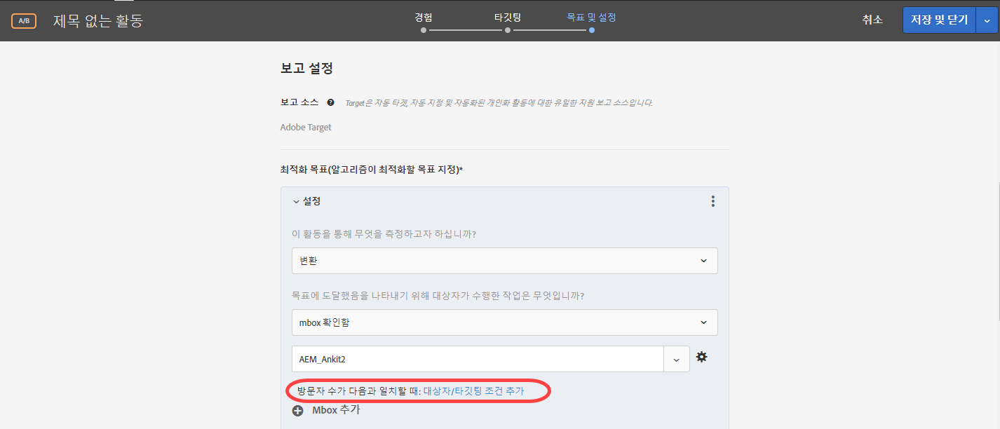
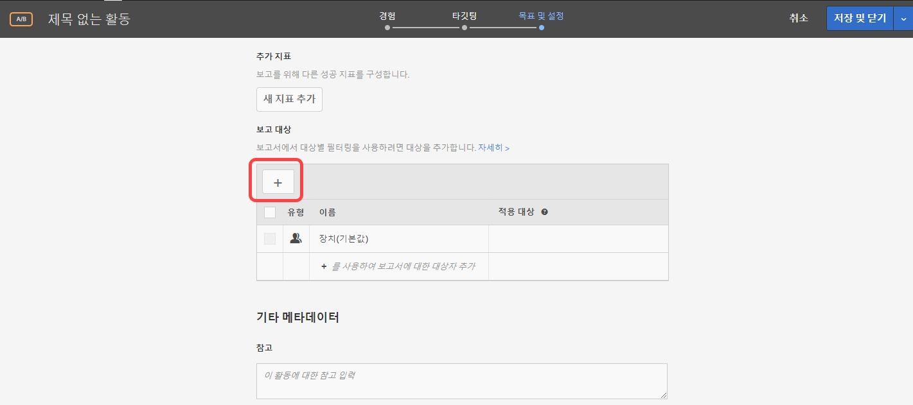

# 여러 대상 결합{#combine-multiple-audiences}

즉석에서 여러 대상(Adobe Experience Cloud 대상 및 Target 대상 포함)을 조합하여 애드혹 대상을 만듭니다. 제외 규칙을 만들고 규칙에서 대상을 제외할 수도 있습니다.

&quot;새로운 방문자&quot; 대상과 &quot;Chrome 사용자&quot; 대상이 있다고 가정합니다. 특정 활동에 대해 이 기존 대상들을 결합하여 Chrome 브라우저를 사용하는 새 방문자를 타깃팅할 수 있습니다. 세 번째 대상을 만들어 [!UICONTROL 대상] 라이브러리에 저장하는 대신, 활동을 만들 때 또는 기존 활동을 편집할 때 이 두 대상을 결합할 수 있습니다.

다른 예로, 세 번째의 영구적 대상을 만드는 대신, 충성도 상태에 대한 특정 [!DNL Audience Manager] 세그먼트를 포함하여 현재 세션 동기화 충성도 프로그램에 등록한 고객으로 구성된 [!DNL Target] 세그먼트와 결합하여 모든 충성 고객을 타깃팅할 수 있습니다.

AND와 OR 연산자를 사용하여 최대 10개의 대상을 결합할 수 있습니다.

[!DNL Target] UI의 다양한 위치에서 결합된 대상을 만들어 사용할 수 있습니다. 

## 활동을 만들 때 결합된 대상 만들기 {#section_2F1CE9434CC04174B4BA2BFC89B85D77}

3단계 안내가 있는 워크플로우 동안 활동의 [!UICONTROL Target] 페이지에서 결합된 임시 대상을 만들 수 있습니다.

1. [타겟](/help/c-activities/activities.md#concept_D317A95A1AB54674BA7AB65C7985BA03) 페이지에서 **[!UICONTROL 활동]**&#x200B;을 만드는 동안 3개의 세로 줄임표를 클릭한 다음 **[!UICONTROL 대상 바꾸기]**&#x200B;를 클릭합니다.

   

1. [!UICONTROL 대상 선택] 페이지에서, 결합된 대상을 위한 빌딩 블록으로 사용할 대상의 옆에 있는 확인란을 선택합니다.

   

1. 맨 위 오른쪽 모서리에 있는 **[!UICONTROL 여러 대상자 결합]**&#x200B;을 클릭합니다.

   

1. (조건부) 결합된 새 대상을 원하는 대로 편집합니다.

   [!UICONTROL 대상 편집] 대화 상자를 사용하면 제외 규칙을 추가하거나 대상을 제외할 수 있을 뿐만 아니라 왼쪽의 추가 대상 빌딩 블록을 결합된 새 대상으로 드래그하여 놓을 수도 있습니다.

   1. 드래그하여 놓기 기능을 사용하여 기존 섹션 내의 대상을 수준 2 빌딩 블록으로 추가할 수 있습니다. 수준 1 빌딩 블록을 추가하려면 원하는 대상 옆에 있는 확인란을 선택한 다음, **[!UICONTROL 규칙에 추가를 클릭하십시오]**.

      예를 들어 앞의 예를 가정할 때 이제 결합된 대상에서 Safari 사용자도 포함시키려고 합니다. 다음 예와 같이, &quot;Safari 브라우저&quot; 대상을 검색하여 오른쪽의 &quot;Firefox 브라우저&quot; 상자로 드래그합니다.

      

      두 브라우저 유형 대상 사이의 연산자는 &quot;AND&quot;입니다. Firefox나 Safari 중 하나를 사용하여 새로운 방문자를 위한 새로운 결합된 대상을 만들려면 And 드롭다운 목록을 선택하여 &quot;OR&quot;로 변경하십시오. 모든 잠재적 대상 구성원을 제외하는 규칙을 작성하지 않도록 주의하십시오. 예를 들어 고객이 Firefox와 Safari를 동시에 사용하여 페이지를 방문할 수는 없습니다.

      >[!NOTE]
      >
      >연산자(AND 또는 OR)는 대상을 결합할 때처럼 동일하게 유지되어야 합니다. 연산자들을 혼합하여 짜 맞출 수는 없습니다.

   1. 규칙에 제외를 추가하려면 **[!UICONTROL 제외]** > **[!UICONTROL 제외 추가]**&#x200B;를 클릭하십시오.

      

      상자에서 대상을 드래그하여 놓습니다.

      

      예를 들어 새 방문자에서 미국 방문자를 제외하려면 다음과 같이 시장: 미국 대상을 상자로 드래그할 수 있습니다.

      

      이 결합된 대상은 Safari 또는 Firefox를 사용하여 사이트를 방문하는 모든 새로운 방문자(San Francisco의 방문자 제외)를 포함합니다.

   1. 규칙에서 대상을 제외하려면 **[!UICONTROL 제외]** > **[!UICONTROL 이 대상 제외]**&#x200B;를 클릭하십시오.

      예를 들어, Firefox를 사용하는 대상을 제외하고 사이트를 방문하는 모든 새 방문자를 포함하는 결합된 대상을 만들 수 있습니다. Firefox를 사용하는 방문자를 제외하는 것이 여러 브라우저(Safari, Chrome 및 Internet Explorer)를 명시적으로 포함하고 Firefox는 포함하지 않는 결합된 대상을 만드는 것보다 더 쉽고 빠릅니다.

1. 결합된 대상에 대한 수사적 이름을 지정한 다음 **[!UICONTROL 저장을 클릭합니다]**.

## 지표 타깃팅에서 사용할 결합된 대상 만들기 {#section_A42E795AFCBD4575809C5942039910F0}

지표 타깃팅에서 사용할 결합된 임시 대상을 활동의 [!UICONTROL 목표 및 설정] 페이지에서 만들어 수 있습니다. 예를 들어, 결합된 대상을 사용하여 전환을 기반으로 타깃팅을 만들려면 다음을 수행하십시오.

1.   [활동](/help/c-activities/activities.md#concept_D317A95A1AB54674BA7AB65C7985BA03)을 편집하거나 만들 때 **[!UICONTROL 목표 및 설정]** 페이지에서 성공 지표에 대한 **[!UICONTROL 전환]**&#x200B;을 선택한 다음, mbox 확인함&#x200B;**[!UICONTROL 을 작업으로 선택합니다.]**
1. **[!UICONTROL mbox 검색]** 필드에서 원하는 mbox를 선택합니다.

   

1. 톱니바퀴 아이콘을 클릭한 다음, **[!UICONTROL 대상 타깃팅 추가를 클릭합니다]**.
1. **[!UICONTROL 대상/타깃팅 조건 추가]** 링크를 클릭하여 [!UICONTROL 대상 선택] 대화 상자를 표시합니다.

   

1. &quot;활동을 만들 때 결합된 대상 만들기&quot;의 [2단계](/help/c-target/combining-multiple-audiences.md#section_2F1CE9434CC04174B4BA2BFC89B85D77)로 진행하여 결합된 대상을 만듭니다.

## 보고에서 사용할 결합된 대상 만들기 {#section_4682D342EFBB43C38E54B99B3A1E14CD}

보고에서 사용할 결합된 임시 대상을 활동의 [!UICONTROL 목표 및 설정] 페이지에서 만들어 수 있습니다.

1. [활동](/help/c-activities/activities.md#concept_D317A95A1AB54674BA7AB65C7985BA03)을 편집하거나 만들 때, **[!UICONTROL 목표 및 설정]** 페이지에서 **[!UICONTROL 보고 대상]** 아래의 [!UICONTROL 대상 추가] 아이콘을 클릭하여 [!UICONTROL 대상 선택] 페이지를 표시합니다.

   

1. &quot;활동을 만들 때 결합된 대상 만들기&quot;의 [2단계](/help/c-target/combining-multiple-audiences.md#section_2F1CE9434CC04174B4BA2BFC89B85D77)로 진행하여 결합된 대상을 만듭니다.

## 활동을 편집할 때 결합된 대상 만들기 {#section_364A12CE96E04B61B7C18113AA586C2C}

기존 활동을 편집할 때 결합된 임시 대상을 만들 수 있습니다.

1. [!UICONTROL 활동] 페이지에서 원하는 활동을 마우스로 가리킨 다음 **[!UICONTROL 편집]** 아이콘을 클릭합니다.

   또는

   원하는 활동을 클릭하여 연 다음, **[!UICONTROL 활동 편집을 클릭합니다]**.

1. **[!UICONTROL 구성]** > **[!UICONTROL 대상]** > **[!UICONTROL 복수 대상]**&#x200B;을 클릭합니다.

   

1. 활동의 현재 대상 옆에 있는 더 보기 선택 사항 아이콘(3개의 수직 줄임표)을 클릭한 다음, **[!UICONTROL 대상 변경을 클릭합니다]**.

   

1. &quot;활동을 만들 때 결합된 대상 만들기&quot;의 [2단계](/help/c-target/combining-multiple-audiences.md#section_2F1CE9434CC04174B4BA2BFC89B85D77)로 진행하여 결합된 대상을 만듭니다.