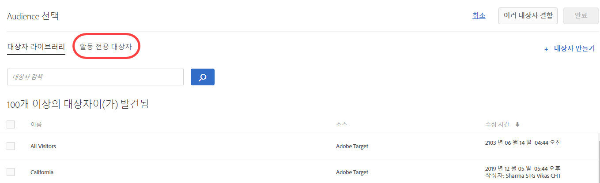

# 활동 전용 대상 만들기{#create-an-activity-only-audience}

활동을 만들 때 안내가 있는 3단계 워크플로우에서 활동 전용 대상을 만듭니다. 이러한 애드혹 대상은 동일한 활동 내의 다른 위치에서 사용될 수 있지만 다른 활동에서 사용할 수 있도록 [!UICONTROL 대상 라이브러리]에 저장되지는 않습니다.

활동 전용 대상은 다음과 같은 이점을 제공합니다.

* 활동 전용 대상을 사용하여 한 번만 사용하려고 하며 [!UICONTROL 대상 라이브러리]에 저장하지 않으려는 대상을 만들 수 있습니다. 이렇게 하면 다시 사용하지 않으려는 대상으로 [!UICONTROL 대상 라이브러리]가 복잡해지지 않게 됩니다.
* 활동 전용 대상은 [!UICONTROL 대상 라이브러리]에 표시되지 않습니다. 따라서 조직의 다른 사용자가 원치 않는 방식으로 변경하지 않도록 방지됩니다.

1. [타겟](/help/c-activities/activities.md#concept_D317A95A1AB54674BA7AB65C7985BA03) 페이지에서 **[!UICONTROL 활동]**&#x200B;을 만드는 동안 3개의 세로 줄임표를 클릭한 다음 **[!UICONTROL 대상 바꾸기]**&#x200B;를 클릭합니다.

   

1. 대상 선택&#x200B;**[!UICONTROL 페이지에서]**&#x200B;활동 전용 대상을 클릭합니다.

   

1. **[!UICONTROL 대상자 만들기를 클릭합니다]**.
1. 수사적 대상 이름을 입력합니다.
1. **[!UICONTROL + 규칙 추가]**&#x200B;를 클릭합니다.

   규칙을 사용하면 대상을 사이트 방문자의 하위 집합으로 제한할 수 있습니다.

1. 규칙 유형을 선택합니다.

   각 규칙 유형에는 고유한 매개 변수가 있습니다. 각 유형의 대상 규칙을 구성하는 방법에 대한 자세한 내용은 [대상 카테고리](/help/c-target/c-audiences/c-target-rules/target-rules.md#concept_E3A77E42F1644503A829B5107B20880D)를 참조하십시오.

1. 규칙 매개 변수를 정의합니다.
1. **[!UICONTROL 저장]**&#x200B;을 클릭합니다.

## 고려 사항

활동 전용 대상을 사용할 때는 다음 정보에 유의하십시오.

* VEC(시각적 경험 작성기) 또는 양식 기반 경험 작성기에서 활동 전용 대상을 만들 수 있습니다. 이 기능은 이전 버전의 Target에 제공되는 세분화 규칙을 대체합니다.
* 활동을 다른 활동에서 재사용하기 위해 활동을 만든 후 [!UICONTROL 대상 라이브러리]에 저장하거나 활동 전용 대상을 만들 수 있습니다. 대상을 저장한 후에는 대상 유형을 변경할 수 없습니다.
* 기존 활동에 대한 구체화 내용은 활동 전용 대상으로 마이그레이션됩니다.
* 활동 전용 대상의 상태는 [!UICONTROL 사용됨] 또는 [!UICONTROL 사용되지 않음]입니다. 사용되지 않음 활동 전용 대상은 활동을 저장할 때까지 표시됩니다. 사용되지 않음 상태로 두고 활동을 저장하려고 하면 사용되지 않음 활동 전용 대상은 삭제된다는 사실을 알리는 경고 메시지가 표시됩니다.
* 대상을 열지 않고 대상 선택기에서 액세스한 팝업 카드에서 대상 정의 세부 사항을 볼 수 있습니다.
* You can [여러 대상을 결합](/help/c-target/combining-multiple-audiences.md#concept_A7386F1EA4394BD2AB72399C225981E5)하여 활동 전용 대상을 만들 수 있습니다.

