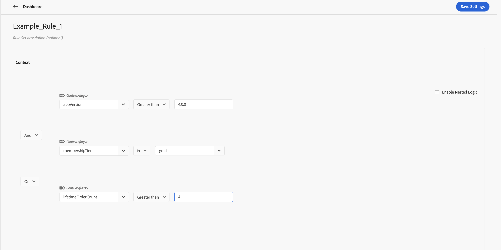
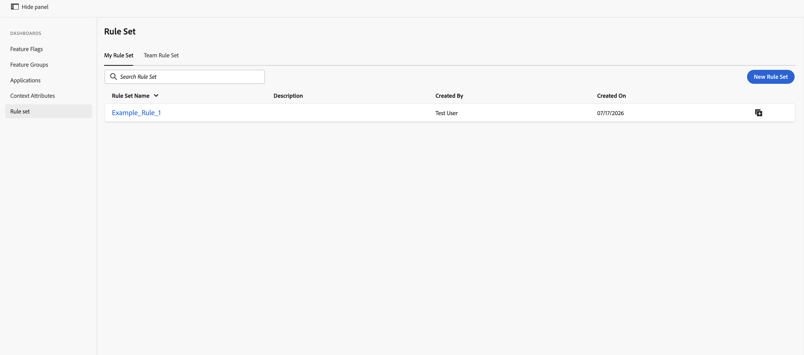

# 규칙 세트 만들기 및 사용 {#creating-and-using-rule-sets}

규칙 세트는 대상 컨텍스트 기준의 재사용 가능한 컬렉션입니다. 여러 기능 플래그 또는 기능 그룹에 동일한 대상이 필요한 경우 규칙 세트를 만듭니다. 그런 다음 각 기능에 대한 대상 기준을 다시 만드는 대신 규칙 세트를 가져올 수 있습니다.

## 규칙 세트 요구 사항 {#requirements}

| UI 레이블 | 사용 | 필수 |
| --- | --- | --- |
| **규칙 집합 입력** | 규칙 세트의 이름을 입력합니다. | 예 |
| **규칙 집합 설명** | 규칙 세트의 목적을 설명합니다. | 아니요 |
| **컨텍스트** | 하나 이상의 대상 기준을 정의합니다. 컨텍스트 속성은 구독 계층, 애플리케이션 버전 또는 지역과 같은 이름이 지정된 필드입니다. | 예 |

## 규칙 세트 만들기 {#create-rule-set}

### 1단계: 새 규칙 세트 시작 {#step-1-start}

플래그에서 왼쪽 탐색에서 **규칙 집합**&#x200B;을 선택한 다음 **새 규칙 집합**&#x200B;을 선택합니다.

**내 규칙 집합** 탭에 사용자가 만든 규칙 집합이 표시됩니다. **팀 규칙 집합** 탭에는 팀에서 사용할 수 있는 규칙 집합이 표시됩니다.

### 2단계: 규칙 세트 세부 사항 및 기준 추가 {#step-2-details}

1. 규칙 세트의 이름을 입력합니다.
1. 설명을 입력합니다(선택적).
1. **컨텍스트**&#x200B;에서 재사용할 대상 기준을 정의합니다.
1. **And** 또는 **Or**&#x200B;을(를) 사용하여 여러 기준을 결합하십시오.
1. 보다 복잡한 식을 만들려면 **중첩 논리 사용**&#x200B;을 선택하세요.

### 3단계: 규칙 세트를 저장합니다. {#step-3-save}

**설정 저장**&#x200B;을 선택합니다. 저장된 규칙 집합이 **내 규칙 집합** 아래에 나타납니다.

## 기능 플래그 또는 기능 그룹에서 규칙 세트 사용 {#use-rule-set}

### 1단계: 대상자 설정을 열고 활성화 {#step-1-open}

규칙 집합을 사용할 기능 플래그 또는 기능 그룹을 열고 **대상** 탭을 선택한 다음 **대상 규칙**&#x200B;을(를) 켜서 대상 기준을 사용하도록 설정합니다.

### 2단계: 규칙 세트 선택 {#step-2-select}

**규칙 집합 선택** 드롭다운을 엽니다. **내 규칙 집합** 또는 **내 팀 규칙 집합**&#x200B;에서 규칙 집합을 선택하십시오.

### 3단계: 가져온 기준 검토 {#step-3-review}

선택한 규칙 세트의 컨텍스트 기준을 대상자로 가져옵니다. 기준을 검토한 다음 기능 플래그 또는 기능 그룹을 저장합니다.

동일한 대상이 필요한 여러 기능 플래그 및 기능 그룹에서 동일한 규칙 세트를 사용할 수 있습니다.

### 4단계: 기능 플래그 또는 기능 그룹 저장 {#step-4-save}

가져온 대상 기준을 검토한 후 **설정 저장**&#x200B;을 선택합니다.

>[!NOTE]
>
>규칙 세트를 가져오면 해당 대상 기준이 기능 플래그나 기능 그룹에 복사됩니다. 대상 기준을 나중에 업데이트해야 하는 경우 규칙 세트를 가져온 모든 기능 플래그 및 기능 그룹에서 별도로 업데이트합니다. 원래 규칙 세트를 업데이트해도 이전에 가져온 대상자는 자동으로 업데이트되지 않습니다.

## 기능 플래그 또는 기능 그룹에서 규칙 세트 만들기 {#create-from-feature}

기능 플래그나 기능 그룹의 대상자 화면에서 직접 규칙 세트를 만들 수도 있습니다.

1. 기능 플래그 또는 기능 그룹을 연 다음 **대상자** 탭을 선택합니다.
1. **대상 규칙**&#x200B;을 켭니다.
1. 재사용할 컨텍스트 기준을 정의합니다.
1. **규칙 집합 선택** 드롭다운 옆의 오른쪽 상단 모서리에서 **+** 단추를 선택합니다.
1. **규칙 집합 저장** 대화 상자에서 규칙 집합 이름을 입력합니다.
1. **규칙 집합 저장**&#x200B;을 선택합니다.

## 참조: {#see-also}

* [컨텍스트 속성 만들기](creating-your-context-attributes.md)
* [대상 규칙에서 컨텍스트 사용](using-context-in-audience-rules.md)
* [기능 플래그 및 기능 그룹의 대상자](audience-in-feature-flags-and-feature-groups.md)

<!-- -->
