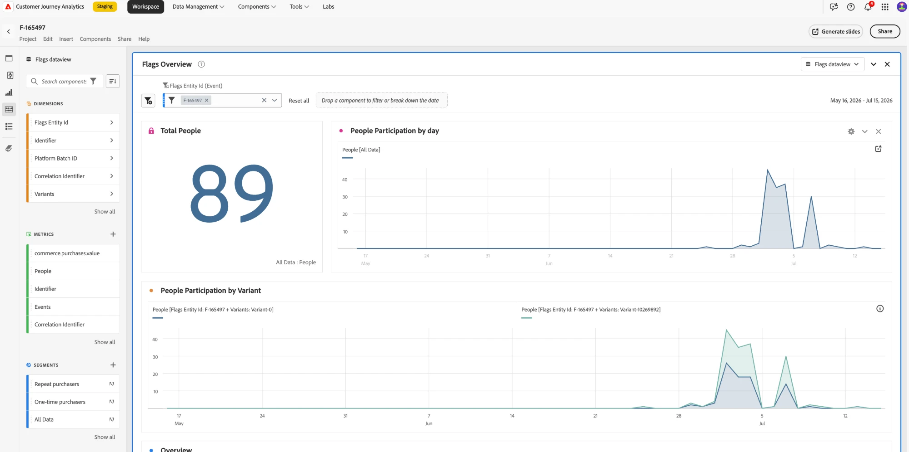

# 보고 {#reporting}

플래그는 **Customer Journey Analytics(CJA)**&#x200B;을 통해 보고를 전달합니다. **보고서** 탭은 모든 기능 플래그 및 기능 그룹 세부 정보 페이지에서 사용할 수 있습니다. 해당 특정 플래그 또는 그룹에 속한, 페이지에 직접 포함된 CJA 보고서를 볼 수 있습니다.

>[!NOTE]
>
>보고서는 기본적으로 **30일** 보고 기간으로 열립니다. 패널 헤더에서 범위를 조정할 수 있습니다.

## 사전 요구 사항 {#prerequisites}

보고서를 보려면 다음을 확인하십시오.

1. 응용 프로그램에 대한 보고가 설정되어 있습니다. [Customer Journey Analytics을 사용하여 보고 설정](#setup)을 참조하십시오.
1. 기능 플래그 또는 기능 그룹이 활성화되었으며 데이터가 누적되었습니다.

## 보고서 보기 {#view-report}

### 보고서 탭을 열고 데이터 보기를 선택합니다. {#open-report-tab}

1. 기능 플래그 또는 기능 그룹을 열고 **보고서** 탭을 선택합니다.
1. 사용 가능한 CJA 데이터 보기가 나열된 **데이터 보기 선택** 대화 상자가 열립니다. 기본적으로 첫 번째 항목이 선택됩니다.
1. 원하는 데이터 보기를 선택하고 **보고서 보기**&#x200B;를 선택합니다. 보고서를 로드하지 않고 대화 상자를 닫으려면 **취소**&#x200B;를 선택하세요.
1. 보고서는 해당 플래그 또는 그룹의 엔티티 ID에 범위가 지정된 탭 내부에 로드됩니다.

>[!NOTE]
>
>이 대화 상자에는 현재 샌드박스에서 액세스할 수 있는 데이터 보기 만 나열됩니다. 사용할 수 있는 항목이 없으면 대화 상자에 메시지가 표시되고 **보고서 보기**&#x200B;가 비활성화된 상태로 유지됩니다. 데이터 보기 권한을 확인하거나 샌드박스를 전환하십시오.

### 성과 보고서 보기 {#view-performance-report}

포함된 **플래그 개요** 대시보드가 표시됩니다.

* **총 사용자**, **일별 사용자 참여** 및 **변형별 사용자 참여**(컨트롤 그룹 및 변형 ID)
* 각 변형을 사람 수 및 기여도와 함께 나열하는 **개요** 테이블

패널 헤더에서 날짜 범위를 조정하여 다른 창(기본 30일)에 대한 다시 그리기를 수행합니다.

### 실험 결과 탐색 {#explore-experimentation-results}

1. **실험** 패널에서 **실험**(플래그 또는 그룹 엔터티 ID) 및 **제어 변형**&#x200B;을(를) 미리 선택했습니다.
1. **지표 추가**&#x200B;를 사용하여 **성공 지표**&#x200B;를 추가하고&#x200B;**정규화 지표**(기본 **사람**)을 선택합니다.
1. 선택적으로 **신뢰도 상한/하한 포함**&#x200B;을 사용하도록 설정하십시오.
1. **빌드**&#x200B;를 선택하여 선택한 지표에 대한 변형당 **상승도**, **신뢰도** 및 **전환율**&#x200B;을 계산합니다.

이러한 지표를 계산하는 방법에 대한 자세한 내용은 [실험 패널 설명서](https://experienceleague.adobe.com/en/docs/analytics-platform/using/cja-workspace/panels/experimentation)를 참조하십시오.

### CJA에서 분석(선택 사항) {#analyze-in-cja}

보고서가 로드되면 보고서 탭의 오른쪽 상단에 **CJA에서 분석** 단추가 나타납니다. 이 옵션을 선택하면 Customer Journey Analytics의 동일한 보고서 전체 페이지가 새 브라우저 탭에 열립니다. 이 탭에서 더 심층적이고 애드혹 분석을 위한 전체 CJA 도구 세트가 제공됩니다.

>[!IMPORTANT]
>
>보고서가 저장되지 않은 임시 프로젝트로 열립니다. CJA에서 사용자 지정(지표 추가, 패널 변경, 필터 조정 등)하고 이러한 변경 사항을 유지하려면 **프로젝트 > 템플릿으로 저장**&#x200B;을 사용하여 저장합니다. 그렇지 않으면 보고서를 닫을 때 편집 내용이 손실됩니다.

## Customer Journey Analytics을 사용하여 보고 설정 {#setup}

보고에는 Flags 애플리케이션에 연결된 Customer Journey Analytics 데이터 세트가 필요합니다. 플래그지원팀 또는 Adobe 담당자에게 문의하여 애플리케이션에 대한 보고를 사용하도록 설정합니다.

>[!NOTE]
>
>기능 요청에서 전달된 ID는 프로필에 연결할 필요가 없습니다. 평가는 런타임에 수행되며 이벤트는 Customer Journey Analytics으로 전송됩니다.

## 참조: {#see-also}

* [첫 번째 기능 플래그 만들기](create-your-first-feature-flag.md)
* [기능 플래그를 사용하여 A/B 테스트](a-b-testing.md)
* [기능 그룹 만들기](create-a-feature-group.md)

<!-- -->
