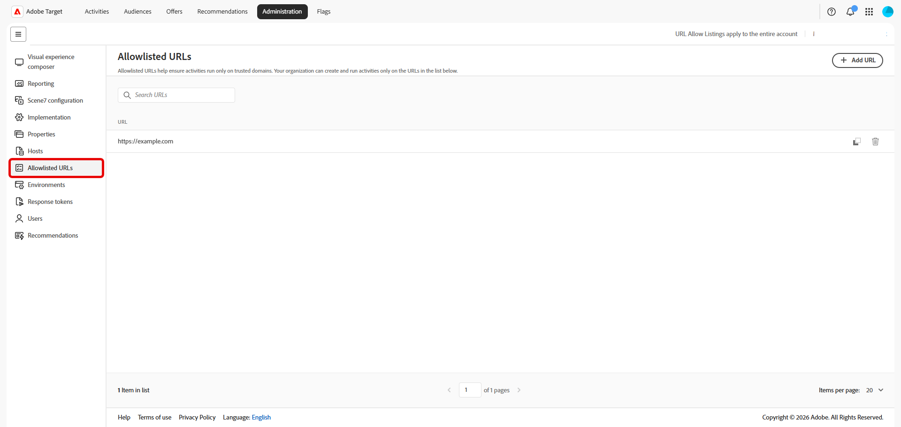
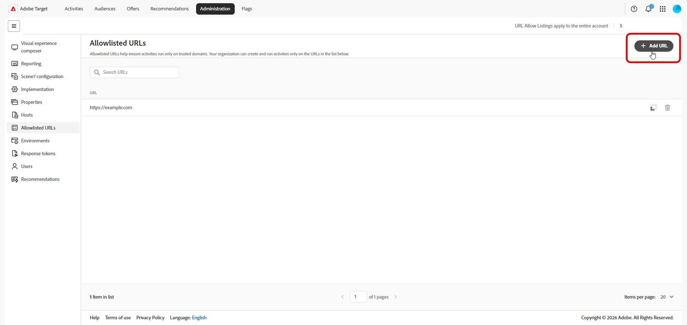

# 허용 목록에추가된 URL

허용 목록에추가된 URL은 원격 또는 리디렉션 오퍼를 사용하는 경우를 포함하여 조직에서 [!DNL Adobe Target] 경험을 만들고 실행할 수 있는 신뢰할 수 있는 URL 패턴을 정의합니다. 이 목록은 [호스트 관리](/help/main/administrating-target/hosts.md) 및 [환경](/help/main/administrating-target/environments.md)과(와) 함께 작동하지만, 특히 허용된 원격 오퍼 URL 패턴 및 관련 유효성 검사에 적용됩니다.

허용 목록에추가된 URL을 관리하려면 **[!UICONTROL 관리]** > **[!UICONTROL 허용 목록에추가된 URL]**&#x200B;을 클릭하세요.

## 허용 목록에추가된 URL 관리 {#add-url}

기본 표에는 단일 열에 있는 각 허용 목록에추가된 패턴이 나열되어 있습니다. 지원되는 항목에는 조직이 원격 경험에 대해 허용하는 정확한 URL, 와일드카드 경로 또는 패턴 형식이 포함될 수 있습니다.

1. **[!UICONTROL URL 추가]**&#x200B;를 클릭합니다.

   

1. 대화 상자에서 조직이 허용해야 하는 URL 또는 패턴을 입력합니다.

   

1. 변경 사항을 저장합니다.

   패턴이 허용 목록에추가된으로 제공되면 사용자는 다른 [!DNL Target] 규칙에 따라 해당 URL을 사용하는 활동 및 오퍼를 만들거나 실행할 수 있습니다.

1. **[!UICONTROL 검색 URL]** 필드를 사용하여 테이블을 필터링하십시오.

1. URL을 삭제하려면 더 이상 필요하지 않은 패턴의 행을 찾아  아이콘을 클릭합니다.

   

