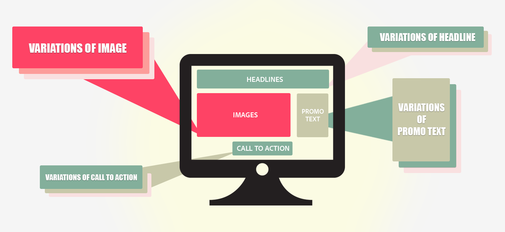

# [!UICONTROL 다변량 테스트 개요]

A [!UICONTROL 다변량 테스트] (MVT) 위치 [!DNL Adobe Target] 페이지의 요소 간에 오퍼 조합을 비교하여 특정 대상에 가장 적합한 조합을 결정하고 활동의 성공에 가장 큰 영향을 미치는 요소를 식별합니다.

[!UICONTROL 다변량] 테스트를 통해 페이지의 다른 요소와 비교하여 전환에 미치는 상대적 영향별 요소를 발견할 수 있습니다. 유효한 것으로 표시된 요소들의 조합을 개선하는 데에도 유용할 수 있습니다.

A/B 테스트와 비교할 때 다변량 테스트의 이점 중 하나는 페이지에서 전환에 가장 많은 영향을 미치는 요소를 파악할 수 있다는 점입니다. 이를 &quot;기본 효과&quot;라고도 합니다. 이 정보는 예를 들어 가장 많은 주목을 받고 싶은 콘텐츠를 배치할 위치를 결정하는 데 유용합니다.

또한 다변량 테스트는 페이지에서 둘 이상의 요소 간에 조합 효과를 찾을 때 도움이 됩니다. 예를 들어, 특정 광고를 특정 배너 또는 영웅 이미지와 조합하면 더 많은 전환을 발생시킬 수 있습니다. 이를 &quot;상호 작용 효과&quot;라고도 합니다.

[!DNL Target]은 완전 요인 다변량 테스트를 사용하여 콘텐츠를 최적화하는 데 도움을 줍니다. 완전 요인 다변량 테스트는 동일한 가능성으로 모든 가능한 콘텐츠 조합을 테스트합니다. 예를 들어, 페이지 요소에 오퍼가 3개씩 포함되어 있으면 총 9개의 조합을 만들 수 있습니다(3x3). 3개 요소 중 2개 요소에는 3개의 오퍼가 포함될 수 있으며 1개 요소에는 2개의 오퍼가 포함될 수 있으므로 총 18개의 옵션이 제공됩니다(3x3x2).

위치 [!DNL Target], 각 조합은 하나의 경험입니다. 다변량 테스트는 각 경험을 비교하므로 가장 성공적인 조합을 알 수 있습니다. 이와 동시에, 데이터가 수집되어 분석되므로 각 위치와 오퍼가 성공 지표에 어떤 영향을 주는지 파악할 수 있습니다.

생성할 수 있는 조합의 수로 인해 A/B 테스트에 비해 다변량 테스트에는 더 많은 시간과 트래픽이 필요합니다. 페이지에서 충분한 트래픽을 수신해야 각 경험에 대해 통계상으로 유효한 결과를 얻을 수 있습니다. 유용한 결과를 얻으려면 페이지가 수신하는 트래픽 양을 이해하고 적절한 시간 동안 최적의 조합 수를 테스트하여 필요한 결과를 얻어야 합니다.

다음 [!DNL Target] [트래픽 견적 도구](/help/main/c-activities/c-multivariate-testing/t-create-multivariate-test/traffic-estimator.md#task_71AA6922AFD447EA8C5E610A78ABA714) 은 트래픽에 작동하는 테스트를 디자인하는 데 도움이 됩니다. 트래픽 견적 도구를 사용하기 전에, 사이트에서 일반적으로 수신하는 노출 수 및 전환 수를 보여주는 적절한 통계가 있어야 합니다. 일 단위로 트래픽 수준을 고려합니다. 활동에 경험이 많을수록 활동에 포함되어야 하는 트래픽이 많거나 활동을 실행해야 하는 시간이 길어집니다. 트래픽이 높지 않은 경우 몇 가지 조합을 테스트해야 합니다. 그렇지 않으면 의미 있는 테스트 결과를 생성하는 데 필요한 시간이 너무 길어 유용할 수 있습니다.

## [!UICONTROL 다변량 테스트] 용어 {#section_DF475CA7F34B4CFDB7BE7363761D64AE}

를 설정할 때 [!UICONTROL 다변량 테스트] 의 활동 [!DNL Target], 몇 가지 기본 용어를 이해하는 것이 유용합니다.

업계에서 서로 다른 방식으로 사용되는 용어가 여러 개 있습니다. 이 섹션에서는 [!DNL Target]에서 사용하는 용어들을 정의합니다 .

### 조합

콘텐츠 변형은 여러 위치에서 여러 콘텐츠 옵션을 테스트할 때 만들어집니다. 예를 들어 각각 세 개의 콘텐츠 선택 사항이 있는 세 개의 위치를 테스트한다면 가능한 조합은 27개(3x3x3)입니다. 사이트 방문자에게는 경험이라고도 하는 하나의 조합이 표시됩니다.

### 콘텐츠

한 위치 내의 테스트 변형으로 구성되는 텍스트 또는 이미지입니다. 다변량 테스트에서는 여러 위치 내의 수많은 콘텐츠 선택 사항을 비교합니다. MVT 방법론에서 콘텐츠는 때로 *수준*&#x200B;이라고도 합니다.

### 요소

MVT 테스트에서 테스트할 콘텐츠 변형을 포함하는 DOM 요소입니다. *위치*&#x200B;를 참조하십시오.

### 위치

종종 단일 DOM 요소에 포함되는 페이지의 특정 콘텐츠 영역입니다. MVT 방법론에서 위치는 때로 *요인*&#x200B;이라고도 합니다. 전체 계승 다변량 테스트에서는 위치에 있는 오퍼들의 가능한 모든 조합을 비교합니다.

## MVT 테스트와 A/B 테스트 사용 시기 {#section_3D2B966B6671406C861A1843EA41D28C}

다변량 테스트와 A/B 테스트를 함께 실행하여 페이지를 최적화할 수 있습니다. 다음과 같은 경우에 이 두 테스트를 함께 사용할 수 있습니다.

* A/B 테스트를 사용하여 페이지 레이아웃을 최적화한 다음 MVT 테스트를 사용하여 페이지의 각 요소에서 최상의 콘텐츠를 파악합니다..

  A/B 테스트는 레이아웃에 대한 중요한 피드백을 제공하며 MVT 테스트는 페이지 디자인에서 요소의 콘텐츠를 테스트하는 데 적합합니다. 여러 개의 콘텐츠 옵션을 테스트하기 전에 레이아웃에 A/B 테스트를 실행하면 최상의 레이아웃과 가장 영향력 있는 콘텐츠를 판별할 수 있습니다.

* MVT 테스트를 사용하여 가장 중요한 요소를 파악한 후에 해당 요소에 좀 더 집중적인 A/B 테스트를 실행합니다.

  각기 다른 경험의 수가 5개를 초과하고 둘 이상의 요소에 걸쳐 있는 경우 A/B 테스트를 실행하기 전에 MVT 테스트를 실행하는 것이 좋습니다. MVT 테스트는 페이지에서 전환 개선 가능성이 가장 높은 영역을 보여줍니다. 마케터는 이러한 점에 중점을 두어야 합니다. 예를 들어, MVT 테스트는 클릭 유도 문안이 목표 달성을 위한 가장 중요한 요소임을 보여줄 수 있습니다. 목표 달성에 가장 유용한 요소 및 콘텐츠를 파악한 후에는 A/B 테스트를 실행하여 결과를 세분화할 수 있습니다. 예를 들어 두 개의 특정 이미지를 서로 테스트하거나 클릭 유도 문안의 문구 또는 색상을 비교할 수 있습니다. MVT 테스트 다음에 하나 이상의 A/B 테스트를 실행하면 원하는 결과에 대해 가능성이 가장 높은 콘텐츠를 판단할 수 있습니다.

## 고려 사항 {#section_979FE3F398654C1EA1C86E7DBC9A8DAD}

* 테스트할 요소가 3개 이상 있는 경우 MVT 테스트를 사용합니다. 테스트할 요소가 3개 미만이면 일련의 A/B 테스트를 실행합니다.
* 결과에 가장 큰 영향을 준다고 생각되는 페이지 요소를 선택합니다.
* 테스트에 너무 많은 요소나 위치를 포함하지 마십시오. 숫자가 클수록 테스트 기간이 길어집니다.
* 테스트 디자인을 미리 계획합니다. 테스트가 실행되고 데이터 수집 및 분석이 시작된 후에는 편집하는 것이 바람직하지 않습니다.
* 요소는 서로 독립적이어야 합니다.

  예를 들어 동일한 테스트에서 레이아웃과 콘텐츠를 테스트하지 마십시오.

* 경험 수가 늘어나므로 QA에 소요되는 추가 시간을 계획합니다. 부분 요인 테스트를 사용하여 다변량 테스트에 필요한 트래픽의 양을 줄일 수도 있습니다. 자세한 내용은 아래의 부분 요인 테스트 를 참조하십시오.

## 부분 요인 테스트

[!DNL Target] 은 내장된 활동 선택 사항으로서 전체 계승 Multivariate Testing을 제공합니다. 통계학의 실험 계획에서는 결과에 영향을 미치는 요인을 결정하기 위한 다양한 접근 방식이나 디자인을 제공합니다. 이러한 접근 방식은 다음과 같습니다. [다구치 방법](https://en.wikipedia.org/wiki/Taguchi_methods) 부분 요인 테스트용. Taguchi를 사용하면 마케터가 테스트해야 하는 경험의 순열 수를 줄이고 결과적으로 다변량 테스트에 대한 트래픽 요구 사항을 감소시키는 일련의 가정을 할 수 있습니다. 이 기능 및 테스트 접근 방식은 다음 위치에서 사용할 수 있습니다. [!DNL Target] 사용 [오프라인 스프레드시트](/help/main/assets/MVT-Taguchi-Partial-Factorial-Design-02102017.xlsx).

팀이 다른 실험 계획 접근 방식을 사용한다면 이 계산 스프레드시트를 사용자 지정 실험 디자인을 위한 참조 구현으로 사용할 수 있습니다.

오프라인 계산 스프레드시트를 사용할 때에는 다음 팁을 고려하십시오.

* 변경할 요소와 각 요소의 버전 수(3x2, 4x3 등)를 선택합니다.
* 번호 지정 방식을 일관성 있게 유지합니다. 예를 들어, 단추가 요소 1이고 선택 사항이 파란색, 녹색 및 노란색인 경우 파란색 단추는 1-1, 녹색 단추는 1-2, 노란색 단추는 1-3이 됩니다.
* 오프라인 스프레드시트는 필요한 경험의 적절한 개수를 제공합니다(3x2의 경우 4개, 4x3의 경우 9개 등).
* [VEC(시각적 경험 작성기)](/help/main/c-experiences/experiences.md)를 사용하여 A/B 워크플로우에서 경험을 구축합니다. 사용자 지정 코드를 사용하거나 HTML, WYSIWYG 또는 모든 조합을 편집할 수 있습니다.
* 활동이 끝나면(샘플 크기 계산기에 따라) 스프레드시트를 통해 결과를 실행하여 다른 세부 사항을 얻습니다.

추가적인 고려 사항 및 우수 사례를 알려면 [다변량 테스트 우수 사례](/help/main/c-activities/c-multivariate-testing/best-practices.md#reference_53635817FFB741EF8C4E56CC70688EDD)를 참조하십시오.

## 교육 비디오

다음 비디오에는 이 문서에서 설명한 개념에 대한 자세한 정보가 포함되어 있습니다.

### 활동 유형(9:03) 

이 개요 비디오에서는 Tar에서 사용할 수 있는 활동 유형에 대해 설명합니다[!DNL]잡아. 다변량 테스트는 4:20부터 설명합니다.

* [!DNL Adobe Target]에 포함된 활동 유형 설명
* 목표를 달성하기 위한 적절한 활동 유형 선택
* 모든 활동 유형에 적용되는 3단계 안내가 있는 워크플로 설명

>[!VIDEO](https://video.tv.adobe.com/v/17386)

### 다변량 테스트 만들기(9:25) 

이 비디오에서는 을(를) 사용하여 다변량 테스트를 이해, 계획 및 만드는 방법을 설명합니다. [!DNL Target] 안내가 있는 3단계 워크플로.

* 다변량 테스트 정의 및 디자인
* 다변량 테스트 만들기

>[!VIDEO](https://video.tv.adobe.com/v/17395)
