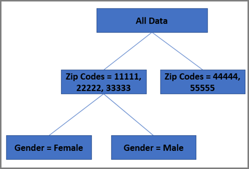

# Random Forest 알고리즘

(AP) 및 [!DNL Auto-Target] 활동 모두에 사용되는 기본 개인화 알고리즘은 Random Forest입니다. Random Forest와 같은 앙상블 방법은 구성 학습 알고리즘 중 어느 것으로부터도 얻을 수 있는 것보다 더 나은 예측 성능을 얻기 위해 다중 학습 알고리즘을 사용한다. [!UICONTROL Automated Personalization]과(와) [!UICONTROL Auto-Target]의 Random Forest 알고리즘은 훈련할 때 다수의 의사 결정 트리를 구성하여 작동하는 분류 또는 회귀 방법입니다.

통계를 생각하는 경우 결과를 예측하는 데 사용되는 단일 회귀 모델을 떠올릴 수도 있습니다. 최신 데이터 과학 연구에서는 동일한 데이터 세트에서 여러 모델이 만든 다음, 지능적으로 결합하는 &quot;Ensemble 방식&quot;이 하나의 모델만을 기반으로 한 예측하는 것보다 개선된 결과를 내놓는다고 말합니다.

Random Forest 알고리즘은 [!UICONTROL Automated Personalization] 및 [!UICONTROL Auto-Target] 활동에 사용되는 핵심 기본 개인화 알고리즘입니다. Random Forest는 수백 개의 결정 트리를 함께 결합하여 하나의 트리가 스스로 할 수 있는 것보다 더 나은 예측에 도달합니다.

## 의사 결정 트리가 무엇입니까? {#section_7F5865D8064447F4856FED426243FDAC}

의사 결정 트리의 목표는 시스템이 학습할 수 있는 모든 방문 데이터를 분류한 다음 해당 데이터를 그룹화하는 것입니다. 여기서 각 그룹 내의 방문은 목표 지표와 관련하여 가능한 한 서로 유사합니다. 그러나 그룹 간에는 목표 지표(예: 전환율)와 관련하여 방문 횟수가 최대한 다릅니다. 의사 결정 트리는 이 목표를 극대화하기 위해 MECE(Mutual Exclusive Exhaudience) 방식으로 데이터를 이러한 그룹(또는 &quot;잎&quot;)으로 분할하는 방법을 결정하기 위해 교육 세트에 있는 다른 변수를 봅니다.

간단한 예로 두 개의 입력 변수를 가정해 보겠습니다.

* 성별(두 개의 가능한 값, 남성 또는 여성)
* 우편 번호(작은 데이터 세트에 11111, 22222, 33333, 44444 또는 55555 5개의 잠재적 값 포함)

목표 지표가 전환인 경우 트리는 먼저 방문 데이터의 전환율에 있어 가장 큰 차이를 설명하는 두 변수 중 하나를 결정합니다.

우편 번호가 자동으로 예측 된다고 가정할 때, 이 변수는 트리의 첫 번째 &quot;분기&quot;를 형성합니다. 그러면 의사 결정 트리는 각 분할 내 레코드의 전환율은 가능한 한 같고, 분할 간의 전환율은 가능한 한 다르게 하는 등의 방식으로, 방문 데이터를 분할하는 방법을 결정합니다. 이 예에서, 11111, 22222, 33333은 하나의 분할이고, 44444 및 55555은 제2 분할이라고 가정한다.

이 작업을 수행하면 결정 트리의 첫 번째 레이어가 됩니다.

의사 결정 트리는 &quot;가장 예측 가능한 변수는 무엇인가?&quot;라는 질문을 던진다. 이 예에서는 두 가지 변수만 존재하므로 여기서의 답은 분명히 성별이다. 이제 트리가 유사한 연습을 완료하여 각 분기 내에서 *데이터를 분할*&#x200B;합니다. 먼저 11111, 22222 및 33333 분기에 대해 생각해 보겠습니다. 이 우편 번호들에서 남성과 여성 간에 전환 차이가 있다면 두 개의 리프(남성 및 여성)가 있을 것이고 이 분기는 완료됩니다. 다른 분기의 44444과 55555에서 여성과 남성이 어떻게 전환되는지 간에 통계적 차이가 없다고 가정하자. 이 경우 첫 번째 분기는 최종 분할이 됩니다.

이 경우 아래 트리가 표시됩니다.

## Random Forest에서는 의사 결정 트리를 어떻게 사용합니까? {#section_536C105EF9F540C096D60450CAC6F627}

의사 결정 트리는 강력한 통계 도구일 수 있습니다. 그러나 몇 가지 단점이 있습니다. 가장 큰 단점은 이 트리가 데이터를 &quot;과잉 맞춤&quot;(over-fit)하여 개별 트리가 초기 트리를 만드는 데 사용되지 않은 미래 데이터는 제대로 예측하지 못할 수 있다는 것입니다. 이 문제를 통계적 학습에서는 [편향-분산 트레이드오프](https://en.wikipedia.org/wiki/Bias%E2%80%93variance_tradeoff)(bias-variance tradeoff)라고 합니다. 랜덤 포레스트는 이 과적합 문제를 극복하는 데 도움이 된다. 가장 높은 수준에서 Random Forest는 개별 트리보다 더 나은 모델을 만들어내기 위해 함께 &quot;투표&quot;하고, 동일한 데이터 세트에서 약간 다르게 만들어지는 의사 결정 트리들의 컬렉션입니다. 트리는 대체 항목이 있는 방문 레코드의 하위 집합을 임의로 선택하고(Bagging이라고 함), 속성의 하위 집합을 임의로 선택하여 빌드하므로 포리스트는 약간 다른 결정 트리로 구성됩니다. 이 방법에서 Random Forest에서 만들어진 트리들은 약간씩 다르게 변형됩니다. 이 통제된 크기의 차이를 포함하는 것은 알고리즘의 예측 정확도를 향상시키는 데 도움이 됩니다.

## [!DNL Target] 개인화 알고리즘에서 Random Forest를 사용하는 방법은 무엇입니까? {#section_32FB53CAD8DF40FB9C0F1217FBDBB691}

### 모델 구축 방법

다음 다이어그램은 [!UICONTROL Auto-Target] 및 [!UICONTROL Automated Personalization] 활동에 대해 모델을 만드는 방법을 요약합니다.

{width="650" zoomable="yes"}

1. Target은 경험 또는 오퍼를 임의로 제공하는 동안 방문자에 대한 데이터를 수집합니다
1. [!DNL Target]이(가) 중요한 데이터 덩어리에 도달한 후 [!DNL Target]에서 기능 엔지니어링을 수행합니다.
1. [!DNL Target]에서 각 경험 또는 오퍼에 대해 Random Forest 모델을 만듭니다.
1. [!DNL Target]에서 모델이 임계값 품질 점수를 충족하는지 확인합니다.
1. [!DNL Target]이(가) 향후 트래픽을 개인화하기 위해 모델을 프로덕션으로 푸시합니다.

[!DNL Target]은(는) 자동으로 수집하는 데이터와 사용자가 제공한 사용자 지정 데이터를 사용하여 개인화 알고리즘을 만듭니다. 이러한 모델은 방문자에게 표시할 최고의 경험이나 오퍼를 예측합니다. 일반적으로 경험([!UICONTROL Auto-Target] 활동의 경우) 또는 오퍼([!UICONTROL Automated Personalization] 활동의 경우)마다 하나의 모델이 만들어집니다. 그런 다음 [!DNL Target]은(는) 가장 높은 예상 성공 지표(예: 전환율)를 산출하는 경험 또는 오퍼를 표시합니다. 이러한 모델은 예측에 사용하기 전에 무작위로 제공되는 방문에 대해 학습을 받아야 합니다. 그 결과, 활동이 처음 시작될 때 개인화 알고리즘이 준비되기 전까지는 개인화된 그룹에 있는 해당 방문자에게도 다른 경험이나 오퍼가 표시됩니다.

각 모델은 활동에 사용되기 전에 방문자의 행동을 잘 예측하도록 검증되어야 합니다. 모델은 곡선 아래 면적(AUC)을 기반으로 검증된다. 유효성 검사가 필요하기 때문에 모델이 개인화된 경험을 제공하기 시작하는 정확한 시간은 데이터의 세부 정보에 따라 다릅니다. 실제로 트래픽 계획 용도로 제공하려는 경우, 각 모델이 유효해지기까지는 최소 전환 개수를 사용할 때보다 많은 시간이 소요됩니다.

경험 또는 오퍼용으로 모델이 유효하게 되면 경험/오퍼 이름의 왼쪽에 있는 시계 아이콘이 녹색 확인란으로 바뀝니다. 최소 2개의 경험 또는 오퍼에 대해 유효한 모델이 있는 경우 일부 방문이 개인화되기 시작합니다.

### 기능 변환

데이터가 개인화 알고리즘을 통과하기 전에, 개인화 모델에서 사용할 수 있도록 학습 레코드에서 수집된 데이터를 사전 준비하는 것으로 생각할 수 있는 특징 변환이 수행됩니다.

특징 변환은 속성 유형에 따라 다릅니다. 주로 두 가지 유형의 속성(또는 때로 데이터 과학자들이 설명할 때에는 &quot;특징&quot;)이 있습니다.

* **카테고리적 유형:**&#x200B;카테고리적 특징은 카운트할 수 없지만 다양한 그룹으로 분류할 수 있으며 국가, 성별 또는 우편 번호와 같은 특징일 수 있습니다.
* **숫자 유형:**&#x200B;나이, 수입 등과 같은 숫자 특징은 측정하거나 카운트할 수 있습니다.

카테고리 특징의 경우 모든 가능한 특징 세트가 유지 관리되고, 변환을 사용하여 데이터 크기를 줄일 수 있습니다. 숫자 기능의 경우 크기 조정을 통해 보드 전체에서 기능을 비교할 수 있습니다.

### Multi-armed bandit 방식으로 학습과 개인화 간 균형 잡기

[!DNL Target]이(가) 트래픽을 개인화하기 위해 개인화 모델을 구축한 후에는 향후 활동 방문자가 직면할 수 있는 뚜렷한 이점이 있습니다. 현재 모델을 기반으로 모든 트래픽을 개인화해야 합니까? 또는 무작위로 무작위 오퍼를 제공하여 새 방문자로부터 계속 배워야 합니까? 대부분의 트래픽을 개인화하면서도 개인화 알고리즘이 방문자의 새로운 트렌드에 대해 항상 학습하도록 할 수 있습니다.

[!DNL Target]이(가) 이 목표를 달성하는 데 어떻게 도움이 되는지 알아봅니다. Multi-arm bandit을 사용하면 모델이 항상 작은 부분 트래픽을 &quot;지출&quot;하여 활동 학습 기간 동안 계속 학습하고 이전에 학습한 트렌드의 과도한 사용을 방지할 수 있습니다.

데이터과학계에서 멀티암드 밴딧 문제는 보상의 확률을 알 수 없는 1인 암적 도적들의 집합물이 주어지는 탐구 대 착취 딜레마의 고전적 사례다. 핵심 아이디어는 성공 확률이 가장 높은 arm을 실행하여 획득된 총 보상이 극대화되도록 하는 전략을 개발하는 것입니다. Multi-armed bandit 는 온라인 모델이 구축된 후 온라인 점수를 얻기 위해 시스템에서 사용됩니다. 이 과정은 탐색 중 온라인 학습에 도움이 된다. 현재의 다중 무장 알고리즘은 엡실론(ε) 그리디 알고리즘이다. 이 알고리즘에서는 확률 1-ε을 사용하여 최선의 arm을 선택합니다. 또한 확률 ε을 사용하여 다른 arm을 임의로 선택합니다.
