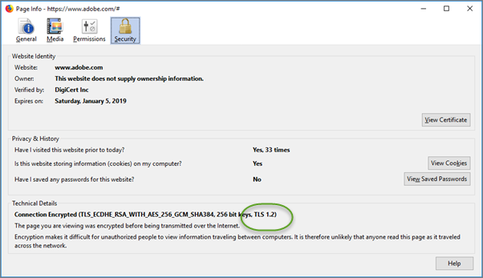

# [!UICONTROL Enhanced Experience Composer]과(와) 관련된 문제 해결

특정 조건에서 [!DNL Adobe Target] [!UICONTROL Enhanced Experience Composer]&#x200B;(EEC)에 문제가 발생하는 경우가 있습니다.

## EEC가 공용 IP에서 액세스할 수 없는 내부 QA URL을 로드하지 않습니다. {#section_D29E96911D5C401889B5EACE267F13CF}

이 문제는 다음 IP 주소를 허용 목록에 추가 하여 해결할 수 있습니다. 이러한 IP 주소는 EEC 프록시에 사용되는 Adobe 서버에 사용됩니다. 활동 편집에만 필요합니다. 사이트 방문자는 이러한 IP 주소를 허용 목록에추가된으로 사용할 필요가 없습니다.

허용 목록에 추가하다 IT 팀에 다음 IP 주소를 요청하십시오.

### 미국(va7)

40.70.154.136/29
52.254.106.240/28
52.254.106.160/28
52.254.107.16/28
20.186.185.181
20.22.83.112
20.186.185.227
52.254.106.192/28
52.254.106.0/28
52.254.107.128/28
52.254.107.80/28
52.254.106.176/28
52.254.107.32/28
52.254.105.192/28
52.254.107.64/28
52.254.106.208/28
52.254.107.0/28
52.254.106.224/28
20.14.241.153
20.186.185.239
4.152.211.251
52.254.107.144/28
52.254.106.144/28

### EMEA(nld2)

51.138.17.16/28
51.138.17.48/28
51.138.16.128/28
51.138.17.32/28
51.138.16.240/28
51.138.17.112/28
51.138.16.160/28
51.138.16.208/28
51.138.17.80/28
51.138.17.0/28
51.138.17.96/28
51.138.16.144/28
20.31.145.248
20.126.189.248
51.138.16.224/28
51.138.16.192/28
51.138.12.94
51.138.12.11
51.138.16.176/28
51.138.12.100
51.138.17.64/28
51.138.12.160/28

### APAC(호주)

20.43.104.160/28
20.227.35.177
20.40.188.227
20.43.104.112/28
20.43.104.128/28
20.43.104.144/28
20.40.188.166
20.53.206.128
20.43.104.80/28
20.43.104.16/28
20.43.105.48/28
20.43.104.96/28
20.43.104.48/28
20.40.188.194
20.43.104.32/28
20.40.191.224/28
20.43.105.16/28
20.40.191.96/28
20.43.104.176/28
20.40.191.240/28
20.43.104.64/28
20.43.105.32/28
20.43.104.192/28
20.43.105.0/28
20.43.104.0/28

### 기존 IP 주소

다음 레거시 IP 주소는 추후 공지가 있을 때까지 계속 허용 목록에추가된으로 제공되어야 합니다.

34.254.77.200
54.73.207.147
54.229.152.123
3.224.194.242
54.90.51.39
34.228.136.112
54.150.116.11
18.178.142.8
54.199.107.77
99.80.139.221
54.78.56.224
54.247.179.246
54.80.219.243
34.201.235.54
54.196.224.236
35.75.212.45
52.199.184.130
18.180.161.176

[!DNL Target]에 다음 오류 메시지가 표시될 수 있습니다.

`Error: Your website domain (ISP) is blocking the [!UICONTROL Enhanced Experience Composer]. You can allowlist the [!UICONTROL Enhanced Experience Composer]'s IP addresses or turn off [!UICONTROL Enhanced Experience Composer] in [!UICONTROL Configure] > [!UICONTROL Page Delivery] menu.`

다음은 이 오류 메시지와 상황을 수정할 조치를 볼 수 있는 이유입니다.

* **문제:** 웹 사이트 도메인(ISP)이 [!UICONTROL Enhanced Experience Composer]을(를) 차단하고 있습니다.

  허용 목록에 추가하다 위에 나열된 IP 주소를 **Remedy:**&#x200B;합니다.

* **문제:** IP 주소는 허용 목록에추가된이지만 웹 사이트에서 TLS 버전 1.2를 지원하지 않습니다. [!DNL Target]은(는) 현재 기본 구성 1.2를 사용합니다. [!DNL Target] 18.4.1(2018년 4월 25일) 이전의 기본 구성은 TLS 1.0을 지원했습니다. 자세한 내용은 [TLS(전송 계층 보안) 암호화 변경 사항](https://experienceleague.adobe.com/docs/target-dev/developer/implementation/tls-transport-layer-security-encryption.html){target=_blank}을 참조하십시오.

  **해결 방법:** 다음 질문을 참조하세요. [!UICONTROL Enhanced Visual Experience Composer]은(는) TLS 1.2를 사용하는 사이트의 보안 페이지에 로드되지 않습니다.

## EEC가 TLS 1.0를 사용하는 사이트의 보안 페이지에 로드되지 않습니다. (EEC만 해당) {#section_C5B31E3D32A844F68E5A8153BD17551F}

&quot;내 사이트의 보안 페이지에서 [!UICONTROL Enhanced Visual Experience Composer]이(가) 로드되지 않습니다.&quot;에서 위에서 설명한 오류 메시지가 표시될 수 있습니다. 위의 IP 주소가 허용 목록에추가된이지만 웹 사이트에서 TLS 버전 1.2를 지원하지 않는 경우 [!DNL Target]은(는) 현재 기본 구성 1.2를 사용합니다. [!DNL Target] 18.4.1(2018년 4월 25일) 이전의 기본 구성은 TLS 1.0을 지원했습니다. 자세한 내용은 [TLS(전송 계층 보안) 암호화 변경 사항](https://experienceleague.adobe.com/docs/target-dev/developer/implementation/tls-transport-layer-security-encryption.html){target=_blank}을 참조하십시오.

Firefox를 사용하여 웹 사이트에서 TLS 버전을 확인하려면 다음을 수행하십시오(다른 브라우저에도 유사한 단계가 있음).

1. Firefox에서 해당 웹 사이트를 엽니다.
1. 브라우저의 주소 표시줄에 있는 **[!UICONTROL Show Site Information]** 아이콘을 클릭합니다.

   

1. **[!UICONTROL Show Connection Details]** > **[!UICONTROL More Information]**&#x200B;을(를) 클릭합니다.

   

1. 기술 세부 사항 아래의 TLS 버전 정보를 검토하십시오.

   

1. 웹 사이트에서 TLS 1.0을 표시하는 경우 Target의 TLS 지원 정책에 대한 자세한 내용은 [TLS(전송 계층 보안) 암호화 변경 사항](https://experienceleague.adobe.com/docs/target-dev/developer/implementation/tls-transport-layer-security-encryption.html){target=_blank}을 참조하십시오. 현재(2018년 9월 12일까지 유효){target=_blank}의 상황을 해결하려면 [고객 지원 센터](/help/main/cmp-resources-and-contact-information.md#reference_ACA3391A00EF467B87930A450050077C)에 연락하여 TLS 버전 및 도메인을 구성하십시오.

## 프록시가 활성화된 로드할 때 시간 초과 또는 &quot;액세스 거부&quot; 오류가 표시됩니다. (EEC만 해당) {#section_60CBB9022DC449F593606C0E6252302D}

프록시 IP가 사용자 환경에서 차단되지 않았는지 확인하십시오.
