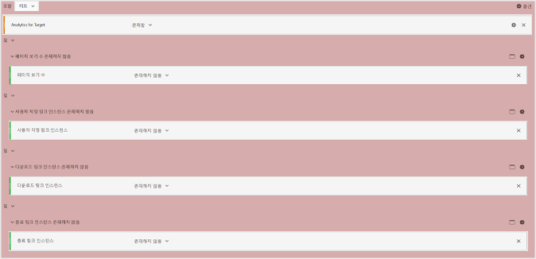

# A4T에서 부풀려진 방문 및 방문자 카운트 최소화

사용 시 부풀려진 방문 및 방문자 카운트의 효과를 최소화하는 데 도움이 되는 정보입니다 [!DNL Adobe Analytics] 를 [!DNL Adobe Target] (A4T).

>[!IMPORTANT]
>2016년 11월 14일부터 Adobe Analytics에서 타겟 분석(A4T)을 사용하는 고객에 대해 일부 데이터가 처리되는 방식이 변경되었습니다. 이러한 변경 때문에 Adobe Target 데이터가 Adobe Analytics용 데이터 모델에 더 적합해질 수 있습니다 . 이러한 변경은 A4T를 사용하는 모든 고객을 위해 롤아웃되었습니다. 이러한 변경은 특히 Target 활동이 실행 중일 때 일부 고객이 방문자 수가 부풀려졌다는 사실을 알게 되는 문제를 해결합니다.
>
>이 변경은 소급 적용되지 않습니다. 기록 보고서에 부풀려진 수가 표시되어 보고서에서 제외하고 싶은 경우, 아래 설명된 대로 가상 보고서 세트를 만들 수 있습니다.
>
>또한 부풀려진 카운트를 최소화하기 위해 여러 JavaScript 라이브러리가 업데이트되었습니다. Adobe은 다음 라이브러리 버전(또는 이상)으로 업그레이드할 것을 권장합니다.
>
>* Experience Cloud 방문자 ID 서비스: visitorAPI.js 버전 2.3.0 이상
>* Adobe Analytics: appMeasurement.js 버전 2.1.
>* Adobe Target: at.js 버전 0.9.6 이상(A4T에서 리디렉션 오퍼를 사용하는 경우 버전 1.1.0 제외)

## 변경 사항 {#section_9CCF45F5D66D48EBA88F3A178B27D986}

When [!DNL Adobe Analytics] 측정하는 데 사용됨 [!DNL Target] 활동(A4T라고 함), [!DNL Analytics] 가 없는 경우 사용할 수 없는 추가 데이터를 수집합니다 [!DNL Target] 활동 을 만들 수 있습니다. 다음 [!DNL Target] 활동은 페이지 맨 위에서 호출을 실행하지만, [!DNL Analytics] 일반적으로 페이지 하단에서 해당 데이터 수집 호출을 실행합니다. 지금까지의 A4T 구현에서 Adobe은 [!DNL Target] 활동이 활성화되었습니다. 앞으로, Adobe은 [!DNL Target] 및 [!DNL Analytics] 태그가 실행되었습니다.

## Adobe가 이 변경 작업을 수행하는 이유는 무엇입니까? {#section_92380A4BD69E4B8886692DD27540C92A}

Adobe는 데이터 정확성 및 품질에 자부심을 갖고 있습니다. 이 [!DNL Target] 태그가 실행되지만 [!DNL Analytics] 태그가 표시되지 않으면 Analytics가 &quot;부분 데이터&quot;(경우에 따라 &quot;연결되지 않은 히트&quot;라고도 함)를 기록합니다. 이 연결되지 않은 히트는 [!DNL Analytics] 만약 [!DNL Target] 활동. 에 이 부분 데이터를 포함하지만 [!DNL Analytics] 보고 기능은 추가 정보를 제공하며, 또한 기록 데이터가 없는 기간의 데이터와 불일치하게 됩니다 [!DNL Target] 실행 중인 활동. 이 상황은 다음과 같은 문제를 일으킬 수 있습니다. [!DNL Analytics] 시간에 따른 트렌드를 분석하는 사용자. 에서 데이터 일관성을 유지하기 위해 [!DNL Analytics], Adobe 는 모든 부분 데이터를 제외합니다.

## 부분 데이터에 기여하는 것은 무엇입니까? {#section_C9C906BEAA7D44DAB9D3C03932A2FEB8}

Adobe에서 일부 고객의 경우 [!DNL Analytics]. 부분 데이터의 높은 비율은 부적절한 구현으로 인해 발생할 수 있지만 정당한 사유도 있습니다.

부분 데이터에 대한 확인된 원인은 다음과 같습니다.

* **잘못 정렬된 보고서 세트 ID(구현):** 활동 설정 동안 지정된 보고서 세트가 테스트가 전달된 페이지의 보고서 세트와 일치하지 않습니다. 데이터를 조정할 수 없습니다 [!DNL Analytics] 서버이므로 부분 데이터처럼 보입니다.
* **느린 페이지:** [!DNL Target] 호출은 페이지 맨 위에 있고 [!DNL Analytics] 호출은 일반적으로 페이지 하단에 있습니다. 페이지가 느리게 로드되면 [!DNL Target] 호출, 하지만 그 전에 [!DNL Analytics] 호출. 연결이 종종 더 느려지는 모바일 웹 사이트에서는 느린 페이지가 특히 문제가 될 수 있습니다.
* **페이지 오류:** 각 터치포인트가 실행되지 않는 JavaScript 오류 또는 기타 시나리오가 있는 경우(Experience Cloud ID 서비스, Target 및 Analytics) 부분 데이터 결과가 있습니다.
* **에서 오퍼 리디렉션 [!DNL Target] 활동:** A4T를 사용하는 활동의 리디렉션 오퍼에 대해서는 구현이 특정 최소 요구 사항을 충족해야 합니다. 또한, 여러분이 알아야 할 중요한 정보가 있습니다. 자세한 내용은 [리디렉션 오퍼 - A4T FAQ](/help/main/c-integrating-target-with-mac/a4t/r-a4t-faq/a4t-faq-redirect-offers.md#section_FA9384C2AA9D41EDBCE263FFFD1D9B58)를 참조하십시오.
* **이전 버전의 라이브러리:** 지난 1년 동안 Adobe은 JavaScript 라이브러리( [!DNL appMeasurement.js], `at.js`, 및 `visitorAPI.js`)를 클릭하여 데이터가 가능한 한 효율적으로 전송되는지 확인하십시오. 구현 요구 사항에 대해 자세히 알려면 [구현하기 전에](/help/main/c-integrating-target-with-mac/a4t/before-implement.md#concept_046BC89C03044417A30B63CE34C22543)를 참조하십시오.

## 부분 데이터를 줄이는 우수 사례는 무엇입니까? {#section_065C38501527451C8058278054A1818D}

부분 데이터 수집을 줄이려면 다음 단계를 검토하십시오.

| 단계 | 작업 |
| --- | --- |
|  | 에서 선택한 보고서 세트가 있는지 확인합니다. [!DNL Target] 활동이 표시되는 페이지의 활동과 동일합니다. |
|  | visitorAPI.js, appMeasurement.js 및 at.js 라이브러리가 A4T 호환 버전에 있는지 확인합니다. 구현 요구 사항에 대해 자세히 알려면 [구현하기 전에](/help/main/c-integrating-target-with-mac/a4t/before-implement.md)를 참조하십시오. |
|  | SDID가 모두 설정되어 있는지 확인하십시오 [!DNL Target] 및 [!DNL Analytics] 페이지에서 나가는 호출과 일치하는 호출을 실행합니다. 네트워크 분석기 또는 디버깅 도구를 사용하여 `mboxMCSDID` 매개 변수 [!DNL Target] 호출은 의 SDID 매개 변수와 일치합니다 [!DNL Analytics] 호출. |
|  | 구현 라이브러리가 사이트에서 올바른 순서로 로드되는지 확인하십시오. 자세한 내용은 [Analytics for Target 구현](/help/main/c-integrating-target-with-mac/a4t/a4timplementation.md)의 8단계를 완료해야 합니다. |

## 보유한 부분 데이터양을 알려면 어떻게 해야 합니까? {#section_89B663E2824A4805AB934153508A0F4B}

이 정보를 [!DNL Analytics]에서 직접 사용할 수 없지만 Adobe 고객 지원 센터에 문의하여 부분 데이터 보고서를 검색할 수 있습니다. 이 보고서는 디버깅을 지원하기 위한 것입니다.

## 부분 데이터를 제외한 기록 추세를 보려면 어떻게 해야 합니까? {#section_4C9DED560FAD4428B362DDA2064897C3}

이 처리 변경 사항은 릴리스 날짜(2016년 11월 14일) 이후에만 데이터에 영향을 줍니다. 내역 지표를 일치하도록 조정하려면 세그먼트를 만들어 부분 데이터를 제외하는 것이 좋습니다.

이 변경 내용과 관련된 다음 정보에는 세그먼트를 정의하고 가상 보고서 세트에 적용하여 이 세그먼트가 항상 [!DNL Analytics] 보기에 적용되도록 하는 데 도움이 되는 지침이 포함되어 있습니다.

대부분의 경우 [!DNL Target] 히트는 각 웹 페이지의 [!DNL Analytics] 히트와 연결됩니다. 이 연결은 [!DNL Target]과 [!DNL Analytics] 호출 모두에서 일관된 SDID와 [!DNL Analytics] 호출의 [!DNL Experience Cloud ID] (MCID)가 동일한 페이지에 있는 경우에 발생합니다. [!DNL Target] 은 일반적으로 MCID도 포함하지만, 호출이 [!DNL Target] 방문자 ID가 반환되기 전에 발생합니다. SDID 때문에 히트가 여전히 연결됩니다. 또한 [!DNL Target] 호출이 실행된 후에 [!DNL Analytics] 호출을 실행할 수 있도록 충분히 오랫동안 사용자가 페이지에 머물러야 합니다. 이 시나리오는 이상적입니다.

**부분 데이터 히트:** 경우에 따라 사용자가 [!DNL Analytics] 호출을 전송할 만큼 충분히 오래 페이지에 머무르지 않아도 [!DNL Target]에 적절한 MCID가 유지됩니다. 이 시나리오는 부분 데이터 히트(히트가 없는 경우)를 발생시킵니다 [!DNL Analytics] 페이지 보기). 이러한 사용자가 사이트로 돌아가 다음을 포함하는 페이지를 보는 경우 [!DNL Analytics] 코드가 있어야 재방문자로 카운트됩니다. 이 히트는 만약 [!DNL Analytics] 코드가 있어야 합니다. 일부 클라이언트는 특정 지표(방문)는 부풀리고 다른 지표(방문당 페이지 보기, 방문당 시간 등)는 줄이기 때문에 이러한 히트에 대한 데이터는 원하지 않습니다. 또한 페이지 보기 없이 방문이 표시됩니다. 그러나 이러한 데이터를 유지해야 하는 적절한 이유는 여전히 있습니다.

부분 데이터 히트를 최소화하려면 페이지를 보다 빠르게 로드하거나, 라이브러리의 최신 버전으로 업데이트하거나, 해당 히트를 제외하는 [가상 보고서 세트](https://experienceleague.adobe.com/docs/analytics/components/virtual-report-suites/vrs-workflow/vrs-create.html)를 만들 수 있습니다. 단계별 지침은 [가상 보고서 세트 만들기](https://experienceleague.adobe.com/docs/analytics/components/virtual-report-suites/vrs-workflow/vrs-create.html) 에서 *Analytics 구성 요소 안내서*.

다음 그림은 가상 보고서 세트에 대한 세그먼트 정의를 보여 줍니다.

가상 보고서 세트를 만들 때 세그먼트 정의에 대해 다음 구성을 지정하십시오(위 그림 참조).

* **히트 표시:**
* Analytics for Target: 있음
* And
* 페이지 보기: 없음
* 및
* 사용자 지정 링크 인스턴스: 없음
* 및
* 다운로드 링크 인스턴스: 없음
* 및
* 종료 링크 인스턴스: 없음

**고립된 히트: ** 드문 경우이지만 사용자가 Analytics 호출을 위해 충분히 오래 페이지에 머무르지 않았으며 Target이 적절한 MCID를 얻지 못했습니다. 이러한 히트는 Adobe이 정의한 &quot;고립된&quot; 히트입니다. 이러한 히트는 거의 재방문하지 않는 고객을 나타내며, 방문 및 방문자 수를 부적절하게 부풀립니다.

이러한 &quot;고립된&quot; 히트를 최소화하기 위해 위에서 설명된 것처럼 해당 히트를 제외하는 [가상 보고서 세트](https://experienceleague.adobe.com/docs/analytics/components/virtual-report-suites/vrs-workflow/vrs-create.html)를 만들 수 있습니다.

## 이것은 내 [!DNL Target] 보고에 어떤 의미가 있습니까? {#section_AAD354C722BE46D4875507F0FCBA5E36}

이러한 변경이 발생하면 다음과 같은 이유로 라이브 테스트를 위한 신규 방문자 및 방문 횟수가 줄어드는 것을 볼 수 있습니다. [!DNL Adobe] 들어오는 부분 데이터를 처리하지 않습니다. 다른 [!DNL Analytics] 지표에 대한 전환 및 히트는 변경되지 않습니다.
