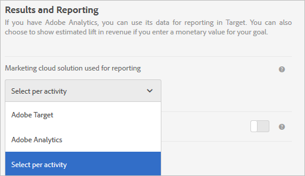

# 활동 설정 - A4T FAQ

이 주제에서는 활동 설정 및 사용에 대한 FAQ에 대한 답변을 제공합니다 [!DNL Analytics] 을(를) 위한 보고 소스로 사용 [!DNL Target] (A4T).

## 지원되는 활동 유형 [!DNL Analytics] 를 보고 소스(A4T)로 사용하시겠습니까? {#section_5E4F58CD25A5424E869E6FE0803968EF}

+++전체 목록에 대해서는 다음에서 &quot;지원되는 활동 유형&quot;을 참조하십시오. [Adobe Target용 보고 소스로서의 Adobe Analytics (A4T)](/help/main/c-integrating-target-with-mac/a4t/a4t.md#concept_7540C8C04259434AB6EE33B09F47A1DE).

+++

## A4T 보고를 사용할 때 별도의 작업 공간에서 두 활동에 대해 동일한 활동 이름을 사용할 수 있습니까?

+++답변

별도의 두 활동에 동일한 활동 이름을 사용하지 마십시오 [작업 공간](/help/main/administrating-target/c-user-management/property-channel/property-channel.md) A4T 보고를 사용 중입니다.

를 사용할 때는 이 옵션이 지원되지만 [!DNL Target] 를 사용할 때는 보고 소스로 두 활동에 동일한 활동 이름을 사용할 수 없습니다 [!UICONTROL Analytics for Target] 를 보고 소스로 사용합니다.

+++

## 목표 지표를 구성하는 동안 고급 설정에 액세스할 수 없는 이유는 무엇입니까?

+++을 사용하는 활동에 대한 답변 [!DNL Analytics] 보고 소스(A4T)로서 목표 지표는 &quot;[!UICONTROL 증분 카운트 및 사용자를 활동에 유지]&quot; 및 &quot;[!UICONTROL 노출 시마다]&quot; 설정. 이 설정은 다음과 같습니다 *아님* 구성 가능합니다.

자세한 내용은 &quot;목표 지표를 구성하는 동안 고급 설정 옵션에 액세스할 수 없는 이유는 무엇입니까?&quot;를 참조하십시오. 위치: [지표 정의 - A4T FAQ](/help/main/c-integrating-target-with-mac/a4t/r-a4t-faq/a4t-faq-metric-definition.md).

+++

## 방금 활동을 만들었습니다. 수신되는 데이터가 표시되지 않는 이유는 무엇입니까? {#section_9F8092BE4225442896F926540292F221}

+++답변 활동이 만들어지면, [!DNL Target] 분류 파일을 (으)로 전송합니다. [!DNL Analytics]. 그러나 [!DNL Analytics] 는 데이터를 캡처하고 처리하며 분류 파일이 업데이트될 때까지 보고서에 표시되지 않습니다. 이 프로세스를 완료하는 데 24~72시간이 걸릴 수 있습니다. 72시간 후에도 데이터가 표시되지 않으면 [고객 지원 센터 문의](/help/main/cmp-resources-and-contact-information.md#reference_ACA3391A00EF467B87930A450050077C). 또는 활동을 시작하는 것을 알고 있는 경우 며칠 전에 활동을 만들 수 있으며 활동이 저장되면 분류가 전송됩니다. 이렇게 하면 활동이 실행될 때 데이터가 보고서에 표시됩니다. 데이터를 처리하는 데 45-90분이 소요됩니다 [!DNL Analytics].

+++

## 활동을 만들 때 Analytics를 보고 소스로 선택할 수 없는 이유는 무엇입니까? {#section_9F4F69C3085F4C2480AF439127EB27CD}

+++답변 변경 가능 [!UICONTROL 보고 설정] 의 옵션 [!UICONTROL 관리].

1. 위치 [!DNL Target], 클릭 **[!UICONTROL 관리]**.
1. **[!UICONTROL 보고에 사용된 Experience Cloud 솔루션]** 드롭다운 목록에서 **[!UICONTROL 활동당 선택]**&#x200B;을 클릭합니다.

**[!UICONTROL 보고 소스]** 드롭다운 목록이 **[!UICONTROL 목표 및 설정]** 화면에서 활성화되어 활동을 만들고 편집할 수 있습니다.

항상 사용 [!DNL Analytics] 를 보고 소스로 선택합니다. **[!UICONTROL Adobe Analytics]** 의 드롭다운 목록에서 [!UICONTROL 관리].

+++

## A4T를 사용하는 자동 타겟 활동의 여러 방문에서 방문자가 타겟팅과 통제 경험 사이를 전환할 수 있습니까?

+++대답 visitorId가 방문 사이에 방문자에 대해 변경되지 않는다고 가정할 경우 다음은 true입니다.

활동 중간에 트래픽 할당 비율을 조정하면 방문자가 타겟팅된 경험과 제어 경험 사이를 이동할 수 있습니다.

백분율이 활동 중간에 조정되지 않으면 처음에 컨트롤을 본 방문자가 항상 컨트롤로 전송됩니다. 타겟팅된 경험으로 전송되는 방문자는 항상 타겟팅된 경험으로 전송됩니다.

* 트래픽의 타겟팅된 &quot;버킷&quot;에 있었던 방문자는 머신 러닝 모델에서 다른 경험이 새 방문과 관련이 있다고 판단되면 방문자가 방문과는 다른 경험으로 보내질 수 있습니다.
* 트래픽의 제어 &quot;버킷&quot;에 할당된 후 경험 할당은 방문자의 visitorId의 결정론적 의사 무작위 해시를 기반으로 하므로 방문자는 항상 동일한 경험을 보게 됩니다.

+++

## 이항식을 사용할 수 있습니까 [!DNL Analytics] 세그먼트가 의 최적화 목표로 적용된 지표 [!UICONTROL 자동 할당] 활동? {#binomial}

+++답변: [!DNL Analytics] 세그먼트가 의 최적화 목표로 적용된 지표 [!UICONTROL 자동 할당] 활동. 해결 방법으로, 동일한 목표를 달성하는 사용자 정의 이벤트를 정의하고 이 이벤트를 최적화 목표 지표로 사용할 수 있습니다.

+++