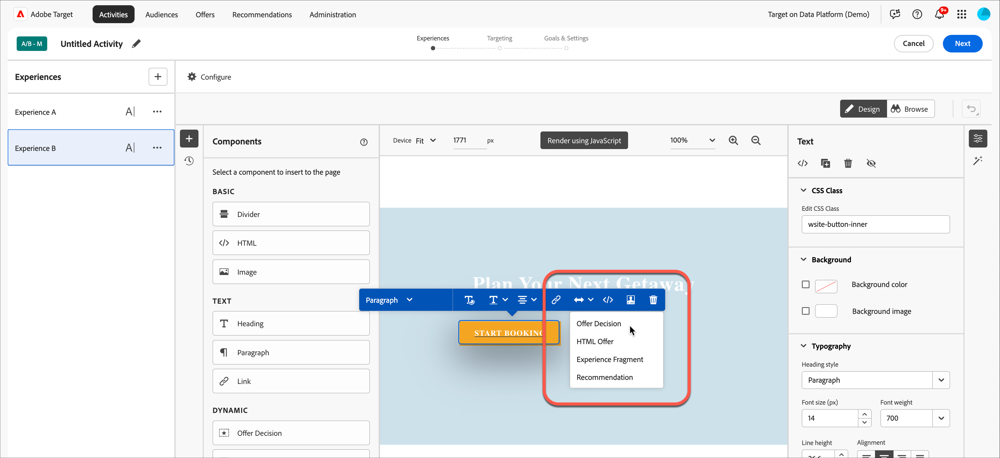

# 오퍼 의사 결정 사용

[!DNL Adobe Journey Optimizer] 오퍼 의사 결정과 함께 [!DNL Adobe Target]을(를) 사용하여 웹 및 모바일에서 방문자에 대한 다음 최상의 오퍼를 결정하고 전달합니다.

[!UICONTROL Visual Experience Composer](VEC) 또는 [!UICONTROL Form-Based Composer]을(를) 사용하여 [!DNL Adobe Journey Optimizer]에서 만든 오퍼 결정을 [!DNL Target] 활동(수동 [!UICONTROL A/B Test] 또는 [!UICONTROL Experience Targeting])에 추가하여 [!DNL Target]에서 제공하는 인바운드 채널에서 방문자에게 개인화된 오퍼를 테스트하고 전달합니다.

[!DNL Adobe Journey Optimizer] 및 오퍼 결정에 대한 자세한 내용은 *[!DNL Journey Optimizer]* 설명서에서 다음 항목을 참조하십시오.

* [Journey Optimizer 시작](https://experienceleague.adobe.com/docs/journey-optimizer/using/get-started/get-started.html)

* [의사 결정 관리 정보](https://experienceleague.adobe.com/docs/journey-optimizer/using/offer-decisioning/get-started-decision/starting-offer-decisioning.html?lang=ko-KR)

## 전제 조건

[!DNL Target]에서 오퍼 결정을 사용하려면 다음이 필요합니다.

* [Adobe Experience Platform Web SDK](https://experienceleague.adobe.com/docs/target-dev/developer/client-side/aep-web-sdk.html){target=_blank}를 사용하여 [!DNL Adobe Target Standard] 또는 [!DNL Adobe Target Premium]을(를) 구현했습니다.

  at.js 또는 다른 [!DNL Target] SDK를 사용하여 [!DNL Target]을(를) 구현할 때는 이 기능을 사용할 수 없습니다.

* [!DNL Adobe Journey Optimizer Ultimate](AJO + Offer decisioning) 또는 [!DNL Adobe Experience Platform] 및 [!UICONTROL Offer Decisioning] 응용 프로그램 서비스 추가 기능입니다.

## 샘플 사용 사례

다음 예는 [!DNL Target]/[!DNL Adobe Journey Optimizer] 통합을 사용하여 [!DNL Target] 활동에서 오퍼 결정을 사용하는 방법에 대한 사용 사례입니다.

### 스포츠 머천다이징

스포츠 리그의 마케터는 홈페이지(데스크탑 및 모바일 웹 사이트 모두)에서 콘텐츠를 개인화할 수 있습니다. 다차원 기반의 콘텐츠를 개인화하고 관련 프랜차이즈 상품을 쇼핑할 수 있는 오퍼를 제시하고자 합니다. 다음에 관심이 있습니다.

* 방문자가 가장 좋아하는 팀
* 최근 선수/선수 활동(예: 팀 이동, 계약 업데이트 또는 부상)

예를 들어, 도르트문트, 프랑크푸르트, 보훔 등의 각 지역과 이러한 팀의 암시적이고 명시적인 팬인 사용자에게 개인화된 경험을 제공하려고 합니다. 지표로, 상품 사이트 방문 횟수 및 클릭 수를 확인하고자 합니다.

기본 경험과 개인화된 경험(각 지역 및 팀에 대한 오퍼와 함께 오퍼 결정 포함) 간의 [!UICONTROL A/B Test] 활동(50/50 분할)을 디자인하려고 합니다. 이 활동을 사용하여 개인화된 경험과 제어에 대한 전환 및 상승도를 결정하려고 합니다.

### 게임 스트리밍 플랫폼

게임 조직의 마케터로서 독일, 프랑스, 멕시코, 브라질 등 다양한 지역의 데스크탑 및 모바일 사용자를 위한 게임 스트리밍 플랫폼을 위한 개인화된 오퍼를 제공하고자 합니다. 방문자가 이러한 지역 중 하나에서 데스크탑 또는 모바일 웹 사이트에 액세스하면 로컬 언어로 게임 스트리밍에 대한 오퍼를 로컬 통화에 대한 해당 가격과 함께 제공하려고 합니다.

[!DNL Adobe Journey Optimizer]에서 타깃팅된 각 지역에 대해 개인화된 홈 페이지 주인공 오퍼와 기본 홈 페이지 주인공이 있는 대체 오퍼를 만들 수 있습니다. 그런 다음 이러한 오퍼와 해당 자격 규칙을 통합하는 오퍼 결정을 만들 수 있습니다. 그런 다음 [!DNL Target]에서 [!DNL Experience Targeting](XT) 활동을 만들고 데스크탑 또는 모바일 웹 사이트에 해당 오퍼 결정을 삽입하여 방문자에게 개인화된 경험을 제공할 수 있습니다.

## 오퍼 결정을 사용하는 경험을 만듭니다.

1. [!UICONTROL Visual Experience Composer](VEC)에서 수동 [!UICONTROL A/B Test] 또는 [!UICONTROL Experience Targeting](XT) 활동을 편집하거나 만드는 동안 페이지 요소를 클릭하여 [옵션 메뉴](/help/main/c-experiences/c-visual-experience-composer/viztarget-options.md)를 표시합니다.

   

   >[!NOTE]
   >
   >[[!UICONTROL Form-Based Experience Composer]](/help/main/c-experiences/form-experience-composer.md)에서 [!UICONTROL Offer Decisions]을(를) 사용하는 경험을 만들 수도 있습니다.

1. **[!UICONTROL Insert Before]**, **[!UICONTROL Insert After]** 또는 **[!UICONTROL Replace Content]**&#x200B;을(를) 클릭한 다음 **[!UICONTROL Offer Decision]**&#x200B;을(를) 클릭합니다.

   [!UICONTROL Offer Decision] 옵션은 [수동 [!UICONTROL A/B Test]](/help/main/c-activities/t-test-ab/test-ab.md#types) 또는 [[!UICONTROL Experience Targeting]](/help/main/c-activities/t-experience-target/experience-target.md)(XT) 활동을 편집하거나 만들 때만 사용할 수 있습니다. 이 옵션은 다른 활동 유형에는 사용할 수 없습니다. 메뉴에서 사용할 수 있는 옵션은 선택한 요소에 따라 달라집니다.

   

1. **[!UICONTROL Add Offer Decision]** 대화 상자에서 원하는 샌드박스와 배치를 선택합니다.

   [!DNL Adobe Experience Platform]의 [샌드박스](https://experienceleague.adobe.com/docs/experience-platform/sandbox/ui/overview.html){target=_blank}을(를) 사용하면 인스턴스를 가상 환경으로 분할할 수 있습니다. 예를 들어 프로덕션 환경과 스테이징 환경이 있을 수 있습니다. [!DNL Adobe Journey Optimizer]의 [placement](https://experienceleague.adobe.com/docs/journey-optimizer/using/offer-decisioning/create-components/creating-placements.html){target=_blank}을(를) 사용하면 올바른 오퍼 콘텐츠가 올바른 위치에 표시되는지 확인할 수 있습니다.

   

1. 원하는 오퍼 결정을 선택한 다음 **[!UICONTROL Create]**&#x200B;을(를) 클릭합니다.

   

   웹 사이트가 VEC에 표시되고 오른쪽의 [!UICONTROL Modifications] 창에서 새로 만든 오퍼 결정을 볼 수 있습니다. 수정 사항을 마우스로 가리킨 다음 [!UICONTROL Preview] 아이콘을 클릭하여 오퍼 결정을 검사할 수 있습니다.

   

   대체 오퍼를 포함하여 [!UICONTROL Offer Preview] 대화 상자 아래쪽에 있는 적절한 아이콘을 클릭하여 오퍼에 포함된 다양한 오퍼를 검사할 수 있습니다. 대체 오퍼는 방문자가 컬렉션에 있는 개인화된 오퍼에 대한 자격이 없을 때 표시되는 기본 오퍼입니다.

   

1. 안내가 있는 3부분 워크플로의 [!UICONTROL Targeting] 및 [!UICONTROL Goals & Settings] 단계를 완료하여 활동 만들기를 완료합니다.

   >[!IMPORTANT]
   >
   >[!DNL Target] 활동이 개인화되도록 하려면 현재 활동 시작/종료 날짜가 [!DNL Adobe Journey Optimizer]의 오퍼 결정의 시작/종료 날짜와 동기화되어 있는지 확인하십시오. [!DNL Target] 시작/종료 날짜가 오퍼 결정의 시작/종료 날짜 범위를 벗어나는 경우 기본 [!DNL Target] 콘텐츠가 방문자에게 표시됩니다.

   

## 참고 사항 및 제한 사항

오퍼 결정을 사용할 때 다음 정보를 고려하십시오.

* offer decisioning 통합은 [Adobe Experience Platform Web SDK](https://experienceleague.adobe.com/docs/target-dev/developer/client-side/aep-web-sdk.html){target=_blank}를 기반으로 [!DNL Target] 구현에 대해 작동합니다. at.js 또는 다른 [!DNL Target] SDK를 사용하여 [!DNL Target]을(를) 구현하는 경우에는 이 기능을 사용할 수 없습니다.

* [!DNL Target]/[!DNL Adobe Journey Optimizer] 통합은 [수동 [!UICONTROL A/B Test]](/help/main/c-activities/t-test-ab/test-ab.md#types) 및 [[!UICONTROL Experience Targeting]](/help/main/c-activities/t-experience-target/experience-target.md)(XT) 활동만 지원합니다. 이 기능은 다른 활동 유형에는 사용할 수 없습니다.

* 활동에서 오퍼 결정을 사용하는 경우 [[!UICONTROL Analytics as the reporting source]](/help/main/c-integrating-target-with-mac/a4t/a4t.md)(A4T)을(를) 사용할 수 없습니다. 활동에서 오퍼 결정을 사용하는 경우 활동 설정 중 [!UICONTROL Goals and Settings] 페이지에서 [!DNL Target]을(를) 보고 소스로 선택합니다.

* 텍스트/html 컨텐츠 유형의 오퍼는 deliveryURL 컨텐츠 전달을 지원하지 않습니다. deliveryURL은 클라이언트가 컨텐츠를 명시적으로 가져오고 작성하는 경우에만 [양식 기반 경험 작성기](/help/main/c-experiences/form-experience-composer.md)를 통해 지원됩니다.

* [!DNL Target] 보고에서는 오퍼 결정 수준 보고를 제공하지 않습니다.

* 오퍼 결정을 포함하는 [!DNL Target] 경험에 대해 [QA 링크](/help/main/c-activities/c-activity-qa/activity-qa.md)을(를) 시각화하는 것은 해당 오퍼 결정에 대한 [!DNL Adobe Journey Optimizer]의 빈도 제한 설정에 영향을 줍니다.
