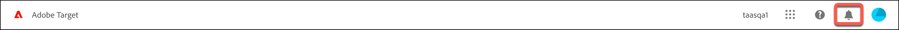

# [!DNL Target] UI 이해

사용자 인터페이스는 [!DNL Adobe Target]을 최대한 활용할 수 있도록 논리적이고 사용자에게 친숙한 형식으로 배열되어 있습니다. 다음의 간략한 개요는 [!DNL Target]에 익숙해지는 데 도움이 되며, 자세한 정보 및 단계별 지침을 위한 링크를 제공합니다.

[!DNL Target] UI 위쪽의 헤더에는 솔루션의 다양한 기능을 탐색하는 데 도움이 되는 탭과 옵션이 포함되어 있습니다. 조직 및 [!DNL Adobe Experience Cloud] 솔루션을 전환하고, 도움말과 알림을 받고, [!DNL Adobe] 프로필을 관리하고, [!DNL Target]에서 로그아웃할 수도 있습니다.

왼쪽의 탭을 통해 [!DNL Target]의 다양한 기능에 액세스할 수 있습니다. 자세한 내용은 뒤에서 참조하십시오. 먼저 탭으로 이동하기 전에 오른쪽의 옵션에 대해 설명하겠습니다.

## 조직

*조직* 은 관리자가 그룹과 사용자를 구성하고, [!DNL Adobe Experience Cloud]에서 단일 사인온을 제어할 수 있도록 해 주는 엔티티입니다. 조직은 모든 [!DNL Experience Cloud] 제품 및 솔루션을 포괄하는 로그인 회사와 같은 기능을 합니다. 대부분의 경우 조직은 회사 이름입니다. 그렇지만 한 회사에 여러 조직이 있을 수 있습니다.

회사에 여러 조직이 있는 경우 [!UICONTROL Organization] 드롭다운 목록에서 원하는 조직을 선택하십시오.

## 앱

앱 전환기를 사용하면 액세스할 수 있는 [!DNL Adobe Experience Cloud] 솔루션에 빠르게 액세스할 수 있습니다.

## 도움말

도움말 아이콘을 사용하면 정보, 비디오, 블로그 등에 액세스하여 [!DNL Target] 을 보다 효과적으로 사용할 수 있습니다. 지원 티켓을 만들거나 지원 전화번호를 찾거나 Twitter으로 질문하거나 [!DNL Target]에 대한 피드백을 제공하여 [!DNL Target] 팀이 어떻게 하고 있는지 알 수 있습니다.

## 알림 및 공지 {#notifications-announcements}

[!UICONTROL Notifications] 및 [!UICONTROL Announcements] 패널을 통해 [!DNL Adobe Target]에 대한 모든 정보를 최신 상태로 유지할 수 있습니다. 사전 알림을 통해 [!DNL Adobe Experience Cloud]개 솔루션 및 [!DNL Target]개 이벤트의 상태를 파악할 수 있습니다. 사전 알림은 중단 이벤트 및 유지 관리 이벤트를 알려 줍니다.

알림을 보려면 헤더에서 벨 아이콘을 클릭합니다.

알림 및 공지를 위한 

패널에 [!UICONTROL Notifications] 및 [!UICONTROL Announcements]에 대한 탭이 있습니다.

다음 섹션에는 각 탭과 알림 및 공지를 구성하는 방법에 대한 정보가 포함되어 있습니다.

### 알림 {#notifications}

[!DNL Target] 이벤트 알림에는 다음이 포함됩니다.

* **활동**: 활동이 승인되거나 비활성화될 때 수동으로 또는 시작 또는 종료 날짜에 도달하면 모든 활동 유형에 대한 알림입니다. 알림에는 활동의 개요 페이지에 대한 링크가 있는 활동의 이름이 포함되어 있습니다.

  알림은 구성 가능하며 기본적으로 [!DNL Target Premium] 계정에 대한 활동의 작업 영역에서 제품 관리자, 게시자 및 승인자가 받습니다. [!DNL Target Standard] 계정의 경우 모든 게시자 및 승인자가 알림을 받습니다.

  알림은 다음 샘플과 같은 형식으로 되어 있습니다.

   * `Activity {target.activity.name} has been activated`

   * `Activity {target.activity.name} has been deactivated`

* **프로필 스크립트**: 프로필 스크립트가 수동으로 또는 [!DNL Target]에 의해 활성화되거나 비활성화될 때의 알림입니다.

  알림은 구성 가능하며 기본적으로 제품 관리자와 승인자가 [!DNL Target Premium] 및 [!DNL Target Standard] 계정 모두에 대해 받고 있습니다.

  알림은 다음 샘플과 같은 형식으로 되어 있습니다.

   * `Profile Script {target.profileScript.name} has been activated`
   * `Profile Script {target.profileScript.name} has been deactivated`

* **Recommendations 피드**: [!DNL Recommendations] 피드가 수동으로 또는 [!DNL Target]에 의해 활성화되거나 비활성화될 때의 알림입니다. [!DNL Recommendations] 피드가 실패하면 알림도 전송됩니다.

  알림은 구성 가능하며 기본적으로 [!DNL Target Premium] 계정에 대해 제품 관리자와 승인자가 수신합니다. [!DNL Recommendations]은(는) [!DNL Target Premium] 기능이며 [!DNL Target Standard]에서 사용할 수 없습니다.

  알림은 다음 샘플과 같은 형식으로 되어 있습니다.

   * `Feed  {target.feed.name} has been activated`
   * `Feed {target.feed.name} has been deactivated`
   * `Feed {target.feed.name} has failed`
   * `Feed {target.feed.name} has failed to import from source`

원하는 알림 위로 마우스를 이동한 다음 확인 표시를 클릭하여 개별 알림을 읽은 상태로 표시할 수 있습니다. 패널 하단의 [!UICONTROL "Mark as Read"] 또는 [!UICONTROL "View All"]을(를) 클릭하여 모든 알림을 읽음으로 표시하거나 모든 알림을 볼 수 있습니다.

알림을 마우스로 가리키고 &quot;[!UICONTROL Remind me]&quot; 아이콘을 클릭한 다음 알림을 받으려는 시간(5분, 15분, 1시간 또는 내일)을 선택하여 알림을 다시 받도록 미리 알림을 설정할 수도 있습니다.

### 공지

사전 알림은 중단 이벤트 및 유지 관리 이벤트를 알려 줍니다.

자세한 내용은 [Adobe 상태](https://status.adobe.com/) 페이지에서 확인할 수 있습니다.

### 알림 및 공지 구성

알림 환경 설정을 편집하려면:

1. 톱니바퀴 아이콘을 클릭한 다음 **[!UICONTROL Notifications]**&#x200B;을(를) 클릭합니다.
1. **[!UICONTROL Target]**&#x200B;에서 **[!UICONTROL Customize]**&#x200B;을(를) 클릭합니다.
1. 알림을 수신할 범주 선택 또는 선택 해제:

   * 요청: 다른 사용자가 개체를 승인하거나 개체에 대한 액세스 권한을 부여하기 위한 요청을 전송하는 경우입니다. 이 범주에서 구독을 취소할 수 없습니다.
   * 나에게 할당됨: 다른 사용자가 개체를 귀하에게 할당할 때.
   * 언급: 다른 사용자가 귀하를 댓글에서 언급할 때.
   * 새 릴리스: 액세스 권한이 있는 제품 또는 서비스에 새 릴리스를 사용할 수 있는 경우.
   * 나와 공유: 다른 사용자가 사용자와 오브젝트를 공유할 때입니다.
   * 콘텐츠 업데이트: 다른 사용자가 귀하가 만들었거나 팔로우하는 개체를 편집, 삭제 또는 댓글을 다는 경우.
   * 기타:

   >[!NOTE]
   >
   >[!DNL Target]에 적용되는 알림 범주는 &quot;새 릴리스&quot; 및 &quot;콘텐츠 업데이트&quot;뿐입니다. 다른 범주는 다른 Adobe 솔루션에 적용됩니다.

1. 높은 우선 순위로 간주할 범주를 선택합니다.
1. 브라우저에 경고를 표시할 알림을 선택합니다.

   이러한 경고는 브라우저의 오른쪽 상단 모서리에 몇 초 동안 표시됩니다. 우선 순위가 높은 범주, 모든 범주를 확인하거나 모든 알림 팝업을 숨기도록 선택할 수 있습니다. 알림을 닫을 때까지 알림을 표시할지 또는 알림 기간을 구성할 수도 있습니다.

1. 알림 이메일을 받을 빈도 선택:

   * 이메일 전송 안 함
   * 인스턴트 알림
   * 일별 요약
   * 주별 다이제스트

## 프로필

프로필 아바타를 클릭하여 [!DNL Adobe Experience Cloud] 환경 설정을 편집하거나 [!DNL Target]에서 로그아웃합니다. [!DNL Adobe] 프로필에 액세스하거나 편집할 수도 있습니다.

이제 [!DNL Target] 헤더 왼쪽에 있는 탭에 대해 설명하겠습니다.

## 활동

[!DNL Target]을(를) 열 때 **[!UICONTROL Activities]** 목록이 기본 보기입니다. 이 페이지에서 활동을 만들고 기존 활동을 관리할 수 있습니다.

[!DNL Target]에서 사용할 수 있는 활동 유형에 대한 자세한 내용과 [!UICONTROL Activity] 목록의 사용자 인터페이스에 대한 자세한 내용은 [활동](/help/main/c-activities/activities.md)을 참조하세요.

## 대상자

대상을 만들고 기존 대상을 관리할 수 있는 [!UICONTROL Audiences] 목록을 표시하려면 **[!UICONTROL Audiences]** 탭을 클릭하십시오.

대상은 타깃팅된 활동을 보는 유사한 활동 참여자의 그룹입니다. 대상자는 새 방문자, 재방문자 또는 중서부의 재방문자와 같이 동일한 특성을 가진 사람 그룹입니다. [!UICONTROL Audience] 기능을 사용하면 적절한 시간에 적절한 사람에게 적절한 메시지를 표시하여 웹 마케팅을 최적화하도록 다양한 콘텐츠 및 경험을 특정 대상에 타깃팅할 수 있습니다. 방문자가 타깃 대상자의 일부로 식별되면 [!DNL Target] 은 활동 작성 중에 정의된 기준에 따라 표시할 경험을 결정합니다.

[!DNL Target]의 대상 유형에 대한 자세한 내용과 [!UICONTROL Audience] 목록의 사용자 인터페이스에 대한 자세한 내용은 [대상 만들기](/help/main/c-target/c-audiences/create-audience.md)를 참조하십시오.

## 오퍼

경험 및 오퍼를 만들고 기존 경험 및 오퍼를 관리할 수 있는 [!UICONTROL Offers] 목록을 표시하려면 **[!UICONTROL Offers]** 탭을 클릭하십시오.

경험은 구매 단계 또는 다른 논리적 페이지 순서를 구성하는 페이지, 전체 웹 페이지 또는 페이지 세트에 있는 오퍼, 이미지, 텍스트, 버튼, 비디오, 이러한 여러 요소의 조합일 수 있습니다. 음성 도우미, 고객 서비스 스크립트 또는 음료 자판기의 개인화된 향에 대한 답변일 수도 있습니다. [!DNL Target] 활동에서 경험을 테스트하거나 개인화합니다.

[!DNL Target]의 오퍼 형식에 대한 자세한 내용과 [!UICONTROL Offer] 목록의 사용자 인터페이스에 대한 자세한 내용은 [오퍼](/help/main/c-experiences/c-manage-content/manage-content.md)를 참조하십시오.

## Recommendations

[!DNL Target Recommendations]에 액세스하려면 **[!UICONTROL Recommendations]** 탭을 클릭하십시오.

>[!NOTE]
>
>권장 사항 활동은 [!DNL Target Premium] 솔루션의 일부로 사용할 수 있습니다 . 이 기능은 [!DNL Target Standard] 라이선스가 없는 [!DNL Target Premium] 에서는 사용할 수 없습니다. 자세한 내용은 [Target 소개](/help/main/c-intro/intro.md#premium) 에서 *Target Premium* 을 참조하십시오.

[!UICONTROL Recommendations] 활동은 이전 사용자 활동이나 기타 알고리즘을 기반으로 고객의 흥미를 끌 수 있는 제품이나 콘텐츠를 자동으로 표시합니다. 권장 사항은 고객이 모를 수 있는 관련 항목을 고객에게 표시하는 데 도움이 됩니다.

[!DNL Target]의 [!UICONTROL Recommendations]에 대한 자세한 내용과 [!UICONTROL Recommendations] 사용자 인터페이스에 대한 자세한 내용은 [Recommendations](/help/main/c-recommendations/recommendations.md)을(를) 참조하십시오.

## 관리

[!UICONTROL Administration] 페이지에 액세스하려면 **[!UICONTROL Administration]** 탭을 클릭하십시오.

[!UICONTROL Administration] 페이지에서는 [!UICONTROL Visual Experience Composer] (VEC), 보고, [!DNL Scene7] 구성, 구현, 호스트, 환경, 응답 토큰 및 사용자에 대한 구성 설정을 포함하여 [!DNL Target]을(를) 관리할 수 있습니다.

자세한 내용 및 사용자 인터페이스에 대해 알아보려면 [Target 관리 개요](/help/main/administrating-target/administrating-target.md) 를 참조하십시오.
