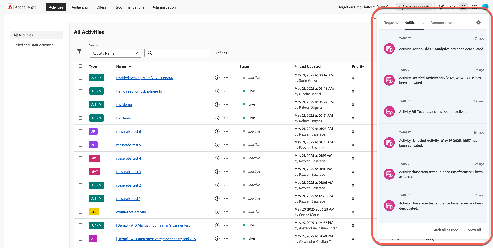

# [!DNL Target] UI 이해

사용자 인터페이스는 [!DNL Adobe Target]을 최대한 활용할 수 있도록 논리적이고 사용자에게 친숙한 형식으로 배열되어 있습니다. 다음 간단한 개요는 다음을 친숙화하는 데 도움이 됩니다 [!DNL Target] 및 은 보다 심층적인 정보 및 단계별 지침을 위한 링크를 제공합니다.

상단 헤더입니다. [!DNL Target] UI에는 솔루션의 다양한 기능을 탐색하는 데 도움이 되는 탭 및 옵션이 포함되어 있습니다. 조직 및 [!DNL Adobe Experience Cloud] 솔루션, 도움말 및 알림 받기, 관리 [!DNL Adobe] 프로필 및 [!DNL Target].

왼쪽 탭을 사용하여 [!DNL Target]: 나중에 논의됩니다. 먼저 탭으로 이동하기 전에 오른쪽의 옵션에 대해 설명하겠습니다.

## 조직

*조직* 은 관리자가 그룹과 사용자를 구성하고, [!DNL Adobe Experience Cloud]에서 단일 사인온을 제어할 수 있도록 해 주는 엔티티입니다. 조직은 모든 [!DNL Experience Cloud] 제품 및 솔루션을 포괄하는 로그인 회사와 같은 기능을 합니다. 대부분의 경우 조직은 회사 이름입니다. 그렇지만 한 회사에 여러 조직이 있을 수 있습니다.

회사에 여러 조직이 있는 경우 [!UICONTROL 조직] 드롭다운 목록에서 원하는 조직을 선택합니다.

## 앱

앱 전환기를 사용하면 액세스할 수 있는 [!DNL Adobe Experience Cloud] 솔루션에 빠르게 액세스할 수 있습니다.

## 도움말

도움말 아이콘을 사용하면 정보, 비디오, 블로그 등에 액세스하여 [!DNL Target] 을 보다 효과적으로 사용할 수 있습니다. 지원 티켓을 만들거나, 지원 전화 번호를 찾거나, Twitter을 통해 질문을 하거나, 피드백을 제공할 수 있습니다 [!DNL Target] 어떻게 하는지 알려주세요 [!DNL Target] 팀도 하고 있어

## 알림 및 공지

[!UICONTROL 알림] 및 [!UICONTROL 공지] 패널을 사용하면 [!DNL Adobe Target]에 대한 모든 정보를 최신 상태로 유지할 수 있습니다. 사전 알림은 을 통해 [!DNL Adobe Experience Cloud] 솔루션 및 [!DNL Target] events. 사전 알림은 중단 이벤트 및 유지 관리 이벤트를 알려 줍니다.

>[!NOTE]
>
>향상된 기능에 대한 정보 [!UICONTROL 알림 및 공지] 현재 이 섹션의 패널은 [!DNL Target] 고객 및 은 향후 몇 개월 동안 모든 고객에게 제공됩니다.

알림을 보려면 헤더에서 종 아이콘을 클릭하십시오.

이 패널에는 다음에 대한 탭이 포함되어 있습니다 [!UICONTROL 알림 을 참조하십시오] 및 [!UICONTROL 공지].

다음 섹션에는 각 탭에 대한 정보와 알림 및 알림을 구성하는 방법이 포함되어 있습니다.

### 알림

[!DNL Target] 이벤트 알림에는 다음이 포함됩니다.

* **활동**: 활동이 승인되거나 비활성화될 때, 수동으로 또는 시작 또는 종료 날짜에 도달하면 모든 활동 유형에 대한 알림입니다. 알림에는 활동의 개요 페이지에 대한 링크가 있는 활동의 이름이 포함되어 있습니다.

   알림은 구성 가능하며, 기본적으로 활동의 작업 공간에서 제품 관리자, 게시자 및 승인자가 수신합니다. [!DNL Target Premium] 계정. 대상 [!DNL Target Standard] 계정, 알림은 모든 게시자 및 승인자가 받습니다.

   알림은 다음 샘플과 같이 형식이 지정됩니다.

   * `Activity {target.activity.name} has been activated`

   * `Activity {target.activity.name} has been deactivated`

* **프로필 스크립트**: 프로필 스크립트가 수동으로 또는 별로 활성화되거나 비활성화될 때의 알림 [!DNL Target].

   알림은 구성 가능하며, 제품 관리자와 승인자 모두 기본적으로 수신됩니다 [!DNL Target Premium] 및 [!DNL Target Standard] 계정.

   알림은 다음 샘플과 같이 형식이 지정됩니다.

   * `Profile Script {target.profileScript.name} has been activated`
   * `Profile Script {target.profileScript.name} has been deactivated`

* **Recommendations 피드**: 알림 시점 [!DNL Recommendations] 피드는 수동으로 또는 [!DNL Target]. 알림 은 [!DNL Recommendations] 피드에 실패했습니다.

   알림은 구성 가능하며, 기본적으로 제품 관리자와 승인자가 [!DNL Target Premium] 계정. [!DNL Recommendations] is [!DNL Target Premium] 기능은에서 사용할 수 없습니다. [!DNL Target Standard].

   알림은 다음 샘플과 같이 형식이 지정됩니다.

   * `Feed  {target.feed.name} has been activated`
   * `Feed {target.feed.name} has been deactivated`
   * `Feed {target.feed.name} has failed to import from source`

원하는 알림 위로 마우스를 이동한 다음 확인 표시를 클릭하여 개별 알림을 읽음으로 표시할 수 있습니다. 를 클릭하여 모든 알림을 읽음으로 표시하거나 모든 알림을 볼 수 있습니다 [!UICONTROL &quot;읽은 상태로 표시&quot;] 또는 [!UICONTROL &quot;모두 보기&quot;] 패널 하단에 있습니다.

알림을 마우스로 가리키고 &quot;[!UICONTROL 알림]&quot; 아이콘을 클릭한 다음 알림을 받을 시점을 선택합니다. 5분, 15분, 1시간 또는 내일

### 공지

사전 알림은 중단 이벤트 및 유지 관리 이벤트를 알려 줍니다.

자세한 내용은 [Adobe 상태](https://status.adobe.com/) 페이지에서 확인할 수 있습니다.

### 알림 및 공지 구성

알림 환경 설정을 편집하려면 다음을 수행하십시오.

1. 톱니바퀴 아이콘을 클릭하고 **[!UICONTROL 알림 을 참조하십시오]**.
1. 아래 **[!UICONTROL Target]**&#x200B;를 클릭합니다. **[!UICONTROL 사용자 지정]**.
1. 알림을 받을 카테고리를 선택하거나 선택 취소합니다.

   * 요청: 누군가 사용자에게 객체를 승인하거나 객체에 대한 액세스 권한을 부여하기 위한 요청을 보낼 때. 이 카테고리에서 구독을 취소할 수 없습니다.
   * 지정 대상: 어떤 사람이 사용자에게 객체를 할당할 때.
   * 언급: 누군가 언급 할 때.
   * 새로운 릴리스: 액세스 권한이 있는 제품이나 서비스에 대해 새 릴리스를 사용할 수 있는 경우.
   * 나와 공유: 누군가 사용자와 객체를 공유할 때
   * 컨텐츠에 대한 업데이트: 사용자가 만들거나 따르는 개체에 대해 편집, 삭제 또는 주석을 수행할 때.
   * 기타:

   >[!NOTE]
   >
   >&quot;새 릴리스&quot; 및 &quot;콘텐츠 업데이트&quot;는 다음에 적용되는 유일한 알림 카테고리입니다 [!DNL Target]. 다른 카테고리는 다른 Adobe 솔루션에 적용됩니다.

1. 우선 순위로 간주할 카테고리를 선택합니다.
1. 브라우저에 경고를 표시할 알림을 선택합니다.

   이러한 경고는 브라우저 의 오른쪽 상단 모서리에 몇 초 동안 표시됩니다. 우선 순위가 높은 카테고리, 모든 카테고리를 표시하도록 선택하거나, 모든 알림 팝업을 숨기도록 선택할 수 있습니다. 알림을 무시하거나 알림 기간을 구성할 수 있을 때까지 알림을 계속 표시할지 여부를 구성할 수도 있습니다.

1. 알림 이메일을 받을 빈도를 선택합니다.

   * 전자 메일 보내기 안 함
   * 인스턴트 알림
   * 일별 다이제스트
   * 주간 다이제스트

## 프로필

프로필 아바타를 클릭하여 [!DNL Adobe Experience Cloud] 환경 설정을 편집하거나 [!DNL Target]에서 로그아웃합니다. [!DNL Adobe] 프로필에 액세스하거나 편집할 수도 있습니다.

이제 [!DNL Target] 헤더 왼쪽에 있는 탭에 대해 설명하겠습니다.

## 활동

**[!UICONTROL 활동]** 목록은 [!DNL Target]을 열 때의 기본 보기입니다. 이 페이지에서 활동을 만들고 기존 활동을 관리할 수 있습니다.

사용할 수 있는 [활동](/help/main/c-activities/activities.md) 유형에 대한 자세한 내용과 [!DNL Target] 활동 목록의 사용자 인터페이스에 대한 자세한 내용은 [!UICONTROL 활동을] 참조하십시오.

## 대상자

을(를) 클릭합니다. **[!UICONTROL 대상]** 탭을 클릭하여 [!UICONTROL 대상] 대상을 만들고 기존 대상을 관리할 수 있는 목록.

대상은 타깃팅된 활동을 보는 유사한 활동 참여자의 그룹입니다. 대상은 새 방문자, 재방문자 또는 중서부의 재방문자와 같이 동일한 특성을 가진 사람 그룹입니다. [!UICONTROL 대상] 기능을 사용하면 적절한 시간에 적절한 사람에게 적절한 메시지를 표시하여 웹 마케팅을 최적화하도록 다양한 콘텐츠 및 경험을 특정 대상에 타기팅할 수 있습니다. 방문자가 타겟 대상의 일부로 식별되면 [!DNL Target] 은 활동 작성 중에 정의된 기준에 따라 표시할 경험을 결정합니다.

대상 유형에 대한 [자세한 내용과](/help/main/c-target/c-audiences/create-audience.md) 대상 목록의 [!DNL Target] 사용자 인터페이스에 대한 자세한 내용은 [!UICONTROL 대상] 만들기를 참조하십시오.

## 오퍼

을(를) 클릭합니다. **[!UICONTROL 오퍼]** 탭을 클릭하여 [!UICONTROL 오퍼] 경험 및 오퍼를 만들고 기존 경험과 오퍼를 관리할 수 있는 목록을 제공합니다.

경험은 구매 단계 또는 다른 논리적 페이지 순서를 구성하는 페이지, 전체 웹 페이지 또는 페이지 세트에 있는 오퍼, 이미지, 텍스트, 버튼, 비디오, 이러한 여러 요소의 조합일 수 있습니다. 음성 도우미, 고객 서비스 스크립트 또는 음료 자판기의 개인화된 향에 대한 답변일 수도 있습니다. [!DNL Target] 활동에서 경험을 테스트하거나 개인화합니다.

오퍼 [유형에](/help/main/c-experiences/c-manage-content/manage-content.md) 대한 자세한 내용과 [!DNL Target] 오퍼 목록의 사용자 인터페이스에 대한 자세한 내용은 [!UICONTROL 오퍼를] 참조하십시오.

## Recommendations

[!DNL Target Recommendations]에 액세스하려면 **[!UICONTROL Recommendations]** 탭을 클릭합니다.

>[!NOTE]
>
>권장 사항 활동은 [!DNL Target Premium] 솔루션의 일부로 사용할 수 있습니다 . 이 기능은 [!DNL Target Standard] 라이선스가 없는 [!DNL Target Premium] 에서는 사용할 수 없습니다. 자세한 내용은 [Target 소개](/help/main/c-intro/intro.md#premium) 에서 *Target Premium* 을 참조하십시오.

[!UICONTROL 권장 사항] 활동은 이전 사용자 활동이나 기타 알고리즘을 기반으로 고객의 흥미를 끌 수 있는 제품이나 콘텐츠를 자동으로 표시합니다. Recommendations은 고객에게 모르는 관련 항목을 안내하는 데 도움이 됩니다.

. [Recommendations에](/help/main/c-recommendations/recommendations.md) 대한 자세한 내용과 [!UICONTROL Recommendations] 사용자 인터페이스에 대한 자세한 내용은 [!DNL Target] [!UICONTROL Recommendations] 를 참조하십시오.

## 관리

[!UICONTROL 관리] 페이지에 액세스하려면 **[!UICONTROL 관리]** 탭을 클릭합니다.

[!UICONTROL 관리] 페이지를 사용하면 [!UICONTROL VEC(Visual Experience Composer)] 에 대한 구성 설정, 보고, [!DNL Scene7] 구성, 구현, 호스트, 환경, 응답 토큰 및 사용자를 포함하여 [!DNL Target]을 관리할 수 있습니다.

자세한 내용 및 사용자 인터페이스에 대해 알아보려면 [Target 관리 개요](/help/main/administrating-target/administrating-target.md) 를 참조하십시오.
