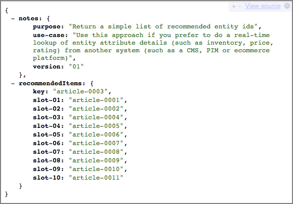

# 디자인 만들기

디자인은 페이지에 권장 사항이 어떻게 나타나는지를 정의합니다.

기본 디자인을 사용하거나 사용자 지정 디자인을 만들어 [!UICONTROL Recommendations] 디자인을 만들 수 있습니다. **[!UICONTROL Recommendations > Designs]** 화면에 기본 디자인 카드와 계정에서 만든 모든 디자인이 표시됩니다.

디자인 작업 시 다음 정보를 염두에 두십시오.

* 기본 디자인을 사용하여 권장 사항 디자인을 만들거나 사용자 지정 디자인을 만들 수 있습니다.
* 기본 디자인은 편집하거나 삭제할 수 없습니다.
* 사용자 지정 디자인을 편집, 복사 또는 삭제할 수 있습니다.
* 기본 디자인을 기반으로 디자인을 만들려면 먼저 디자인을 복사한 다음 복사본을 편집해야 합니다.

이 그림은 기본 1 x 4 디자인을 보여 줍니다.


이 그림은 사용자 정의 디자인을 보여 줍니다.


[!UICONTROL Visual Experience Composer] (VEC) 내에서 또는 활동 만들기 외부의 디자인 라이브러리에서 활동 만들기 프로세스 중에 디자인을 만들 수 있습니다. 다음 섹션에서는 라이브러리에서 디자인을 생성하는 것으로 가정하지만 단계는 유사합니다.

## 디자인 만들기

기본 디자인을 기반으로 디자인을 만들거나 사용자 지정 디자인을 만들 수 있습니다.

### 기본 디자인을 기반으로 디자인 만들기

1. **[!UICONTROL Recommendations]** > **[!UICONTROL Designs]**&#x200B;을(를) 클릭하여 [!UICONTROL Designs] 라이브러리를 표시합니다.


1. 만들려는 디자인에 대해 [추가 작업] 아이콘()을 클릭한 다음 **[!UICONTROL Copy]**&#x200B;을(를) 클릭합니다.

   [!UICONTROL Create Design] 대화 상자가 표시됩니다.

1. 디자인 카드에 표시할 **[!UICONTROL &#x200B; Name]** 및 선택적 미리 보기 이미지를 입력하십시오.

   기본 디자인을 사용하면 디자인 이름과 &quot;복사본&quot;이 **[!UICONTROL Content Name]** 필드에 나타납니다. 이름을 편집할 수 있습니다. 디자인 카드에 표시할 이미지를 선택할 수도 있습니다.

1. (조건부) 원하는 대로 디자인 **[!UICONTROL Code]**&#x200B;을(를) 편집합니다.

   권장 디자인은 오픈 소스 Velocity 디자인 언어를 사용합니다. Velocity에 대한 정보는 [https://velocity.apache.org](https://velocity.apache.org) 및 [Velocity를 사용하여 디자인 사용자 지정](/help/main/c-recommendations/c-design-overview/customizing-a-template.md)에서 찾을 수 있습니다.

   디자인은 HTML 또는 비 HTML일 수 있습니다. 기본적으로 HTML 디자인은 웹 환경에서 클릭 추적을 허용하기 위해 `<div>` 태그로 줄바꿈됩니다. 비 HTML 디자인은 클릭 추적이 불가능한 웹이 아닌 환경을 위한 것입니다. HTML 코드가 아닌 코드를 사용하려면 [!UICONTROL HTML Design] 토글을 &quot;끄기&quot; 위치로 밉니다.

   >[!NOTE]
   >
   >하드 코딩되거나 루프를 통해 디자인에서 참조할 수 있는 최대 개체 수는 99개입니다.

1. **[!UICONTROL Create]** 아이콘을 클릭합니다.

### 사용자 지정 디자인 만들기

1. **[!UICONTROL Recommendations]** > **[!UICONTROL Designs]**&#x200B;을(를) 클릭하여 [!UICONTROL Designs] 라이브러리를 표시합니다.

1. **[!UICONTROL Create Design]** 아이콘을 클릭합니다.

   기존 디자인을 기준으로 새 사용자 지정 디자인을 만들려면 만들려는 디자인에 대해 [!UICONTROL More Actions] 아이콘()을 클릭한 다음 [!UICONTROL Copy]을(를) 클릭합니다. 그런 다음 사본을 편집하여 새 사용자 정의 디자인을 만들 수 있습니다.

1. **[!UICONTROL Name]** 및 선택적 미리 보기 이미지를 추가합니다.

1. (조건부) 원하는 대로 디자인 **[!UICONTROL Code]**&#x200B;을(를) 편집합니다.

   자세한 내용은 위의 4단계 정보를 참조하십시오.

1. **[!UICONTROL Create]** 아이콘을 클릭합니다.

## 디자인 편집, 복사 또는 삭제

기본 디자인은 편집하거나 복사할 수 없으며 기본 디자인만 복사할 수 있습니다.

편집하거나 삭제할 디자인에 대한 [!UICONTROL More Actions] 아이콘()을 클릭한 다음 적절한 아이콘([!UICONTROL Edit], [!UICONTROL Copy] 또는 [!UICONTROL Delete])을 클릭합니다.

기존 디자인을 복사하여 수정할 수 있는 중복 디자인을 생성할 수 있습니다. 이 프로세스를 사용하면 적은 노력으로 유사한 디자인을 만들 수 있습니다.

디자인은 전체 계정에서 사용할 수 있습니다. 디자인을 삭제하기 전에 계정 간 사용을 고려해야 합니다. 삭제된 디자인을 복구할 수 없습니다.

## JSON 예 {#section_75BFB2537CFF4FBD9B560F59EB32C8DD}

다음 예제에서는 [양식 기반 편집기](/help/main/c-experiences/form-experience-composer.md)를 통해 활동을 구성할 때 JSON 응답을 반환하는 방법을 보여 줍니다.

1. [!UICONTROL Design library] 또는 양식 기반 워크플로 내에서 디자인을 만듭니다. [!UICONTROL Visual Experience Composer] (VEC) 워크플로 내에서 디자인을 만들려고 하면 클릭 추적을 위해 `<div>`에 래핑된 HTML 디자인 이외의 다른 디자인을 만들 수 없습니다.

1. &quot;HTML 디자인&quot; 선택 사항이 꺼져 있는지 확인합니다.

   

1. 다음 코드는 디자인에 붙여넣을 수 있는 사항의 예입니다.

   ```javascript
       #* 
       * "Return a simple list of recommended entity ids"   
       *#
   
       {   
         "notes":{   
         "purpose": "Return a simple list of recommended entity ids",   
         "use-case": "Use this approach if you prefer to do a real-time lookup of entity attribute details (such as inventory, price, rating) from another system (such as a CMS, PIM or ecommerce platform)",   
         "version": "01"   
         },   
         "recommendedItems": {   
           "key": "$key.id",   
           "slot-01": "$entity1.id",   
           "slot-02": "$entity2.id",   
           "slot-03": "$entity3.id",   
           "slot-04": "$entity4.id",   
           "slot-05": "$entity5.id",   
           "slot-06": "$entity6.id",   
           "slot-07": "$entity7.id",   
           "slot-08": "$entity8.id",   
           "slot-09": "$entity9.id",   
           "slot-10": "$entity10.id"   
         }   
       }  
   ```

1. 이 디자인을 사용하는 양식 기반 [!DNL Recommendations] 활동을 설정하십시오.

   1. **[!UICONTROL Activities]** 페이지로 이동합니다.
   1. **[!UICONTROL Create Activity]** > **[!UICONTROL Recommendations]**&#x200B;을(를) 클릭합니다.
   1. **[!UICONTROL Choose Experience Composer]**&#x200B;에서 **[!UICONTROL Form]**&#x200B;을(를) 선택한 다음 **[!UICONTROL Next]**&#x200B;을(를) 클릭합니다.
   1. 위치 아래에 &quot;Sample_Recs_Response&quot;라는 텍스트를 입력합니다.
   1. **[!UICONTROL Default Content]**&#x200B;에서 아래쪽 화살표를 클릭한 다음 **[!UICONTROL Add Recommendation]**&#x200B;을(를) 클릭합니다.
   1. 페이지 유형을 선택합니다. 이 유형은 그 다음 화면의 초기 필터링을 결정합니다.
   1. 기준 카드를 선택한 다음 **[!UICONTROL Next]**&#x200B;을(를) 클릭합니다.
   1. 이전 단계에서 만든 디자인을 선택한 다음 **[!UICONTROL Next]**&#x200B;을(를) 클릭합니다.
   1. 설정 프로세스를 완료합니다.
   1. **[!UICONTROL Inactive]** 옆의 오른쪽 화살표를 클릭한 다음 **[!UICONTROL Activate]**&#x200B;을(를) 선택합니다.

1. 활동이 설정되고 활성화된 후 깨끗한 JSON 응답을 다시 가져오는 샘플 요청을 설정할 수 있습니다.

   활동을 저장한 후 [!DNL Target]에서 선택한 기준 구성을 지원하는 모델을 만들어야 합니다. 여러 요인에 따라 이 프로세스는 시간이 걸릴 수 있습니다. 모델이 만들어지면 결과가 표시됩니다.

   예:

   ```
   https://[YOUR_CLIENT_CODE].tt.omtrdc.net/m2/YOUR_CLIENT_CODE/ubox/raw?mbox=[YOUR_MBOX_NAME]&mboxContentType=text/html&mboxXDomain=disabled&entity.id=[ENTITY_ID]&mboxHost=rawbox_sample&at_property=[AT_PROPERTY_TOKEN]&mboxNoRedirect=true&mboxPC=1234-4321&mboxSession=9876-7000
   ```

   where

   | 매개 변수 | 값 |
   |--- |--- |
   | `[YOUR_CLIENT_CODE]` | Target 클라이언트 코드(/help/target/products.html#recsSettings > Recommendations API 토큰 > 클라이언트 코드에서 사용 가능). |
   | `[YOUR_MBOX_NAME]` | 양식 기반 Recommendations의 &quot;위치&quot; 섹션에서 선택한 이름입니다. 이 경우 Sample_Recs_Response입니다. |
   | `[ENTITY_ID` | 카탈로그에 있는 항목의 `entity.id`입니다. |
   | `[AT_PROPERTY_TOKEN]` | (선택 사항) 활동 설정 중에 속성(엔터프라이즈 권한의 일부)을 선택한 경우 추가하십시오. |

알고리즘이 실행되고 결과가 나오면, 응답은 다음과 같은 모습이어야 합니다.

{width="575px"}

## 추가 JSON 개체 팁 및 요령 {#section_C305673C68944749969DB239E3221DC2}

다음 구문을 사용하여 디자인을 설정하여 쉼표로 구분된 간단한 항목 목록을 다시 보낼 수도 있습니다.

```
entity1.id, $entity2.id, $entity3.id, $entity4.id, $entity5.id, 
```

또는 응답에서 추가 정보를 전송할 수도 있습니다. 다음 코드 파일은 연결된 슬롯(순서)이 있는 엔티티 ID보다 훨씬 더 많은 내용을 반환하는 더 복잡한 예입니다. 이 디자인 예는 반환된 항목과 연결된 활동 세부 사항, [!UICONTROL Target Profile] 세부 사항(해당하는 경우) 및 기타 `entity.attributes`도 반환합니다.

```javascript
    {   
     "adobeRecommendations": {   
      "notes": {   
       "purpose": "Return a list of entity ids with their associated entity.attributes",   
       "use-case": "Use this approach to avoid looking up attribute details after receiving a response from Target",   
       "version": "01"   
      },   
      "recommendedItems": {   
       "slot-01": "$entity1.id",   
       "slot-02": "$entity2.id",   
       "slot-03": "$entity3.id",   
       "slot-04": "$entity4.id",   
       "slot-05": "$entity5.id",   
       "slot-06": "$entity6.id",   
       "slot-07": "$entity7.id",   
       "slot-08": "$entity8.id",   
       "slot-09": "$entity9.id",   
       "slot-10": "$entity10.id"   
      },   
      "activityDetails": {   
       "mbox.name": "email-mbox",   
       "campaign.name": "\${campaign.name}",   
       "campaign.id": "\${campaign.id}",   
       "campaign.recipe.name": "\${campaign.recipe.name}",   
       "campaign.recipe.id": "\${campaign.recipe.id}",   
       "offer.name": "\${offer.name}",   
       "offer.id": "\${offer.id}",   
       "criteria.title": "$criteria.title",   
       "algorithm.name": "$algorithm.name",   
       "algorithm.dayCount": "$algorithm.dayCount"   
      },   
      "visitorProfile": {   
       "profile.favorite-category": "\${profile.favorite-category}",   
       "profile.test": "\${profile.test}",   
       "user.endpoint.lastPurchasedEntity": "\${user.endpoint.lastPurchasedEntity}",   
       "user.endpoint.lastViewedEntity": "\${user.endpoint.lastViewedEntity}",   
       "user.endpoint.mostViewedEntity": "\${user.endpoint.mostViewedEntity}",   
       "user.endpoint.categoryAffinity": "\${user.endpoint.categoryAffinity}",   
       "profile.geolocation.city": "\${profile.geolocation.city}",   
       "profile.geolocation.dma": "\${profile.geolocation.dma}",   
       "profile.geolocation.state": "\${profile.geolocation.state}",   
       "profile.geolocation.country": "\${profile.geolocation.country}",   
       "profile.sessionCount": "\${profile.sessionCount}",   
       "profile.averageDaysBetweenVisits": "\${profile.averageDaysBetweenVisits}",   
       "profile.browserTime": "\${profile.browserTime}",   
       "user.activeActivities": "\${user.activeActivities}",   
       "user.pcId": "\${user.pcId}",   
       "user.isFirstSession": "\${user.isFirstSession}",   
       "user.isNewSession": "\${user.isNewSession}",   
       "user.header": "\${user.header}",   
       "user.parameter": "\${user.parameter}"   
      },   
      "recKey": {   
       "recKeyDetails": {   
        "id": "$key.id",   
        "name": "$key.name",   
        "category": "$key.category",   
        "pageUrl": "$key.pageUrl",   
        "thumbnailUrl": "$key.thumbnailUrl"   
       }   
      },   
      "recDetailedResults": {   
       "recEntity1Details": {   
        "id": "$entity1.id",   
        "name": "$entity1.name",   
        "category": "$entity1.category",   
        "pageUrl": "$entity1.pageUrl",   
        "thumbnailUrl": "$entity1.thumbnailUrl"   
       },   
       "recEntity2Details": {   
        "id": "$entity2.id",   
        "name": "$entity2.name",   
        "category": "$entity2.category",   
        "pageUrl": "$entity2.pageUrl",   
        "thumbnailUrl": "$entity2.thumbnailUrl"   
       },   
       "recEntity3Details": {   
        "id": "$entity3.id",   
        "name": "$entity3.name",   
        "category": "$entity3.category",   
        "pageUrl": "$entity3.pageUrl",   
        "thumbnailUrl": "$entity3.thumbnailUrl"   
       },   
       "recEntity4Details": {   
        "id": "$entity4.id",   
        "name": "$entity4.name",   
        "category": "$entity4.category",   
        "pageUrl": "$entity4.pageUrl",   
        "thumbnailUrl": "$entity4.thumbnailUrl"   
       },   
       "recEntity5Details": {   
        "id": "$entity5.id",   
        "name": "$entity5.name",   
        "category": "$entity5.category",   
        "pageUrl": "$entity5.pageUrl",   
        "thumbnailUrl": "$entity5.thumbnailUrl"   
       },   
       "recEntity6Details": {   
        "id": "$entity6.id",   
        "name": "$entity6.name",   
        "category": "$entity6.category",   
        "pageUrl": "$entity6.pageUrl",   
        "thumbnailUrl": "$entity6.thumbnailUrl"   
       },   
       "recEntity7Details": {   
        "id": "$entity7.id",   
        "name": "$entity7.name",   
        "category": "$entity7.category",   
        "pageUrl": "$entity7.pageUrl",   
        "thumbnailUrl": "$entity7.thumbnailUrl"   
       },   
       "recEntity8Details": {   
        "id": "$entity8.id",   
        "name": "$entity8.name",   
        "category": "$entity8.category",   
        "pageUrl": "$entity8.pageUrl",   
        "thumbnailUrl": "$entity8.thumbnailUrl"   
       },   
       "recEntity9Details": {   
        "id": "$entity9.id",   
        "name": "$entity9.name",   
        "category": "$entity9.category",   
        "pageUrl": "$entity9.pageUrl",   
        "thumbnailUrl": "$entity9.thumbnailUrl"   
       },   
       "recEntity10Details": {   
        "id": "$entity10.id",   
        "name": "$entity10.name",   
        "category": "$entity10.category",   
        "pageUrl": "$entity10.pageUrl",   
        "thumbnailUrl": "$entity10.thumbnailUrl"   
       }   
      }   
     }   
    }  
```

## 교육 비디오: Recommendations에서 사용자 지정 디자인 만들기(3:20) 

이 비디오에는 다음 정보가 포함됩니다.

* 사용자 지정 디자인 만들기
* 디자인에서 디스플레이 변수를 참조하는 방법 이해

>[!VIDEO](https://video.tv.adobe.com/v/27687)
